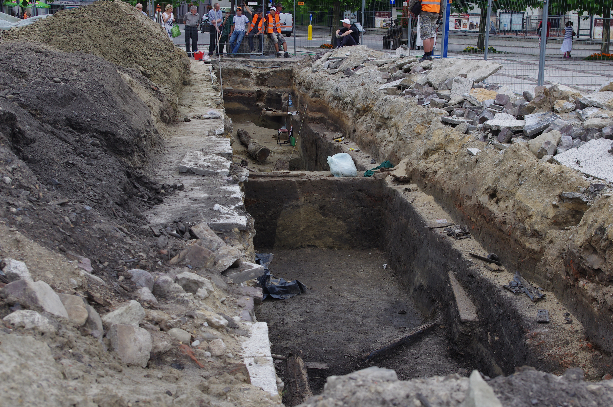

<!-- .slide: id="otwarcie" class="opening-slide" data-purpose="opening" data-layout="split" -->

TAJEMNICA NR 1
<h1>Skąd wiemy, co było dawniej?</h1>
Dziś pracujemy jak detektywi przeszłości.

<figure><figcaption>Kodeks Zamoyskich · XIV-wieczny odpis kroniki</figcaption></figure>

notes:
Zapytaj: „Czy patrzymy na przeszłość, historię czy opowieść?”. Przyjmij kilka hipotez bez oceniania. To XIV-wieczny odpis kroniki Galla Anonima, nie jego własnoręczny zapis.

---

<!-- .slide: id="pytanie" class="question-slide" data-purpose="question" data-layout="statement-centered" -->

?
Przeszłości nie możemy zobaczyć.
<h2>Jak więc odkryć, co się wydarzyło?</h2>

---

<!-- .slide: id="trzy-znaczenia" class="explanation-slide" data-purpose="explanation" data-layout="comparison" -->
## Historia ma trzy twarze

<article class="fragment fade-up">WCZORAJ<strong>przeszłość</strong>
To, co już się wydarzyło.
</article>
<article class="fragment fade-up">LUPA<strong>nauka</strong>
Badanie śladów i szukanie wyjaśnień.
</article>
<article class="fragment fade-up">OPOWIEŚĆ<strong>historia</strong>
Sposób przedstawienia wydarzeń.
</article>

„Historia mojego miasta” — które znaczenie pasuje? A może więcej niż jedno?

notes:
Doprecyzuj, że przeszłość istnieje niezależnie od opowieści, a badacz nie „cofa się w czasie”. Nauka historyczna tworzy uzasadnione wyjaśnienia na podstawie zachowanych śladów.

---

<!-- .slide: id="opowiesci" class="compare-slide" data-purpose="explanation" data-layout="source-split" -->
## Baśń, legenda czy historia?

Najpierw odpowiedzcie. Potem kliknijcie zagadkę.

<lesson-disclosure class="story-riddles">

ZAGADKA 1<b>Dziewczyna gubi pantofelek na balu. Pomaga jej dobra wróżka.</b>

<strong>BAŚŃ</strong>
Wróżka i czary należą do świata fikcji.

ZAGADKA 2<b>Pod Wawelem mieszka smok. Pokonuje go sprytny szewczyk.</b>

<strong>LEGENDA</strong>
Opowieść łączy prawdziwe miejsce z fantastycznym wydarzeniem.

ZAGADKA 3<b>Na świadectwie z 1922 roku zapisano oceny jednego ucznia.</b>

<strong>HISTORIA</strong>
Tę informację możemy sprawdzić w zachowanym dokumencie.

</lesson-disclosure>

notes:
Przy każdej zagadce najpierw zbierz odpowiedzi i krótkie uzasadnienia, dopiero potem kliknij pole. Po trzeciej odpowiedzi podsumuj: historia sprawdza twierdzenia w źródłach; legenda może łączyć realne miejsce lub osobę z fantazją; baśń jest fikcją i może zawierać magię.

---

<!-- .slide: id="po-co" class="context-slide" data-purpose="explanation" data-layout="takeaways" -->
## Co nam daje historia?
<lesson-icon-list style="--icon-list-columns:2">
<li class="fragment fade-up"><strong>Rozumiemy zmiany</strong> Skąd wzięły się nasze zwyczaje?</li>
<li class="fragment fade-up"><strong>Chronimy pamiątki</strong> Dlaczego nie burzymy każdego starego budynku?</li>
<li class="fragment fade-up"><strong>Sprawdzamy opowieści</strong> Na jakich dowodach są oparte?</li>
<li class="fragment fade-up"><strong>Rozumiemy ludzi</strong> Dlaczego pamiętają to samo inaczej?</li>
</lesson-icon-list>

---

<!-- .slide: id="historyk" class="explanation-slide" data-purpose="explanation" data-layout="process" -->
## Historyk rusza tropem

<article class="fragment fade-up">1<h3>PYTA</h3>
Co chcę odkryć?
</article>
<article class="fragment fade-up">2<h3>SZUKA</h3>
Co przetrwało?
</article>
<article class="fragment fade-up">3<h3>SPRAWDZA</h3>
Kto, kiedy i po co?
</article>
<article class="fragment fade-up">4<h3>PORÓWNUJE</h3>
Czy ślady do siebie pasują?
</article>
<article class="fragment fade-up">5<h3>WNIOSKUJE</h3>
Co potwierdzają dowody?
</article>

---

<!-- .slide: id="dwaj-badacze" class="source-slide" data-purpose="evidence" data-layout="photo-pair" -->
## Dwa warsztaty — jeden cel

<figure><figcaption>Historyk może badać kronikę i porównywać jej przekaz z innymi źródłami.</figcaption></figure>
<figure><figcaption>Archeolog dokumentuje przedmioty, warstwy i miejsce znaleziska.</figcaption></figure>

Ich ustalenia mogą się uzupełniać.

notes:
Nie przedstawiaj podziału jako „historyk tylko czyta, archeolog tylko kopie”. Obie profesje stawiają pytania, dokumentują i interpretują materiał. Fotografia pokazuje wykop na rynku w Pszczynie w 2015 r.; nie widać na niej samej pracy badacza.

---

<!-- .slide: id="zrodla" class="explanation-slide" data-purpose="explanation" data-layout="matrix" -->
## Co może być źródłem?

<article class="fragment fade-up"><strong>rzeczy i miejsca</strong> moneta · budynek · narzędzie · grób</article>
<article class="fragment fade-up"><strong>zapisy</strong> list · kronika · dokument · napis</article>
<article class="fragment fade-up"><strong>obrazy</strong> fotografia · obraz · mapa · film</article>
<article class="fragment fade-up"><strong>relacje</strong> wspomnienie · wywiad · nagranie</article>

Źródłem staje się ślad, któremu badacz zadaje pytanie.

---

<!-- .slide: id="wiarygodnosc" class="explanation-slide" data-purpose="explanation" data-layout="process" -->
## Skaner źródła

SPRAWDŹ<strong>ŹRÓDŁO</strong>

<article class="fragment fade-right"><strong>KTO?</strong>
Kto je stworzył i co mógł wiedzieć?
</article>
<article class="fragment fade-left"><strong>KIEDY?</strong>
Podczas wydarzeń czy później?
</article>
<article class="fragment fade-right"><strong>PO CO?</strong>
Komu i w jakim celu miało służyć?
</article>
<article class="fragment fade-left"><strong>Z CZYM?</strong>
Czy potwierdzają je inne źródła?
</article>

To samo źródło może pomóc w jednym pytaniu, a nie wystarczyć do innego.

notes:
Wiarygodność nie jest pieczątką „prawda/fałsz”. Na przykład świadectwo dobrze odpowiada na pytanie o zapisane przedmioty i oceny jednego ucznia, ale nie wystarcza do opisu wszystkich szkół.

---

<!-- .slide: id="sledztwo-foto" class="source-slide" data-purpose="evidence" data-layout="source-split" -->
## Trop A · fotografia

<figure class="source-figure"><figcaption>Klasa szkolna w Keene, New Hampshire (USA) · ok. 1900–1920</figcaption></figure>
<aside class="analysis-panel"><strong>Przyjrzyj się klasie.</strong>
Co różni tę klasę od naszej sali? Podaj dwa przykłady.

Jakie szkolne przedmioty i meble rozpoznajesz?
</aside>

---

<!-- .slide: id="sledztwo-rzecz" class="source-slide" data-purpose="evidence" data-layout="source-split" -->
## Trop B · przedmiot

<figure class="source-figure"><figcaption>Szkolna tabliczka łupkowa · 1882 · Wisconsin Historical Museum</figcaption></figure>
<aside class="analysis-panel"><strong>Obejrzyj tabliczkę.</strong>
Z czego ją wykonano?

Do czego uczeń mógł jej używać?
</aside>

---

<!-- .slide: id="sledztwo-dokument" class="source-slide" data-purpose="evidence" data-layout="source-split" -->
## Trop C · dokument

<figure class="source-figure"><figcaption>Detale autentycznego świadectwa szkoły elementarnej · Polska</figcaption></figure>
<aside class="analysis-panel"><strong>Przeczytaj świadectwo.</strong>
Z którego roku jest?

Jakich przedmiotów uczył się ten uczeń? Znajdź dwa.
</aside>

notes:
Jeśli pismo jest za małe, wskaż uczniom drukowane nagłówki i odczytaj wybrane nazwy. Nie omawiaj danych osobowych właściciela dokumentu; celem są cechy dokumentu i zakres wnioskowania.

---

<!-- .slide: id="zadanie" class="practice-slide" data-purpose="practice" data-layout="activity-brief" -->

WASZA KOLEJ

<h2>Rozwiążcie zagadkę w parach</h2>
<ol><li>Uzupełnijcie tabelę dla tropów A–C.</li><li>Oddzielcie <strong>„widzę”</strong> od <strong>„wnioskuję”</strong>.</li><li>Zapiszcie: „Możemy ostrożnie powiedzieć, że…”</li></ol>

6 <small>min</small>

notes:
Model i kryteria pełnej odpowiedzi są w assessment.md. Rozdaj worksheet.md. W połowie czasu przypomnij, że materiały pochodzą z różnych miejsc i nie opisują jednej klasy.

---

<!-- .slide: id="metoda" class="synthesis-slide" data-purpose="synthesis" data-layout="equation" -->
## Jak powstaje dobry wniosek?

źródło<b>+</b>kontekst<b>+</b>porównanie<b>→</b>wniosek oparty na dowodach

Dobry historyk potrafi też powiedzieć: „Tego jeszcze nie wiem”.

---

<!-- .slide: id="podsumowanie" class="synthesis-slide" data-purpose="synthesis" data-layout="takeaways" -->
## Jedna zasada historyka

<strong>Nie zgaduję.</strong>PYTAM<i>→</i>SPRAWDZAM<i>→</i>UZASADNIAM
Tak ze śladów powstaje wiedza o przeszłości.

---

<!-- .slide: id="bilet" class="exit-ticket-slide" data-purpose="exit-ticket" data-layout="plain" -->
## Ostatnia zagadka

Kolega mówi: „Jedno stare zdjęcie pokazuje dokładnie, jak żyli wszyscy ludzie w tamtych czasach”.  <strong>Odpowiedz w 2–3 zdaniach.</strong> Użyj pojęć <em>źródło historyczne</em> i <em>wiarygodność</em>.

