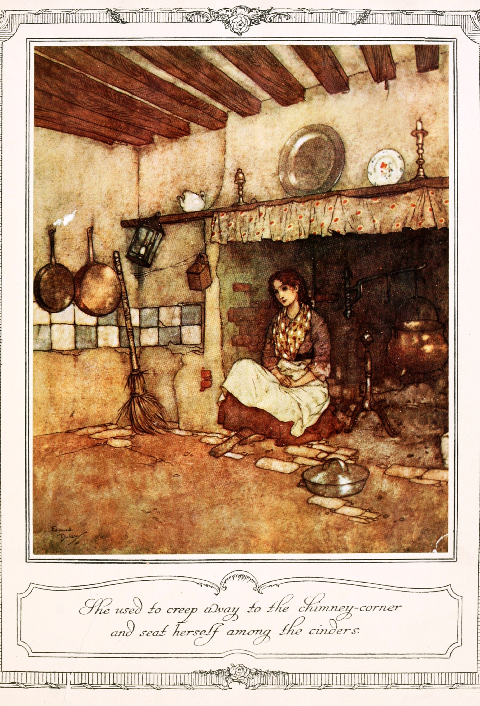
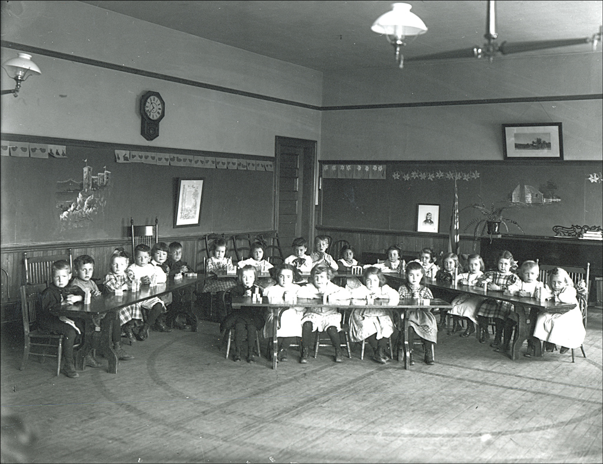
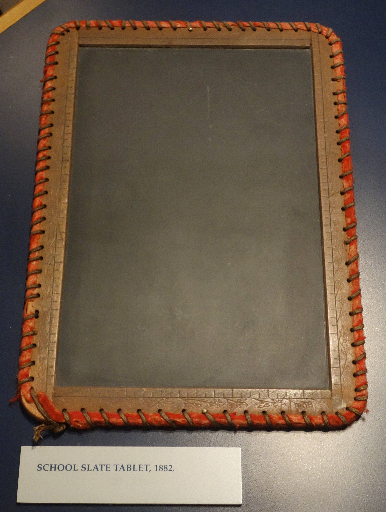
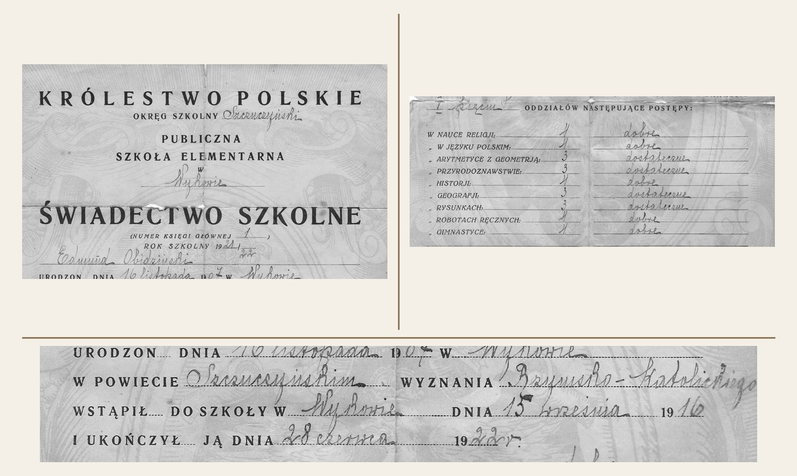

<!-- .slide: id="otwarcie" class="opening-slide" data-purpose="opening" data-layout="split" -->

Klasa IV · śledztwo historyczne
<h1>Jak poznajemy przeszłość?</h1>
Historia i źródła historyczne

<figure><figcaption>Kodeks Zamoyskich · XIV-wieczny odpis kroniki</figcaption></figure>

notes:
Zapytaj: „Czy patrzymy na przeszłość, historię czy opowieść?”. Przyjmij kilka hipotez bez oceniania. To XIV-wieczny odpis kroniki Galla Anonima, nie jego własnoręczny zapis.

---

<!-- .slide: id="pytanie" class="question-slide" data-purpose="question" data-layout="statement-centered" -->
## Jak z zachowanych śladów budujemy wiarygodną wiedzę o przeszłości?

---

<!-- .slide: id="trzy-znaczenia" class="explanation-slide" data-purpose="explanation" data-layout="comparison" -->
## Jedno słowo — trzy znaczenia

<article><strong>przeszłość</strong> To, co już się wydarzyło.</article>
<article><strong>nauka o przeszłości</strong> Badanie śladów, pytań i wyjaśnień.</article>
<article><strong>opowieść</strong> Sposób przedstawienia wydarzeń — prawdziwych albo wymyślonych.</article>

„Historia mojego miasta” — które znaczenie pasuje? A może więcej niż jedno?

notes:
Doprecyzuj, że przeszłość istnieje niezależnie od opowieści, a badacz nie „cofa się w czasie”. Nauka historyczna tworzy uzasadnione wyjaśnienia na podstawie zachowanych śladów.

---

<!-- .slide: id="opowiesci" class="compare-slide" data-purpose="explanation" data-layout="source-split" -->
## Trzy sposoby opowiadania

<strong>Historia:</strong> sprawdza twierdzenia w źródłach.

<strong>Legenda:</strong> może łączyć pamięć o miejscu lub osobie z fantazją.

<strong>Baśń:</strong> jest fikcją; magia należy do świata utworu.

Co je łączy? Co je odróżnia?

<figure class="source-figure portrait"><figcaption>Kopciuszek · ilustracja Edmunda Dulaca, ok. 1910</figcaption></figure>

notes:
Najpierw poproś o podobieństwo: wszystkie mogą opowiadać o ludziach i przekazywać wartości. Potem różnica: badanie historyczne ma obowiązek wskazywać i sprawdzać dowody. Ilustracja jest obrazem tekstu kultury, nie źródłem potwierdzającym wydarzenia baśni.

---

<!-- .slide: id="po-co" class="context-slide" data-purpose="explanation" data-layout="takeaways" -->
## Po co nam historia dzisiaj?
<lesson-icon-list style="--icon-list-columns:2">
<li data-icon="🧭"><strong>Rozumiemy zmiany</strong> Skąd wzięły się instytucje, granice i zwyczaje?</li>
<li data-icon="🏛️"><strong>Chronimy dziedzictwo</strong> Dlaczego zachowujemy zabytki i pamiątki?</li>
<li data-icon="🔎"><strong>Sprawdzamy przekazy</strong> Na jakich dowodach opiera się opowieść?</li>
<li data-icon="🤝"><strong>Rozumiemy ludzi</strong> Dlaczego różne wspólnoty pamiętają inaczej?</li>
</lesson-icon-list>

---

<!-- .slide: id="historyk" class="explanation-slide" data-purpose="explanation" data-layout="process" -->
## Jak pracuje historyk?
<lesson-stepper>
<lesson-step><h3>1. Pyta</h3>
Co chcę ustalić?
</lesson-step>
<lesson-step><h3>2. Szuka</h3>
Jakie źródła mogą pomóc?
</lesson-step>
<lesson-step><h3>3. Sprawdza</h3>
Kto, kiedy i po co je stworzył?
</lesson-step>
<lesson-step><h3>4. Porównuje</h3>
Czy inne źródła potwierdzają informację?
</lesson-step>
<lesson-step><h3>5. Wnioskuje</h3>
Co mogę uzasadnić dowodami?
</lesson-step>
</lesson-stepper>

---

<!-- .slide: id="dwaj-badacze" class="source-slide" data-purpose="evidence" data-layout="photo-pair" -->
## Historyk i archeolog

<figure><figcaption>Historyk może badać kronikę i porównywać jej przekaz z innymi źródłami.</figcaption></figure>
<figure><figcaption>Archeolog dokumentuje przedmioty, warstwy i miejsce znaleziska.</figcaption></figure>

Ich ustalenia mogą się uzupełniać.

notes:
Nie przedstawiaj podziału jako „historyk tylko czyta, archeolog tylko kopie”. Obie profesje stawiają pytania, dokumentują i interpretują materiał. Fotografia pokazuje wykop na rynku w Pszczynie w 2015 r.; nie widać na niej samej pracy badacza.

---

<!-- .slide: id="zrodla" class="explanation-slide" data-purpose="explanation" data-layout="matrix" -->
## Jakie ślady mogą być źródłami?

<article><strong>rzeczy i miejsca</strong> moneta · budynek · narzędzie · grób</article>
<article><strong>zapisy</strong> list · kronika · dokument · napis</article>
<article><strong>obrazy</strong> fotografia · obraz · mapa · film</article>
<article><strong>relacje</strong> wspomnienie · wywiad · nagranie</article>

Źródłem staje się ślad, któremu badacz zadaje pytanie.

---

<!-- .slide: id="wiarygodnosc" class="explanation-slide" data-purpose="explanation" data-layout="process" -->
## Jak sprawdzamy źródło?
<lesson-stepper>
<lesson-step><h3>Kto?</h3>
Kto stworzył źródło i co mógł wiedzieć?
</lesson-step>
<lesson-step><h3>Kiedy?</h3>
Czy powstało podczas wydarzeń, czy później?
</lesson-step>
<lesson-step><h3>Po co?</h3>
Komu i w jakim celu miało służyć?
</lesson-step>
<lesson-step><h3>Z czym?</h3>
Czy potwierdzają je inne źródła?
</lesson-step>
</lesson-stepper>

Źródło może być przydatne do jednego pytania, a słabe do innego.

notes:
Wiarygodność nie jest pieczątką „prawda/fałsz”. Na przykład świadectwo dobrze odpowiada na pytanie o zapisane przedmioty i oceny jednego ucznia, ale nie wystarcza do opisu wszystkich szkół.

---

<!-- .slide: id="sledztwo-foto" class="source-slide" data-purpose="evidence" data-layout="source-split" -->
## Źródło A

<figure class="source-figure"><figcaption>Klasa szkolna w Keene, New Hampshire (USA) · ok. 1900–1920</figcaption></figure>
<aside class="analysis-panel"><strong>Najpierw obserwuj.</strong>
Wypisz dwa szczegóły, które naprawdę widać.

Jakie pytanie pozostaje bez odpowiedzi?
</aside>

---

<!-- .slide: id="sledztwo-rzecz" class="source-slide" data-purpose="evidence" data-layout="source-split" -->
## Źródło B

<figure class="source-figure"><figcaption>Szkolna tabliczka łupkowa · 1882 · Wisconsin Historical Museum</figcaption></figure>
<aside class="analysis-panel"><strong>Przyjrzyj się rzeczy.</strong>
Z czego została wykonana?

Do czego mogła służyć? Jak sprawdzić ten domysł?
</aside>

---

<!-- .slide: id="sledztwo-dokument" class="source-slide" data-purpose="evidence" data-layout="source-split" -->
## Źródło C

<figure class="source-figure"><figcaption>Detale autentycznego świadectwa szkoły elementarnej · Polska</figcaption></figure>
<aside class="analysis-panel"><strong>Odczytaj dokument.</strong>
Znajdź datę i dwie nazwy przedmiotów.

Czy opisuje jednego ucznia, czy wszystkie szkoły?
</aside>

notes:
Jeśli pismo jest za małe, wskaż uczniom drukowane nagłówki i odczytaj wybrane nazwy. Nie omawiaj danych osobowych właściciela dokumentu; celem są cechy dokumentu i zakres wnioskowania.

---

<!-- .slide: id="zadanie" class="practice-slide" data-purpose="practice" data-layout="task-board" -->
## Śledztwo w parach

<strong>Uzupełnij tabelę dla źródeł A–C.</strong> Oddziel to, co widzisz lub odczytujesz, od tego, co wnioskujesz.

Czas6 min

Produkt3 wiersze + jeden wspólny wniosek

PamiętajKażdy wniosek połącz ze szczegółem ze źródła.

notes:
Model i kryteria pełnej odpowiedzi są w assessment.md. Rozdaj worksheet.md. W połowie czasu przypomnij, że materiały pochodzą z różnych miejsc i nie opisują jednej klasy.

---

<!-- .slide: id="metoda" class="synthesis-slide" data-purpose="synthesis" data-layout="equation" -->
## Od śladu do wniosku

źródło<b>+</b>kontekst<b>+</b>porównanie<b>→</b>uzasadniony wniosek

Mocny wniosek mówi także, czego jeszcze nie wiemy.

---

<!-- .slide: id="podsumowanie" class="synthesis-slide" data-purpose="synthesis" data-layout="takeaways" -->
## Jak poznajemy przeszłość?
<ul class="takeaways">
<li>Przeszłość zostawia ślady nazywane źródłami historycznymi.</li>
<li>Historycy i archeolodzy zadają pytania, sprawdzają kontekst i porównują źródła.</li>
<li>Opowieść historyczna różni się od legendy i baśni obowiązkiem uzasadniania twierdzeń.</li>
<li>Wiedza o przeszłości pomaga rozumieć współczesność i oceniać przekazy.</li>
</ul>

---

<!-- .slide: id="bilet" class="exit-ticket-slide" data-purpose="exit-ticket" data-layout="plain" -->
## Bilet wyjścia

Kolega mówi: „Jedno stare zdjęcie pokazuje dokładnie, jak żyli wszyscy ludzie w tamtych czasach”.  <strong>Odpowiedz w 2–3 zdaniach.</strong> Użyj pojęć <em>źródło historyczne</em> i <em>wiarygodność</em>.

