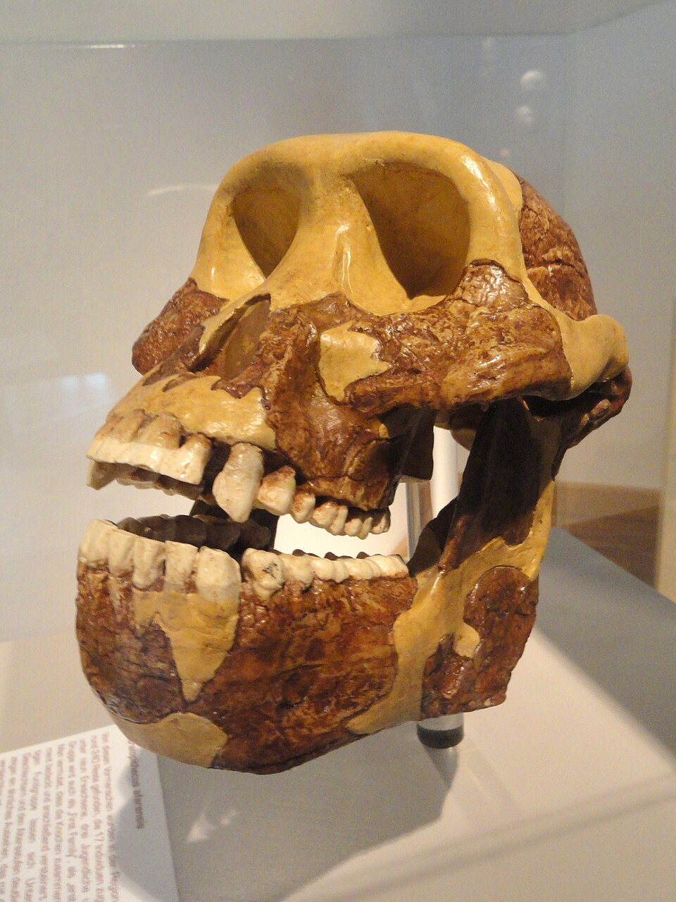
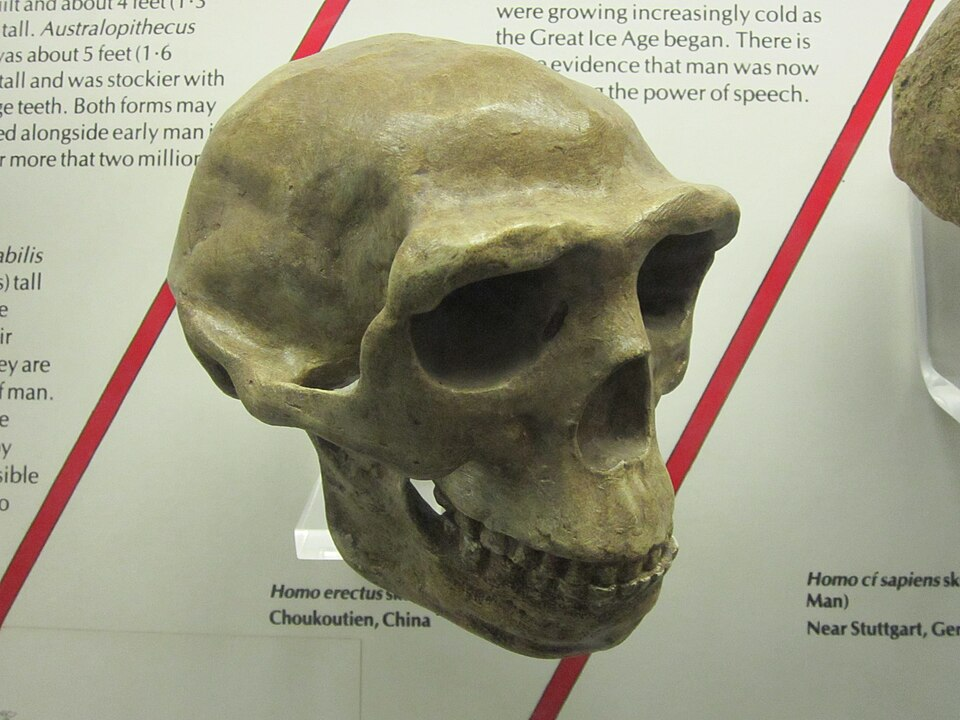
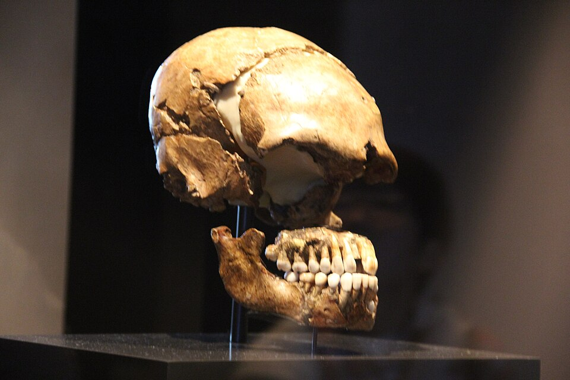
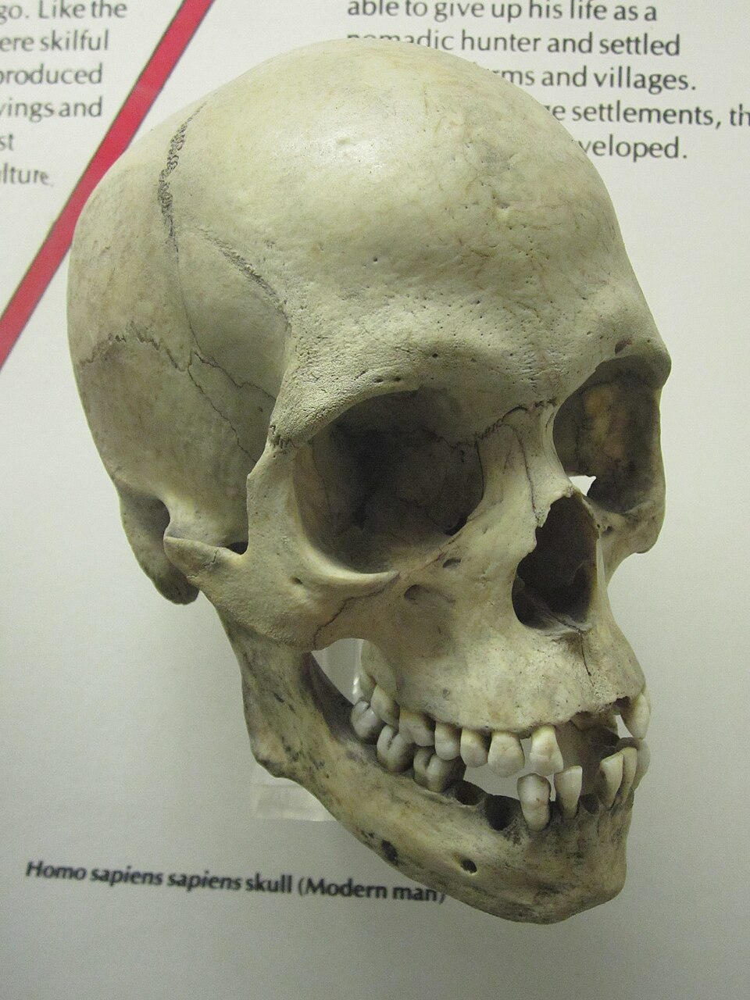
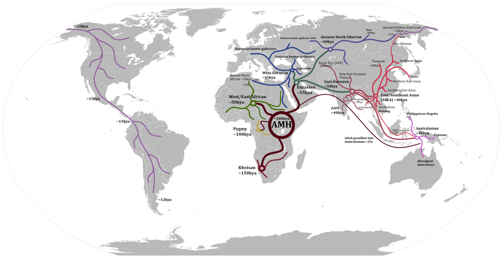
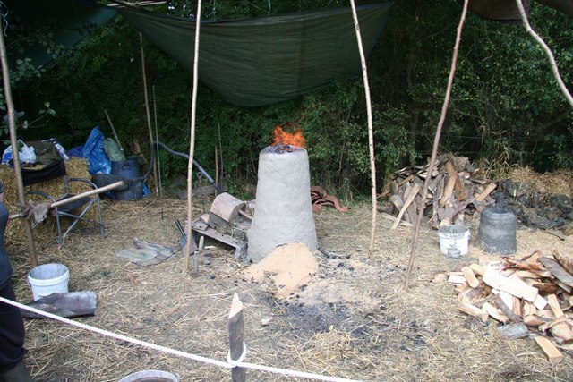
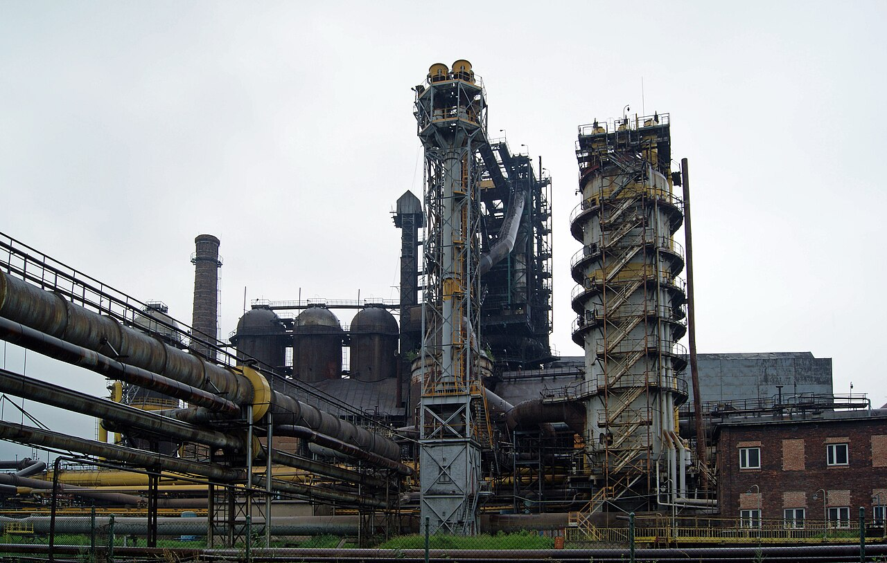

<!-- .slide: id="otwarcie" class="opening-slide" data-purpose="opening" data-layout="statement" -->
# Od epoki kamienia do epoki żelaza

Klasa V · Historia · 45 minut

> Od pierwszych ludzi, przez rolnictwo i osady, do narzędzi z metalu.

notes:
typ lekcji: nowa wiedza. prezentacja używa trzech lokalnych materiałów commons oraz schematów dydaktycznych. przed lekcją sprawdź notes, sources.md i kartę pracy.

---

<!-- .slide: id="pytanie-glowne" class="question-slide" data-purpose="question" data-layout="statement" -->
## Co może zmienić sposób zdobywania jedzenia?

<figure class="handaxe-photo"><figcaption>Pięściak — narzędzie z kamienia.</figcaption></figure>
<figure><figcaption>Współczesna rekonstrukcja domu neolitycznego.</figcaption></figure>

**Pomyśl:** który przedmiot łatwiej zabrać w drogę? Co dom mówi o sposobie życia jego mieszkańców?

notes:
daj 45 sekund na hipotezę w parach. nie pytaj, który obraz jest „lepszy”; pytaj o to, co mówi o potrzebach, ruchu i zapasach.

---

<!-- .slide: id="przodkowie" class="explanation-slide" data-purpose="explanation" data-layout="statement" -->
## Przodkowie współczesnych ludzi: rozgałęzienie, nie drabina

<figure><figcaption><strong>Australopitek</strong> Afryka · ok. 4,2–2 mln lat temu eksponat muzealny</figcaption></figure>
<figure><figcaption><strong>Homo erectus</strong> Afryka i Azja · ok. 1,9 mln–110 tys. lat temu odlew muzealny</figcaption></figure>
<figure><figcaption><strong>Neandertalczyk</strong> Europa i Azja · ok. 400–40 tys. lat temu eksponat muzealny</figcaption></figure>
<figure><figcaption><strong>Homo sapiens</strong> Afryka · od ok. 300 tys. lat temu odlew muzealny</figcaption></figure>

> **Praludzie** to szkolne określenie dawnych gatunków człowiekowatych i ludzi z rodzaju *Homo*. Różniły się m.in. budową ciała i czaszki oraz miejscem życia. Nie tworzyły jednej prostej kolejki prowadzącej do nas — część gatunków żyła równocześnie.

notes:
powiedz „wspólni, bardzo dawni przodkowie”, nie „człowiek pochodzi od współczesnej małpy”. daty są orientacyjne; nie wymagaj ich zapamiętania poza porządkiem: bardzo dawno → Homo sapiens w Afryce.

---

<!-- .slide: id="migracje" class="map-slide" data-purpose="evidence" data-layout="evidence" -->
współczesne opracowanie kartograficzne · model tras

## Z Afryki na inne kontynenty

<figure class="migration-map"><figcaption>Mapa pokazuje główne kierunki migracji, a nie jedną wyprawę. Różne grupy przemieszczały się przez tysiące lat, różnymi trasami.</figcaption></figure>

Wskaż Afrykę i jedną strzałkę. Dokończ: „Z mapy mogę odczytać…, ale mapa nie mówi mi…”.

notes:
model tras nie pozwala opowiedzieć o doświadczeniach wszystkich grup ani wskazać jednej pewnej daty dla zasiedlenia kontynentu. oczekiwana obserwacja: początki Homo sapiens w Afryce i późniejsze rozchodzenie się na inne kontynenty.

---

<!-- .slide: id="zycie-lowcow" class="image-slide" data-purpose="evidence" data-layout="evidence" -->
fotografia zabytku · jeden przykład narzędzia

## Życie człowieka pierwotnego

<figure class="handaxe-photo"><figcaption>Pięściak: narzędzie wykonywane przez obijanie kamienia. Jego kształt pozwalał m.in. ciąć i rozbijać.</figcaption></figure>

<ul class="icon-list">
<li><strong>Pożywienie:</strong> polowanie, zbieractwo i rybołówstwo.</li>
<li><strong>Ogień:</strong> dawał ciepło, światło, ochronę i możliwość przygotowania części pożywienia.</li>
<li><strong>Narzędzia:</strong> kamień, drewno i kość — materiały dostępne w otoczeniu.</li>
<li><strong>Współpraca:</strong> wspólne zdobywanie żywności, opieka nad dziećmi i dzielenie zadań.</li>
</ul>

Nie każdy człowiek w pradziejach żył tak samo. Sposób życia zależał od środowiska i czasu.

---

<!-- .slide: id="tryby-zycia" class="compare-slide" data-purpose="explanation" data-layout="split" -->
## Koczowniczy czy osiadły?

<lesson-table>
<table>
<thead><tr><th>Pytanie</th><th>Tryb koczowniczy</th><th>Tryb osiadły</th></tr></thead>
<tbody>
<tr><td>Jak zdobywano żywność?</td><td>polowanie, zbieractwo, rybołówstwo</td><td>uprawa roślin i hodowla zwierząt</td></tr>
<tr><td>Gdzie mieszkano?</td><td>w obozowiskach i schronieniach łatwiejszych do opuszczenia</td><td>w trwalszych domach i osadach</td></tr>
<tr><td>Jak często zmieniano miejsce?</td><td>często — za zasobami i porami roku</td><td>rzadziej — przy polach, pastwiskach i zapasach</td></tr>
<tr><td>Co można było gromadzić?</td><td>niewiele rzeczy łatwych do przeniesienia</td><td>ziarno, naczynia, narzędzia i inne zapasy</td></tr>
</tbody>
</table>
</lesson-table>

> **Koczowniczy** nie znaczy „bez planu”. To sposób życia dostosowany do zasobów. **Osiadły** nie znaczy „bez ruchu” — ludzie nadal handlowali i podróżowali.

---

<!-- .slide: id="od-lowcy-do-rolnika" class="explanation-slide" data-purpose="explanation" data-layout="process" -->
## Od zdobywania żywności do jej wytwarzania

<ol class="process-list">
<li><strong>Obserwacja roślin i zwierząt</strong>Ludzie poznają pory roku, nasiona i zachowanie stad.</li>
<li><strong>Uprawa i hodowla</strong>Część roślin jest sadzona, a wybrane zwierzęta rozmnażane i chronione.</li>
<li><strong>Zapasy i osady</strong>Warto zostać przy polach, domach i magazynach.</li>
</ol>

<strong>Twoje zadanie:</strong> ułóż własny łańcuch: <strong>uprawa / hodowla → … → …</strong>. Ostatnie ogniwo ma być skutkiem dla życia ludzi.

notes:
podkreśl, że ten proces nie wydarzył się wszędzie jednocześnie. nie twierdź, że rolnictwo „wynaleziono raz i od razu wszędzie”.

---

<!-- .slide: id="dom-neolityczny" class="image-slide" data-purpose="evidence" data-layout="evidence" -->
współczesna rekonstrukcja archeologiczna · nie zdjęcie z neolitu

## Rewolucja neolityczna

<figure><figcaption>Rekonstrukcja domu jednej z kultur neolitycznych. Pokazuje możliwy typ trwalejszego budownictwa, nie wszystkie osady neolitu.</figcaption></figure>

<strong>Rewolucja neolityczna</strong>

to wielka i trwała zmiana: ludzie zaczęli <strong>wytwarzać żywność</strong> przez uprawę roślin i hodowlę zwierząt.

<ul>
<li>nie była jednym nagłym dniem;</li>
<li>przebiegała przez tysiące lat;</li>
<li>w różnych miejscach zaczynała się w różnym czasie.</li>
</ul>

---

<!-- .slide: id="skutki-neolitu" class="explanation-slide" data-purpose="explanation" data-layout="statement" -->
## Co zmieniła rewolucja neolityczna?

<article><strong>🌾 Więcej żywności</strong>
można planować zbiory i przechowywać część plonów.
</article>
<article><strong>🏠 Osady</strong>
domy, magazyny i sąsiedzi w jednym miejscu.
</article>
<article><strong>🏺 Nowe zajęcia</strong>
garncarstwo, tkactwo, budownictwo, wymiana.
</article>
<article><strong>⚖️ Także koszty</strong>
cięższa praca, zależność od plonów, choroby w większych skupiskach i nierówności.
</article>

> **Wniosek:** rewolucja neolityczna zmieniła nie tylko jedzenie. Zmieniła miejsce zamieszkania, pracę, relacje między ludźmi i wielkość społeczności.

---

<!-- .slide: id="rada-osady" class="practice-slide" data-purpose="practice" data-layout="activity-brief" -->
## Praca w grupach: Rada osady

<article><strong>Łowcy i zbieracze</strong>
Co zyskujemy, gdy wędrujemy? Jakie mamy ograniczenia?
</article>
<article><strong>Pierwsi rolnicy</strong>
Dlaczego chcemy zostać przy polach i stadach?
</article>
<article><strong>Budowniczowie osady</strong>
Co trzeba zbudować, aby żyć dłużej w jednym miejscu?
</article>
<article><strong>Opiekunowie zapasów</strong>
Co możemy przechować na później i jakie ryzyko niesie zależność od plonów?
</article>

W grupie wybierzcie: <strong>wędrujemy czy budujemy osadę?</strong> Przygotujcie dwa dowody i jeden skutek swojej decyzji. Macie 6 minut, potem po 30 sekund na wypowiedź.

notes:
każda grupa zapisuje decyzję w wierszu karty pracy. gdy czasu jest mało, wysłuchaj łowców i rolników, a pozostałe decyzje odczytaj z kart.

---

<!-- .slide: id="epoki" class="context-slide" data-purpose="explanation" data-layout="equation" -->
## Od kamienia do metalu

miedź+cyna=brąz

Stop wymagał dwóch surowców: dlatego łączył rozwój narzędzi z wymianą między społecznościami.

<article class="stone"><strong>Epoka kamienia</strong>
kamień, drewno i kość
np. pięściak, siekiera, ostrze</article>

→

<article class="bronze"><strong>Epoka brązu</strong>
<strong>brąz = miedź + cyna</strong>
narzędzia, ozdoby, broń; potrzebna wymiana surowców</article>

→

<article class="iron"><strong>Epoka żelaza</strong>
żelazo uzyskiwane z rudy
narzędzia i broń; wysokie temperatury oraz wiedza o wytopie</article>

Epoki nie zaczęły się wszędzie w tym samym roku. Nazwy pomagają uporządkować dominujące materiały narzędzi.

---

<!-- .slide: id="zelazo" class="compare-slide" data-purpose="explanation" data-layout="split" -->
## Wytapianie żelaza: dawniej i dziś

<figure><figcaption><strong>Dawniej: dymarka</strong> Współczesna rekonstrukcja eksperymentalna. Ruda żelaza, węgiel drzewny i powietrze dawały gąbkę żelaza, którą trzeba było przekuwać.</figcaption></figure>
<figure><figcaption><strong>Dzisiaj: huta</strong> Fotografia współczesnego wielkiego pieca w Nowej Hucie. Proces ma wielką skalę i pozwala precyzyjnie kontrolować skład metalu.</figcaption></figure>

> Wspólne: surowiec, wysoka temperatura i doprowadzanie powietrza / tlenu. Różne: skala, urządzenia i kontrola procesu.

---

<!-- .slide: id="dyskusja" class="practice-slide" data-purpose="practice" data-layout="activity-brief" -->
## Dyskusja: czy rewolucja neolityczna była postępem dla każdego?

<article><strong>„Tak, ponieważ…”</strong>
więcej żywności · zapasy · trwalsze domy · nowe umiejętności
</article>
<article><strong>„Ale miała też koszty…”</strong>
cięższa praca · ryzyko nieurodzaju · choroby w osadach · nierówności
</article>

<strong>Każda strona</strong> podaje jeden argument i wyjaśnia go słowem <strong>„ponieważ”</strong>. Nie wybieramy „zwycięzcy” — szukamy pełniejszego obrazu zmiany.

notes:
nie oceniaj historycznych społeczności według współczesnego komfortu. dobry wniosek zawiera korzyść i koszt.

---

<!-- .slide: id="synteza" class="compare-slide" data-purpose="synthesis" data-layout="takeaways" -->
## Uporządkuj odpowiedź na pytanie główne

<ul class="synthesis-list">
<li><strong>Praludzie i Homo sapiens:</strong> ewolucja była rozgałęziona; Homo sapiens ma afrykańskie początki.</li>
<li><strong>Koczownicy:</strong> zdobywali żywność, przemieszczali się i mieli niewielkie zapasy.</li>
<li><strong>Rewolucja neolityczna:</strong> uprawa i hodowla sprzyjały osadom, zapasom i nowym problemom.</li>
<li><strong>Epoki materiałów:</strong> kamień → brąz → żelazo zmieniały narzędzia oraz pracę.</li>
</ul>

> **Zmiana sposobu zdobywania żywności uruchomiła dalsze zmiany: w osadnictwie, pracy, zapasach, technice i relacjach społecznych.**

---

<!-- .slide: id="bilet" class="exit-ticket-slide" data-purpose="exit-ticket" data-layout="plain" -->
## Bilet wyjścia

Dokończ zdanie w zeszycie lub na karcie:

> **„Rewolucja neolityczna zmieniła życie ludzi, ponieważ… Jednym skutkiem było…”**

**Warunek dobrej odpowiedzi:** nazwij zmianę w zdobywaniu żywności i podaj konkretny skutek — np. osady, zapasy, nowe zajęcia albo problem zależności od plonów.

notes:
przykładowa odpowiedź jest w assessment.md. zbierz odpowiedzi jako informację, kto umie połączyć przyczynę ze skutkiem.
