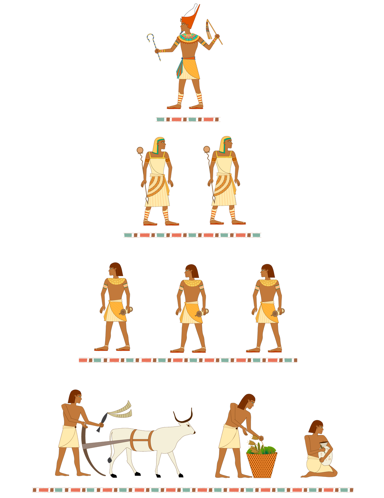
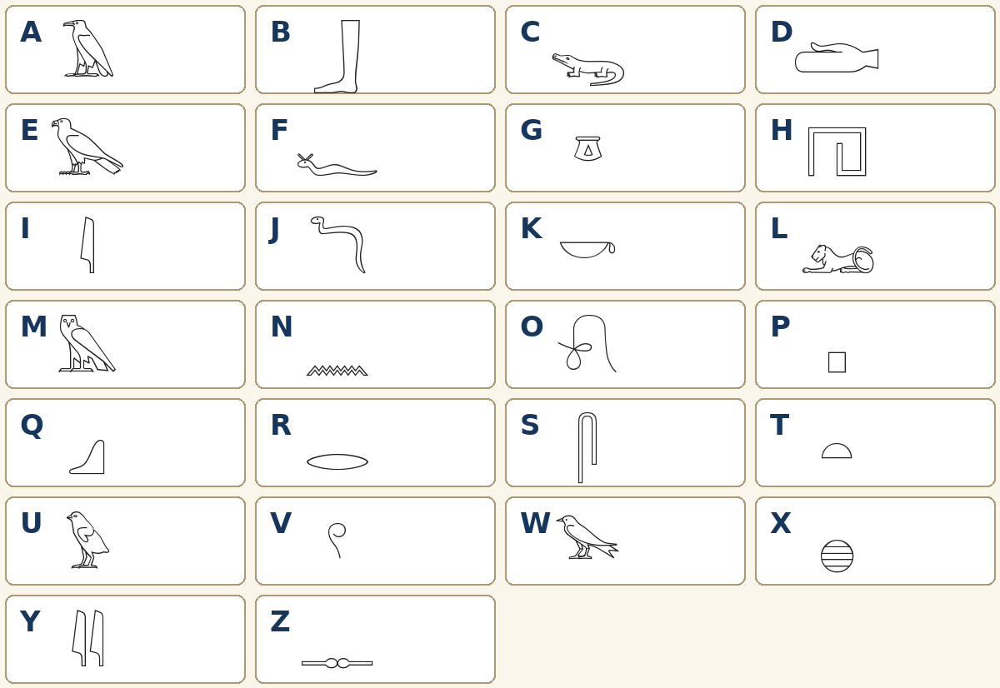

# Stacja 1. Egipt — dar Nilu

**Przeczytaj krótki tekst.**

Egipt rozwinął się w północno-wschodniej Afryce, wzdłuż Nilu. Większą część kraju zajmowały pustynie, dlatego pola, osady i miasta skupiały się w dolinie oraz delcie rzeki. Wylewy Nilu dostarczały wody i pozostawiały żyzny muł. Egipcjanie budowali kanały, aby doprowadzać wodę na pola. Nil był także szlakiem transportowym.

## Wykonaj
Otwórz część 1 karty pracy. Odpowiedz na pytania do mapy, a następnie uzupełnij zależność.

**Źródło mapy:** ZPE, „Starożytny Egipt”, Krystian Chariza i zespół, CC BY 3.0.

---

# Stacja 2. Mumifikacja krok po kroku

**Film:** [The Mummification Process](https://www.youtube.com/watch?v=Nh-1eTd2c4o)

1. Uruchom film od **0:13**.
2. Zatrzymaj go po **1:58**.
3. Obserwuj, co kolejno dzieje się z ciałem.
4. W części 2 karty pracy wpisz przy każdym etapie numer od **1 do 5**.

Nie musisz rozumieć każdego angielskiego słowa. Pomogą ci obrazy i polskie nazwy etapów na karcie.

## Plan B, gdy film nie działa
Nauczyciel odczytuje pięć zdań z klucza odpowiedzi, zachowując prawidłową kolejność. Uczniowie numerują etapy podczas słuchania.

**Uwaga źródłowa:** film pokazuje mumię Herakleidesa z I wieku n.e. Nie wszystkie szczegóły tego przypadku były jednakowe w całej historii Egiptu; w zadaniu wykorzystujemy tylko ogólny ciąg czynności.

---

# Stacja 3. Kto tworzył społeczeństwo Egiptu?

Schemat jest uproszczonym modelem. Pokazuje pozycję grup, ale nie oznacza, że życie każdej osoby zawsze wyglądało tak samo.

- **Faraon** był monarchą. Kierował państwem, administracją i wojskiem oraz kontrolował kult religijny.
- **Kapłani** opiekowali się świątyniami, odprawiali obrzędy i zarządzali majątkiem świątynnym.
- **Urzędnicy i pisarze** zapisywali rozkazy, podatki oraz stan zapasów i pomagali zarządzać państwem.
- **Chłopi** uprawiali ziemię, oddawali część plonów jako podatek i pracowali przy kanałach. Byli najliczniejszą grupą.

## Wykonaj
W części 3 karty pracy rozpoznaj cztery postacie. Przy każdej zapisz nazwę grupy i jej główne zajęcie. Potem wybierz jedną grupę i wyjaśnij, dlaczego jej praca była ważna.

**Źródło grafiki:** ZPE, „Egipt — państwo nad Nilem”, Contentplus.pl sp. z o.o., CC BY 3.0.

---

# Stacja 4. Osiągnięcia i szkolny kod hieroglificzny

Egipcjanie rozwijali wiedzę potrzebną państwu i mieszkańcom:

- **pismo** służyło do zapisywania podatków, rozkazów, modlitw i wiedzy;
- **papirus** był lekkim materiałem pisarskim;
- **matematyka i geometria** pomagały mierzyć pola oraz projektować budowle;
- **kalendarz liczący około 365 dni** pomagał planować prace;
- **medycyna** pomagała rozpoznawać choroby, opatrywać rany i opisywać sposoby leczenia;
- **architektura** umożliwiała wznoszenie świątyń, grobowców i innych monumentalnych budowli.

## Szkolny kod A–Z

To **umowny szyfr do ćwiczenia**, a nie prawdziwy alfabet polsko-egipski. Hieroglify mogły oznaczać dźwięki, całe słowa lub podpowiadać znaczenie; Egipcjanie nie przypisywali każdej polskiej literze osobnego znaku. W kodzie pomiń znaki diakrytyczne: Ą=A, Ć=C, Ę=E, Ł=L, Ń=N, Ó=O, Ś=S, Ź/Ż=Z.

## Wykonaj
Najpierw zapisz dwa osiągnięcia i ich zastosowania. Następnie użyj kodu, aby przerysować swoje imię i nazwisko na kartę pracy.

**Źródło znaków:** znaki Unicode „Egyptian Hieroglyphs”; krój Noto Sans Egyptian Hieroglyphs, SIL Open Font License 1.1. Tabela jest autorskim kodem szkolnym.

---

# Stacja 5. Pięcioro znanych bogów Egiptu

Egipcjanie czcili wielu bogów, dlatego ich religię nazywamy **politeistyczną**. Bóstwa mogły być przedstawiane jako ludzie, zwierzęta albo ludzie z głowami zwierząt.

- **Re (Ra)** — bóg Słońca; przedstawiany z głową sokoła lub jastrzębia i tarczą słoneczną.
- **Ozyrys** — władca świata zmarłych; przedstawiany jak owinięta postać z koroną oraz berłem i biczem.
- **Izyda** — bogini kojarzona z macierzyństwem, opieką i rodziną; żona Ozyrysa.
- **Anubis** — bóg związany z mumifikacją i opieką nad zmarłymi; przedstawiany z głową szakala.
- **Bastet** — bogini związana z domem i ochroną; przedstawiana jako kot lub kobieta z głową kota.

## Wykonaj
W części 5 karty pracy dopasuj imiona bogów do opisów i atrybutów. Zapisz pary, np. `1–C`.

**Źródło treści:** ZPE, „Starożytny Egipt” i „Egipt — państwo nad Nilem”; opisy skrócone na potrzeby klasy V.
