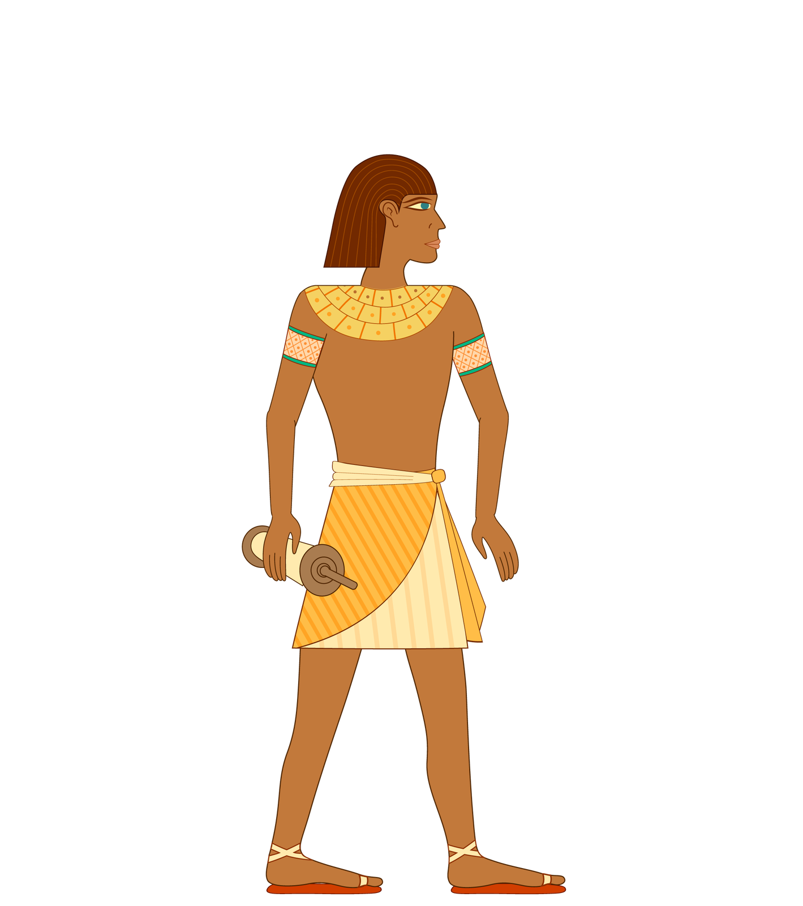
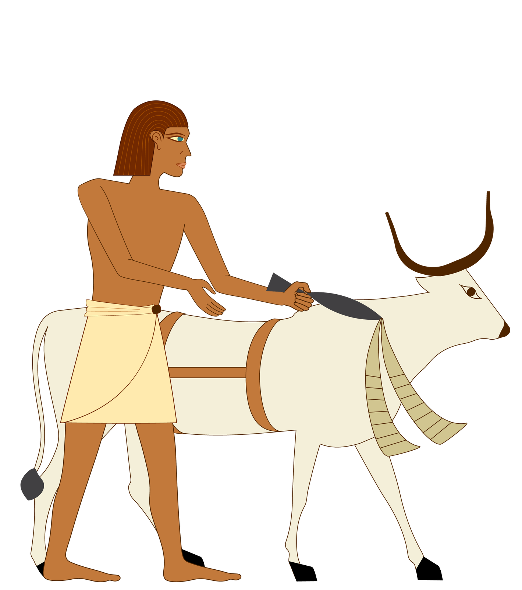
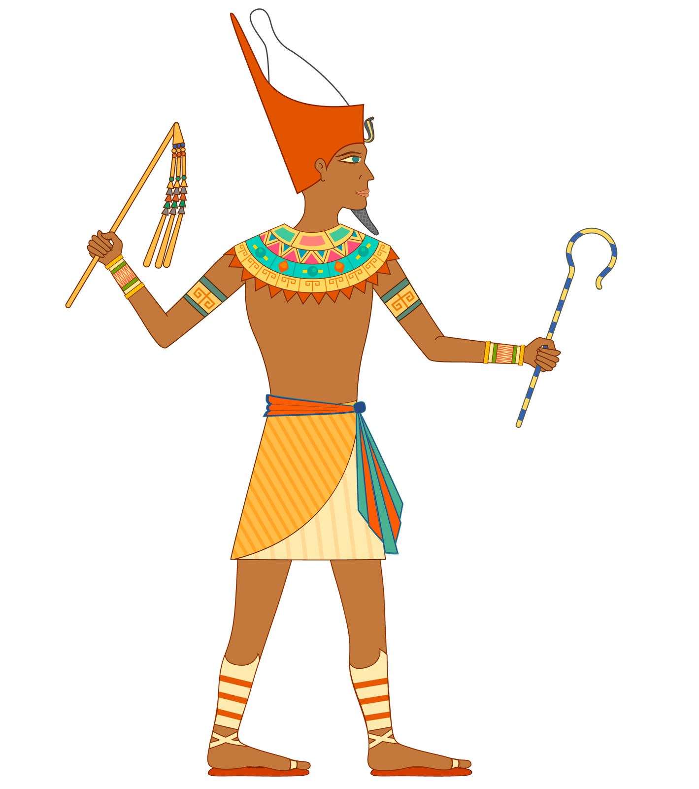
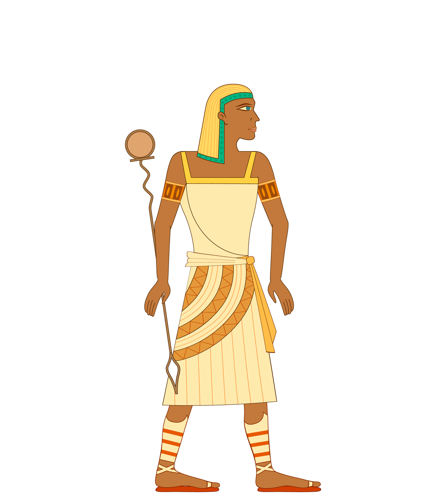

**Imię i nazwisko:** ____________________________________  **Grupa:** ______  **Pierwsza stacja:** ______

## 1. Egipt — dar Nilu

1. Odczytaj z mapy i uzupełnij.

- Rzeka: ______________________________
- Morze na północy: ______________________________
- Morze na wschodzie: ______________________________
- Pola i osady skupiały się głównie ________________________________________________

2. Uzupełnij zależność.

**wylew Nilu → woda i ____________________ → dobre ____________________ → rozwój pól, osad i miast**

3. Dlaczego Nil był ważny także poza rolnictwem? __________________________________________

## 2. Mumifikacja krok po kroku

Wpisz w każde puste pole numer od **1 do 5** zgodnie z kolejnością pokazaną w filmie.

| Numer | Etap |
|:---:|---|
| ____ | ciało owijano pasami lnu |
| ____ | usuwano część organów |
| ____ | nakładano kolejne osłony, amulety lub portret |
| ____ | ciało osuszano solą |
| ____ | ciało nacierano olejami i żywicami |

Mumifikowano ciało, ponieważ Egipcjanie wierzyli, że ______________________________________

## 3. Społeczeństwo Egiptu

Rozpoznaj postacie. Przy każdej zapisz nazwę grupy oraz jej główne zajęcie.

| A | B | C | D |
|:---:|:---:|:---:|:---:|
|  |  |  |  |
| Grupa: __________ | Grupa: __________ | Grupa: __________ | Grupa: __________ |
| Zajęcie: _________ | Zajęcie: _________ | Zajęcie: _________ | Zajęcie: _________ |

Wybierz jedną z tych grup. Dlaczego jej praca była ważna dla państwa?

Grupa: ____________________  Znaczenie: ___________________________________________________

## 4. Osiągnięcia i kod hieroglificzny

1. Podaj dwa osiągnięcia Egipcjan i napisz, do czego służyły.

- __________________________ służyło do __________________________________________________
- __________________________ służyło do __________________________________________________

2. Użyj szkolnego kodu ze stanowiska. Zapisz swoje imię i nazwisko bez polskich znaków, a potem przerysuj odpowiadające im znaki.

**Imię bez polskich znaków:** _____________________________________________________________

**Znaki:** _______________________________________________________________________________

**Nazwisko bez polskich znaków:** _________________________________________________________

**Znaki:** _______________________________________________________________________________

## 5. Bogowie Egiptu

Połącz imię boga z właściwym opisem. Zapisz pięć par.

| Bóstwo | Opis lub atrybut |
|---|---|
| 1. Re (Ra) | A. głowa szakala; mumifikacja i opieka nad zmarłymi |
| 2. Ozyrys | B. kot lub głowa kota; dom i ochrona |
| 3. Izyda | C. świat zmarłych; korona, berło i bicz |
| 4. Anubis | D. Słońce; głowa sokoła lub jastrzębia i tarcza słoneczna |
| 5. Bastet | E. macierzyństwo, opieka i rodzina; żona Ozyrysa |

Pary: 1–____  2–____  3–____  4–____  5–____

Religia Egipcjan była politeistyczna, czyli _______________________________________________

## Bilet wyjścia

Wybierz jedną stację. Zapisz najważniejszą rzecz, której się na niej nauczyłeś lub nauczyłaś.

Stacja nr ____: __________________________________________________________________________
