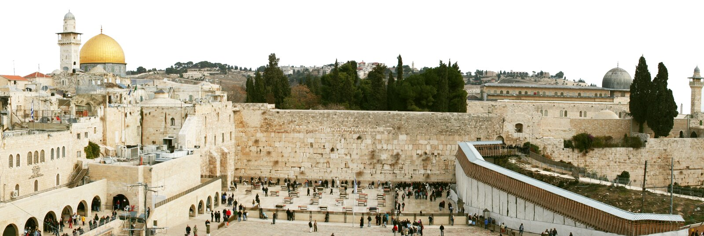
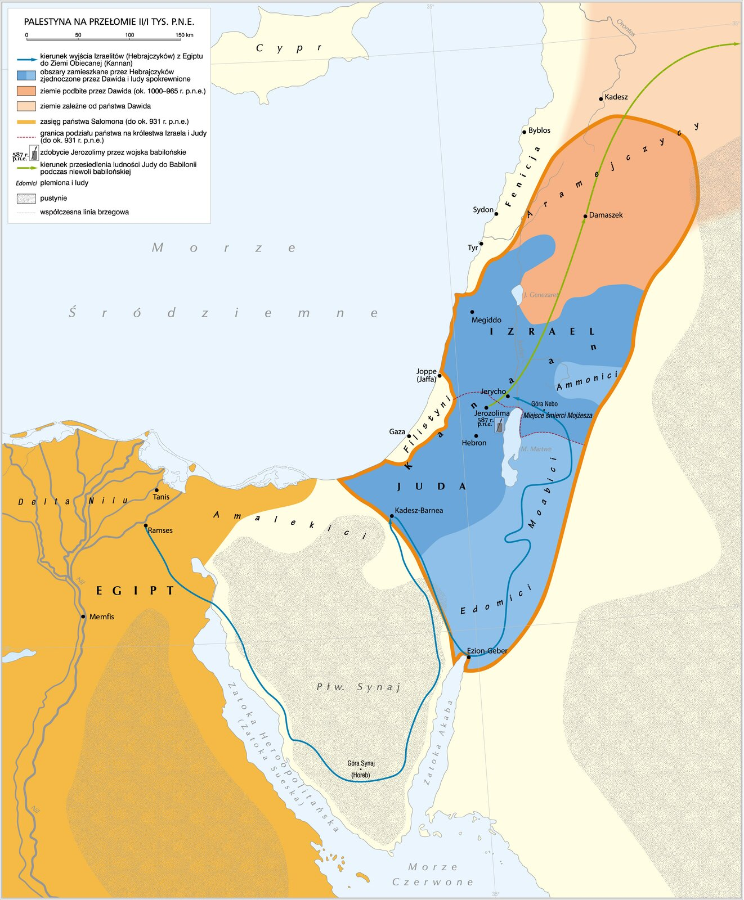
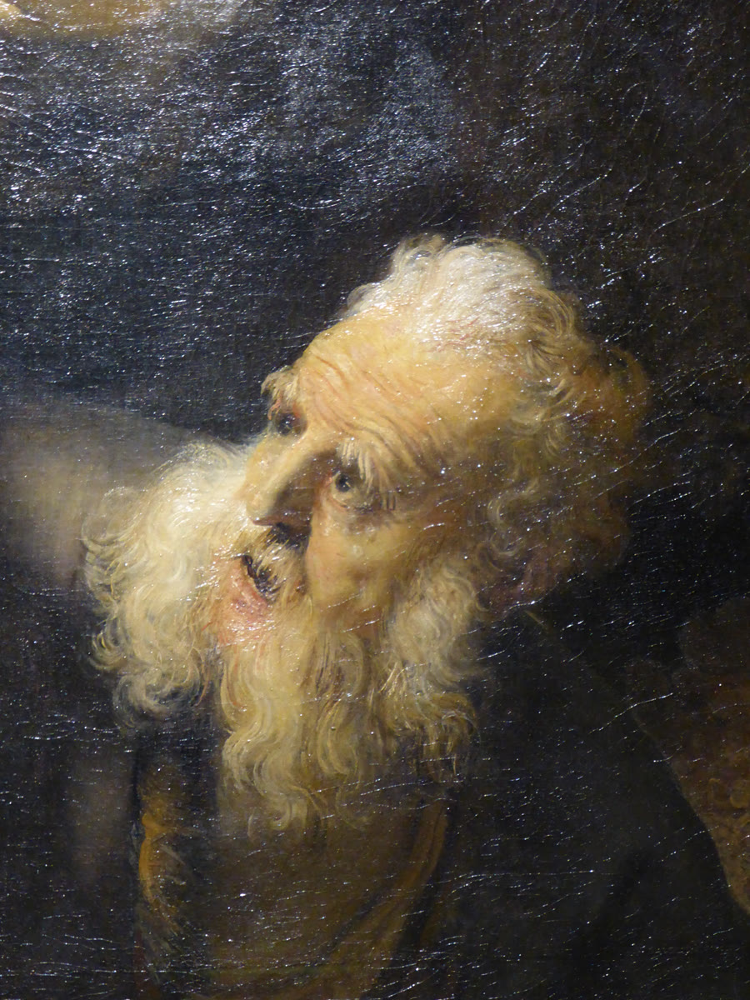
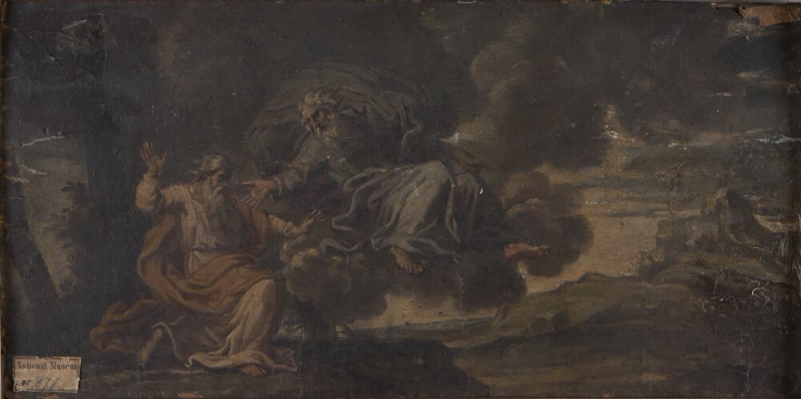
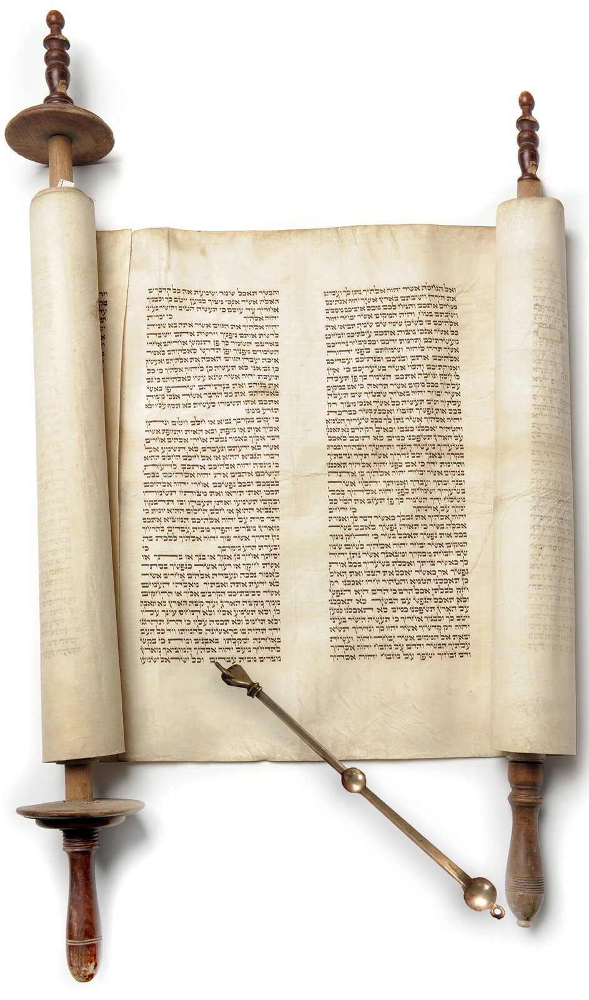
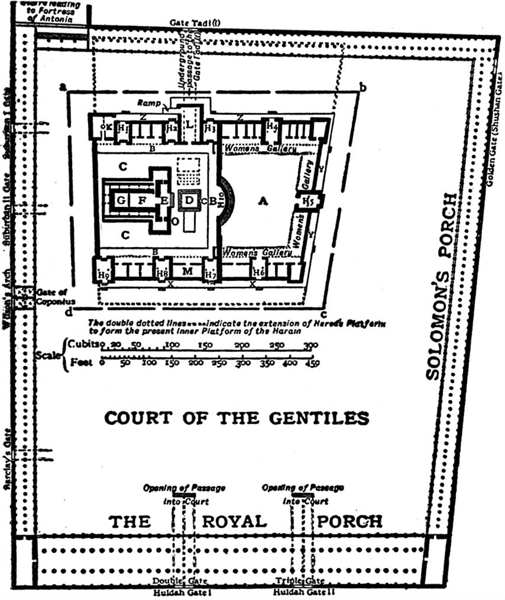
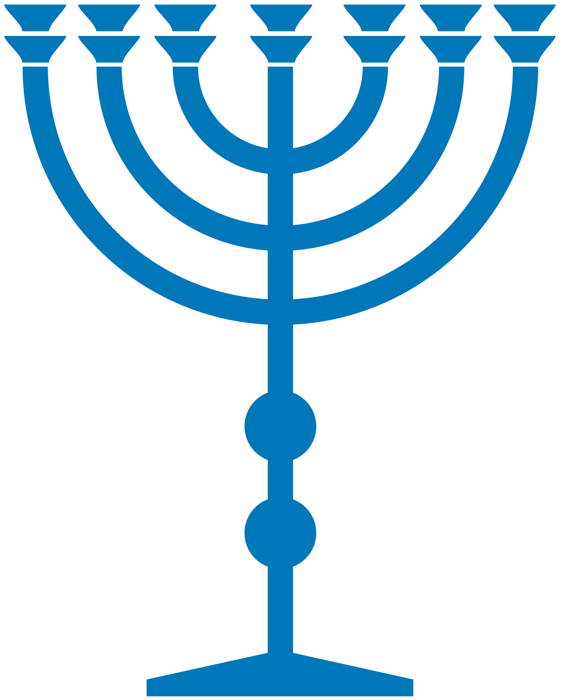
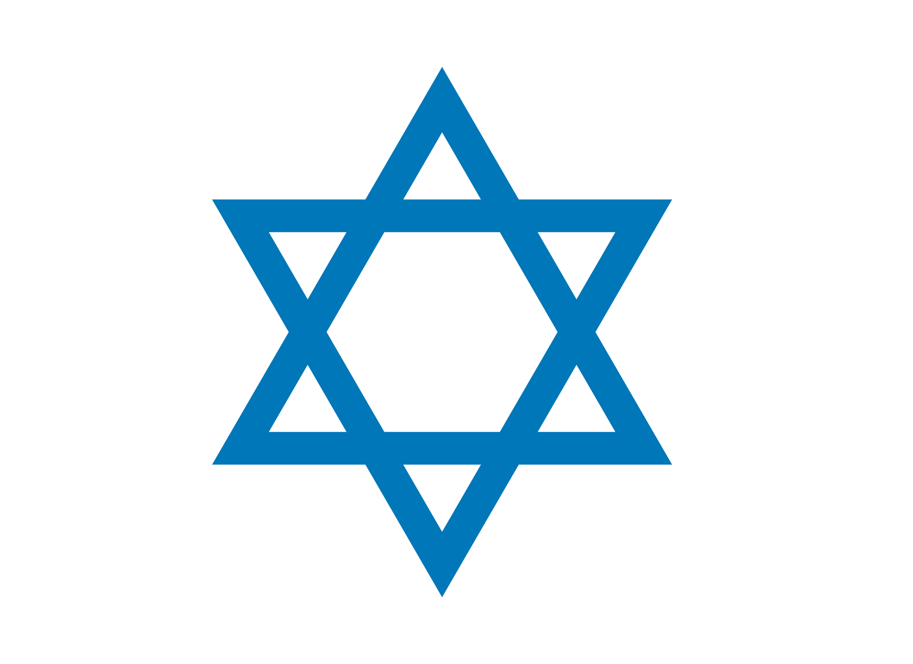
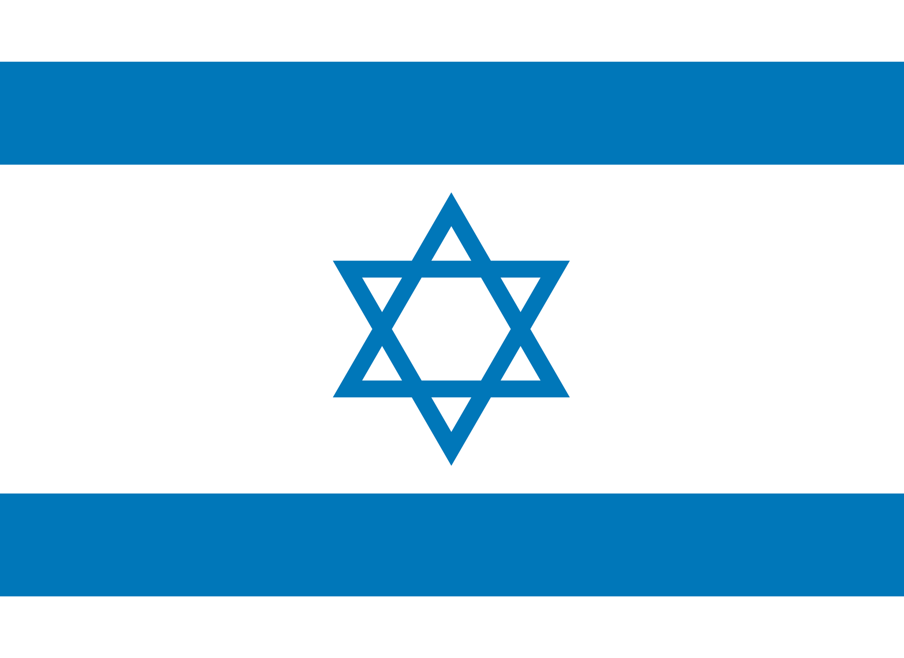

<!-- .slide: id="otwarcie" data-purpose="opening" data-layout="statement" -->

BLISKI WSCHÓD · STAROŻYTNOŚĆ

<h1>W starożytnym Izraelu</h1>
<h2>Dzieje, religia i znaczenie Jerozolimy</h2>

Jak jedno miejsce połączyło historię, wiarę i pamięć?

<figure><figcaption>Zachodni Mur w Jerozolimie. Fot. Sheepdog85, CC BY-SA 3.0, za ZPE.</figcaption></figure>

<!-- notes:
Poproś o jedną hipotezę: dlaczego Jerozolima mogła być ważna dla wspólnoty nawet po utracie państwa?
-->

---

<!-- .slide: id="mapa-region" data-purpose="evidence" data-layout="hero-source" -->
<figure class="source-figure map-full"></figure>

<!-- notes:
Mapa łączy kilka warstw czasowych. Nie odczytuj jej jak obrazu jednego roku. ZPE oznacza zdobycie Jerozolimy jako 587 r. p.n.e.; w materiałach ucznia użyto 586. Oba datowania występują w literaturze.
-->

---

<!-- .slide: id="tradycja" data-purpose="explanation" data-layout="matrix" -->
## Początki w tradycji biblijnej

<figure><figcaption>Abraham — późniejsze dzieło sztuki ilustrujące tradycję biblijną.</figcaption></figure>
<figure><figcaption>Mojżesz otrzymujący Dekalog na Synaju — późniejsze dzieło sztuki ilustrujące tradycję biblijną.</figcaption></figure>

<strong>Ważne:</strong> to opowieści kształtujące pamięć wspólnoty; nie mają jednej bezspornej, dokładnej daty.

---

<!-- .slide: id="krolestwo" data-purpose="explanation" data-layout="timeline-band" -->
## Od królestwa do dwóch państw

ok. X w. p.n.e.<strong>Dawid</strong>
według Biblii zdobył Jerozolimę i uczynił ją stolicą; opowieść o Goliacie łączy go z procą, nie mieczem.

tradycja<strong>Salomon</strong>
słynął z mądrego sądu; z jego panowaniem Biblia łączy budowę Pierwszej Świątyni.

ok. 930 p.n.e.<strong>Rozpad</strong>
po śmierci Salomona powstały: Izrael na północy i Juda na południu.

Co wydarzyło się po śmierci Salomona? Rechoboam odmówił zmniejszenia podatków i przymusowej pracy; północne plemiona wybrały Jeroboama.

---

<!-- .slide: id="podzial-krolestw" data-purpose="evidence" data-layout="hero-source" -->
## Po śmierci Salomona: Izrael i Juda

<figure class="source-figure division-map"><figcaption>Na mapie odszukaj dwa królestwa: Izrael na północy i Judę na południu. Mapa syntetyczna ZPE.</figcaption></figure>

---

<!-- .slide: id="wygnanie" data-purpose="explanation" data-layout="impact-flow" -->
## Utrata państwa — zachowanie wspólnoty

<strong>722 p.n.e.</strong>Asyria podbija Izrael

<strong>587/586 p.n.e.</strong>Babilończycy niszczą Jerozolimę i Pierwszą Świątynię

<strong>wygnanie</strong>część ludności Judy trafia do Babilonii

<strong>po 539/538 p.n.e.</strong>pod panowaniem Persów część wygnańców wraca

---

<!-- .slide: id="powstania" data-purpose="explanation" data-layout="timeline-band" -->
## Obce panowanie i powstania

167 p.n.e.<strong>Machabeusze</strong>
sprzeciw wobec władzy Seleucydów; Chanuka upamiętnia odzyskanie i ponowne poświęcenie Świątyni.

66–73 n.e.<strong>Powstanie przeciw Rzymowi</strong>
70 n.e. — zniszczenie Drugiej Świątyni

132–135 n.e.<strong>Bar Kochba</strong>
klęska i nasilone represje

Kolejne podboje i rozproszenie nie zakończyły istnienia wspólnoty ani religii.

---

<!-- .slide: id="os-czasu" data-purpose="practice" data-layout="activity-brief" -->
## Uporządkuj sześć wydarzeń

<strong>Pracujcie w parach. Macie 6 minut.</strong>
<ol>
<li>Wpiszcie kolejność wydarzeń z zadania 1.</li>
<li>Wybierzcie jedno przejście i wyjaśnijcie związek: <em>wydarzenie → skutek</em>.</li>
<li>Zaznaczcie, które wydarzenia należą do tradycji biblijnej.</li>
</ol>

Gotowe: sześć numerów + jedno zdanie przyczynowo‑skutkowe.

---

<!-- .slide: id="judaizm" data-purpose="explanation" data-layout="matrix" -->
## Judaizm — religia jednego Boga

<strong>monoteizm</strong>wiara w jednego Boga

<strong>przymierze</strong>szczególna więź Boga i ludu Izraela

<strong>prawo</strong>zasady życia jednostki i wspólnoty

<strong>pamięć</strong>opowieści, święta i nauczanie podtrzymują tożsamość

politeizm = wielu bogów &nbsp;&nbsp;•&nbsp;&nbsp; monoteizm = jeden Bóg

---

<!-- .slide: id="tora-prorocy" data-purpose="evidence" data-layout="split" -->
## Tora, prorocy, Mesjasz

<ul class="plain-list">
<li><strong>Tora:</strong> pięć pierwszych ksiąg Biblii hebrajskiej oraz zawarte w nich nauczanie i prawo.</li>
<li><strong>Prorocy:</strong> wzywali do wierności Bogu, sprawiedliwości i poprawy postępowania.</li>
<li><strong>Mesjasz:</strong> oczekiwany „pomazaniec”, z którym wiązano nadzieję na odnowę.</li>
</ul>

<figure class="source-figure"><figcaption>Zwój Tory. Fot. Lewrie Cate, CC BY 2.0, za ZPE.</figcaption></figure>

---

<!-- .slide: id="swiatynia" data-purpose="evidence" data-layout="plain" -->
## Świątynia za Salomona — współczesna wizualizacja

<lesson-video>

<strong>Film: 1:20–9:50</strong>
Obejrzyj początek: Dawid, Jerozolima i rozpoczęcie budowy za Salomona. Zatrzymaj około 2:24. Plan B: kolejny slajd — schemat części Świątyni.
<button data-video-play type="button">Odtwórz fragment</button>

<iframe data-video-src="https://www.youtube-nocookie.com/embed/Xt6lQAe8ues?start=80&end=590" title="Solomon's Temple Explained — współczesna wizualizacja" allow="accelerometer; autoplay; clipboard-write; encrypted-media; gyroscope; picture-in-picture" allowfullscreen hidden></iframe>
</lesson-video>

<!-- notes:
Film jest współczesną wizualizacją i ma wyznaniową perspektywę. W pierwszych minutach wykorzystaj tylko informacje o Dawidzie, Salomonie i budowie Świątyni; nie przedstawiaj grafiki jako pewnej rekonstrukcji archeologicznej.
-->

---

<!-- .slide: id="plan-swiatyni" data-purpose="explanation" data-layout="plain" -->
## Świątynia — części i wyposażenie

<figure class="source-figure temple-plan"><figcaption>Plan Drugiej Świątyni i dziedzińców z czasów Heroda, Encyclopaedia Britannica (1911), domena publiczna.</figcaption></figure>

---

<!-- .slide: id="zachodni-mur" data-purpose="evidence" data-layout="split" -->
## Co pozostało po kompleksie Świątyni?

Druga Świątynia została zniszczona przez Rzymian w <strong>70 r. n.e.</strong>

<strong>Zachodni Mur</strong> jest częścią muru oporowego dawnego kompleksu Wzgórza Świątynnego.

Nie jest ścianą samego budynku Świątyni.

<figure class="source-figure"><figcaption>Zachodni Mur w Jerozolimie. Fot. Sheepdog85, CC BY-SA 3.0, za ZPE.</figcaption></figure>

---

<!-- .slide: id="symbole" data-purpose="evidence" data-layout="matrix" -->
## Rozpoznaj symbole judaizmu

<figure><figcaption><strong>Menora</strong> siedmioramienny świecznik związany ze Świątynią</figcaption></figure>
<figure><figcaption><strong>Tora</strong> nauczanie i prawo</figcaption></figure>
<figure><figcaption><strong>Gwiazda Dawida</strong> symbol upowszechniony znacznie później</figcaption></figure>

ZPE: Contentplus.pl, CC BY 3.0; Lewrie Cate, CC BY 2.0.

---

<!-- .slide: id="most-chrzescijanstwo" data-purpose="synthesis" data-layout="hero-source" -->
## Most do następnej historii

1<strong>Judea</strong>
Chrześcijaństwo narodziło się w środowisku żydowskim w rzymskiej Judei.

2<strong>Miasta i drogi</strong>
Uczniowie Jezusa oraz pierwsi misjonarze przekazywali naukę przez miasta i porty cesarstwa.

3<strong>Morze Śródziemne</strong>
W I–III w. n.e. wspólnoty pojawiały się od wschodniej części cesarstwa po Rzym.

Co pomagało nowej religii rozchodzić się między odległymi miastami?

---

<!-- .slide: id="izrael-dzis" data-purpose="explanation" data-layout="split" -->
## Starożytność a współczesny Izrael

<strong>1948</strong> — ogłoszenie niepodległości współczesnego państwa Izrael.

Leży w tym samym regionie, ale nie jest tym samym organizmem politycznym co starożytne królestwa Izraela i Judy.

<figure class="source-figure"><figcaption>Flaga Izraela. Contentplus.pl, CC BY 3.0, za ZPE.</figcaption></figure>

---

<!-- .slide: id="bilet" data-purpose="exit-ticket" data-layout="activity-brief" -->
## Bilet wyjścia

<ol>
<li>Czym monoteizm różni się od politeizmu?</li>
<li>Podaj dwa elementy judaizmu i objaśnij jeden z nich.</li>
<li>Gdzie i kiedy narodziło się chrześcijaństwo — i w jakim kierunku początkowo się rozprzestrzeniało?</li>
</ol>

3 minuty • odpowiedz samodzielnie

