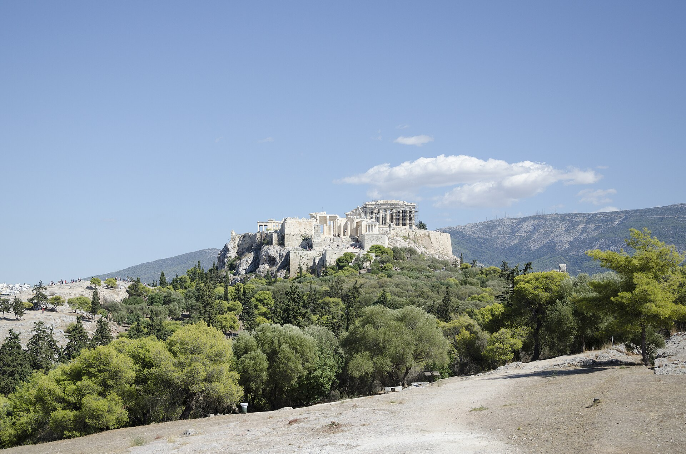
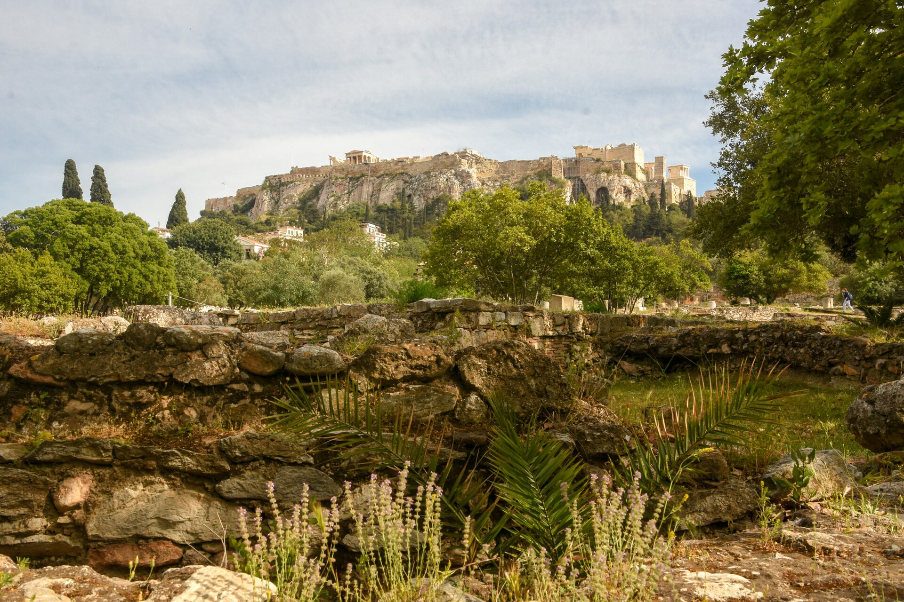
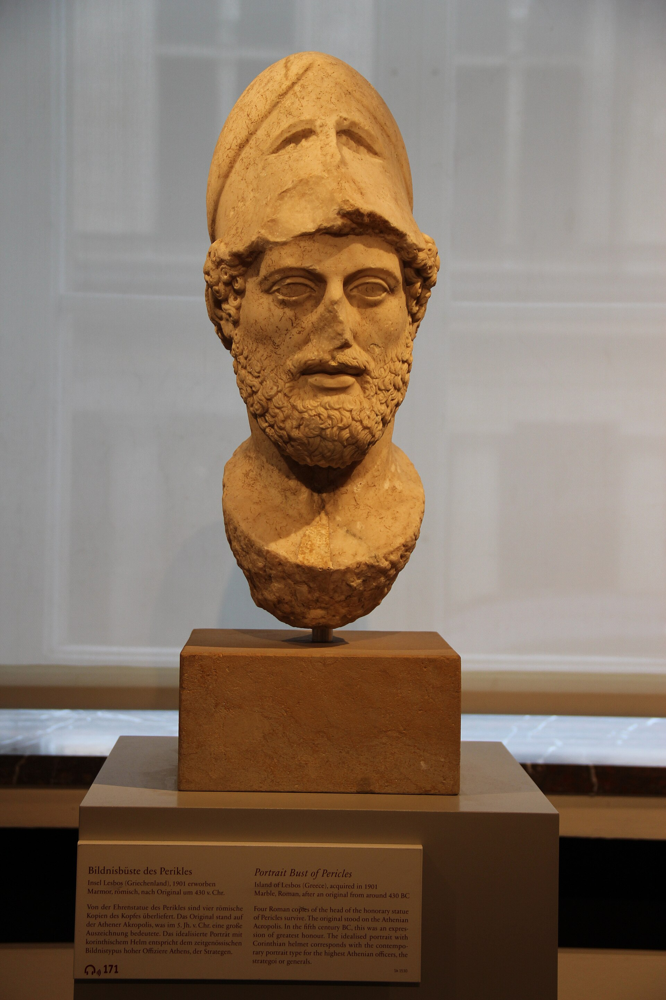

<!-- .slide: id="otwarcie" data-purpose="opening" data-layout="split" data-goals="G1" -->

  

    
STAROŻYTNA GRECJA · KLASA V

    <h1>Demokratyczne Ateny</h1>
    
Polis, obywatele i decyzje podejmowane na zgromadzeniu

  

  <figure class="source-figure"><figcaption>Pnyks — miejsce obrad; w tle Akropol. Fot. Peulle, CC BY-SA 4.0.</figcaption></figure>

<!-- notes:
Poproś pary o jedną hipotezę: dlaczego obywatele spotykali się na wzgórzu pod gołym niebem? Nie wyjaśniaj jeszcze całej procedury.
-->

---

<!-- .slide: id="mapa" data-purpose="evidence" data-layout="map-focus" data-goals="G1" -->
<button class="map-button" type="button" data-lightbox-src="assets/grecja-490-pne.png" data-lightbox-alt="Mapa świata greckiego około 490 roku przed naszą erą" data-lightbox-uncaptioned="true" aria-label="Powiększ mapę świata greckiego około 490 roku przed naszą erą">
  
</button>

<!-- notes:
Mapa ma angielskie etykiety. Wskaż: Aegean Sea = Morze Egejskie, Athens = Ateny, Attica = Attyka, Sparta = Sparta. To mapa około 490 r. p.n.e., nie stałych granic całej starożytności.
-->

---

<!-- .slide: id="polis" data-purpose="explanation" data-layout="statement" data-goals="G1" -->
## Polis to więcej niż miasto

  <strong>POLIS</strong>
  wspólnota obywateli
  miasto i okoliczne ziemie
  własne prawa i instytucje

<b>około VIII w. p.n.e.</b> — rozwój greckich miast-państw

---

<!-- .slide: id="miejsca" data-purpose="evidence" data-layout="split" data-goals="G1" -->
## Trzy przestrzenie ateńskiej polis

  <figure class="source-figure"><figcaption>Akropol widziany z agory. Fot. Georgios Liakopoulos, CC BY-SA 3.0.</figcaption></figure>
  

    
<b>AGORA</b>handel, spotkania, życie publiczne

    
<b>AKROPOL</b>kult i dawna funkcja obronna

    
<b>PNYKS</b>obrady zgromadzenia obywateli

  

---

<!-- .slide: id="mieszkancy" data-purpose="explanation" data-layout="matrix" data-goals="G3" -->
## Mieszkaniec nie zawsze był obywatelem

  
grupawolność osobistaudział w zgromadzeniu

  
<b>mężczyźni–obywatele</b>taktak

  
<b>kobiety z rodzin obywatelskich</b>taknie

  
<b>metojkowie — wolni przybysze</b>taknie

  
<b>ludzie zniewoleni</b>nienie

Brak praw politycznych nie oznaczał braku znaczenia w gospodarce, rodzinie lub religii.

---

<!-- .slide: id="demokracja" data-purpose="explanation" data-layout="process" data-goals="G2" -->
## Demokracja bezpośrednia

  
1<b>Obecność</b>
obywatel przychodził na zgromadzenie

  
2<b>Przemówienia</b>
uczestnicy przedstawiali wnioski i argumenty

  
3<b>Głosowanie</b>
większość decydowała o sprawie

  
4<b>Uchwała</b>
decyzja obowiązywała polis

<strong>Bez posłów:</strong> uprawnieni obywatele decydowali osobiście.

---

<!-- .slide: id="perykles" data-purpose="evidence" data-layout="split" data-goals="G2" -->
## Perykles — strateg i mówca, nie król

  <figure class="source-figure"><figcaption>Rzymska kopia greckiego popiersia Peryklesa. Fot. Gary Todd, CC0.</figcaption></figure>
  

    
<b>V w. p.n.e.</b>czas rozkwitu demokratycznych Aten

    
<b>wielokrotnie wybierany strateg</b>dowódca i wpływowy polityk

    
<b>znakomity mówca</b>przekonywał obywateli, ale nie rządził sam

    
<b>służba publiczna</b>wynagrodzenia ułatwiały udział mniej zamożnym

  

<!-- notes:
Nie przypisuj Peryklesowi stworzenia demokracji od zera ani bez zastrzeżenia zapłaty za sam udział w zgromadzeniu. Bezpiecznie: wspierał wynagrodzenia za część służby publicznej, zwłaszcza sądowej.
-->

---

<!-- .slide: id="decyzja" data-purpose="practice" data-layout="comparison" data-goals="G2 G3" -->
## Polis może wybrać tylko jedną inwestycję

FIKCYJNA SYTUACJA DYDAKTYCZNA — NIE KONKRETNE GŁOSOWANIE Z EPOKI

  
<b>A</b><strong>Ujęcie wody przy agorze</strong>łatwiejszy dostęp do wody dla miasta i rynku

  
<b>B</b><strong>Naprawa drogi do Pireusu</strong>sprawniejszy transport ludzi i towarów do portu

Wybierzcie A lub B. Zapiszcie jeden argument z punktu widzenia waszej grupy.

---

<!-- .slide: id="role" data-purpose="practice" data-layout="matrix" data-goals="G3" -->
## Pięć grup mieszkańców

  
<b>A · obywatele–rolnicy</b>macie prawa polityczne

  
<b>B · obywatele–rzemieślnicy i wioślarze</b>macie prawa polityczne

  
<b>C · metojkowie–kupcy</b>jesteście wolni, bez praw politycznych

  
<b>D · kobiety z rodzin obywatelskich</b>jesteście wolne, bez praw politycznych

  
<b>E · ludzie zniewoleni</b>nie macie wolności ani praw politycznych

Rola jest losowa i nie ma związku z płcią, pochodzeniem ani sytuacją ucznia.

---

<!-- .slide: id="runda-a" data-purpose="practice" data-layout="activity-brief" data-goals="G2 G3" -->
## Głosowanie — zasady historycznej symulacji

  
<strong>Grupy A–B: obywatele</strong>
Przedstawcie argument. Następnie każdy obywatel głosuje: A albo B.

  
<strong>Grupy C–E: bez praw politycznych</strong>
Nie głosujecie. Policzcie głosy i zapiszcie potrzebę, której zgromadzenie nie usłyszało.

8 minut • wynik i obserwację zapiszcie w zadaniu 4

---

<!-- .slide: id="porownanie" data-purpose="synthesis" data-layout="comparison" data-goals="G3" -->
## Ateny a współczesna Polska

  
ATENY · V W. P.N.E.<b>demokracja bezpośrednia</b>
uprawnieni obywatele sami przemawiają i głosują

prawa polityczne ma tylko część mieszkańców

  
POLSKA · DZIŚ<b>głównie demokracja przedstawicielska</b>
obywatele wybierają przedstawicieli do władz

prawa wyborcze ma ogół dorosłych obywateli

Nie pytamy tylko „czy była demokracja?”, lecz także: <strong>kto należał do ludu politycznego?</strong>

---

<!-- .slide: id="bilet" data-purpose="exit-ticket" data-layout="activity-brief" data-goals="G2 G3" -->
## Bilet wyjścia

  
<b>1.</b> Ateny były demokratyczne, ponieważ…

  
<b>2.</b> Nie były demokratyczne dla wszystkich, ponieważ…

  
<b>3.</b> Jedna różnica między Atenami a współczesną Polską polega na tym, że…

3 minuty • odpowiedz samodzielnie w zadaniu 6

