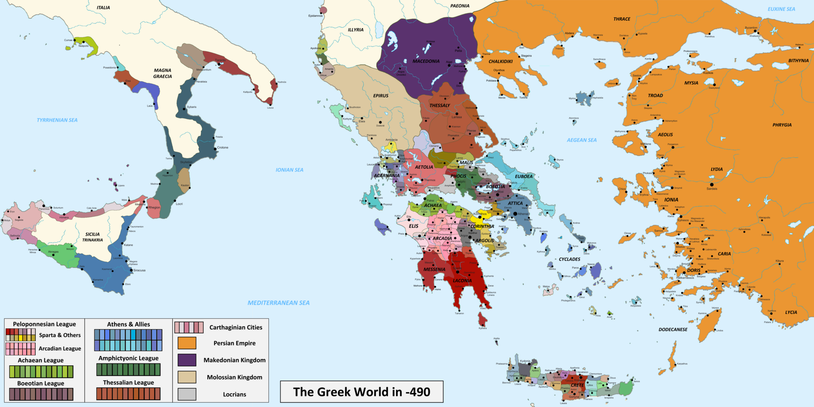

# Pakiet grupowy: Demokratyczne Ateny

**Jeden pakiet dla grupy. Nie trzeba go ciąć.** Każda osoba lub para analizuje jedną kartę A–D, rozwiązuje zadanie i przedstawia grupie odpowiedź wraz z uzasadnieniem.

---

## Karta A — gdzie i kiedy?

Świat grecki obejmował południe Półwyspu Bałkańskiego, liczne wyspy i wybrzeża Morza Egejskiego. Ateny leżały w Attyce. Grecy nie utworzyli jednego wspólnego państwa: żyli w wielu samodzielnych polis. Polis rozwijały się od około VIII w. p.n.e., a rozkwit Aten Peryklesa przypadał na V w. p.n.e.

**Przekaż grupie:** Gdzie leżały Ateny? Jakie dwa wieki trzeba zapamiętać?

---

## Karta B — czym była polis?

**Polis** nie oznaczała wyłącznie zabudowanego miasta. Była wspólnotą obywateli posiadającą miasto, okoliczne ziemie, własne prawa i instytucje. **Agora** była placem handlu, spotkań i życia publicznego. **Akropol** był wyniesioną częścią miasta związaną przede wszystkim z kultem, a dawniej także z obroną. Na wzgórzu **Pnyks** obradowało ateńskie zgromadzenie obywateli.

### Rozwiąż
1. Dopasuj miejsce do sytuacji i uzasadnij każdy wybór:
   - sprzedaż oliwy i ceramiki;
   - modlitwa w świątyni położonej nad miastem;
   - przemówienie obywatela przed głosowaniem.
2. Obal zdanie: **„Polis to tylko zabudowane miasto otoczone murami”.** Wskaż dwa elementy polis pominięte w tym zdaniu.

---

## Karta C — jak podejmowano decyzje?

Rada Pięciuset przygotowywała sprawy do obrad. Na zgromadzeniu uprawnieni obywatele słuchali przemówień, dyskutowali i głosowali. Urzędnicy wykonywali przyjęte uchwały. Wiele urzędów obsadzano przez losowanie, ale strategów, czyli dowódców, wybierano.

### Rozwiąż
1. Uporządkuj: **wykonanie uchwały · głosowanie · przygotowanie sprawy · przemówienia i dyskusja**.
2. Ateny potrzebują doświadczonego dowódcy. Czy stratega lepiej **wylosować**, czy **wybrać**? Zdecyduj i uzasadnij.
3. W którym etapie najlepiej widać, że demokracja była bezpośrednia?

---

## Karta D — kto był obywatelem?

Pełne prawa polityczne mieli wolno urodzeni dorośli mężczyźni należący do wspólnoty obywatelskiej. Kobiety z rodzin obywatelskich, metojkowie — wolni przybysze — oraz ludzie zniewoleni nie uczestniczyli w zgromadzeniu. **Perykles** był w V w. p.n.e. wielokrotnie wybieranym strategiem, wpływowym politykiem i mówcą.

### Rozwiąż
1. Zdecyduj, kto mógł przemawiać i głosować na zgromadzeniu:
   - dorosły mężczyzna–obywatel;
   - kobieta z rodziny obywatelskiej;
   - dorosły metojk prowadzący warsztat;
   - człowiek zniewolony pracujący w porcie.
2. Popraw zdanie: **„Perykles był królem, dlatego sam podejmował decyzje za Ateńczyków”.**

---

# Miniagora — problem polis

Ateny mogą sfinansować tylko jedną inwestycję:

- **A — publiczne ujęcie wody przy agorze:** łatwiejszy dostęp do wody dla mieszkańców i rynku;
- **B — naprawa drogi do portu w Pireusie:** sprawniejszy transport ludzi i towarów.

## Role grup

### 1. Obywatele–rolnicy
Macie prawa polityczne. Woda pomaga ludziom i rynkowi, ale droga może ułatwić sprzedaż plonów.

### 2. Obywatele–rzemieślnicy i wioślarze
Macie prawa polityczne. Woda służy warsztatom i domom, a droga pomaga portowi oraz pracy.

### 3. Metojkowie–kupcy
Jesteście wolnymi przybyszami. Pracujecie w handlu i płacicie podatki, lecz nie macie ateńskich praw politycznych.

### 4. Kobiety z rodzin obywatelskich
Jesteście wolne i ważne dla życia domu oraz religii, lecz nie uczestniczycie w zgromadzeniu.

### 5. Ludzie zniewoleni
Wykonujecie pracę domową, transportową lub budowlaną. Nie macie wolności osobistej ani praw politycznych.

## Zapis grupy

Nasza rola: ______  Nasz wybór: **A / B**

Nasz argument: _________________________________________________________________________

Kto mógł przemawiać i głosować? _________________________________________________________

Wynik A / B: ______ / ______

Potrzeba, której zgromadzenie nie usłyszało: ______________________________________________

## Wnioski

1. W Atenach o sprawach polis decydowali ________________________________________________.

2. Z udziału w zgromadzeniu byli wykluczeni ____________________________________________.

---

**Źródła opracowania:** podstawa programowa historii, Dz.U. 2024 poz. 996, dział I pkt 2 i 4; publiczny flipbook Nowej Ery *Wczoraj i dziś 5*, „Demokratyczne Ateny”; materiały ZPE wymienione w `sources.md`. Mapa: Simeon Netchev / World History Encyclopedia, CC BY-NC-SA 4.0.