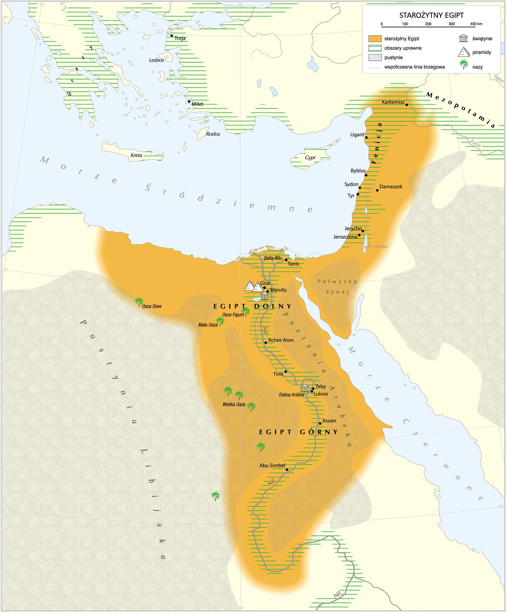

# Karty stacji: Starożytny Egipt

> Wydrukuj dwa komplety dla klasy liczącej 17–32 uczniów. Każdą stację włóż do osobnej koperty lub koszulki. Karty oznaczone „wytnij” przygotuj przed lekcją.

# Stacja 1. Tajemnica zielonej wstęgi

## Akta kartografa
Starożytny Egipt rozwinął się w północno-wschodniej Afryce. Większość kraju była sucha, ale wzdłuż Nilu i w jego delcie ciągnął się pas ziemi przydatnej do uprawy. Wylewy rzeki pozostawiały żyzny muł, a kanały doprowadzały wodę dalej od brzegu.

*Mapa starożytnego Egiptu. Źródło: Krystian Chariza i zespół, ZPE, licencja CC BY 3.0.*

## Polecenie
1. Na mapie w koszulce obrysuj bieg **Nilu** i zakreśl **deltę**.
2. Wskaż **Gizę** oraz **Teby**. Powiedz zespołowi, czy leżą bliżej Nilu, czy daleko od niego.
3. Ułóż ramy czasu: **początek III tysiąclecia p.n.e. / około 3000 r. p.n.e. → 30 r. p.n.e.**
4. W paszporcie dokończ zdanie: „Pola i osady skupiały się nad Nilem, ponieważ…”. Podaj dwa powody.

## Karta pomocy — otwórz po 3 minutach
Szukaj trzech rzeczy: **wody**, **żyznego mułu** i **kanałów nawadniających**.

## Dla badaczy
Dlaczego Górny Egipt znajduje się na południu mapy? Podpowiedź: nazwa dotyczy biegu rzeki, a Nil płynie z południa na północ.

---

# Stacja 2. Kto naprawdę utrzymywał Egipt?

## Akta urzędnika
Egipskie społeczeństwo miało hierarchię. Faraon stał na jej szczycie. Kapłani sprawowali kult, a urzędnicy pobierali podatki, nadzorowali zapasy, kanały i spory. Żołnierze bronili państwa. Rzemieślnicy wytwarzali potrzebne przedmioty, a kupcy prowadzili wymianę. Najliczniejsi chłopi uprawiali ziemię, oddawali część plonów jako podatek i wykonywali prace publiczne.

## Polecenie
1. Ułóż oznaczone literami karty grup społecznych od najwyższej pozycji do najniższej.
2. Dopasuj do każdej grupy właściwą kartę obowiązku.
3. W paszporcie zapisz, **kto był najliczniejszy** i dlaczego jego praca była konieczna dla całego państwa.

## Karty grup społecznych — wytnij

---
**C. RZEMIEŚLNICY I KUPCY**
Wytwarzali przedmioty i prowadzili wymianę.

---
**A. CHŁOPI**
Najliczniejsza grupa społeczeństwa.

---
**E. KAPŁANI I WYSOCY URZĘDNICY**
Elita związana z kultem i zarządzaniem państwem.

---
**B. FARAON**
Jeden władca stojący na czele państwa.

---
**D. PISARZE, URZĘDNICY I ŻOŁNIERZE**
Ludzie potrzebni administracji i obronie państwa.

---

## Karty obowiązków — wytnij

---
Wytwarzają naczynia, narzędzia i tkaniny oraz wymieniają towary.

---
Uprawiają ziemię, oddają część plonów i pracują przy kanałach.

---
Rządzi państwem i podejmuje najważniejsze decyzje.

---
Sprawują kult, pobierają podatki i nadzorują zapasy oraz kanały.

---
Prowadzą zapisy, wykonują polecenia administracji i bronią państwa.

---

## Karta pomocy — otwórz po 3 minutach
Najliczniejsza grupa wytwarzała żywność. Najwyżej znajdował się człowiek, który rządził państwem.

## Dla badaczy
Dlaczego znajomość pisma mogła podnosić pozycję pisarza w społeczeństwie?

---

# Stacja 3. Akta faraona

## Akta śledczego
Około 3000 r. p.n.e. Górny i Dolny Egipt zostały połączone w jedno państwo. Rządził nim faraon. Egipt był monarchią. Faraon nadzorował administrację i gospodarkę, dowodził wojskiem oraz był uznawany za pośrednika między bogami a ludźmi.

## Polecenie
1. Podziel karty decyzji między cztery obszary: **administracja**, **gospodarka**, **wojsko**, **religia**.
2. Wybierz dwa różne obszary i zapisz w paszporcie przykłady władzy faraona.
3. Dokończ zdanie: „Egipt był monarchią, ponieważ…”.

## Karty decyzji — wytnij

---
Faraon mianuje wezyra i urzędników zarządzających częściami kraju.

---
Faraon nakazuje zebrać część plonów i umieścić ją w państwowych spichlerzach.

---
Faraon decyduje o rozpoczęciu wojny albo zawarciu pokoju.

---
Faraon nadzoruje kult i występuje jako pośrednik między bogami a ludźmi.

---
Faraon rozkazuje naprawić kanały doprowadzające wodę na pola.

---
Faraon stoi na czele armii.

---
Urzędnicy rozstrzygają spór o ziemię w imieniu faraona.

---
Wizerunek faraona łączy symbole królewskie z odniesieniami do bogów.

---

## Karta pomocy — otwórz po 3 minutach
**Monarchia** to państwo rządzone przez jednego władcę. Jedna decyzja może pasować do więcej niż jednego obszaru — wtedy trzeba ją uzasadnić.

## Dla badaczy
Czy religijna rola faraona mogła wzmacniać jego władzę polityczną? Odpowiedz jednym zdaniem z „ponieważ”.

---

# Stacja 4. Pomieszane etykiety w grobowcu

## Akta archeologa
Egipcjanie czcili wielu bogów, między innymi Re — boga Słońca — oraz Ozyrysa, związanego ze światem zmarłych. Wierzyli również, że życie trwa po śmierci. Dlatego starali się zachować ciało zmarłego i wkładali do grobów przedmioty potrzebne w zaświatach.

## Polecenie
1. Połącz każdą kartę dowodu z właściwą etykietą muzealną.
2. W paszporcie wyjaśnij różnicę między **politeizmem** a **monoteizmem**.
3. Zapisz dwa dowody na to, że Egipcjanie wierzyli w życie po śmierci.

## Etykiety muzealne — wytnij

---
**POLITEIZM** — wiara w wielu bogów.

---
**MONOTEIZM** — wiara w jednego Boga.

---
**WIARA W ŻYCIE PO ŚMIERCI** — przekonanie, że śmierć nie kończy istnienia człowieka.

---

## Karty dowodów — wytnij

---
Egipcjanie czcili Re, Ozyrysa, Nut i wiele innych bóstw.

---
Religia starożytnego Izraela opierała się na wierze w jednego Boga.

---
Ciało zmarłego poddawano mumifikacji, aby je zachować.

---
Do grobowca wkładano żywność, przedmioty i kosztowności potrzebne zmarłemu w zaświatach.

---
Piramidy i grobowce były miejscami pochówku faraonów.

---
Każde z wielu egipskich bóstw opiekowało się określoną dziedziną życia lub częścią świata.

---

## Karta pomocy — otwórz po 3 minutach
Przedrostek **poli-** oznacza „wiele”, a **mono-** — „jeden”. Mumia i wyposażenie grobu odpowiadają na pytanie: „Co miało stać się ze zmarłym po śmierci?”.

## Dla badaczy
Echnaton próbował wywyższyć Atona i zakazać kultu innych bogów. Dlaczego po jego śmierci powrót do dawnych bóstw pokazuje siłę tradycyjnego egipskiego politeizmu?
