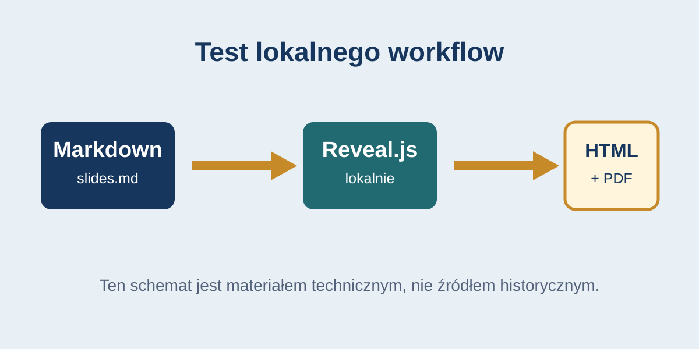

# Pilot szablonu — test techniczny

Klasa 6 · Prezentacja kontrolna · 45 minut

notes:
To nie jest gotowa lekcja historii. Służy wyłącznie do sprawdzenia lokalnego działania szablonu, sterowania, notatek i eksportu PDF.

---

<!-- .slide: id="slide-01" class="question-slide" data-purpose="question" data-layout="statement" -->
## Czy widzisz kolejne slajdy?

Naciśnij **spację** albo strzałkę w prawo.

notes:
Sprawdź, czy przejście i numer slajdu działają.

---

<!-- .slide: id="slide-02" class="context-slide" data-purpose="explanation" data-layout="statement" -->
## Test bez Internetu

- Treść: lokalny Markdown
- Silnik: lokalny Reveal.js
- Obraz: lokalny plik SVG

notes:
Odłącz sieć tylko podczas świadomego testu na komputerze używanym na lekcji.

---

<!-- .slide: id="slide-03" class="source-slide" data-purpose="evidence" data-layout="evidence" -->
schemat testowy

## Czy obraz jest widoczny?

Jeżeli widzisz obraz, lokalne zasoby ładują się prawidłowo.

notes:
Ten plik nie jest źródłem historycznym. Sprawdź też widok notatek klawiszem S.

---

<!-- .slide: id="slide-04" class="exit-ticket-slide" data-purpose="exit-ticket" data-layout="plain" -->
## Gotowość techniczna

Czy działają: slajdy, obraz, notatki, pełny ekran i PDF?

notes:
Po teście zaznacz wynik w metadata.json oraz wykonaj eksport PDF.
