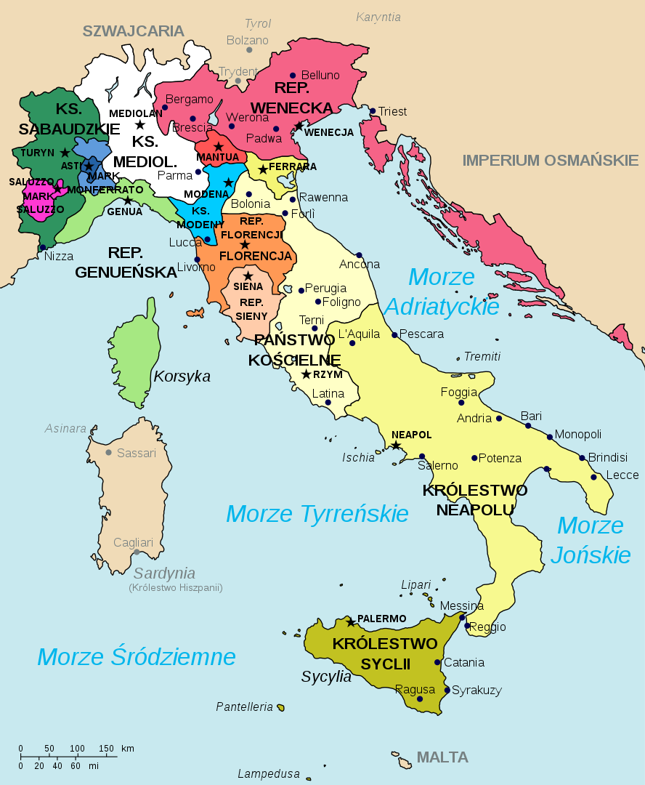
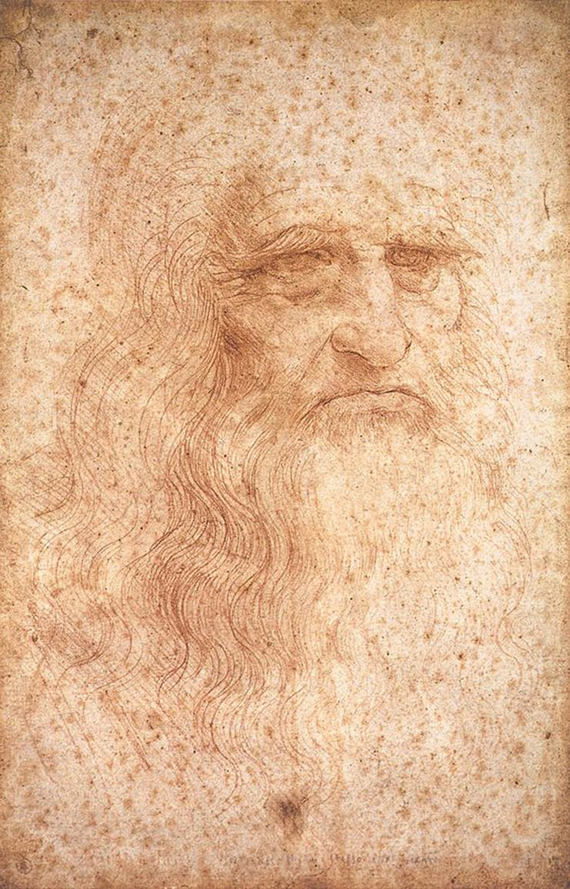
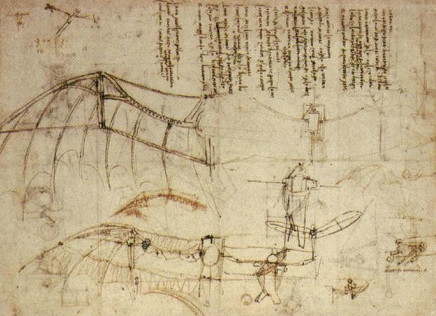
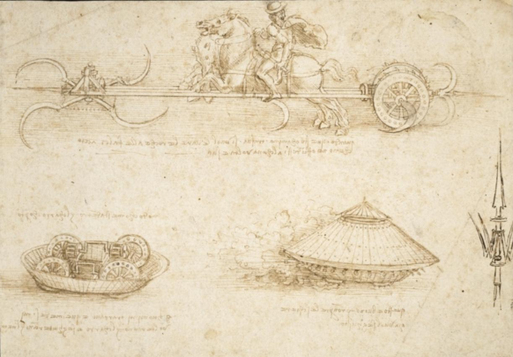
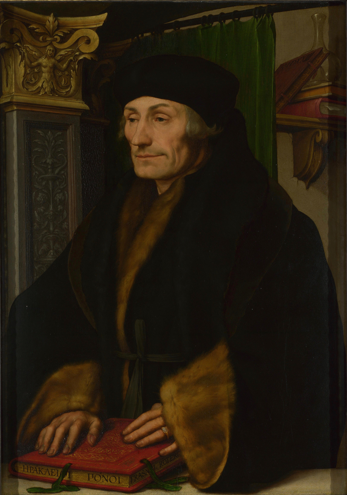
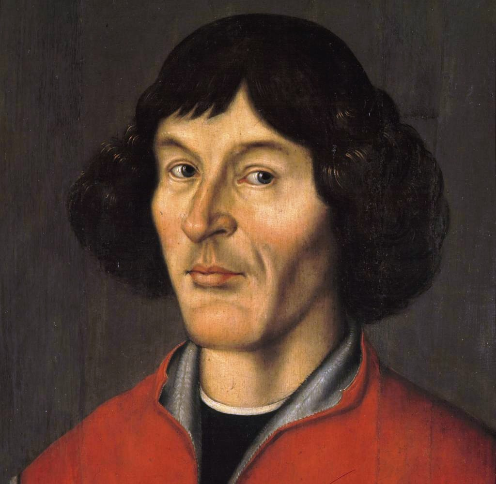
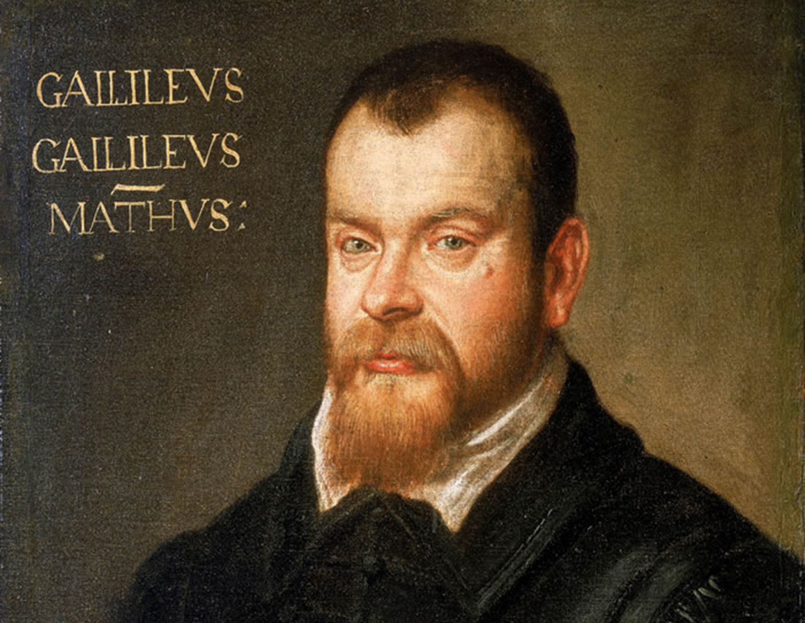
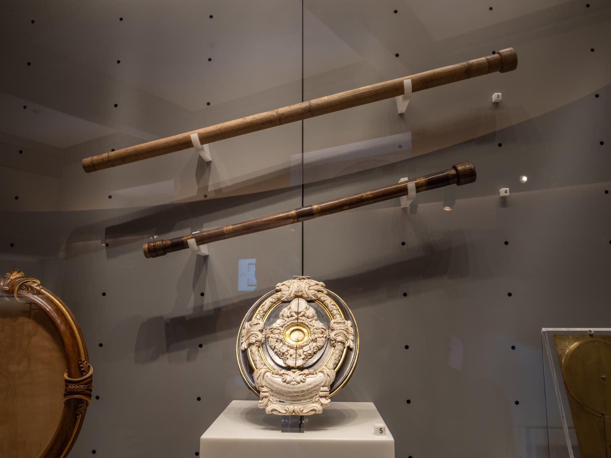
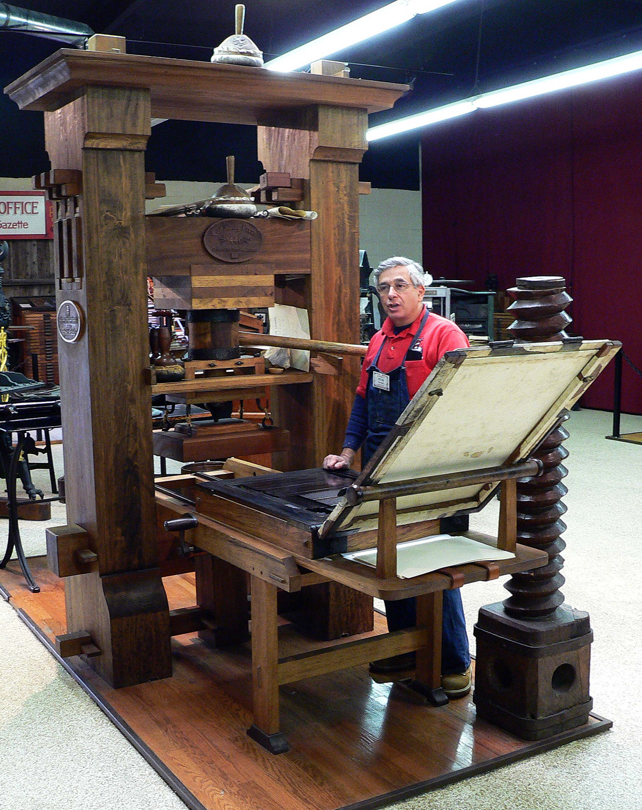

<!-- .slide: id="otwarcie" data-purpose="opening" data-layout="statement" -->

EUROPA · XIV–XVI WIEK

<h1>Renesans — narodziny nowej epoki</h1>
<h2>Kultura renesansu w Europie</h2>

Co się zmienia, gdy człowiek staje się miarą poznawania świata?

<figure><figcaption>Rafael Santi, „Szkoła Ateńska”, 1509–1511</figcaption></figure>

---

<!-- .slide: id="wlochy" data-purpose="evidence" data-layout="split" -->
## Włochy — gdzie zaczęło się odrodzenie?

<figure class="source-figure"><figcaption>Mapa Półwyspu Apenińskiego w 1494 r., Flankner, domena publiczna; udostępniona przez ZPE.</figcaption></figure>

Renesans narodził się najwcześniej w <strong>bogatych miastach włoskich</strong>.

<strong>Florencja</strong>banki, artyści, Medyceusze

<strong>Wenecja</strong>handel i druk

<strong>Rzym</strong>papieże, budowle, artyści

Mapa pokazuje wiele państw, nie jedno zjednoczone państwo włoskie.

---

<!-- .slide: id="epoka" data-purpose="explanation" data-layout="timeline-band" -->
## Odrodzenie czego?

XIV w.<strong>miasta włoskie</strong>
bogactwo, mecenat, ślady antyku

XV w.<strong>nowy język sztuki</strong>
perspektywa, proporcje, obserwacja natury

XVI w.<strong>Europa</strong>
idee, książki i artyści przekraczają granice

<strong>Renesans / odrodzenie</strong> — świadomy powrót do kultury antycznej i nowe sposoby przedstawiania oraz poznawania świata.

---

<!-- .slide: id="mecenat" data-purpose="explanation" data-layout="statement" -->
## Mecenat — kto umożliwiał sztukę?

<strong>Mecenat</strong>
finansowanie artystów, uczonych, książek i budowli przez zamożnych ludzi lub instytucje.

<strong>Po co?</strong>
dla prestiżu, pamięci rodu, wiary i znaczenia miasta.

<strong>Najważniejszy przykład</strong>
<b>Medyceusze z Florencji</b> wspierali artystów i uczonych; dzięki ich pieniądzom powstawały dzieła, biblioteki i budowle.

Mecenas nie „malował obrazu” — dawał twórcy środki, zamówienie i ochronę.

---

<!-- .slide: id="siedem-postaci" data-purpose="explanation" data-layout="matrix" -->
## Siedem postaci — mapa epoki

<strong>Leonardo</strong>obserwacja

<strong>Michał Anioł</strong>ciało i monumentalność

<strong>Rafael</strong>antyk i perspektywa

<strong>Erazm</strong>edukacja i krytyczna lektura

<strong>Kopernik</strong>heliocentryzm

<strong>Galileusz</strong>obserwacja teleskopowa

<strong>Gutenberg</strong>druk w Europie

---

<!-- .slide: id="humanizm" data-purpose="explanation" data-layout="statement" -->
## Człowiek na pierwszym miejscu

HUMANIZM

<strong>godność</strong>człowiek ma wartość i może rozwijać zdolności

<strong>edukacja</strong>języki, historia, literatura i sztuka kształcą człowieka

<strong>rozum</strong>pytania, dyskusja i krytyczna lektura tekstów

<strong>działanie</strong>zainteresowanie życiem doczesnym i sprawami wspólnoty

<strong>Humanizm ≠ odrzucenie religii.</strong> Wielu humanistów było ludźmi wierzącymi.

---

<!-- .slide: id="galeria" data-purpose="evidence" data-layout="matrix" -->
## Trzy dzieła — wspólny język epoki

<figure><figcaption><strong>Leonardo</strong> „Mona Lisa”, ok. 1503–1519</figcaption></figure>
<figure><figcaption><strong>Michał Anioł</strong> „Stworzenie Adama”, ok. 1511</figcaption></figure>
<figure><figcaption><strong>Rafael</strong> „Szkoła Ateńska”, 1509–1511</figcaption></figure>

---

<!-- .slide: id="cechy-sztuki" data-purpose="practice" data-layout="activity-brief" -->
## Zobacz cechy renesansu

<strong>Pracuj z osobą obok. Macie 3 minuty.</strong>
<ol>
<li>Wybierzcie jedno dzieło z poprzedniego slajdu.</li>
<li>Wskażcie dwa widoczne elementy z listy: <em>realizm • człowiek • emocje • perspektywa • antyk • proporcje</em>.</li>
<li>Przygotujcie jedno zdanie: „To dzieło jest renesansowe, ponieważ…”</li>
</ol>

---

<!-- .slide: id="artysci" data-purpose="explanation" data-layout="matrix" -->
## Artyści i ich ambicje

<strong>Leonardo da Vinci</strong>1452–1519
Malarz, konstruktor i badacz. „Mona Lisa”, „Ostatnia Wieczerza”, notatniki o anatomii i mechanice.

<strong>Michał Anioł</strong>1475–1564
Rzeźbiarz, malarz i architekt. „Dawid”, „Pietà”, sklepienie Kaplicy Sykstyńskiej.

<strong>Rafael Santi</strong>1483–1520
Malarz harmonijnych kompozycji. „Szkoła Ateńska” łączy antycznych filozofów i perspektywę.

---

<!-- .slide: id="leonardo-obserwacja" data-purpose="evidence" data-layout="split" -->
## Leonardo: artysta, badacz, konstruktor

<figure class="source-figure"><figcaption>Rysunek tradycyjnie uznawany za autoportret Leonarda da Vinci, domena publiczna.</figcaption></figure>

Leonardo łączył <strong>sztukę, obserwację natury i projekty techniczne</strong>.
<ul><li>malował: „Mona Lisę” i „Ostatnią Wieczerzę”;</li><li>badał anatomię człowieka;</li><li>rysował projekty maszyn, mostów i pojazdów.</li></ul>
Nie każdy projekt zbudowano i nie każdy działałby tak, jak zakładał autor.

---

<!-- .slide: id="leonardo-projekty" data-purpose="evidence" data-layout="matrix" -->
## Leonardo: projekty, nie gotowe wynalazki

<figure><figcaption>Badanie: studia serca i naczyń.</figcaption></figure><figure><figcaption>Projekt maszyny latającej, ok. 1488.</figcaption></figure><figure><figcaption>Szkice pojazdów, ok. 1485.</figcaption></figure>

W notatnikach widzimy proces myślenia: obserwację, rysunek, poprawkę i kolejny pomysł.

---

<!-- .slide: id="erazm" data-purpose="explanation" data-layout="statement" -->
## Erazm z Rotterdamu — humanista Europy

<figure class="source-figure"><figcaption>Erazm z Rotterdamu, Hans Holbein młodszy, 1523 r., domena publiczna.</figcaption></figure>
ok. 1466–1536<strong>Teksty trzeba czytać uważnie. Ludzi — kształcić.</strong>
Uczony podróżował po Europie, porównywał rękopisy, przygotował greckie wydanie Nowego Testamentu i krytykował nadużycia w „Pochwale głupoty”.

---

<!-- .slide: id="kopernik-galileusz" data-purpose="explanation" data-layout="comparison" -->
## Nowy obraz kosmosu

<article>1473–1543<strong>Mikołaj Kopernik</strong>
Przedstawił heliocentryczny model świata w dziele „O obrotach sfer niebieskich” (1543).
</article><article>1564–1642<strong>Galileusz</strong>
Udoskonalił użycie teleskopu; obserwował m.in. księżyce Jowisza i fazy Wenus.
</article><figure><figcaption>Teleskopy Galileusza, Museo Galileo we Florencji.</figcaption></figure>

---

<!-- .slide: id="druk" data-purpose="explanation" data-layout="split" -->
## Gutenberg: książka w wielu zgodnych kopiach

<figure class="source-figure"><figcaption>Replika prasy drukarskiej Gutenberga, vlasta2, CC BY 2.0; udostępniona przez ZPE.</figcaption></figure>

<strong>ruchoma metalowa czcionka</strong>
<b>→</b>
<strong>prasa i farba drukarska</strong>
<b>→</b>
<strong>szybsze powielanie</strong>
<b>→</b>
<strong>szerszy obieg wiedzy</strong>

<figure class="gutenberg-page"><figcaption>Strona Biblii Gutenberga, lata 50. XV w., domena publiczna.</figcaption></figure>

<!-- notes:
Mów: Gutenberg rozwinął i upowszechnił w Europie system druku z ruchomej metalowej czcionki. Nie: wynalazł druk na świecie.
-->

---

<!-- .slide: id="architektura" data-purpose="evidence" data-layout="split" -->
## Architektura: porządek, proporcja, antyk

<strong>symetria</strong>czytelny, uporządkowany plan

<strong>kopuła</strong>technika i monumentalność

<strong>kolumny i arkady</strong>nawiązanie do Grecji i Rzymu

<strong>proporcje</strong>harmonia części i całości

<figure class="source-figure"><figcaption>Tempietto Bramantego, pocz. XVI w. Fotografia CC BY‑SA 4.0, Wikimedia Commons.</figcaption></figure>

Zabytki: kopuła katedry we Florencji • Tempietto w Rzymie • bazylika św. Piotra

---

<!-- .slide: id="kuratorzy" data-purpose="practice" data-layout="activity-brief" -->
## Zostańcie kuratorami wystawy

<strong>Sześć par • 8 minut</strong>
<ol>
<li>Wybierzcie trzy obiekty lub postaci do wystawy „Człowiek poznaje siebie i świat”.</li>
<li>Przy każdym zapiszcie jedno zdanie uzasadnienia.</li>
<li>Co najmniej jeden wybór ma dotyczyć sztuki, a jeden wiedzy lub druku.</li>
</ol>

Gotowe: trzy wybory + trzy argumenty + jedno zdanie o znaczeniu druku.

---

<!-- .slide: id="synteza" data-purpose="synthesis" data-layout="takeaways" -->
## Jak renesans zmienił Europę?

<strong>człowiek</strong>godność, zdolności, edukacja

<strong>obraz</strong>realizm, perspektywa, proporcje

<strong>wiedza</strong>lektura, obliczenia, obserwacja

<strong>obieg idei</strong>druk i więcej zgodnych kopii tekstu

Renesans połączył inspirację antykiem z nowym zainteresowaniem człowiekiem i światem.

---

<!-- .slide: id="bilet" data-purpose="exit-ticket" data-layout="activity-brief" -->
## Bilet wyjścia

<ol>
<li>Podaj cztery cechy renesansu.</li>
<li>Połącz dwie postaci z ich osiągnięciami.</li>
<li>Wyjaśnij w dwóch krokach, jak druk pomagał rozpowszechniać idee.</li>
</ol>

3 minuty • odpowiedz samodzielnie

