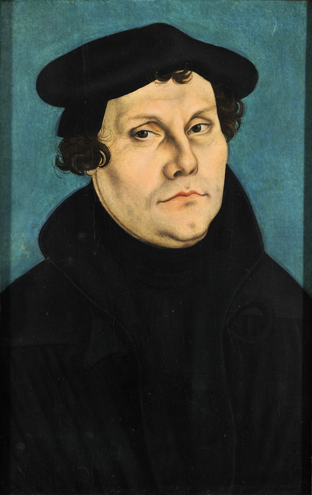
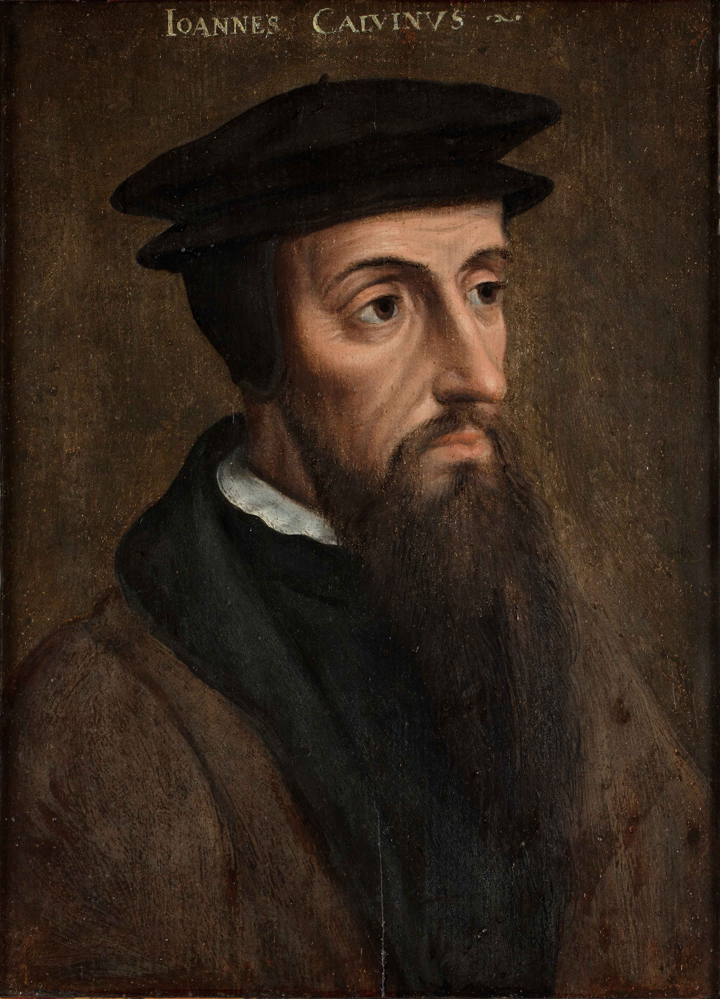
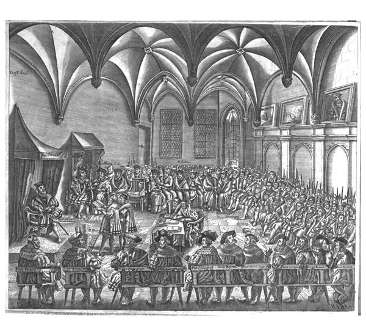

<!-- .slide: id="otwarcie" data-purpose="opening" data-layout="statement" -->

EUROPA · XVI WIEK · KLASA VI

<h1>Reformacja czas wielkich zmian</h1>

Dlaczego spór o odnowę Kościoła stał się zmianą religijną, polityczną i społeczną?

---

<!-- .slide: id="mapa-europy" data-purpose="explanation" data-layout="matrix" -->
## Mapa reformacji: miejsca, ludzie, wydarzenia
<figure class="reformation-map"><figcaption>Mapa późniejsza, edukacyjna: najważniejsze obszary rozwoju reformacji.</figcaption></figure>

<b>Wittenberga</b> — Luter, 1517 r., 95 tez<b>Genewa</b> — Jan Kalwin<b>Anglia</b> — Henryk VIII, 1534 r.<b>Rzym</b> — siedziba papieża

---

<!-- .slide: id="przyczyny" data-purpose="explanation" data-layout="impact-flow" -->
## Dlaczego pojawiła się reformacja?

<strong>nadużycia</strong>część duchownych prowadziła wystawne życie; urzędy bywały kupowane

<strong>odpusty</strong>wokół ich sprzedaży narastał sprzeciw; niektórzy głosiciele obiecywali zbyt wiele

<strong>nowe idee</strong>humaniści zachęcali do uważnej lektury Biblii i krytyki błędów

<strong>druk i polityka</strong>pisma szybko krążyły, a część władców poparła zmianę

<strong>Reformacja</strong> — ruch religijny XVI w., który dążył do odnowy Kościoła, a w rezultacie doprowadził do powstania nowych wyznań chrześcijańskich.

<!-- notes:
Nie przedstawiaj wszystkich duchownych jako zepsutych. Mów o krytyce konkretnych nadużyć i o różnicach poglądów na drogę odnowy.
-->

---

<!-- .slide: id="luter-1517" data-purpose="explanation" data-layout="timeline-band" -->
## Marcin Luter i rok 1517

<figure><figcaption>Marcin Luter, Lucas Cranach starszy, 1528 r.</figcaption></figure>
<lesson-timeline><lesson-event year="1517">Luter ogłasza 95 tez przeciw nadużyciom związanym z odpustami.</lesson-event><lesson-event year="1521">Na sejmie w Wormacji odmawia odwołania poglądów.</lesson-event><lesson-event year="1522">Ukazuje się przekład Nowego Testamentu na język niemiecki.</lesson-event></lesson-timeline>
<strong>Uwaga:</strong> tradycja mówi o przybiciu tez do drzwi kościoła; pewne jest ich rozesłanie i szybkie rozpowszechnienie w druku.

---

<!-- .slide: id="zrodlo-tezy" data-purpose="evidence" data-layout="evidence" -->
## Źródło: głos Lutra w „95 tezach”

<figure class="text-source">
<blockquote class="theses-quote">

„Prawdziwym skarbem Kościoła jest najświętsza Ewangelia chwały i łaski Bożej.”

„Ci, którzy wierzą, że dzięki listom odpustowym są pewni swego zbawienia, będą potępieni wraz ze swymi nauczycielami.”

<figcaption>Marcin Luter, tezy 62 i 32, 1517 r. Przekład skrócony na potrzeby lekcji.</figcaption>
</blockquote>
</figure>

<strong>Porozmawiajcie w parze:</strong> Co Luter nazywa „prawdziwym skarbem”? Przed czym ostrzega w drugiej tezie?

notes:
Wniosek: dla Lutra zbawienia nie można było „kupić”. Nie wymaga się od uczniów rozstrzygania sporów teologicznych; wystarczy odczytanie krytyki nadużyć i wskazanie Biblii/Ewangelii jako punktu odniesienia.

---

<!-- .slide: id="poglady-lutra" data-purpose="explanation" data-layout="comparison" -->
## Co głosił Marcin Luter?

<strong>Biblia</strong>
najważniejsze źródło wiary; powinna być dostępna także w językach narodowych.

<strong>wiara i łaska Boga</strong>
człowiek dostępuje zbawienia dzięki wierze i łasce Boga, nie dzięki kupowaniu odpustów.

<strong>prostszy Kościół</strong>
odrzucał zwierzchnictwo papieża i uznawał dwa sakramenty: chrzest oraz komunię.

<strong>Nie pomyl:</strong> Luter nie chciał początkowo „założyć nowej religii”; jego krytyka doprowadziła jednak do trwałego podziału.

---

<!-- .slide: id="rozprzestrzenienie" data-purpose="explanation" data-layout="process" -->
## Jak idee rozeszły się po Europie?

<b>1</b><strong>druk</strong>teksty i ulotki trafiały do wielu miast

<b>2</b><strong>kazania i szkoły</strong>nowe poglądy docierały do ludzi, którzy nie czytali

<b>3</b><strong>władcy i miasta</strong>część z nich przyjęła reformację także z powodów politycznych i majątkowych

<b>4</b><strong>nowe Kościoły</strong>luteranizm, kalwinizm i anglikanizm

<strong>Druk przyspieszył reformację:</strong> ulotki, kazania i przekłady Biblii można było szybko powielać, taniej kupować i odczytywać w wielu miastach.

Reformacja nie przebiegała wszędzie tak samo. W każdym kraju religia łączyła się z lokalną polityką.

---

<!-- .slide: id="kalwin" data-purpose="explanation" data-layout="split" -->
## Jan Kalwin i Genewa

<figure class="calvin-portrait"><figcaption>Jan Kalwin, portret anonimowy, ok. 1550 r.</figcaption></figure>

Kalwin działał głównie w <strong>Genewie</strong>, która stała się ważnym ośrodkiem reformacji.
<ul><li>podkreślał surową, zdyscyplinowaną wspólnotę;</li><li>głosił predestynację — przekonanie, że Bóg z góry wie, kto zostanie zbawiony;</li><li>jego idee rozpowszechniły się m.in. we Francji, Niderlandach i Szkocji.</li></ul>

notes:
Wyjaśnij predestynację ostrożnie: to pogląd religijny Kalwina, nie zachęta, by oceniać ludzi jako „wybranych” lub „potępionych”.

---

<!-- .slide: id="anglia" data-purpose="explanation" data-layout="statement" -->
## Reformacja w Anglii: inna droga

<strong>Henryk VIII</strong>chciał unieważnienia małżeństwa
<b>→</b>
<strong>1534</strong>Akt supremacji: król staje na czele Kościoła Anglii
<b>→</b>
<strong>anglikanizm</strong>Kościół anglikański powstaje z decyzji monarchy i późniejszych zmian religijnych

Anglikanizm nie był po prostu „luteranizmem po angielsku”: jego początek był silnie związany z konfliktem króla z papieżem.

---

<!-- .slide: id="wojny-religijne" data-purpose="explanation" data-layout="impact-flow" -->
## Spory przerodziły się w wojny

<strong>Rzesza Niemiecka</strong>konflikty między katolickimi władcami a książętami popierającymi luteranizm

<strong>Francja</strong>walki katolików i hugenotów (francuskich kalwinistów)

<strong>Niderlandy</strong>konflikt religijny splótł się z walką przeciw panowaniu Hiszpanii

Wojny religijne miały wiele przyczyn: wiara, władza, majątek i niezależność państw. Nie były tylko sporami o modlitwę.

---

<!-- .slide: id="fronty-reformacji" data-purpose="synthesis" data-layout="hero-source" -->
## Gdzie reformacja miała swoje „fronty”?
<figure class="reformation-map front-map"><figcaption>Mapa edukacyjna: reformacja rozwijała się różnie w państwach niemieckich, Skandynawii, Anglii, Szwajcarii, Francji i Niderlandach.</figcaption></figure>

<strong>Odczytaj mapę:</strong> gdzie przeważał luteranizm, a gdzie kalwinizm? Dlaczego konflikty nie ograniczyły się do jednego państwa?

---

<!-- .slide: id="augsburg" data-purpose="explanation" data-layout="statement" -->
## Pokój augsburski, 1555 r.

<figure><figcaption>Strona dokumentu pokoju augsburskiego, 1555 r.</figcaption></figure>
cuius regio, eius religio<strong>„czyj kraj, tego religia”</strong>
Władca danego państwa Rzeszy wybierał katolicyzm albo luteranizm. Poddani mieli przyjąć wyznanie władcy lub opuścić jego kraj.

Układ dotyczył tylko katolicyzmu i luteranizmu w Rzeszy Niemieckiej — nie rozwiązał wszystkich sporów i nie objął kalwinizmu.

notes:
Nie tłumacz zasady jako pełnej wolności religijnej. Decydował przede wszystkim władca, a nie każdy mieszkaniec.

---

<!-- .slide: id="skutki" data-purpose="synthesis" data-layout="impact-flow" -->
## Skutki reformacji

<strong>religijne</strong>podział zachodniego chrześcijaństwa; powstanie Kościołów protestanckich

<strong>polityczne</strong>wzrost znaczenia części władców; konflikty między państwami i wewnątrz nich

<strong>społeczne i kulturowe</strong>rozwój szkolnictwa, przekładów Biblii i języków narodowych; także prześladowania i wojny

<strong>katolicka odpowiedź</strong>reforma Kościoła katolickiego, m.in. sobór trydencki

---

<!-- .slide: id="protestanci" data-purpose="explanation" data-layout="statement" -->
## Kogo nazywamy protestantami?

To wspólna nazwa wielu chrześcijan i Kościołów wywodzących się z reformacji. Nie oznacza jednego, identycznego wyznania.

luteraniekalwinianglikanieinne wspólnoty reformacyjne

<strong>Nie pomyl:</strong> protestanci, katolicy i prawosławni to różne tradycje chrześcijańskie. W tej lekcji porównujemy nurty reformacji zachodniej Europy.

---

<!-- .slide: id="porownanie" data-purpose="synthesis" data-layout="comparison" -->
## Trzy nurty reformacji — porównanie

<table class="comparison-table">
<thead><tr><th>Nurt</th><th>Osoba / miejsce</th><th>Co wyróżniało?</th></tr></thead>
<tbody>
<tr><th>Luteranizm</th><td>Marcin Luter Wittenberga</td><td>Biblia, wiara i łaska Boga; dwa sakramenty; odrzucenie zwierzchnictwa papieża.</td></tr>
<tr><th>Kalwinizm</th><td>Jan Kalwin Genewa</td><td>Surowa wspólnota, predestynacja; duży wpływ w części Francji, Niderlandów i Szkocji.</td></tr>
<tr><th>Anglikanizm</th><td>Henryk VIII Anglia</td><td>Król jako głowa Kościoła Anglii; początek związany z konfliktem monarchy z papieżem.</td></tr>
</tbody>
</table>

---

<!-- .slide: id="notatka" data-purpose="reference" data-layout="takeaways" -->
## Notatka do zeszytu

<strong>Reformacja</strong> to ruch religijny XVI w., który krytykował nadużycia w Kościele katolickim i doprowadził do powstania nowych wyznań.

<strong>1517 r.</strong> — Marcin Luter ogłosił 95 tez. Głosił, że Biblia jest najważniejszym źródłem wiary, a zbawienie jest darem łaski Boga przyjmowanym przez wiarę.

Najważniejsze nurty protestantyzmu: <strong>luteranizm</strong>, <strong>kalwinizm</strong> i <strong>anglikanizm</strong>. Reformacja podzieliła zachodnie chrześcijaństwo, wywołała konflikty, ale wpłynęła też na rozwój szkolnictwa, druku i języków narodowych.

---

<!-- .slide: id="bilet" data-purpose="exit-ticket" data-layout="activity-brief" -->
## Bilet wyjścia

<strong>Samodzielnie, 3 minuty.</strong><ol><li>Wyjaśnij związek: nadużycia i odpusty → wystąpienie Lutra w 1517 r. → powstanie nowych wyznań.</li><li>Wybierz luteranizm, kalwinizm albo anglikanizm i podaj jedną cechę, która go wyróżnia.</li></ol>

