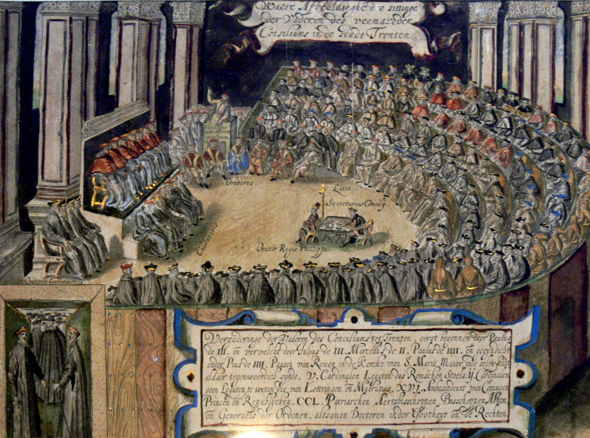
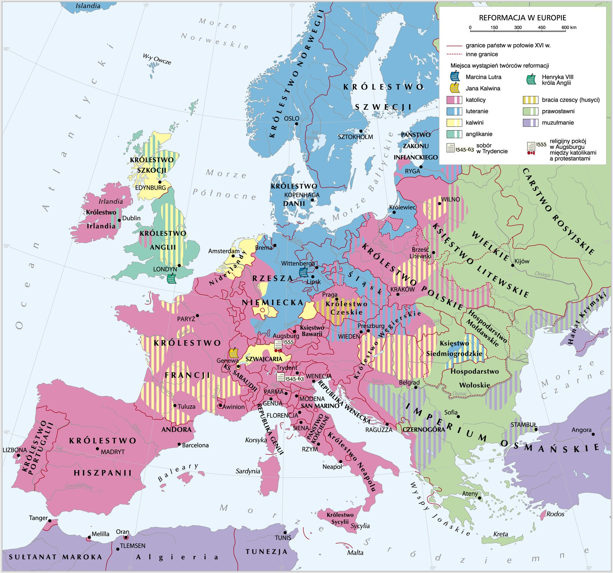
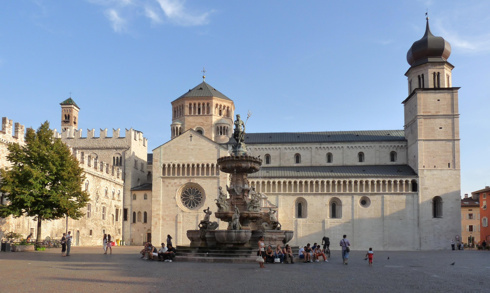
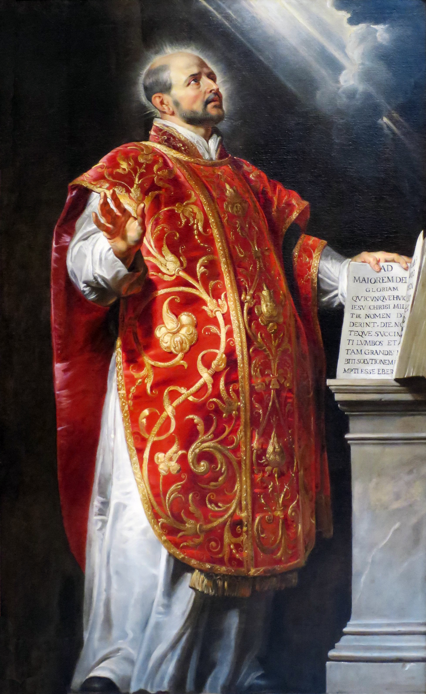
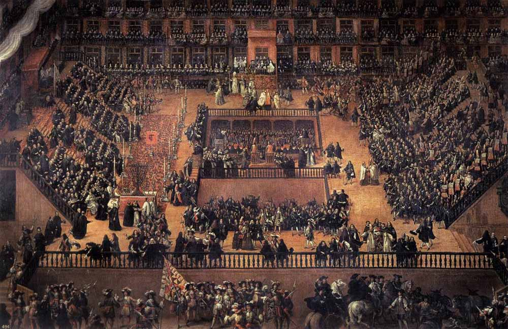
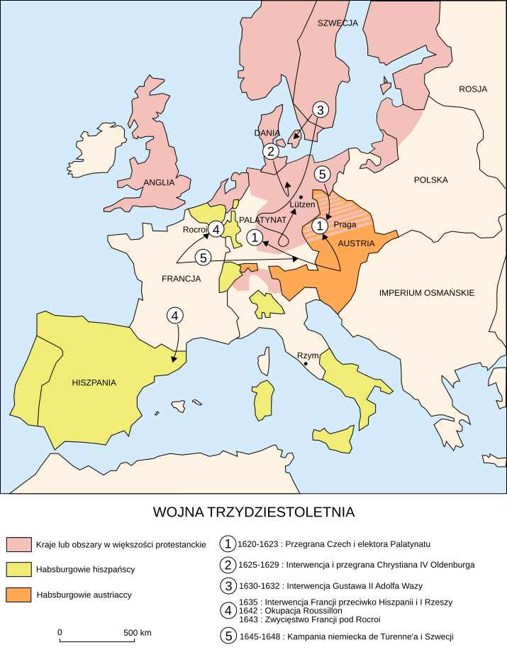
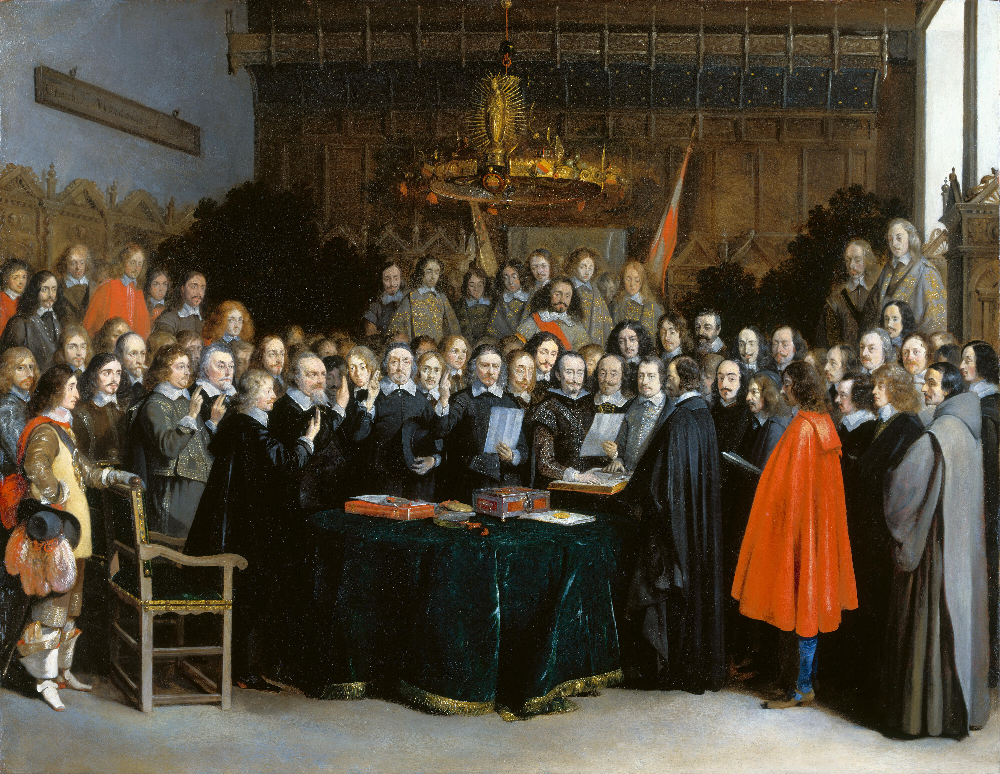

<!-- .slide: id="otwarcie" class="opening-slide" data-purpose="opening" data-layout="hero-source" -->

EUROPA · XVI–XVII WIEK · KLASA VI
<h1>Kontrreformacja</h1>
Jak Kościół katolicki odpowiedział na reformację — i dlaczego religijny spór objął całą Europę?

notes:
Rozpocznij: „Na tej sali nie ma królów ani wojsk, a jednak zapadną tu decyzje, które zmienią Europę. Jak zgromadzenie duchownych może odpowiedzieć na kryzys?” Zbierz dwie hipotezy.

---

<!-- .slide: id="mapa-wyznan" class="map-slide" data-purpose="explanation" data-layout="map-focus" -->
## Europa podzielona wyznaniowo

<figure></figure><aside>
<strong>Północ:</strong> silne wpływy luteranizmu.

<strong>Szwajcaria i część zachodu:</strong> ośrodki kalwinizmu.

<strong>Anglia:</strong> Kościół anglikański.

<strong>Południe Europy:</strong> przewaga katolicyzmu.
</aside>

<strong>Wskaż:</strong> Trydent, Rzym, ziemie niemieckie i Czechy. To tutaj będą rozgrywać się kolejne etapy opowieści.

notes:
Mapa jest orientacyjna i pokazuje proces, nie jedną chwilę. Przypomnij po poprzedniej lekcji: protestantyzm nie był jednym wyznaniem.

---

<!-- .slide: id="chronologia" class="timeline-slide" data-purpose="explanation" data-layout="timeline-band" -->
## Od odnowy Kościoła do pokoju w Europie

<b>1540</b>zatwierdzenie zakonu jezuitów

<b>1545–1563</b>sobór trydencki

<b>1582</b>kalendarz gregoriański

<b>1618–1648</b>wojna trzydziestoletnia

<b>1648</b>pokój westfalski

Najpierw odnowa i obrona katolicyzmu, potem długi konflikt, na końcu próba ułożenia zasad współistnienia.

notes:
Nie każ zapamiętywać wszystkich dat od razu. Oś ma pokazać ciąg i skalę czasu: sobór obradował z przerwami przez osiemnaście lat, a wojna trwała trzydzieści.

---

<!-- .slide: id="pojecia" data-purpose="explanation" data-layout="matrix" -->
## Sześć pojęć potrzebnych na lekcji

<strong>reforma katolicka</strong>wewnętrzna odnowa Kościoła katolickiego

<strong>kontrreformacja</strong>działania przeciw rozwojowi protestantyzmu i w obronie katolicyzmu

<strong>sobór</strong>zgromadzenie biskupów obradujące nad sprawami wiary i Kościoła

<strong>herezja / heretyk</strong>pogląd sprzeczny z nauką Kościoła / osoba uznana za jego głosiciela

<strong>dogmat</strong>oficjalnie określona prawda wiary uznawana przez Kościół

<strong>inkwizycja</strong>kościelna instytucja sądowa badająca zarzuty herezji

<strong>Nie pomyl:</strong> reforma katolicka i kontrreformacja częściowo się łączyły, ale pierwsza oznacza odnowę wewnętrzną, a druga także walkę z wpływami reformacji.

notes:
Termin „heretyk” przedstaw jako określenie historyczne zależne od oceny władz kościelnych, nie etykietę do używania wobec współczesnych ludzi.

---

<!-- .slide: id="sobor-kto-gdzie" class="source-slide" data-purpose="explanation" data-layout="source-split" -->
## Sobór trydencki: kto, gdzie i dlaczego?

<figure class="source-figure"><figcaption>Katedra w Trydencie, jedno z miejsc obrad soboru.</figcaption></figure>

<b>Kiedy?</b>1545–1563, z przerwami

<b>Gdzie?</b>Trydent w północnych Włoszech

<b>Kto zwołał?</b>papież Paweł III

<b>Dlaczego?</b>odpowiedź na reformację i potrzeba naprawy problemów w Kościele

notes:
Trydent leżał wtedy na obszarze Świętego Cesarstwa Rzymskiego, blisko ziem włoskich i niemieckich. Nie przedstawiaj soboru jako jednego spotkania — odbywał się w kilku etapach.

---

<!-- .slide: id="postanowienia" data-purpose="explanation" data-layout="comparison" -->
## Co postanowił sobór trydencki?

<h3>POTWIERDZONO NAUKĘ</h3><ul><li>Pismo Święte i tradycja są podstawą nauczania;</li><li>Kościół uznaje siedem sakramentów;</li><li>utrzymano dotychczasowe zasady wiary i liturgii.</li></ul>

<h3>WPROWADZONO REFORMY</h3><ul><li>seminaria miały lepiej kształcić księży;</li><li>biskupi i proboszczowie mieli przebywać w swoich diecezjach i parafiach;</li><li>wizytacje miały kontrolować pracę duchownych.</li></ul>

Sobór jednocześnie <strong>bronił nauki katolickiej</strong> i <strong>porządkował życie Kościoła</strong>.

notes:
Nie przypisuj soborowi dogmatu o nieomylności papieża — ogłoszono go dopiero w 1870 r. Wyjaśnij „seminarium duchowne”: szkoła przygotowująca kandydatów do kapłaństwa.

---

<!-- .slide: id="zadanie-sobor" class="practice-slide" data-purpose="practice" data-layout="activity-brief" data-goals="G1" -->
## Obrona nauki czy reforma Kościoła?

<strong>W parach, 4 minuty.</strong> W zadaniu 1 karty pracy oznacz każdą decyzję:

<b>O</b> obrona nauki<b>R</b> reforma organizacji i duchowieństwa
<ol><li>siedem sakramentów;</li><li>seminaria duchowne;</li><li>Pismo Święte i tradycja;</li><li>obowiązek przebywania biskupa w diecezji.</li></ol>
Dokończ: <strong>„Sobór nie tylko…, lecz także…”</strong>

notes:
Odpowiedzi: O, R, O, R. Model zdania: „Sobór nie tylko bronił nauki katolickiej, lecz także poprawiał przygotowanie i dyscyplinę duchownych.”

---

<!-- .slide: id="jezuici" class="source-slide" data-purpose="explanation" data-layout="split" -->
## Jezuici: edukacja, misje, dyscyplina

<figure class="source-figure"><figcaption>Ignacy Loyola, założyciel jezuitów — obraz Rubensa, ok. 1600 r.</figcaption></figure>

<b>1540</b>papież zatwierdza Towarzystwo Jezusowe
<ul><li><strong>szkoły i kolegia</strong> — kształcenie duchownych i świeckich;</li><li><strong>misje</strong> — działalność m.in. w Indiach, Chinach i Ameryce;</li><li><strong>kazania i dyskusje</strong> — wzmacnianie katolicyzmu;</li><li><strong>posłuszeństwo papieżowi</strong> i staranne przygotowanie członków zakonu.</li></ul>

<strong>Ciekawostka:</strong> jezuici uczyli nie tylko religii, lecz także języków, retoryki, matematyki i nauk przyrodniczych.

notes:
Portret jest późniejszym dziełem artystycznym, nie fotografią Ignacego Loyoli. Nie sprowadzaj zakonu wyłącznie do „walki” — edukacja i działalność misyjna były jego ważnymi narzędziami.

---

<!-- .slide: id="inkwizycja" class="source-slide" data-purpose="explanation" data-layout="source-split" -->
## Inkwizycja i kontrola poglądów

<figure class="source-figure"><figcaption>Francisco Rizi, autodafé w Madrycie, 1683 r. — późniejszy obraz inkwizycji hiszpańskiej.</figcaption></figure>

<strong>Inkwizycja rzymska</strong> została zorganizowana w 1542 r. do badania podejrzeń o herezję.

<strong>Indeks ksiąg zakazanych</strong> wskazywał publikacje uznane za niebezpieczne dla wiary.

<strong>Skutki:</strong> cenzura, procesy i kary wobec osób uznanych za odstępców.

<strong>Ważne:</strong> inkwizycja rzymska, hiszpańska i wcześniejsza średniowieczna nie były jedną identyczną instytucją.

notes:
Obraz pokazuje publiczną ceremonię hiszpańskiej inkwizycji ponad sto lat po jej utworzeniu; używamy go tylko do rozmowy o kontroli i publicznym charakterze sądów, nie jako obrazu działań inkwizycji rzymskiej w 1542 r. Nie epatuj karami.

---

<!-- .slide: id="kalendarz" data-purpose="explanation" data-layout="comparison" -->
## Kalendarz gregoriański: zniknęło dziesięć dat

<h3>WCZEŚNIEJ</h3><b>kalendarz juliański</b>
Był odrobinę zbyt długi. Przez stulecia data równonocy przesuwała się względem kalendarza.

4 X 1582<b>→</b>15 X 1582

<h3>OD 1582</h3><b>kalendarz gregoriański</b>
Papież Grzegorz XIII wprowadził dokładniejsze zasady lat przestępnych i jednorazową korektę dat.

<strong>Ciekawostka:</strong> ludzie nie stracili dziesięciu dób życia — zmieniły się numery dat. Państwa przyjmowały nowy kalendarz w różnym czasie.

notes:
Reguła: rok podzielny przez 4 jest przestępny; lata setne tylko wtedy, gdy są podzielne przez 400. Nie wymagaj zapamiętania algorytmu, tylko zrozumienia, że kalendarz miał lepiej odpowiadać rokowi słonecznemu.

---

<!-- .slide: id="przed-po" class="compare-slide" data-purpose="synthesis" data-layout="comparison" -->
## Kościół katolicki: co zmieniło się po reformach?

<h3>PROBLEMY WCZEŚNIEJ</h3>
słabe przygotowanie części duchownych

łączenie wielu urzędów

zaniedbywanie diecezji i parafii

niejednolita kontrola nauczania

REFORMA + OBRONA

<h3>DZIAŁANIA PÓŹNIEJ</h3>
seminaria duchowne

obowiązek obecności biskupów i proboszczów

wizytacje i większa dyscyplina

szkoły jezuitów, misje, kontrola publikacji

Kontrreformacja oznaczała zarówno odnowę, jak i ostrzejszą kontrolę religijną.

notes:
„Wcześniej” i „później” są skrótem porównawczym: reformy wdrażano stopniowo i nierówno w różnych państwach. Nie twierdź, że wszystkie problemy zniknęły natychmiast.

---

<!-- .slide: id="wojna-przyczyny" data-purpose="explanation" data-layout="impact-flow" -->
## Dlaczego wybuchła wojna trzydziestoletnia?

<b>RELIGIA</b>spory katolików, luteran i kalwinistów w Rzeszy

<b>WŁADZA</b>cesarz chciał wzmocnić rządy, książęta bronili samodzielności

<b>RYWALIZACJA</b>Habsburgowie, Francja, Dania i Szwecja walczyli o wpływy

<strong>Iskra: Praga, 1618 r.</strong>czescy protestanci wyrzucili z okna zamku urzędników królewskich — to defenestracja praska.

notes:
Wyjaśnij „defenestracja”: wyrzucenie przez okno. Najważniejszy wniosek: wojna rozpoczęła się jako konflikt religijno-ustrojowy, lecz stała się walką europejskich państw o przewagę.

---

<!-- .slide: id="mapa-wojny" class="map-slide" data-purpose="explanation" data-layout="map-focus" -->
## Wojna objęła środek Europy

<figure class="war-map"></figure>
<b>Praga</b><small>początek buntu</small><b>Lützen</b><small>ważna bitwa armii szwedzkiej</small><b>Münster i Osnabrück</b><small>rokowania pokojowe</small>
Mapa jest szczegółowa — śledzimy tylko te trzy miejsca i państwa interweniujące.

notes:
Mapa jest szczegółowa. Nie omawiaj całej legendy. Wskaż Rzeszę, Czechy, Szwecję, Francję oraz trzy miejsca zapisane pod mapą.

---

<!-- .slide: id="przebieg-wojny" class="timeline-slide" data-purpose="explanation" data-layout="timeline-band" -->
## Wojna trzydziestoletnia — najkrótsza oś przebiegu

<b>1618</b>bunt Czechów<small>Praga</small>

<b>1620</b>klęska Czechów<small>Biała Góra</small>

<b>1630</b>wkracza Szwecja<small>Gustaw II Adolf</small>

<b>1635</b>wkracza Francja<small>walka z Habsburgami</small>

<b>1648</b>koniec wojny<small>pokój westfalski</small>

Katolicka Francja walczyła z katolickimi Habsburgami — dlatego nie była to już wyłącznie wojna religijna.

notes:
Nie wymagaj nazw czterech faz wojny. Uczniowie mają rozumieć przemianę konfliktu: od buntu w Rzeszy do europejskiej rywalizacji politycznej.

---

<!-- .slide: id="pokoj-westfalski" class="source-slide" data-purpose="explanation" data-layout="source-split" -->
## Pokój westfalski, 1648 r.

<figure class="source-figure"><figcaption>Gerard ter Borch, zaprzysiężenie pokoju w Münster, 1648 r.</figcaption></figure>

<strong>Münster i Osnabrück</strong> — dwa miasta rokowań.

uznano miejsce <strong>kalwinizmu</strong> obok katolicyzmu i luteranizmu;

wzmocniono prawa państw i książąt Rzeszy;

uznano niezależność Niderlandów i Szwajcarii;

Francja i Szwecja zwiększyły znaczenie.

Pokój zakończył wojnę trzydziestoletnią, ale nie wszystkie wojny w Europie.

notes:
Traktaty podpisano 24 października 1648 r. Nie używaj uproszczenia „powstał nowoczesny system państw” jako jedynego skutku; ważniejsze są konkretne postanowienia.

---

<!-- .slide: id="podsumowanie" data-purpose="synthesis" data-layout="takeaways" -->
## Najważniejsze informacje

<b>ODNOWA</b>Sobór trydencki potwierdził naukę katolicką i poprawił kształcenie oraz dyscyplinę duchownych.

<b>DZIAŁANIE</b>Jezuici prowadzili szkoły, misje i kaznodziejstwo; inkwizycja i indeks kontrolowały poglądy.

<b>PORZĄDEK CZASU</b>W 1582 r. dokładniejszy kalendarz gregoriański zaczął zastępować juliański.

<b>KONFLIKT</b>Wojna trzydziestoletnia połączyła spory religijne z walką o władzę i wpływy.

<b>POKÓJ</b>W 1648 r. pokój westfalski zakończył wojnę i uregulował część sporów politycznych i wyznaniowych.

notes:
Zakończenie do powiedzenia: „Kościół odpowiedział na reformację reformą, edukacją i kontrolą. Europa potrzebowała jednak jeszcze dziesięcioleci wojny, aby ustalić zasady współistnienia różnych wyznań i państw.”

---

<!-- .slide: id="bilet" data-purpose="exit-ticket" data-layout="plain" data-goals="G1 G2 G3" -->
## Bilet wyjścia

<strong>Samodzielnie, 3 minuty.</strong> Dokończ trzy zdania:
<ol><li>Jedną odpowiedzią Kościoła katolickiego na reformację było…</li><li>Wojna trzydziestoletnia nie była wyłącznie religijna, ponieważ…</li><li>Pokój westfalski był ważny, ponieważ…</li></ol>

notes:
Pełny model i kryteria znajdują się w assessment.md. Zbierz odpowiedzi przed wyjściem.

---

<!-- .slide: id="zrodla" data-purpose="reference" data-layout="plain" -->
## Źródła wykorzystane w prezentacji

<strong>Zintegrowana Platforma Edukacyjna:</strong> „Reforma katolicka” — treść, sobór trydencki, jezuici, inkwizycja.

<strong>Wikimedia Commons:</strong> mapa reformacji; mapa wojny trzydziestoletniej; Gerard ter Borch, „Zaprzysiężenie pokoju w Münster”.

<strong>Encyclopaedia Britannica:</strong> Council of Trent, Gregorian calendar, Thirty Years’ War, Peace of Westphalia.

<strong>Dokładne adresy, autorzy, licencje i ograniczenia:</strong> plik <code>sources.md</code> w pakiecie lekcji.

Materiały zapisano lokalnie — prezentacja nie wymaga Internetu.

notes:
Nie omawiaj slajdu szczegółowo. Służy przejrzystości i wskazuje, gdzie znajdują się pełne dane o źródłach.
