<!-- .slide: id="otwarcie" data-purpose="opening" data-layout="hero-source" -->

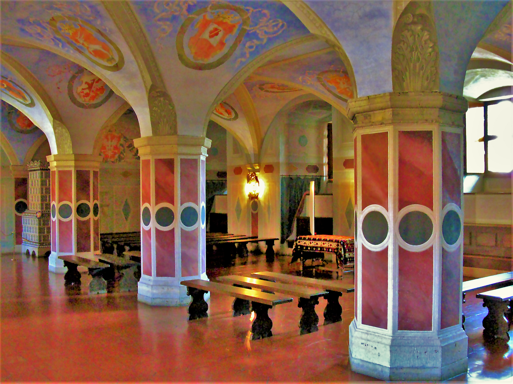

HISTORIA · KLASA VI
<h1>Demokracja szlachecka</h1>
Kto naprawdę decydował?
<small>Izba poselska na Zamku Królewskim w Warszawie; sala późniejsza niż 1505 r.</small>

notes:
Zacznij: „Kto mógł wejść do takiej sali i zdecydować o prawie? A gdybyście mieszkali na wsi, kto zapytałby was o zdanie?” Fotografia przedstawia późniejszą salę sejmową w Warszawie, a nie miejsce uchwalenia *Nihil novi* w Radomiu w 1505 r.

---

<!-- .slide: id="pochodzenie" data-purpose="explanation" data-layout="split" data-goals="G1" -->
## Od rycerstwa do szlachty

<strong>Rycerze</strong> służyli władcy zbrojnie.

Ich potomkowie tworzyli <strong>stan szlachecki</strong>: grupę ze wspólnymi prawami.

Ten sam stan, ale bardzo różne majątki.

notes:
Stan to grupa o określonych prawach; pochodzenie było procesem, a nie jedną datą.

---

<!-- .slide: id="herby" data-purpose="explanation" data-layout="comparison" data-goals="G1" -->
## Po co szlachcie były herby?

<figure>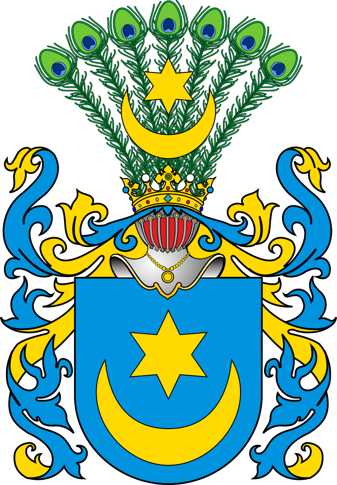<figcaption>Leliwa</figcaption></figure><figure>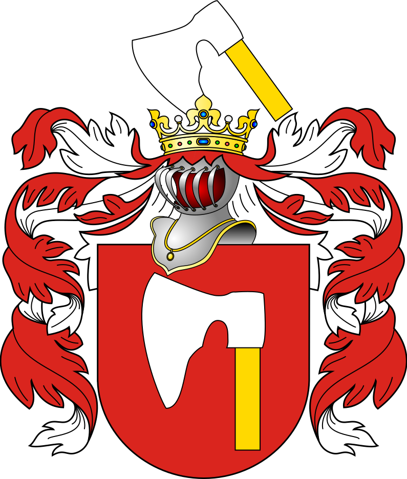<figcaption>Topór</figcaption></figure>
<strong>Herb</strong> był znakiem rozpoznawczym. W Polsce jeden herb mogły nosić różne rodziny należące do wspólnoty herbowej.

notes:
Zwróć uwagę na symbole na tarczach. Ciekawostka: wspólny herb nie musiał oznaczać jednej rodziny. To współczesne opracowania graficzne, nie malowidła z XV wieku.

---

<!-- .slide: id="ilu-szlachty" data-purpose="explanation" data-layout="statement" data-goals="G3" -->
## Czy szlachty było wielu?

<strong>około 6–10%</strong>
mieszkańców — przybliżenie zależne od czasu, regionu i sposobu liczenia

<b>Większość</b> mieszkańców nie miała szlacheckich praw politycznych.

notes:
To szeroki zakres różnych szacunków, nie pomiar dla 1505 r. W opracowaniu Artura Wójcika dla XVI wieku podano średnio 6–8%; starszy szacunek regionalny Witolda Kuli to 9,8% dla Wielkopolski, Małopolski i Mazowsza (relacjonowany przez opracowanie wtórne). Regiony bardzo się różniły. Pasek pokazuje górną granicę dydaktycznego zakresu: 10 na 100. Szczegóły i linki w `sources.md`.

---

<!-- .slide: id="prawa-obowiazki" data-purpose="explanation" data-layout="comparison" data-goals="G1" -->
## Co wolno było, a co trzeba było robić?

<h3>Prawa</h3>
udział w sejmikach

wpływ na wybór posłów

szczególne uprawnienia stanowe

<h3>Obowiązek</h3>
obrona kraju, w tym — gdy zwołano — <strong>pospolite ruszenie</strong>, czyli wojsko szlacheckie

Posiadanie prawa nie oznaczało jednakowego majątku ani wpływu.

notes:
Nie twierdź, że każdy szlachcic osobiście walczył w każdej sytuacji. Prawo udziału w sejmiku a faktyczna możliwość podróży i działania to dwie różne rzeczy.

---

<!-- .slide: id="przywileje" data-purpose="explanation" data-layout="process" data-goals="G1" -->
## Czym były przywileje szlacheckie?

<strong>Przywilej</strong> = szczególne prawo nadane przez władcę.

król potrzebował zgody na podatkiszlachta zyskiwała prawawzrastał jej wpływ na rządzenie

notes:
To skrót długiego procesu przywilejów, nie jedna ustawa. Monarcha potrzebował środków i poparcia; szlachta uzależniała ich udzielenie od uznania uprawnień.

---

<!-- .slide: id="sejmiki" data-purpose="explanation" data-layout="split" data-goals="G2" -->
## Sejmik: decyzje bliżej domu

<figure>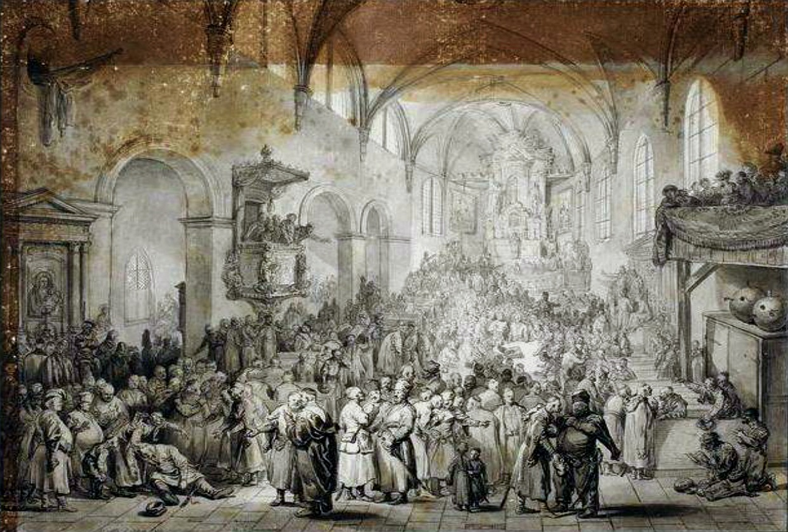<figcaption>Sejmik w kościele — Norblin, 1785 r., późniejsza wizja.</figcaption></figure>

<strong>Sejmik ziemski</strong> — spotkanie szlachty danej ziemi.

Omawiano sprawy miejscowe i wybierano posłów na sejm.

Posłowie otrzymywali <strong>instrukcje</strong>.

notes:
Sejmik to nie sejm walny. Ciekawostka: często obradowano w kościele, bo mieścił wielu uczestników. Rysunek pokazuje późny sejmik, nie wydarzenie z 1493 r.

---

<!-- .slide: id="sejm-walny" data-purpose="explanation" data-layout="split" data-goals="G2" -->
## Sejm walny: trzy części

<figure>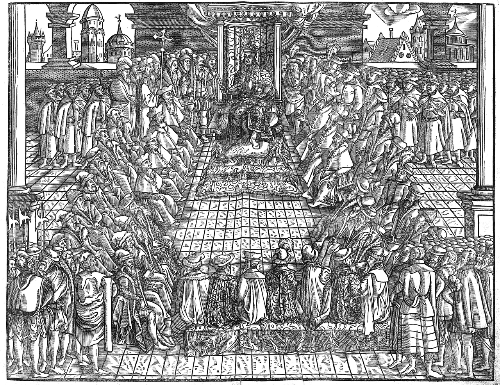<figcaption>Sejm za Zygmunta Augusta — rycina z druku z 1570 r.</figcaption></figure>

<strong>Król</strong>

<strong>Senat</strong> — najwyżsi dostojnicy

<strong>Izba poselska</strong> — posłowie wybrani na sejmikach

1493 · sejm w Piotrkowie

notes:
1493 jest szkolnym punktem odniesienia dla ukształtowanego sejmu dwuizbowego, nie pierwszym zjazdem w historii. Trzy stany sejmujące to części sejmu, nie trzy warstwy szlachty. Rycina pochodzi z późniejszego druku.

---

<!-- .slide: id="obrady" data-purpose="explanation" data-layout="process" data-goals="G2" -->
## Jak obradował sejm?

<b>1</b> Sejmik wybierał posła i przekazywał mu instrukcje.

<b>2</b> Posłowie debatowali w izbie poselskiej. Obradom przewodniczył marszałek.

<b>3</b> Nowe prawa uzgadniano z senatem i królem.

Ciekawostka: marszałek poselski używał laski marszałkowskiej.

notes:
Nie sugeruj, że wszystkie propozycje praw pochodziły z sejmików. Wyjaśnij różnicę między dyskusją posłów a wspólną decyzją.

---

<!-- .slide: id="nihil-novi" data-purpose="explanation" data-layout="split" data-goals="G2" -->
## 1505: *Nihil novi* w Radomiu

<figure>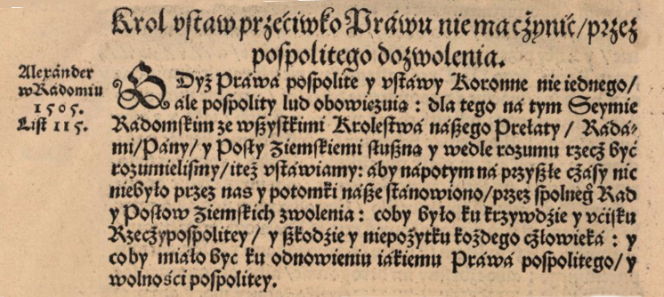<figcaption>Przekład *Nihil novi* z druku z 1570 r., nie oryginał z 1505 r.</figcaption></figure>

<strong>„Nic nowego”</strong> — król nie mógł sam stanowić nowych praw.

Potrzebna była zgoda <strong>senatorów i posłów</strong>.

Nie oznaczało to końca władzy króla.

notes:
Uchwalono w Radomiu w 1505 r. Obraz pokazuje późniejszy druk przekładu, nie oryginał. Parafrazuj sens; nie udawaj dokładnego cytatu ze starej polszczyzny.

---

<!-- .slide: id="co-to-demokracja" data-purpose="explanation" data-layout="comparison" data-goals="G3" -->
## Dlaczego „demokracja szlachecka”?

<h3>Współdecydowanie</h3>
król nie stanowił nowych praw sam

sejmiki wybierały posłów

<h3>Granica</h3>
głos polityczny należał głównie do szlachty

chłopi i mieszczanie pozostawali poza tym systemem reprezentacji

„Szlachecka” to słowo, bez którego nie zrozumiemy tej demokracji.

notes:
Nie utożsamiaj systemu z powszechnym prawem wyborczym ani ze współczesną demokracją. Nie twierdź, że wszyscy szlachcice mieli jednakowy wpływ.

---

<!-- .slide: id="zrodlo-cwiczenie" data-purpose="practice" data-layout="activity-brief" data-goals="G2" -->
## Kto mógł powiedzieć królowi „nie sam”?

<strong>Parafraza postanowienia z 1505 r.:</strong> nowe prawo wymagało zgody króla, senatu i posłów.

W zadaniu 1 karty pracy <strong>wypisz te trzy części sejmu</strong>. Następnie odpowiedz: czy posłowie reprezentowali wszystkich mieszkańców?

notes:
To parafraza, nie cytat. Odpowiedź: król, senat, izba poselska; posłowie reprezentowali szlachtę, nie wszystkich mieszkańców. Daj 5 minut wraz z omówieniem.

---

<!-- .slide: id="notatka" data-purpose="practice" data-layout="evidence" data-goals="G1 G2 G3" -->
## Uzupełnij notatkę graficzną
<figure class="note-figure">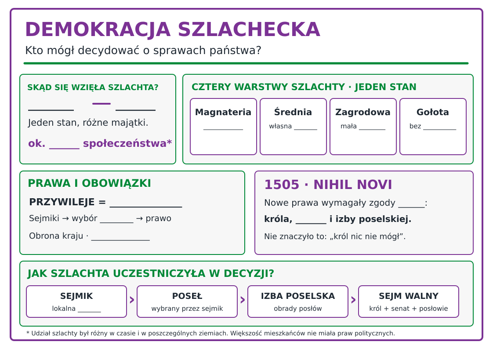<figcaption>Na swojej kartce wpisz brakujące hasła. Potem pokaż drogę sejmik → poseł → izba poselska → sejm.</figcaption></figure>
notes:
Uczniowie pracują przez 5 minut na wersji z lukami `assets/notatka-graficzna-do-uzupelnienia.svg`. Przesłany przez nauczycielkę obraz M. Nowackiej był inspiracją; oryginału nie skopiowano z uwagi na brak potwierdzonej licencji. Schemat odróżnia majątek od praw oraz *Nihil novi* od całkowitego zakazu działania króla.

---

<!-- .slide: id="wywiady" data-purpose="practice" data-layout="activity-brief" data-goals="G3" -->
## Cztery wywiady — jeden stan

<strong>4 grupy, do 5 osób.</strong> Każda grupa odgrywa rozmowę z przedstawicielem jednej warstwy szlachty.

Zapytaj o <strong>ziemię, dom, udział w sejmiku i realny wpływ</strong>. Korzystaj z opisu roli w karcie pracy.

5 min przygotowania · 4 × około 2 min wywiadów · 3 min porównania.

notes:
Przydziel magnaterię, szlachtę średnią, zagrodową i gołotę. W grupie jedna osoba w roli, dwoje pyta, pozostali przygotowują odpowiedzi. Uczniowie odgrywają hipotetyczne role, nie biografie ludzi z portretów.

---

<!-- .slide: id="magnateria" data-purpose="evidence" data-layout="comparison" data-goals="G3" -->
## Magnateria — wielki majątek i wpływy

<figure>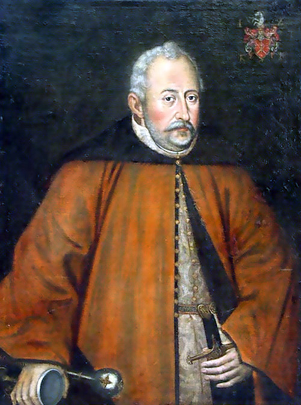<figcaption>Jan Zamoyski — konkretny magnat XVI wieku.</figcaption></figure>

Rozległe dobra, kontakty i możliwość wpływania na politykę.

<strong>Co ułatwia magnatowi uczestnictwo w decyzjach?</strong>
<small>Pałac w tle ma późniejszy, dzisiejszy wygląd.</small>
<figure>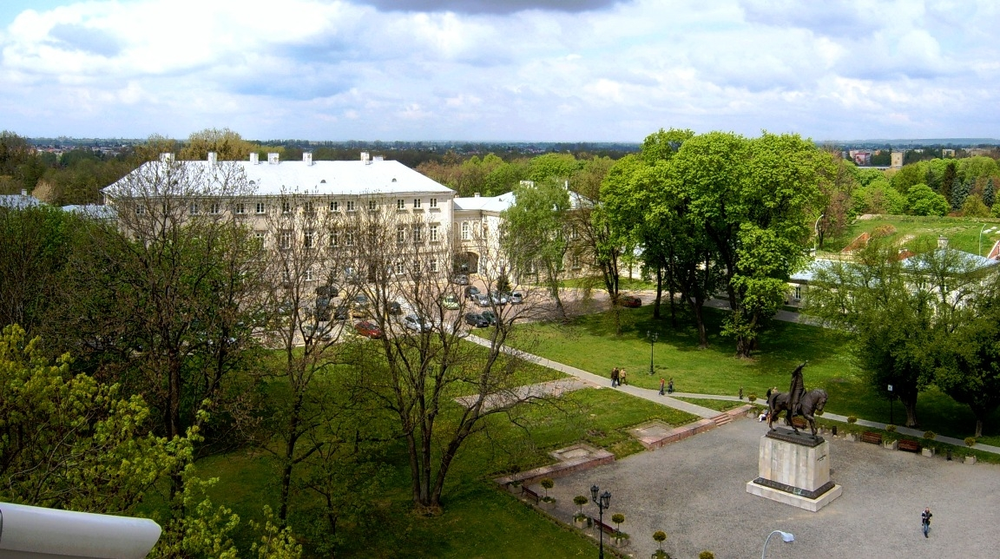<figcaption>Pałac Zamoyskich — współczesna fotografia.</figcaption></figure>

notes:
Portret przedstawia Jana Zamoyskiego, a nie typowego magnata. Dzisiejszy pałac nie pokazuje dokładnie jego stanu za życia. Porównaj jego środki i wpływy z gołotą.

---

<!-- .slide: id="srednia" data-purpose="evidence" data-layout="comparison" data-goals="G3" -->
## Szlachta średnia — ziemia i własny dwór

<figure>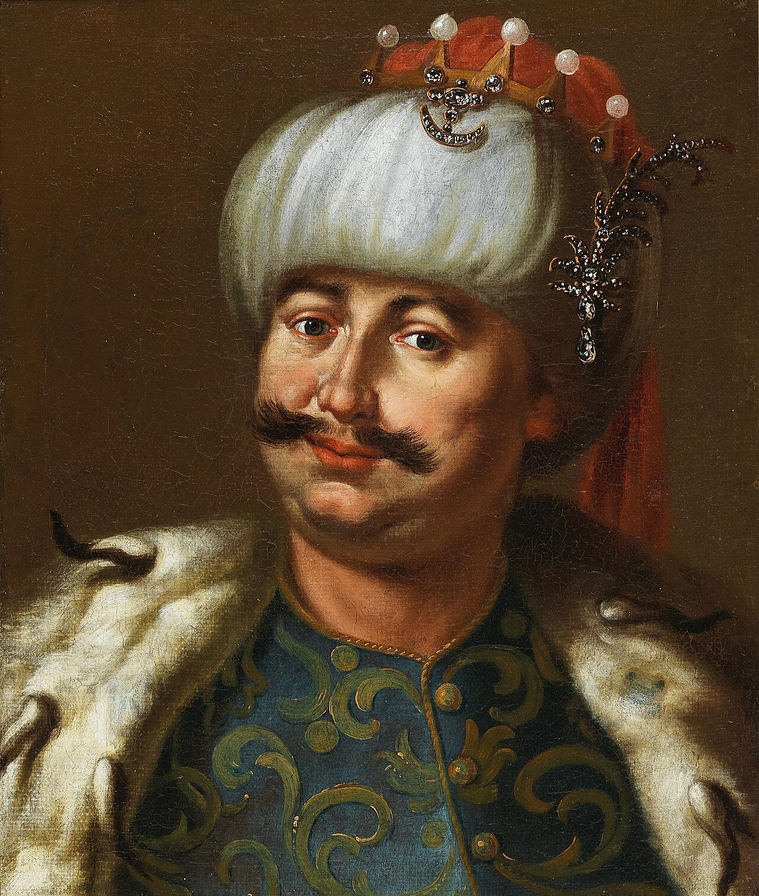<figcaption>Nieznany szlachcic, XVII w.; majątek nieznany.</figcaption></figure>

Posiadanie ziemi i gospodarstwa ułatwiało udział w sejmiku.

<strong>Jak jego zdanie mogło dotrzeć do sejmu?</strong>
<small>Postać i dom są zestawieniem poglądowym, nie udokumentowaną parą.</small>
<figure><figcaption>Dwór z Moniaków, XVIII w., dziś w Janowcu.</figcaption></figure>

notes:
Nie twierdź, że osoba z portretu należała do szlachty średniej. Dwór jest późniejszy od 1505 r. Wyjaśnij, że majątek ułatwiał aktywność w sejmiku.

---

<!-- .slide: id="zagrodowa" data-purpose="evidence" data-layout="comparison" data-goals="G3" -->
## Szlachta zagrodowa — niewielkie gospodarstwo

<figure>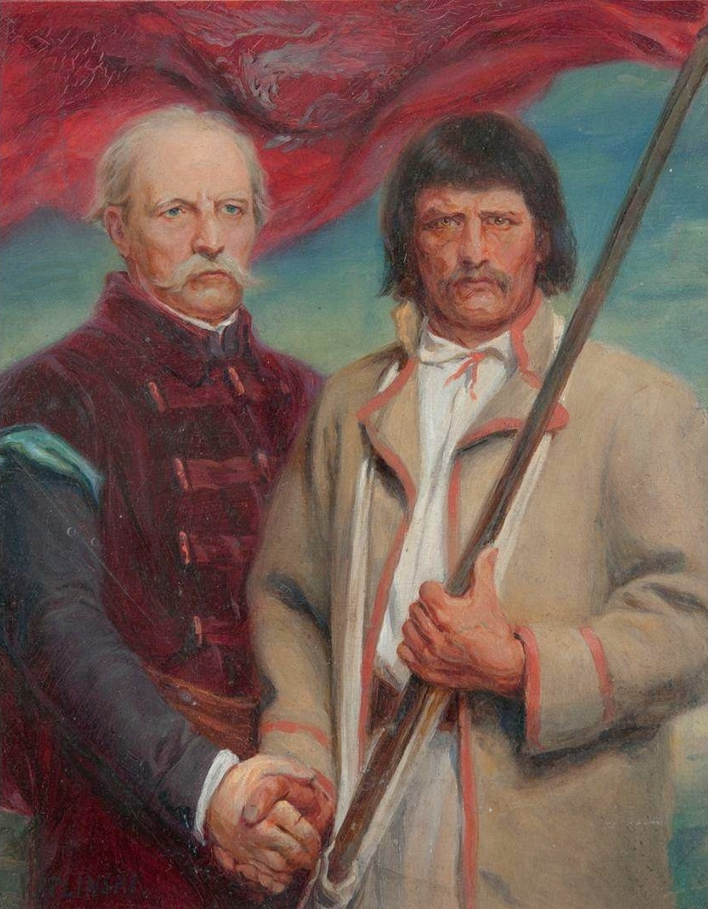<figcaption>„Szlachcic i chłop”, XIX w.; warstwa postaci nieznana.</figcaption></figure>

Mało ziemi, własna praca w gospodarstwie i skromniejszy dom.

<strong>Co utrudnia długą podróż i udział w polityce?</strong>
<small>Obraz i budynek pochodzą z późniejszych czasów.</small>
<figure>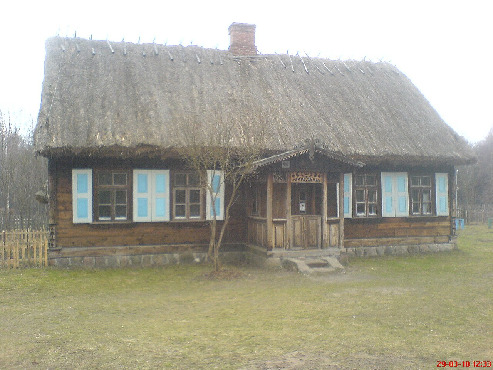<figcaption>Chałupa drobnoszlachecka z 1926 r. — późny przykład.</figcaption></figure>

notes:
To nie jest fotografia XVI-wiecznego domu ani portret szlachcica zagrodowego. Konkret: prawo nie gwarantowało czasu i pieniędzy na aktywność.

---

<!-- .slide: id="golota" data-purpose="evidence" data-layout="comparison" data-goals="G3" -->
## Gołota — szlachta bez własnej ziemi

<figure>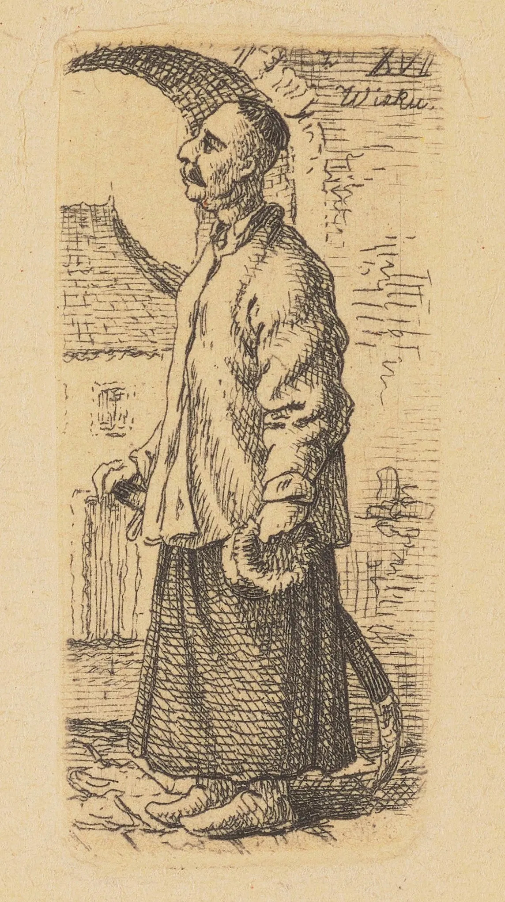<figcaption>Ubogi szlachcic (rysunek 1841 r.); bezrolność niepotwierdzona.</figcaption></figure>

Brak własnej ziemi. Trudniej działać samodzielnie; część osób zależała od możnych.

<strong>Czy formalne prawo zapewniało rzeczywisty wpływ?</strong>
<small>Chata w tle nie jest udokumentowanym „domem gołoty”.</small>
<figure>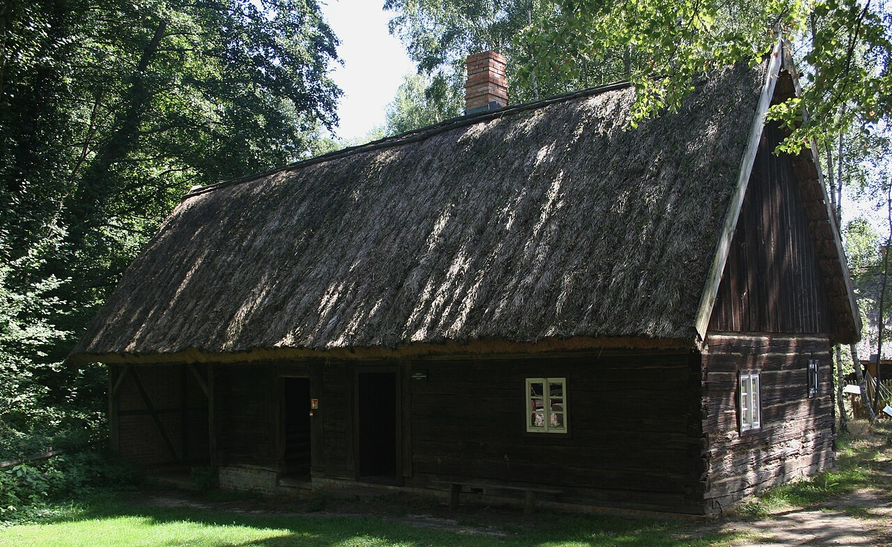<figcaption>Chata z Jędrzychowic, XVIII w. — tło poglądowe.</figcaption></figure>

notes:
Gołota to brak własnej ziemi, nie określony strój czy dom. Rysunek i fotografia nie dokumentują jednej osoby ani własności. Nie przypisuj wszystkim jednakowej sytuacji.

---

<!-- .slide: id="porownanie" data-purpose="synthesis" data-layout="takeaways" data-goals="G3" -->
## Kto naprawdę decydował?

<b>Prawo:</b> szlachta uczestniczyła w sejmikach i wybierała posłów.

<b>Wpływ:</b> majątek i kontakty pomagały korzystać z tych praw.

<b>Granica:</b> większość mieszkańców nie miała głosu w sejmie.

notes:
Poproś o porównanie magnata i gołoty. Co ich łączyło jako szlachtę, a co różniło w realnym wpływie? Nie nazywaj warstw odrębnymi stanami.

---

<!-- .slide: id="bilet" data-purpose="exit-ticket" data-layout="activity-brief" data-goals="G1 G2 G3" -->
## Bilet wyjścia

Zapisz trzy krótkie odpowiedzi w karcie pracy:
<ol><li>Czym różnił się sejmik od sejmu walnego?</li><li>Co zmieniło *Nihil novi* w 1505 r.?</li><li>Dlaczego gołota i magnateria nie miały jednakowego wpływu?</li></ol>

notes:
Daj czas na samodzielne odpowiedzi. Nie pokazuj klucza na slajdzie; odpowiedzi są w `assessment.md`.

---

<!-- .slide: id="zrodla" data-purpose="reference" data-layout="plain" -->
## Skąd wiemy?
<ul class="source-list"><li><a href="https://zpe.gov.pl/a/demokracja-szlachecka/DxZQW0FRx">ZPE: Demokracja szlachecka — sejm i sejmiki</a></li><li><a href="https://zpe.gov.pl/a/demokracja-szlachecka/DnTOpzFQ9">ZPE: Demokracja szlachecka — przywileje i ustrój</a></li><li><a href="https://www.national-geographic.pl/historia/szlachta-w-rzeczypospolitej-stanowila-ewenement-ale-nie-byla-zamknietym-klubem/">A. Wójcik, „Szlachta w Polsce” — szacunek dla XVI w.</a></li><li>Dz.U. 2024 poz. 996 — podstawa historii dla klasy VI.</li><li>Ilustracje: Wikimedia Commons; autorzy, daty i licencje w <code>sources.md</code>.</li></ul>
notes:
Podkreśl, że późniejszy obraz lub fotografia domu ilustrują porównanie, a nie dowodzą majątku nieznanej osoby z portretu. W sources.md są adresy do konkretnych ilustracji.
