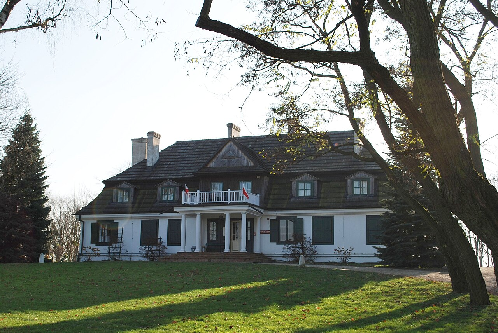
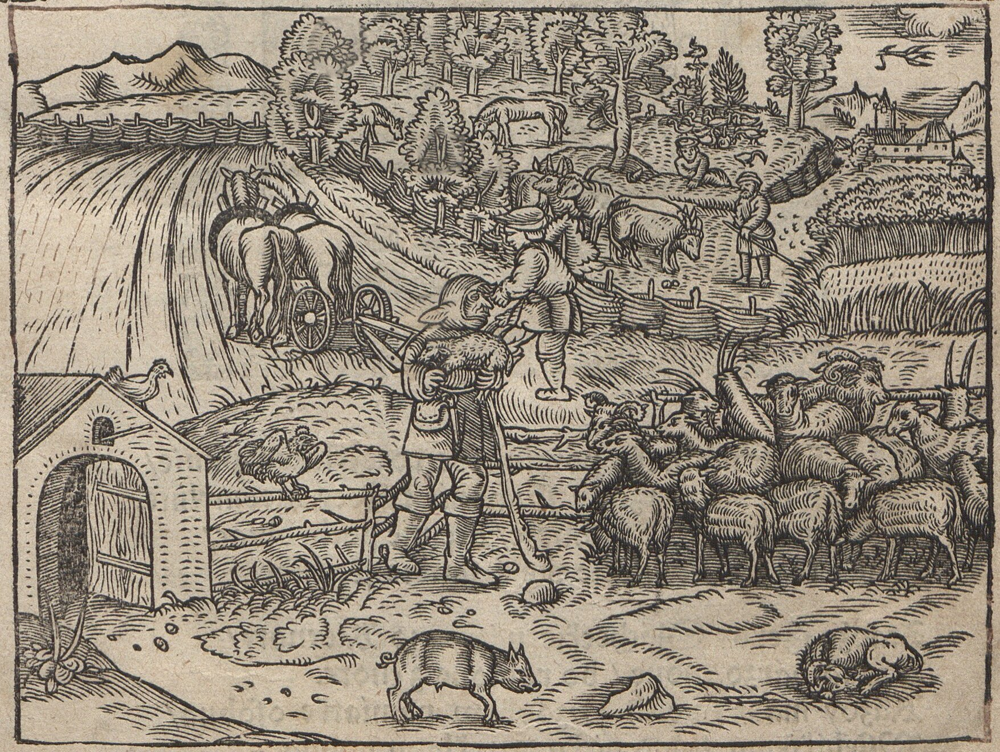
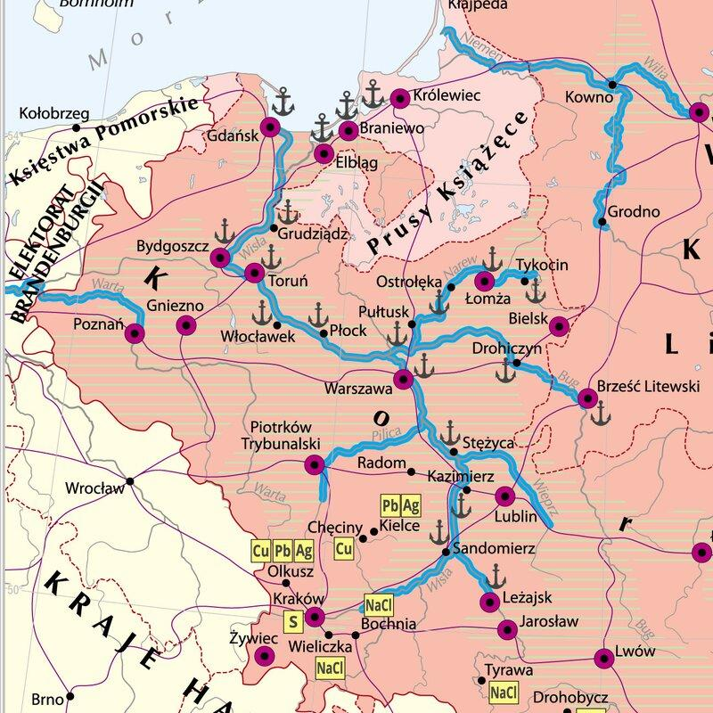
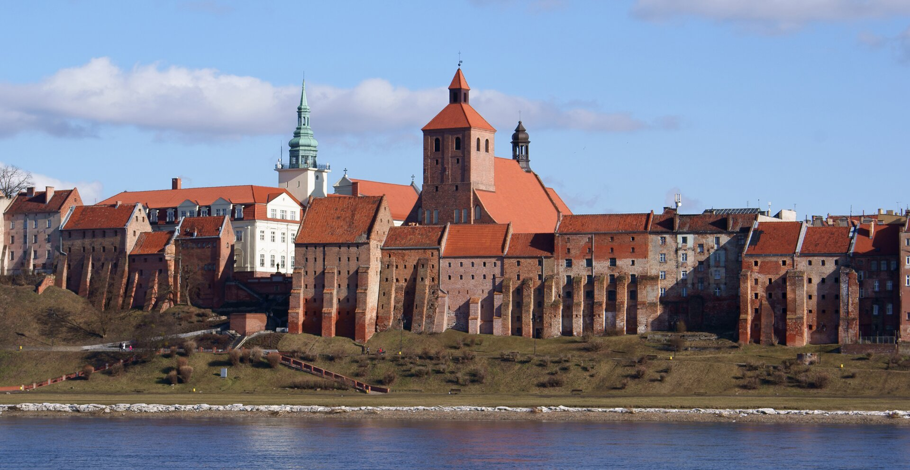
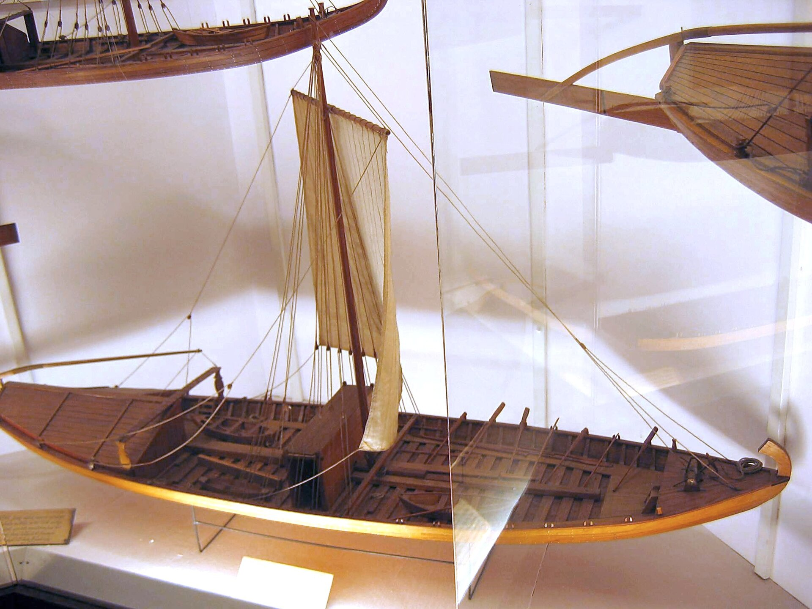
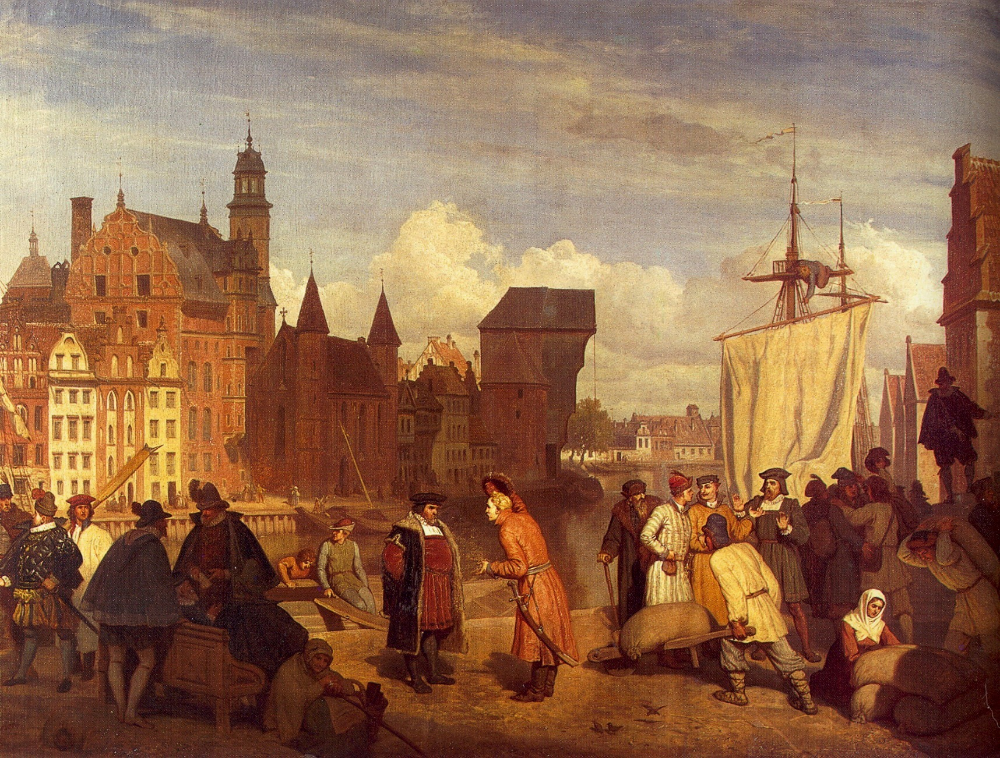
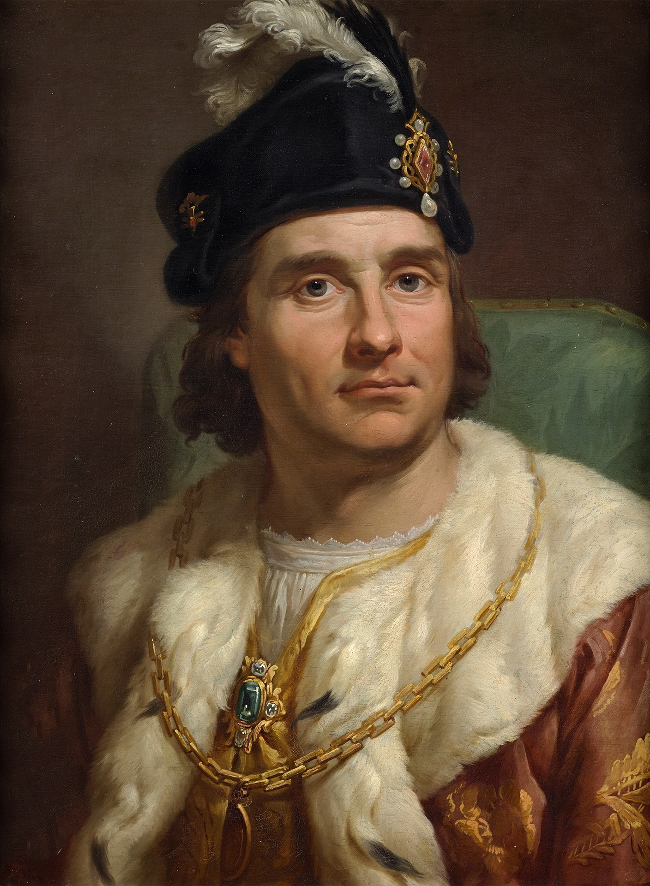
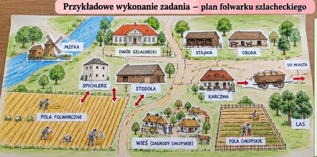

<!-- .slide: id="otwarcie" data-purpose="opening" data-layout="hero-source" -->

Klasa VI
<h1>W folwarku szlacheckim</h1>
Jak zboże z pola trafiało za morze?

<figure class="source-figure"><figcaption>Dwór w Janowcu · fotografia współczesna</figcaption></figure>

notes:
30 s. Zapowiedz drogę od pola do portu. Dwór na fotografii jest późniejszym przykładem siedziby szlacheckiej, nie dowodem wyglądu wszystkich dworów w XVI wieku.

---

<!-- .slide: id="folwark-dwor" data-purpose="explanation" data-layout="split" data-goals="G1" -->
# Folwark — gospodarstwo szlachcica

<figure class="source-figure"><figcaption>Dwór — siedziba właściciela</figcaption></figure>

<strong>Folwark</strong> — duże gospodarstwo produkujące głównie na sprzedaż.

<strong>Dwór</strong> — dom szlachcica, nie cały folwark.

Do gospodarstwa należały pola, łąki i zabudowania: m.in. stodoła, obora i stajnia.

notes:
1 min. Folwark to całość gospodarstwa, dwór to jeden budynek. Stodoła mieściła snopy i służyła młóceniu; spichlerz przechowywał ziarno. Szlachta nie była jedynym właścicielem folwarków — miały je też Kościół i król. Nie rozbudowuj tego pobocznego wątku.

---

<!-- .slide: id="panszczyzna" data-purpose="explanation" data-layout="split" data-goals="G1" -->
# Kto pracował na folwarku?

<figure class="source-figure"><figcaption>Praca na wsi · dawny drzeworyt</figcaption></figure>

<strong>Pańszczyzna</strong> — obowiązkowa praca chłopa dla pana, bez zapłaty.

Chłopi orali, siali, zbierali zboże i wykonywali inne prace.

Musieli też uprawiać własne pola, aby utrzymać rodzinę.

notes:
1 min 30 s. Wskaż orkę i siew. Chłop korzystał z ziemi należącej do pana, w zamian miał obowiązki, w tym pracę na pańskim gospodarstwie. Przykład wyłącznie dydaktyczny: część tygodnia na własnym polu, część na pańskim. Nie podawaj jednej liczby dni dla wszystkich wsi i stuleci. Pracowali również pracownicy najemni i czeladź.

---

<!-- .slide: id="rozwoj" data-purpose="explanation" data-layout="process" data-goals="G1 G2" -->
# Dlaczego folwarki się rozwijały?

Większe potrzeby miast w Europie<b>→</b>Popyt na zboże<b>→</b>Zyski ze sprzedaży

<ul><li>Folwarki rozwijały się szczególnie w <strong>XV–XVI wieku</strong>.</li><li>Szlachta powiększała uprawy, aby sprzedawać więcej zboża.</li><li>Wraz z rozwojem folwarków zwiększano obciążenia chłopów.</li></ul>

notes:
1 min. Nie sugeruj, że wszystkie folwarki powstały jednocześnie w jednej dacie. Połącz handel i obowiązki: właściciel zwiększał produkcję, chłopi tracili czas na własne gospodarstwo. Pytanie ustne: kto otrzymywał zapłatę za zboże?

---

<!-- .slide: id="wisla-1466" data-purpose="explanation" data-layout="split" data-goals="G2" -->
# Wisłą do Gdańska

<strong>1466 — II pokój toruński.</strong>

Polska odzyskała Pomorze Gdańskie.

Wisła była głównym szlakiem przewozu zboża do portu w Gdańsku.

Znajdź na mapie Wisłę i Gdańsk.

notes:
1 min 30 s. Po wojnie trzynastoletniej Polska odzyskała Pomorze Gdańskie. Handel Wisłą istniał wcześniej; 1466 poprawił warunki rozwoju, nie stworzył szlaku z dnia na dzień. Mapa przedstawia XVI wiek, nie granice z 1466. Niebieskie linie oznaczają spław; znajdź Wisłę od Krakowa na północ. Kliknięcie powiększa mapę.

---

<!-- .slide: id="szkuta-spichlerz" data-purpose="explanation" data-layout="comparison" data-goals="G2" -->
# Spichlerz i szkuta

<figure class="source-figure"><figcaption><strong>Spichlerz</strong> — magazyn zboża. Spichlerze w Grudziądzu</figcaption></figure><figure class="source-figure"><figcaption><strong>Szkuta</strong> — statek rzeczny do przewozu zboża. Model muzealny</figcaption></figure>

<strong>Spław</strong> — przewóz towarów rzeką, zwykle z jej nurtem.

notes:
1 min 30 s. Transport rzeką dużych ilości towaru był tańszy od długiej drogi wozami. Z folwarku zboże trzeba było najpierw dowieźć nad rzekę. Ciekawostka: płaskie dno szkuty ułatwiało pływanie po płytkiej wodzie. Rozróżnij magazyn i statek.

---

<!-- .slide: id="gdansk" data-purpose="explanation" data-layout="split" data-goals="G2" -->
# Gdańsk — z rzeki na morze

<figure class="source-figure"><figcaption>Gdańsk w XVII wieku · W. Gerson, 1865</figcaption></figure>

Kupcy kupowali zboże i organizowali jego dalszą sprzedaż.

Statki morskie zabierały je do Europy Zachodniej, m.in. Holandii i Anglii.

Na handlu zarabiali właściciele folwarków i kupcy.

notes:
1 min. Odróżnij szkutę na rzece od statku morskiego. Żuraw to dźwig portowy — krótka ciekawostka. Obraz Gersona jest późniejszym przedstawieniem XVII wieku.

---

<!-- .slide: id="statuty" data-purpose="explanation" data-layout="comparison" data-goals="G3" -->
# 1496 — statuty piotrkowskie
**Za panowania Jana Olbrachta wzmocniono przywileje szlachty.**
<table class="law-table"><thead><tr><th>Ograniczenia mieszczan</th><th>Ograniczenia chłopów</th></tr></thead><tbody><tr><td>Zakaz kupowania dóbr ziemskich, czyli majątków na wsi.</td><td>Tylko jeden chłop rocznie mógł legalnie opuścić daną wieś.</td></tr></tbody></table>

<strong>Szlachtę zwolniono z ceł na własne towary.</strong>

Szlachta zyskiwała; mieszczanie i chłopi mieli mniej możliwości.

notes:
2 min. Ustawy uchwalił sejm w Piotrkowie za Jana Olbrachta. Cło to opłata od przewozu towarów. Limit dotyczył jednej wsi, nie całej Polski; odejście wymagało spełnienia warunków, nie było automatyczne. Zakaz dotyczył majątków ziemskich, nie wszystkich nieruchomości i nie całego handlu. Nie przypisuj statutom wprowadzenia pańszczyzny: istniała wcześniej.

---

<!-- .slide: id="olbracht" data-purpose="explanation" data-layout="split" data-goals="G3" -->
# „Za króla Olbrachta wyginęła szlachta”

<figure class="source-figure"><figcaption>Jan Olbracht · portret z XVIII wieku</figcaption></figure>

<strong>1497:</strong> nieudana wyprawa Jana Olbrachta do Mołdawii.

Podczas odwrotu wojsko zaatakowano w lasach koźmińskich. Zginęło wielu uczestników wyprawy.

<strong>Powiedzenie wyolbrzymia klęskę — nie wyginęła cała szlachta!</strong>

notes:
1 min 30 s. Oddziel 1496 — przepisy gospodarcze i społeczne — od 1497 — klęski wojennej. Wyprawa wiązała się z planami przeciw Turkom i narzucenia wpływów w Mołdawii; nie udało się zdobyć Suczawy, a podczas odwrotu nastąpił atak 26 października. Cele wyprawy są dyskutowane przez historyków, więc nie upraszczaj do jednej pewnej intencji. Nie podawaj niezweryfikowanej liczby poległych.

---

<!-- .slide: id="synteza" data-purpose="synthesis" data-layout="takeaways" data-goals="G1 G2 G3" -->
# Zapamiętaj
<ul class="takeaways"><li><strong>Folwark</strong> produkował na sprzedaż; <strong>dwór</strong> był domem właściciela.</li><li><strong>Pańszczyzna</strong> to obowiązkowa, nieodpłatna praca chłopów dla pana.</li><li>Zboże trafiało <strong>Wisłą do Gdańska</strong>, a potem morzem za granicę.</li><li><strong>1466:</strong> Pomorze Gdańskie. <strong>1496:</strong> statuty. <strong>1497:</strong> klęska wyprawy.</li></ul>

notes:
30 s. Krótkie domknięcie — bez długiego przepisywania. Uczniowie mogą później skorzystać z osobnej notatki.

---

<!-- .slide: id="sprawdzenie" data-purpose="exit-ticket" data-layout="plain" data-goals="G1 G2 G3" -->
# Sprawdź się przed rysowaniem
1. Dlaczego rozwój folwarków był korzystny dla szlachty, ale zwiększał obowiązki chłopów?
2. Po co zboże przewożono Wisłą do Gdańska?
3. Podaj jedno ograniczenie z 1496 roku. Czy powiedzenie o Olbrachcie jest dosłowne?
**Odpowiedz krótko, własnymi słowami.**

notes:
2 min. Każdy najpierw formułuje odpowiedź, potem przyjmij trzy krótkie wypowiedzi. W bardzo szybkiej klasie można zapisać hasła w zeszycie. Klucz jest tylko w assessment.md. Sprawdzenie odbywa się przed rozdaniem A3.

---

<!-- .slide: id="zrodla" data-purpose="reference" data-layout="plain" -->
# Źródła
- **ZPE:** „Polska spichlerzem Europy”; „Gospodarka folwarczno-pańszczyźniana i sytuacja chłopów”.
- **T. Grabarczyk, 2017:** opracowanie wyprawy mołdawskiej z 1497 r.
- **Ilustracje:** M. Rej — drzeworyt; W. Gerson, M. Bacciarelli — domena publiczna; fotografie — CC BY-SA 3.0.
- **Przykład zadania:** ilustracja przesłana przez nauczyciela.

Pełne adresy i prawa: sources.md. Wersja do prywatnego przeglądu.

notes:
Bez wykładu; źródła przed końcowym zadaniem. Przykład od nauczyciela ma nieustalone autorstwo/prawa, nie publikujemy go w repo ani publicznym katalogu.

---

<!-- .slide: id="zadanie" data-purpose="practice" data-layout="task-board" data-goals="G1 G2" -->
# Zaprojektujcie swój folwark

<strong>W grupie narysujcie i wyklejcie plan folwarku na A3.</strong>
<ol><li>Podpiszcie: <strong>dwór, pola folwarczne, stodołę, spichlerz, oborę lub stajnię oraz wieś chłopską.</strong></li><li>Strzałkami pokażcie drogę zboża z pola do spichlerza i dalej do rzeki.</li><li>Dopiszcie przy rzece: <strong>„Wisłą do Gdańska”.</strong></li></ol>
Na następnym slajdzie zobaczycie przykład. <strong>Stwórzcie własny układ.</strong>

notes:
45 s instrukcji. Sama praca plastyczna jest PO 15-minutowym rdzeniu, w pozostałym czasie lekcji lub na kolejnych zajęciach. Rozdaj A3 i przygotowane elementy do wklejenia dopiero po sprawdzeniu. Rysunek może zastąpić brakującą wycinankę. Klucz: spichlerz przechowuje ziarno, stodoła nie jest tym samym.

---

<!-- .slide: id="przyklad" data-purpose="evidence" data-layout="evidence" -->

notes:
15 s pokazania wzoru. Cały przesłany obraz, bez kadrowania i dopisywania podpisów. Zostaw na ekranie na czas pracy. Ilustracja poglądowa, nie mapa konkretnego folwarku. Uczniowie tworzą własny plan; nie muszą kopiować każdego obiektu. Plik źródłowy ma małą rozdzielczość 537×267: powiększenie nie doda szczegółów.
