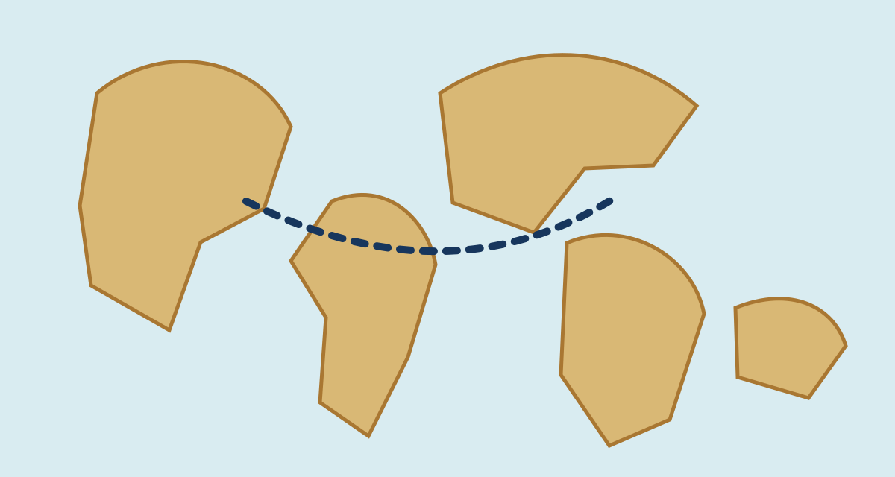

# Katalog komponentów prezentacji

Klasa VI · Wzornik interaktywnych slajdów · wersja robocza

notes:
To jest katalog do oglądania i strojenia stylów. Treści, dane i cytaty są przykładowe — przed użyciem w lekcji zastąp je źródłami zweryfikowanymi w sources.md.

---

<!-- .slide: id="katalog-start" class="question-slide" -->
## Katalog komponentów

**10 gotowych wzorców** do wykorzystania w kolejnych prezentacjach.

Każdy komponent ma czytelną wersję statyczną oraz opcjonalną interakcję.

notes:
Przejdź po katalogu jak po bibliotece: wybierz komponenty, które pasują do celów konkretnej lekcji, nie odwrotnie.

---

<!-- .slide: id="mapa-lokalna" class="map-slide" -->
komponent · mapa lokalna

## Mapa z aktywnymi punktami

<lesson-map aria-label="Schemat trasy oceanicznej">
  

    
    <button data-map-pin style="left:27%;top:39%" aria-controls="punkt-portugalia" aria-pressed="false" aria-label="Pokaż opis Portugalii">1</button>
    <button data-map-pin style="left:68%;top:38%" aria-controls="punkt-karaiby" aria-pressed="false" aria-label="Pokaż opis Karaibów">2</button>
  

  <aside class="map-info">
    kliknij punkt
    
<strong>Port w Europie</strong> Tu można wpisać datę, osobę, źródło albo pytanie do uczniów.

    
<strong>Wyspa na Karaibach</strong> Opis może zawierać lokalną perspektywę, cytat albo ilustrację.

    
Schemat edukacyjny, nie źródło historyczne.

  </aside>
</lesson-map>

notes:
Mapa jest offline-first: obraz i punkty są lokalne. Kliknięcie punktu zmienia panel po prawej.

---

<!-- .slide: id="mapa-google" class="map-slide" -->
komponent · tryb online

## Osadzona mapa Google

<lesson-map>
  
<strong>Mapa Google</strong>
Mapa zewnętrzna nie ładuje się automatycznie. Kliknij tylko, gdy Internet jest dostępny i akceptujesz połączenie z Google.
<button data-map-open type="button">Otwórz mapę Google</button>

  <iframe title="Przykładowa mapa Google: Kraków" loading="lazy" referrerpolicy="no-referrer-when-downgrade" data-map-src="https://www.google.com/maps?q=Krak%C3%B3w&output=embed" hidden></iframe>
  <aside class="map-info">wymaga internetu
W lekcji online można osadzić mapę Google przez zwykły iframe. Do PDF i pracy offline dodaj obok lokalny schemat lub zrzut źródłowy.
</aside>
</lesson-map>

notes:
Google Maps nie jest zasobem offline. Stosuj tylko opcjonalnie; nie ukrywaj treści lekcji wyłącznie w mapie zewnętrznej.

---

<!-- .slide: id="hasla" class="context-slide" -->
komponent · rozwijane hasła

## Kliknij hasło, zobacz kontekst

<lesson-disclosure>
  

Kolonia

Terytorium podporządkowane władzy innego państwa. W lekcji dopisz czas, miejsce i perspektywę.

  

Wymiana

Przepływ ludzi, towarów, roślin, chorób i idei — nie tylko handel.

  

Źródło historyczne

Może tu być lokalny obraz, podpis i pytanie badawcze.

</lesson-disclosure>

notes:
To są natywne elementy details: działają myszą, dotykiem i klawiaturą także bez JavaScriptu.

---

<!-- .slide: id="statystyki" class="context-slide" -->
komponent · dane

## Dane na pierwszy rzut oka

<lesson-stats>
  <lesson-stat><lesson-counter value="1492"></lesson-counter><small>rok wyprawy Kolumba</small>
Przykład daty jako punktu kontrolnego.
</lesson-stat>
  <lesson-stat><lesson-counter value="3" suffix=" kontynenty"></lesson-counter><small>perspektywy do porównania</small>
Żeglarz, kupiec, mieszkańcy lądów.
</lesson-stat>
  <lesson-stat><lesson-counter value="65000000" suffix=" osób"></lesson-counter><small>miejsce na dane demograficzne</small>
Wpisuj tylko liczbę z podanym źródłem i datą.
</lesson-stat>
</lesson-stats>

notes:
Liczniki animują się tylko jako dodatek. W PDF i przy ograniczonym ruchu pokazują od razu pełną wartość.

---

<!-- .slide: id="stepper" class="context-slide" -->
komponent · kroki procesu

## Stepper: jak pracować ze źródłem

<lesson-stepper>
  <lesson-step><h3>Obejrzyj</h3>
Co jest widoczne bez interpretacji?
</lesson-step>
  <lesson-step data-state="current"><h3>Nazwij</h3>
Kto, gdzie i kiedy stworzył materiał?
</lesson-step>
  <lesson-step><h3>Zapytaj</h3>
Czego źródło nie pozwala rozstrzygnąć?
</lesson-step>
  <lesson-step><h3>Uzasadnij</h3>
Połącz wniosek z konkretnym dowodem.
</lesson-step>
</lesson-stepper>

notes:
W wersji pionowej użyj atrybutu orientation="vertical" na lesson-stepper.

---

<!-- .slide: id="tabela" class="compare-slide" -->
komponent · tabela

## Tabela porównawcza

<lesson-table>
<table>
  <thead><tr><th>Perspektywa</th><th>Co może zauważyć?</th><th>Pytanie do źródła</th></tr></thead>
  <tbody>
    <tr><td>Żeglarz</td><td>trasę i porty</td><td>Co było celem wyprawy?</td></tr>
    <tr><td>Kupiec</td><td>towary oraz koszty</td><td>Kto zyskuje na wymianie?</td></tr>
    <tr><td>Mieszkańcy lądu</td><td>przybycie obcych</td><td>Jakie skutki przynosi spotkanie?</td></tr>
  </tbody>
</table>
</lesson-table>

notes:
Tabela nie powinna mieć zbyt wielu kolumn. Trzy kolumny i trzy–pięć wierszy są czytelne na projektorze.

---

<!-- .slide: id="cytat" class="source-slide" -->
komponent · postać i cytat

## Testimonial / cytat źródłowy

<lesson-quote>
  
  
<blockquote>„Cytat może tu służyć jako punkt wyjścia do krytyki źródła — nie jako dowód sam w sobie.”</blockquote><figcaption>Imię postaci · data · rodzaj źródła · [DO WERYFIKACJI]</figcaption>

</lesson-quote>

notes:
Nie używaj fikcyjnego cytatu jako historycznego. Ten slajd jest wyłącznie wzorem układu.

---

<!-- .slide: id="timeline-pozioma" class="context-slide timeline-slide" -->
komponent · oś pozioma

## Timeline pozioma

<lesson-timeline>
  <lesson-event year="1492">Początek przykładowej osi</lesson-event>
  <lesson-event year="1498">Drugie wydarzenie</lesson-event>
  <lesson-event year="1507">Trzeci punkt</lesson-event>
  <lesson-event year="1519–1522">Wydarzenie rozciągnięte w czasie</lesson-event>
</lesson-timeline>

---

<!-- .slide: id="timeline-pionowa" class="context-slide timeline-slide" -->
komponent · oś pionowa

## Timeline pionowa

<lesson-timeline orientation="vertical">
  <lesson-event year="przed">Warunek lub przyczyna</lesson-event>
  <lesson-event year="w trakcie">Działanie / zwrot akcji</lesson-event>
  <lesson-event year="po">Skutek bezpośredni</lesson-event>
  <lesson-event year="później">Dłuższa konsekwencja</lesson-event>
</lesson-timeline>

notes:
Pionowa wersja jest dobra dla procesu, który wymaga krótkiego opisu przy każdym kroku.

---

<!-- .slide: id="video" class="source-slide" -->
komponent · wideo

## Wideo YouTube z kontrolą startu

<lesson-video>
  
<strong>Materiał wideo</strong>
Film nie ładuje się automatycznie. Kliknięcie świadomie uruchamia osadzony YouTube w trybie privacy-enhanced.
<button data-video-play type="button">▶ Odtwórz wideo</button>

  <iframe data-video-src="https://www.youtube-nocookie.com/embed/dQw4w9WgXcQ" title="Przykładowe wideo YouTube" allow="accelerometer; autoplay; clipboard-write; encrypted-media; gyroscope; picture-in-picture" allowfullscreen hidden></iframe>
</lesson-video>

W gotowej lekcji dodaj tytuł, autora, URL, licencję, czas fragmentu i alternatywne zadanie offline.

notes:
Adres jest technicznym przykładem. Przed użyciem zastąp go zweryfikowanym filmem edukacyjnym; wideo wymaga Internetu.

---

<!-- .slide: id="lista-ikony" class="context-slide" -->
komponent · lista z ikonami

## Lista bez zwykłych punktorów

<lesson-icon-list>
  <li data-icon="🧭">kierunek podróży</li>
  <li data-icon="⚓">port i wymiana</li>
  <li data-icon="🗺️">mapa jako źródło</li>
  <li data-icon="💬">różne perspektywy</li>
</lesson-icon-list>

notes:
Można używać emoji albo krótkich symboli. Nie opieraj znaczenia wyłącznie na kolorze ikony.

---

<!-- .slide: id="compare-slider" class="source-slide" -->
komponent · compare slider

## Przesuń: schemat i mapa źródłowa

<lesson-compare>
  <figure class="compare-base"><figcaption>źródło historyczne</figcaption></figure>
  <figure class="compare-overlay"><figcaption>schemat edukacyjny</figcaption></figure>
  <input type="range" min="0" max="100" value="50" aria-label="Porównaj schemat edukacyjny z mapą historyczną">
  <output aria-live="polite"></output>
</lesson-compare>

notes:
Suwak ma prawdziwy input range, więc jest obsługiwany klawiaturą i dotykiem. W druku oba obrazy pozostają widoczne.

---

<!-- .slide: id="zestawienie" class="exit-ticket-slide" -->
## Jak wybierać komponent?

<lesson-icon-list style="--icon-list-columns:1">
  <li data-icon="①">najpierw cel poznawczy, potem efekt wizualny</li>
  <li data-icon="②">wpisz własne źródło, datę i kontekst</li>
  <li data-icon="③">sprawdź offline, na projektorze i w PDF</li>
</lesson-icon-list>

notes:
Zanotuj komponenty do wdrożenia w realnych lekcjach oraz potrzebne zmiany stylu w lesson.css.
