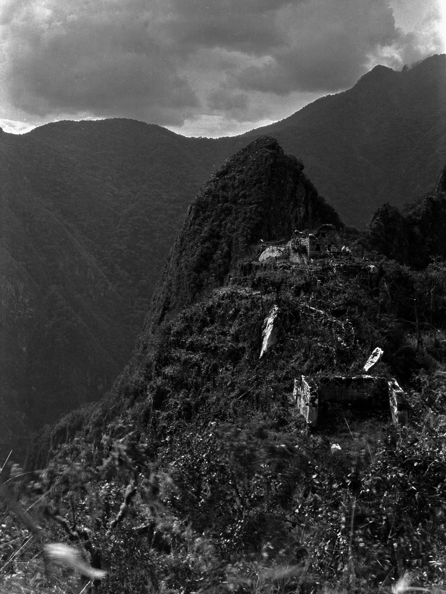
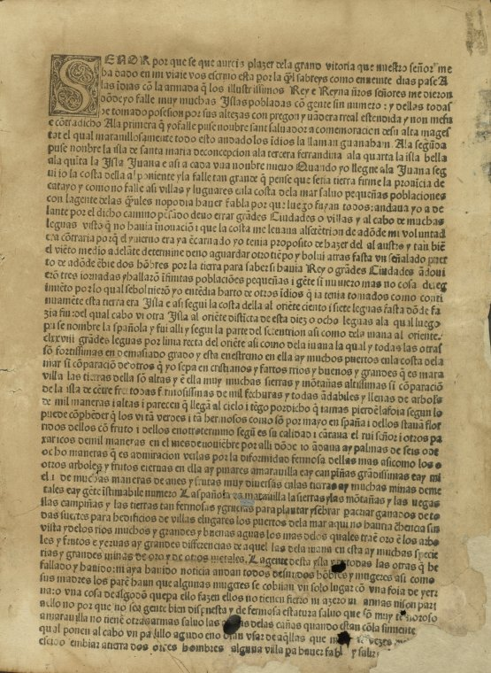

<!-- .slide: id="otwarcie" class="opening-slide" data-purpose="opening" data-layout="statement" -->
# Skutki wypraw geograficznych
## Ameryka przed Kolumbem i świat po 1492 r.

---

<!-- .slide: id="pytanie" class="question-slide" data-purpose="question" data-layout="plain" -->
## Pytanie główne
**Jak spotkanie społeczeństw po 1492 r. zmieniło Amerykę i Europę — i dlaczego skutki nie były dla wszystkich takie same?**

---

<!-- .slide: id="przed-1492" class="explanation-slide" data-purpose="explanation" data-layout="takeaways" -->
## Ameryka przed Kolumbem nie była „pustym lądem”
<ul class="takeaways"><li>Żyły tam liczne społeczności, języki i państwa.</li><li>Uprawiano m.in. kukurydzę, ziemniaki, fasolę i kakao.</li><li>Istniały miasta, sieci handlowe, drogi oraz wiedza astronomiczna i rolnicza.</li></ul>

---

<!-- .slide: id="majowie-aztekowie-inkowie" class="explanation-slide" data-purpose="explanation" data-layout="matrix" -->
## Trzy przykłady, nie cała Ameryka

<article><strong>Majowie</strong> miasta-państwa, pismo, kalendarze i obserwacje nieba</article><article><strong>Aztekowie</strong> Tenochtitlán, handel i chinampas — pola na płytkich wodach</article><article><strong>Inkowie</strong> państwo w Andach, drogi, mosty i uprawy tarasowe</article><article><strong>Ważne</strong> nie były to jedyne ludy ani jeden wspólny sposób życia</article>

---

<!-- .slide: id="mapa-aztekow" class="map-slide" data-purpose="evidence" data-layout="evidence" data-backdrop="off" -->
## Czytam mapę: państwo Azteków w 1519 r.
<figure class="source-figure"><figcaption>Aldan-2, 2019, CC BY-SA 4.0. Mapa pokazuje zasięg; nie pokazuje życia ani losów wszystkich mieszkańców.</figcaption></figure>

<strong>Zadanie:</strong> wskaż obszar państwa Azteków. Dopisz: „Mapa pokazuje…, ale nie pokazuje…”.

---

<!-- .slide: id="fotografia-inkow" class="evidence-slide" data-purpose="evidence" data-layout="evidence" data-backdrop="off" -->
## Fotografia może być źródłem — ale trzeba ją datować
<figure class="source-figure"><figcaption>H. L. Tucker, Machu Picchu, 24 VII 1911, domena publiczna.</figcaption></figure>

<strong>Pytanie:</strong> czego dowiadujemy się o miejscu, a czego nie możemy powiedzieć o czasach Inków na podstawie zdjęcia z 1911 r.?

---

<!-- .slide: id="konkwistadorzy" class="explanation-slide" data-purpose="explanation" data-layout="plain" -->
## Kim byli konkwistadorzy?
Byli to głównie hiszpańscy zdobywcy działający w imieniu Korony i dla własnego zysku. <strong>Hernán Cortés</strong> podbił państwo Azteków, a <strong>Francisco Pizarro</strong> państwo Inków. Nie byli jedyną stroną: wykorzystywali miejscowych sojuszników i konflikty między ludami Ameryki.

---

<!-- .slide: id="zrodla" class="evidence-slide" data-purpose="evidence" data-layout="evidence" data-backdrop="off" -->
## Źródło z 1493 r.: czyj to głos?
<figure class="source-figure"><figcaption>Krzysztof Kolumb, list o pierwszej wyprawie, 1493, domena publiczna.</figcaption></figure>

To źródło z epoki, ale reprezentuje perspektywę europejskiego autora. <strong>Nie jest</strong> opisem całej Ameryki ani wszystkich jej mieszkańców.

---

<!-- .slide: id="epidemie" class="explanation-slide" data-purpose="explanation" data-layout="plain" -->
## Dlaczego zginęło tak wiele ludności rdzennej?
Podbój łączył przemoc, pracę przymusową i niszczenie dawnych porządków z epidemiami ospy i innych chorób. Ludzie w Ameryce nie mieli wcześniejszego kontaktu z wieloma chorobami przywiezionymi z Europy. Tej tragedii nie wolno wyjaśniać jednym czynnikiem.

---

<!-- .slide: id="kolonie" class="explanation-slide" data-purpose="explanation" data-layout="process" -->
## Od podboju do kolonii
<ol class="process-list"><li><strong>Podbój</strong>przemoc, przewaga militarna, sojusze i konflikty</li><li><strong>Kolonizacja</strong>władza europejskich państw nad ziemią i ludnością</li><li><strong>Eksploatacja</strong>srebro, złoto, plantacje i praca przymusowa</li></ol>

---

<!-- .slide: id="wymiana" class="explanation-slide" data-purpose="explanation" data-layout="matrix" -->
## Wymiana między kontynentami

<article><strong>Do Europy</strong> ziemniaki, pomidory, kakao, kukurydza</article><article><strong>Do Ameryki</strong> konie, pszenica, bydło, choroby</article><article><strong>Zmiana w Europie</strong> nowe towary, dieta i handel oceaniczny</article><article><strong>Zmiana w Ameryce</strong> kolonie, przymus pracy, epidemie i utrata samodzielności wielu ludów</article>

---

<!-- .slide: id="ocena" class="practice-slide" data-purpose="practice" data-layout="activity-brief" -->
## Praca w parach: karta skutków
Wybierz dwie kategorie: gospodarcza, społeczna, religijna, terytorialna lub kulturowa. Dla każdej wpisz skutek dla Europy i skutek dla mieszkańców Ameryki. Podkreśl, <strong>kto zyskał, a kto poniósł koszt</strong>.

---

<!-- .slide: id="synteza" class="synthesis-slide" data-purpose="synthesis" data-layout="plain" -->
## Najważniejsza myśl
Wyprawy geograficzne połączyły kontynenty, ale nie stworzyły równej wymiany. Europejskie państwa zdobyły kolonie i towary, a wiele społeczności Ameryki doświadczyło podboju, epidemii i utraty samodzielności.

---

<!-- .slide: id="exit" class="exit-ticket-slide" data-purpose="exit-ticket" data-layout="plain" -->
## Bilet wyjścia
Dokończ zdanie: <strong>Po 1492 r. zmiana … była korzyścią dla …, lecz stratą dla …, ponieważ …</strong>
