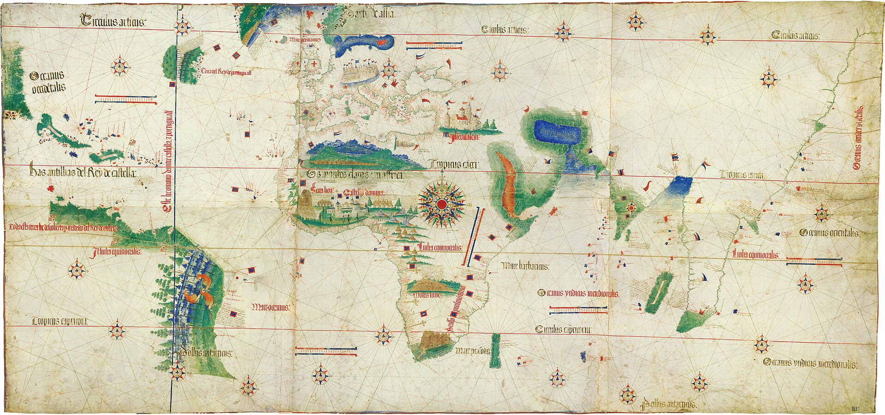
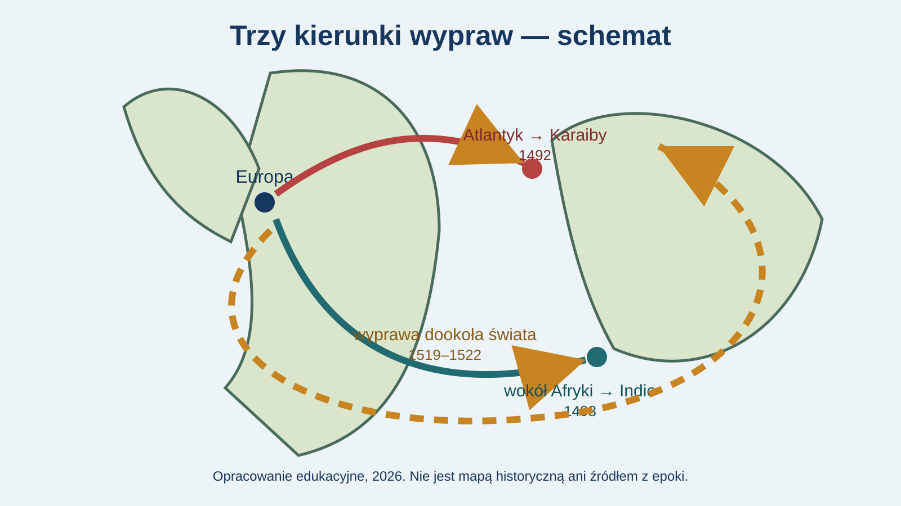

# Wielkie odkrycia geograficzne

Klasa VI · Lekcja 1: przyczyny i kierunki

notes:
„Odkrycie” jest nazwą używaną w historii Europy; ziemie, do których przybywali Europejczycy, były zamieszkane przez wiele społeczności.

---

<!-- .slide: class="question-slide" -->
## Po co płynąć tam, gdzie nie ma znanej drogi?

Zapisz **dwie możliwe przyczyny**.

notes:
Zbierz hipotezy, bez oceniania. Wróć do nich w podsumowaniu.

---

<!-- .slide: class="context-slide" -->
## Co ułatwiło wyprawy?

- statki oceaniczne
- nawigacja
- mapy i porty
- inwestorzy oraz władcy

notes:
Sama ciekawość nie wystarczała: wyprawa wymagała wiedzy, pieniędzy i organizacji.

---

<!-- .slide: class="context-slide" -->
## Czego szukano?

- drogi do rynków Azji
- przypraw i jedwabiu
- nowych możliwości handlu

notes:
Nie przedstawiaj jednej przyczyny jako wyjaśnienia wszystkich wypraw.

---

<!-- .slide: class="map-slide" -->
źródło z epoki · 1502

## Co widzisz na tej mapie?

notes:
Pytaj o kształt lądów, linie na oceanie i róże wiatrów. Nie wymagaj odczytywania drobnego tekstu.

---

<!-- .slide: class="source-slide" -->
## Obserwacja ≠ wniosek

**Obserwacja:** „Widzę wiele linii na oceanie.”

**Wniosek:** „Mapa pomagała żeglarzom wyznaczać kierunek.”

notes:
Pokaż różnicę między tym, co widoczne, a tym, co wymaga dodatkowej wiedzy.

---

<!-- .slide: class="compare-slide" -->
## Trzy kierunki — schemat

notes:
To współczesne opracowanie, nie mapa historyczna. Daty sprawdź w `sources.md` przed lekcją.

---

<!-- .slide: class="student-task" -->
## Zadanie w parach

**„Płynięto, aby…, a trudność stanowiło…”**

notes:
Daj 4 minuty. Wsparcie: bank słów z karty pracy.

---

<!-- .slide: class="exit-ticket-slide" -->
## Bilet wyjścia

Jedna przyczyna. Jeden kierunek. Jedno pytanie do mapy.

notes:
Kryterium: połączenie przyczyny, kierunku i dowodu.