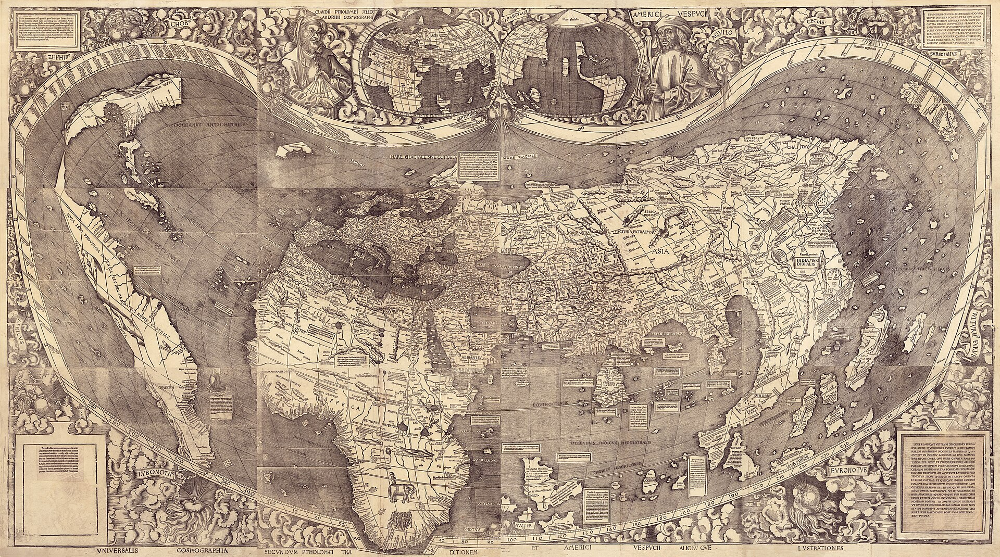
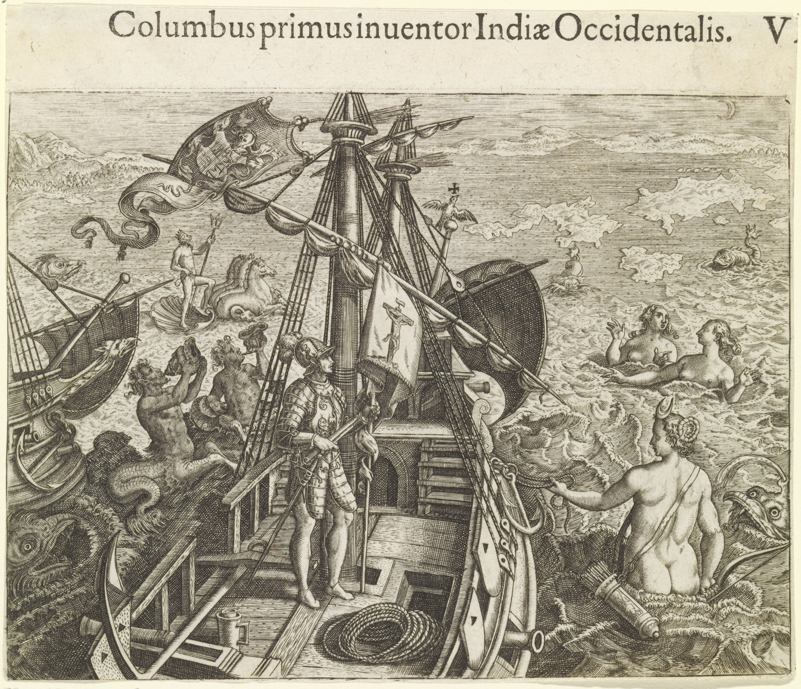
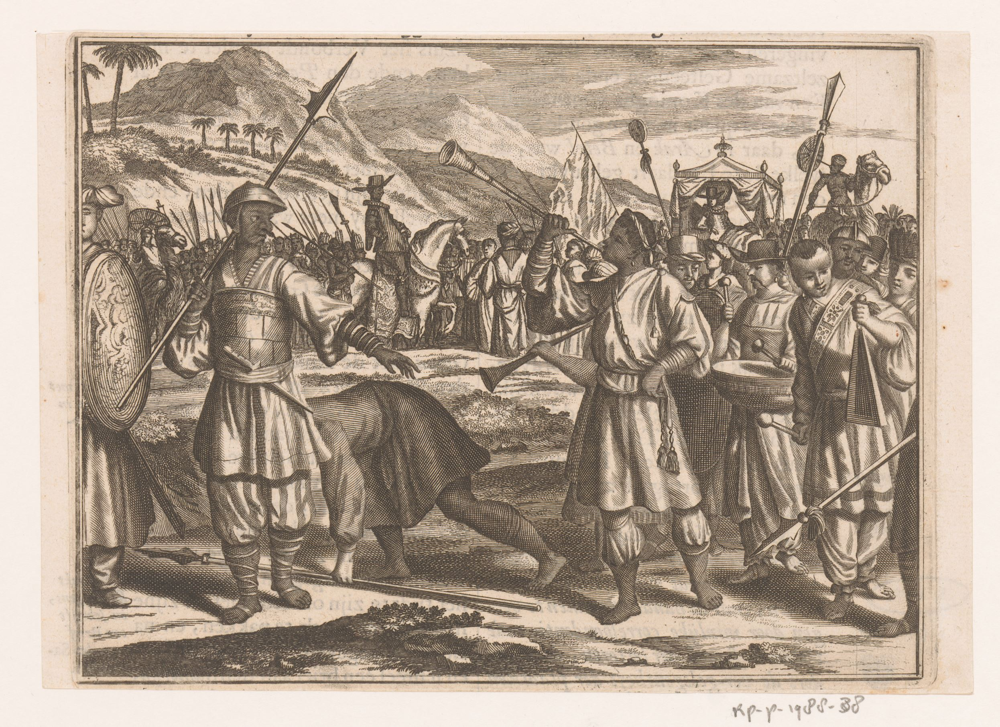

# Wielkie odkrycia geograficzne

Klasa VI · Lekcja 2: wyprawy i spotkanie światów

notes:
Omawiamy europejskie wyprawy, ale nie zaczynamy historii lądów od chwili przybycia Europejczyków.

---

<!-- .slide: class="question-slide" -->
## „Nowy” dla kogo?

Dokończ zdanie: **„Odkrycie może znaczyć…”**

notes:
Nie oczekuj definicji. Uruchom różne perspektywy przed pracą z mapą.

---

<!-- .slide: id="chronologia-wypraw" class="context-slide timeline-slide" -->
## Daty kontrolne

<lesson-timeline>
  <lesson-event year="1492">Kolumb dociera do Karaibów</lesson-event>
  <lesson-event year="1498">Vasco da Gama dociera do Indii</lesson-event>
  <lesson-event year="1507">Mapa Waldseemüllera</lesson-event>
  <lesson-event year="1519–1522">Wyprawa Magellana i Elcano</lesson-event>
</lesson-timeline>

notes:
Daty są punktami orientacyjnymi, nie pełną opowieścią. Sprawdź je przed lekcją w podręczniku.

---

<!-- .slide: class="map-slide" -->
źródło z epoki · 1507

## Mapa Waldseemüllera

notes:
Pytaj o elementy łatwe do rozpoznania oraz o pytania, które budzi mapa. Nie wymagaj odczytywania łacińskich podpisów.

---

<!-- .slide: class="source-slide portrait-source" -->
## Rycina o Kolumbie — źródło późniejsze

notes:
Ta rycina powstała w 1594 r., ponad 100 lat po wyprawie z 1492 r. Nie jest „fotografią” wydarzenia. Zapytaj: co artysta chciał pokazać i czego z obrazu nie możemy pewnie wywnioskować?

---

<!-- .slide: class="source-slide" -->
## Spotkanie przedstawione po latach

notes:
Rycina przedstawia spotkanie, ale została wykonana w 1672 r. Zwróć uwagę na teatralną kompozycję, stroje i gesty. Traktuj ją jako późniejsze przedstawienie, nie dosłowny zapis wydarzenia.

---

<!-- .slide: id="galeria-rycin" class="source-slide gallery-slide" -->
## Galeria późniejszych przedstawień

<lesson-gallery aria-label="Dwie późniejsze ryciny o europejskich wyprawach">
  <figure data-gallery-item>
    
    <figcaption>de Bry, 1594 — przedstawienie Kolumba.</figcaption>
  </figure>
  <figure data-gallery-item>
    
    <figcaption>Appelmans, 1672 — przedstawienie spotkania w Kalikacie.</figcaption>
  </figure>
</lesson-gallery>

notes:
Na komputerze najedź na wybraną rycinę; na klawiaturze przejdź Tabem, potem użyj strzałek. Na ekranie dotykowym dotknij obrazu. Każda rycina powstała później niż przedstawiane wydarzenia — pytaj, jak wpływa to na jej wiarygodność.

---

<!-- .slide: class="source-slide" -->
## Co mapa może powiedzieć?

- jak przedstawiano świat
- jakie nazwy stosowano
- co uznawano za ważne

notes:
Mapa nie daje bezpośredniego głosu każdej społeczności, której dotyczy.

---

<!-- .slide: class="compare-slide" -->
## Trzy perspektywy

| Żeglarz | Kupiec | Mieszkaniec zamieszkanego lądu |
|---|---|---|
| podróż | handel | spotkanie przybyszów |

notes:
To uproszczenie do rozmowy. Nie przypisuj wszystkim osobom jednej reakcji.

---

<!-- .slide: class="student-task" -->
## Dopowiedz słowo

„Dla europejskiego żeglarza było to…, ale dla ludzi mieszkających tam było to…”

notes:
Pary zapisują dwa różne końce zdania.

---

<!-- .slide: class="exit-ticket-slide" -->
## Bilet wyjścia

Dlaczego słowo **„odkrycie”** potrzebuje dopowiedzenia?

notes:
Sprawdź rozumienie perspektyw, bez wymagania szczegółowej chronologii.
