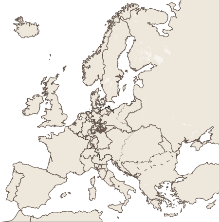

# Karta pracy: Kongres wiedeński

Imię i nazwisko: ________________________________  Klasa: ______  Data: __________

## 1. Chronologia: kongres trwa, Napoleon wraca
Wpisz numery od 1 do 5. Następnie podkreśl wydarzenie, które nastąpiło **po podpisaniu aktu końcowego kongresu**.

- ___ Napoleon opuszcza Elbę i ląduje we Francji.
- ___ Rozpoczynają się obrady w Wiedniu.
- ___ Napoleon przegrywa pod Waterloo.
- ___ Zostaje podpisany akt końcowy kongresu.
- ___ Napoleon abdykuje w 1814 r. i trafia na Elbę.

## 2. Mapa decyzji
Na mapie wpisz:
- **N** — Królestwo Niderlandów;
- **ZN** — Związek Niemiecki;
- **KP** — Królestwo Polskie;
- **W** — obszar dominacji Austrii w północnych Włoszech.

## 3. Dyplomaci przy mapie
Wybierz **cztery** decyzje. W kolumnie „zasada” użyj: **legitymizm**, **restauracja**, **równowaga europejska**. Jeśli pasują dwie zasady, wpisz obie i uzasadnij.

| Decyzja | Zasada | Kto zyskał lub jaki problem rozwiązano? |
|---|---|---|
| Burbonowie wracają na trony Francji i Hiszpanii. |  |  |
| Powstaje silne Królestwo Niderlandów na północ od Francji. |  |  |
| Zamiast zjednoczonych Niemiec powstaje Związek Niemiecki. |  |  |
| Prusy otrzymują ziemie nad Renem i część Saksonii. |  |  |
| Większość Księstwa Warszawskiego staje się Królestwem Polskim połączonym z Rosją. |  |  |
| Austria odzyskuje wpływy w północnych Włoszech. |  |  |

Przy jednej wybranej decyzji dopisz: **czy lepiej pokazuje zasadę, czy interes mocarstwa? Dlaczego?**

____________________________________________________________________________

____________________________________________________________________________

## 4. Ziemie polskie po 1815 r.
Uzupełnij zdania.

1. Większość Księstwa Warszawskiego utworzyła ________________________________, którego królem został car Rosji.
2. Zachodnia część z Poznaniem przypadła __________________ jako ________________________________________.
3. Kraków i okolice utworzyły ______________________________________ pod protektoratem Rosji, Prus i Austrii.
4. Kongres nie odbudował ______________________________ Polski.

## 5. Bilet wyjścia
W trzech zdaniach omów decyzje kongresu: podaj jedną dotyczącą Europy, jedną dotyczącą ziem polskich i wyjaśnij, którą zasadę widać w jednej z nich.

____________________________________________________________________________

____________________________________________________________________________

____________________________________________________________________________

### Pomoc
- „Decyzja dotycząca Europy polegała na…”
- „W sprawie ziem polskich postanowiono…”
- „Widać tu zasadę…, ponieważ…”

### Dla chętnych
Wskaż jedną decyzję, w której interes mocarstwa okazał się ważniejszy niż deklarowana zasada. Uzasadnij.
