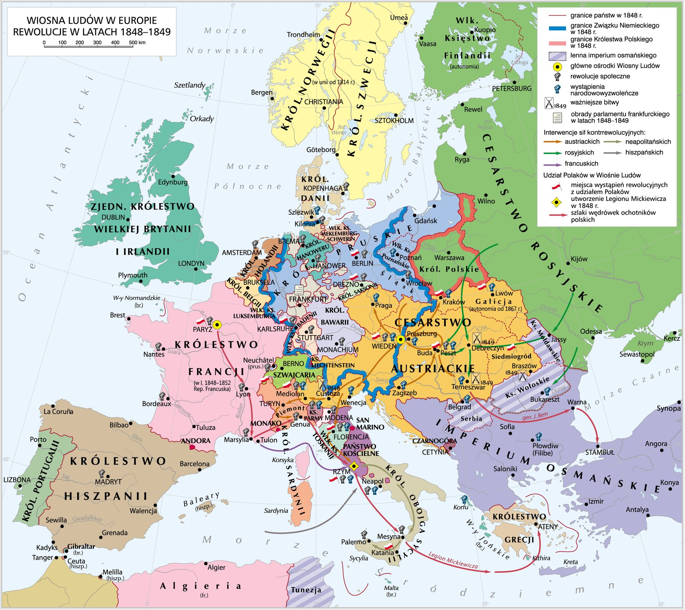
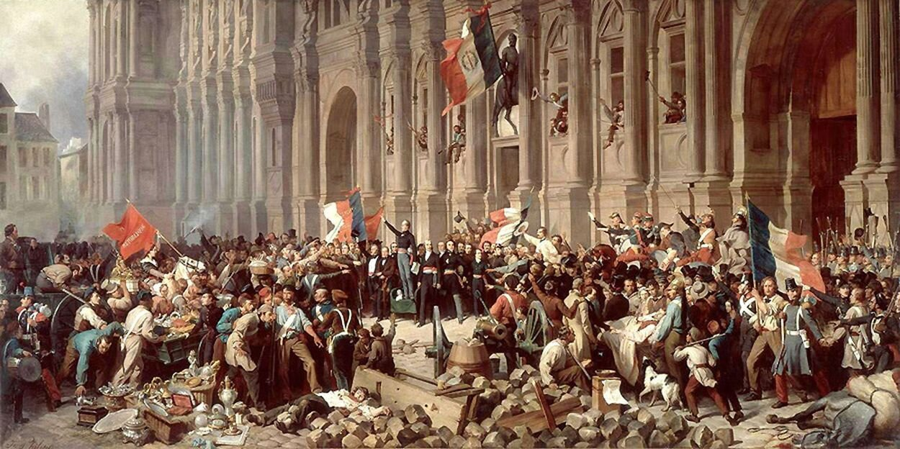
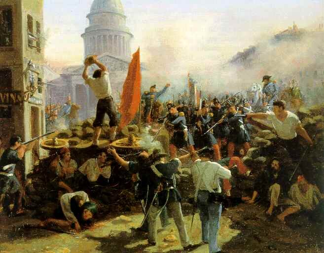
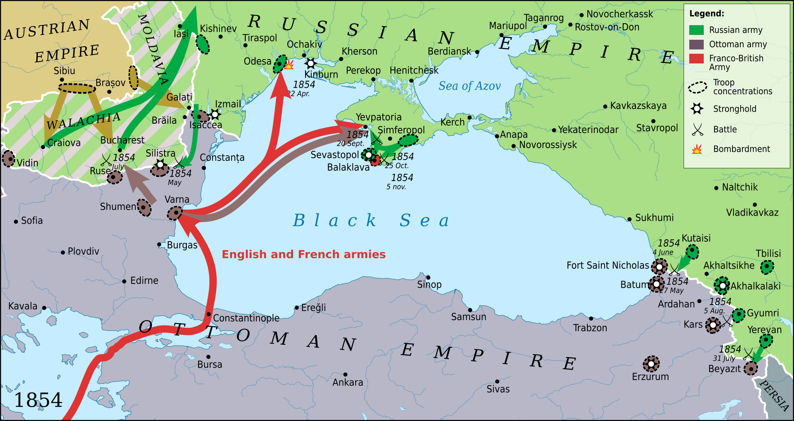

<!-- .slide: id="otwarcie" class="opening-slide rebellion-hero" data-purpose="opening" data-layout="hero-source" -->

Eugène Delacroix, 1830 · późniejsze przedstawienie rewolucji lipcowej<h1>Przeciwko Świętemu Przymierzu</h1>
Dlaczego Europa buntowała się przeciw porządkowi po 1815 r.?

notes:
Zacznij: „Czy po wojnie można przywrócić dawny porządek tak, aby wszyscy go zaakceptowali?” Daj parom 30 sekund na odpowiedź. Obraz pokazuje rewolucję lipcową 1830 r., a nie Wiosnę Ludów.

---

<!-- .slide: id="os-czasu" class="timeline-slide" data-purpose="explanation" data-layout="timeline-band" -->
## Od buntu do wojny: najważniejsza chronologia

<b>1820–1821</b>Hiszpania i Włochy

<b>1825</b>dekabryści w Rosji

<b>1830</b>Francja, Belgia i ziemie polskie

<b>1848–1849</b>Wiosna Ludów

<b>1853–1856</b>wojna krymska

Ład wiedeński trwał, ale od początku wywoływał opór.

notes:
Nie traktuj tej osi jako listy do wykucia. Uczniowie mają zobaczyć ciąg: najpierw lokalne bunty, potem fala ogólnoeuropejska, a następnie osłabienie współpracy mocarstw w wojnie krymskiej.

---

<!-- .slide: id="opór" class="map-slide" data-purpose="explanation" data-layout="map-focus" -->
## Pierwsze uderzenia w ład wiedeński

<figure class="source-figure"><figcaption>Mapa późniejszej fali rewolucji pomaga zlokalizować obszary buntu.</figcaption></figure><aside class="analysis-panel">
<b>Włochy i Hiszpania:</b> żądania konstytucji, sprzeciw wobec absolutyzmu.

<b>Rosja:</b> sprzeciw młodych oficerów wobec samowładztwa.

<b>Belgia:</b> walka o oddzielenie od Holandii.

<b>Ziemie polskie:</b> dążenie do odzyskania niepodległości.
</aside>

notes:
Pokaż na mapie Francję, ziemie niemieckie, Austrię, Włochy i Węgry. Dla wydarzeń wcześniejszych użyj jej tylko jako orientacji przestrzennej; data i zakres są podane na osi.

---

<!-- .slide: id="dekabrysci" data-purpose="explanation" data-layout="split" -->
## Rosja: powstanie dekabrystów (1825)

<b>młodzi oficerowie</b><small>znali idee wolnościowe z Europy</small>→<b>grudzień 1825</b><small>próba buntu w Petersburgu</small>→<b>klęska i represje</b><small>carska władza nie zgodziła się na reformy</small>

<strong>Dekabryści</strong> — rosyjscy oficerowie domagający się zmian ustrojowych; część chciała zlikwidować monarchię i wprowadzić republikę.

notes:
Wyjaśnij termin samowładztwo: car skupiał niemal całą władzę w państwie. Powstanie nie było masowym ruchem całego społeczeństwa; szybko je stłumiono, a przywódców stracono lub zesłano.

---

<!-- .slide: id="francja-1830" class="source-slide" data-purpose="evidence" data-layout="source-split" -->
## Francja 1830: rewolucja lipcowa

<figure class="source-figure"><figcaption>Delacroix, 1830 — dzieło malarskie, nie fotografia.</figcaption></figure><aside class="analysis-panel">
<b>Karol X</b> ograniczał wolność prasy i prawa wyborcze.

<b>27–29 VII:</b> walki na barykadach w Paryżu.

<b>Skutek:</b> Karol X abdykuje.

<b>Ludwik Filip</b> zostaje „królem Francuzów”.
</aside>

notes:
Ciekawostka: trzy dni walk nazwano „trzema dniami chwały”. Podkreśl, że Delacroix wykorzystał symbolicznie przedstawioną Wolność; to obraz o wydarzeniu, nie dosłowny reportaż.

---

<!-- .slide: id="burzuazja" data-purpose="explanation" data-layout="comparison" -->
## Kto zyskał po 1830 r.?

<strong>BURŻUAZJA</strong>zamożni mieszczanie umocnili wpływ na państwo<b>największy zysk polityczny</b>

<strong>ROBOTNICY</strong>trudne warunki pracy i mały wpływ na politykę<b>niewiele zmian</b>

<strong>NAJBIEDNIEJSI</strong>bez powszechnego prawa wyborczego<b>poza decyzjami</b>

Zmiana władcy nie oznaczała jeszcze demokracji dla wszystkich.

notes:
Wyjaśnij, że burżuazja to nie „wszyscy mieszkańcy miast”, lecz przede wszystkim zamożna warstwa miejska. W monarchii lipcowej prawo wyborcze nadal zależało od majątku.

---

<!-- .slide: id="wiosna-definicja" class="dark-statement" data-purpose="explanation" data-layout="statement" -->
## Co nazywamy Wiosną Ludów?

<strong>Wiosna Ludów</strong> to fala rewolucji i wystąpień narodowych w Europie w latach <strong>1848–1849</strong>.

więcej prawlepsze warunki życianiepodległość lub zjednoczenie

„Wiosna” oznaczała nadzieję na zmianę, nie porę roku.

notes:
Nie przedstawiaj Wiosny Ludów jako jednego powstania dowodzonego przez jedną osobę. W różnych krajach ludzie mieli różne cele, ale fala wydarzeń rozlała się po Europie.

---

<!-- .slide: id="przyczyny" data-purpose="explanation" data-layout="matrix" -->
## Dlaczego wybuchła Wiosna Ludów?

<b>WIEŚ</b><strong>pańszczyzna</strong>→
uwłaszczenie chłopów

<b>MIASTA</b><strong>kryzys i bezrobocie</strong>→
praca i płace

<b>POLITYKA</b><strong>ograniczone prawa</strong>→
konstytucja, prasa, wybory

<b>NARODY</b><strong>brak własnego państwa</strong>→
niepodległość lub zjednoczenie

notes:
Powiedz wyraźnie: jedna przyczyna nie wyjaśnia całej Europy. We Francji szczególnie ważne były kryzys i prawa polityczne; w monarchii Habsburgów także sprawy narodowe i chłopskie.

---

<!-- .slide: id="mechanizm" data-purpose="explanation" data-layout="process" -->
## Wiosna Ludów: przyczyny → przebieg → skutki

<b>kryzys społeczny i polityczny</b><small>drożyzna, bezrobocie, brak praw</small>→<b>rewolucje 1848–1849</b><small>barykady, manifesty, parlamenty, powstania</small>→<b>część reform zostaje</b><small>m.in. uwłaszczenie w monarchii Habsburgów; większość rewolucji przegrywa</small>

Klęska militarna nie zawsze oznaczała powrót do dawnego życia.

notes:
To główna grafika porządkująca lekcję. Poproś uczniów o wskazanie jednej przyczyny i jednego skutku, które są ze sobą logicznie połączone.

---

<!-- .slide: id="francja-1848" class="map-slide" data-purpose="explanation" data-layout="source-split" -->
## Francja 1848: od monarchii do republiki

<figure class="source-figure"><figcaption>Wiec pod paryskim ratuszem — ilustracja z materiału ZPE.</figcaption></figure><aside class="analysis-panel">
<b>luty:</b> upada monarchia Ludwika Filipa.

<b>Rząd Tymczasowy</b> ogłasza II Republikę.

wprowadzono powszechne prawo wyborcze dla dorosłych mężczyzn.

utworzono warsztaty narodowe dla bezrobotnych.
</aside>

notes:
Pokaż na mapie Europy Francję jako miejsce, z którego rewolucyjna wiadomość szybko rozchodziła się dalej. Ciekawostka: we Francji od 1848 r. głosować mogli wszyscy dorośli mężczyźni, ale kobiety nadal nie miały praw wyborczych.

---

<!-- .slide: id="francja-czerwiec" class="source-slide" data-purpose="explanation" data-layout="source-split" -->
## Paryż: spór o pracę i władzę

<figure class="source-figure"><figcaption>Barykada w Paryżu, 1848 r. — źródło ilustracyjne ZPE.</figcaption></figure><aside class="analysis-panel">
zamknięcie warsztatów narodowych wywołało <b>powstanie robotników w czerwcu</b>.

wojsko stłumiło walki na barykadach.

<b>grudzień 1848:</b> prezydentem wybrano Ludwika Napoleona Bonapartego.

W 1852 r. został cesarzem Napoleonem III.
</aside>

notes:
Zestaw dwa fakty: republika dała szerokie prawa wyborcze mężczyznom, ale konflikt społeczny nie zniknął. Ludwik Napoleon był bratankiem Napoleona I — to ważna ciekawostka wyjaśniająca siłę jego nazwiska.

---

<!-- .slide: id="europa-1848" class="map-slide" data-purpose="explanation" data-layout="split" -->
## Wiosna Ludów: gdzie i o co walczono?

<figure class="source-figure"><figcaption>Krystian Chariza i zespół, „Wiosna Ludów w Europie. Rewolucje 1848–1849”, CC BY-SA 3.0.</figcaption></figure><aside class="analysis-panel">
<b>Francja:</b> republika i szersze prawa wyborcze.

<b>Prusy:</b> konstytucja i reformy.

<b>Austria:</b> obalenie wpływów Metternicha; zniesienie pańszczyzny.

<b>Węgry:</b> większa samodzielność.

<b>Włochy:</b> walka z Austrią i dążenie do zjednoczenia.
</aside>

<b>Wskaż na mapie dwa z wymienionych miejsc.</b> Powiedz, czego domagali się tam ludzie.

notes:
Najpierw wskaż Francję jako początek fali, potem Prusy, Austrię, Węgry i państwa włoskie. Nie wymagaj odtwarzania całej legendy mapy. Uczniowie mają połączyć miejsce z jednym jasnym celem. „Niemcy” i „Włochy” nie były jeszcze zjednoczonymi państwami.

---

<!-- .slide: id="bilans" data-purpose="synthesis" data-layout="comparison" -->
## Bilans Wiosny Ludów

<h3>STŁUMIONO</h3>
większość rewolucji

dążenia Węgier i Włoch

<b>1848–1849</b>porażka wystąpień ≠ brak zmian

<h3>POZOSTAŁO</h3>
republika we Francji

zniesienie pańszczyzny i idee zjednoczenia

Wiosna Ludów nie spełniła wszystkich nadziei, ale zmieniła Europę.

notes:
Nie mów: „Wiosna Ludów całkowicie się nie udała”. To zbyt proste. Rozróżnij porażkę wielu powstań od trwałych reform społecznych i długiego wpływu idei narodowych.

---

<!-- .slide: id="krym" class="map-slide" data-purpose="explanation" data-layout="source-split" -->
## Wojna krymska (1853–1856)

<figure class="source-figure"><figcaption>Mapa działań wojennych w 1854 r.; opracowanie współczesne.</figcaption></figure><aside class="analysis-panel">
<b>Przyczyny:</b> rywalizacja Rosji i Turcji o wpływy na Bałkanach oraz spór o opiekę nad miejscami świętymi.

<b>Przebieg:</b> przeciw Rosji wystąpiły Turcja, Francja, Wielka Brytania i Sardynia; główne walki toczyły się na Krymie.

<b>Skutki:</b> pokój paryski osłabił Rosję i zakończył współpracę Rosji, Austrii i Prus w dawnym kształcie.
</aside>

notes:
Na mapie wskaż Krym i Morze Czarne. Doprecyzuj, że Austria nie walczyła po stronie aliantów, lecz jej postawa izolowała Rosję. Ciekawostka: wojna krymska przyczyniła się do rozwoju nowoczesnego pielęgniarstwa dzięki działalności Florence Nightingale.

---

<!-- .slide: id="podsumowanie" class="dark-statement" data-purpose="synthesis" data-layout="takeaways" -->
## Najważniejsze informacje

<b>1815+</b>Święte Przymierze broniło monarchii i ładu wiedeńskiego przed rewolucjami.

<b>1820–1830</b>Włochy, Hiszpania, dekabryści, Belgowie i Polacy występowali przeciw absolutyzmowi lub obcemu panowaniu.

<b>1830</b>We Francji upadł Karol X; Ludwik Filip oparł rządy na zamożnej burżuazji.

<b>1848</b>Wiosnę Ludów wywołały pańszczyzna, kryzys, żądania robotników, praw obywatelskich i celów narodowych.

<b>1848–1849</b>Rewolucje objęły Francję, Prusy, Austrię, Węgry i Włochy; większość została stłumiona.

<b>SKUTKI</b>Zniesiono pańszczyznę w monarchii Habsburgów, a idee zjednoczenia Włoch i Niemiec przetrwały.

<b>1853–1856</b>Wojna krymska osłabiła Rosję i dawną współpracę mocarstw.

notes:
Zakończenie do powiedzenia: „Ład wiedeński miał zatrzymać rewolucje. Nie zdołał jednak zatrzymać ani pragnienia wolności, ani pytań o to, kto ma prawo decydować o państwie.”

---

<!-- .slide: id="bilet" data-purpose="exit-ticket" data-layout="plain" -->
## Bilet wyjścia

Wybierz jedno wydarzenie z lat <b>1825–1856</b>.
<ol><li><b>Przyczyna</b>Przeciw czemu wystąpili ludzie lub państwa?</li><li><b>Skutek</b>Co zmieniło się po wydarzeniu?</li><li><b>Wniosek</b>Co wydarzenie mówi o trwałości ładu wiedeńskiego?</li></ol>

3 minuty · użyj jednej daty i jednego pojęcia z lekcji

notes:
Poproś o zdania przyczyna → wydarzenie → skutek. Model odpowiedzi oraz punktacja są w assessment.md, nie w prezentacji ucznia.
