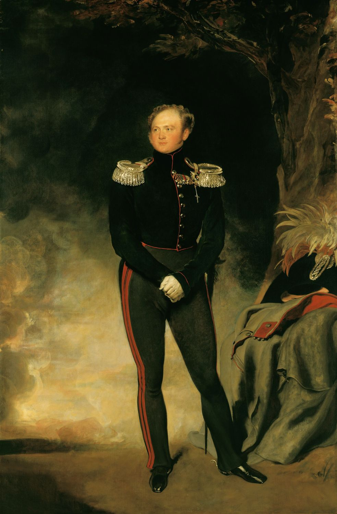
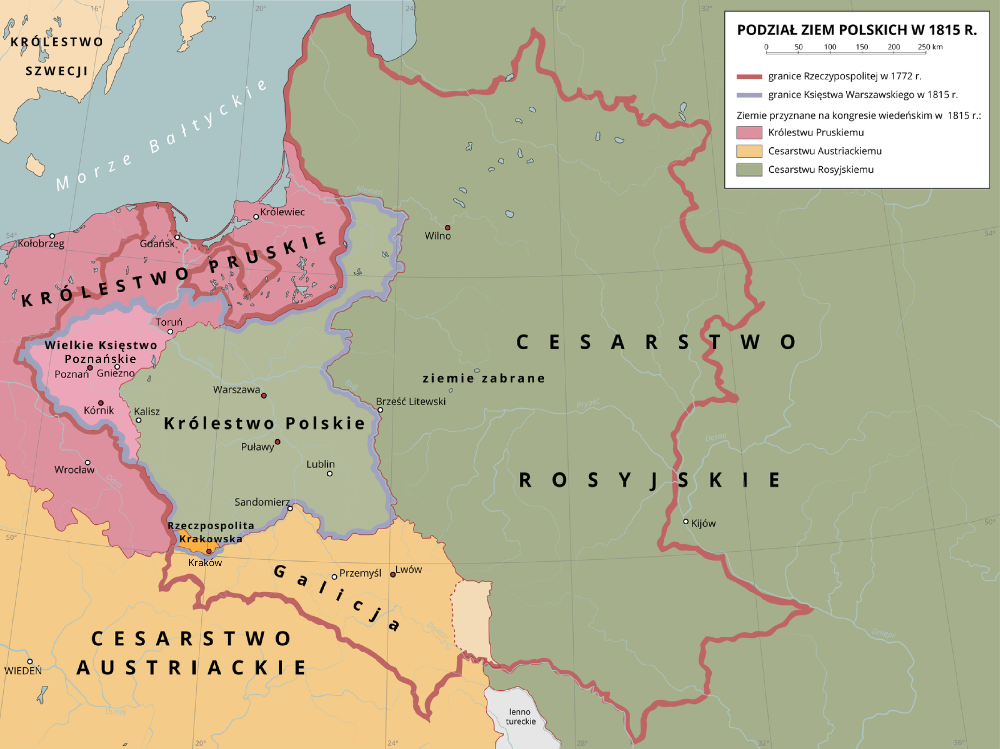
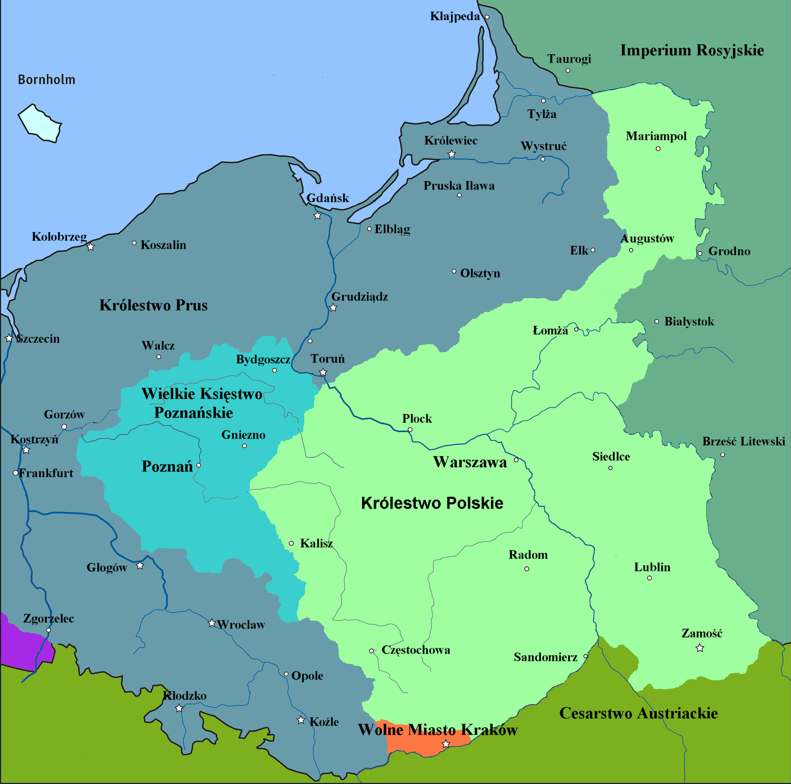
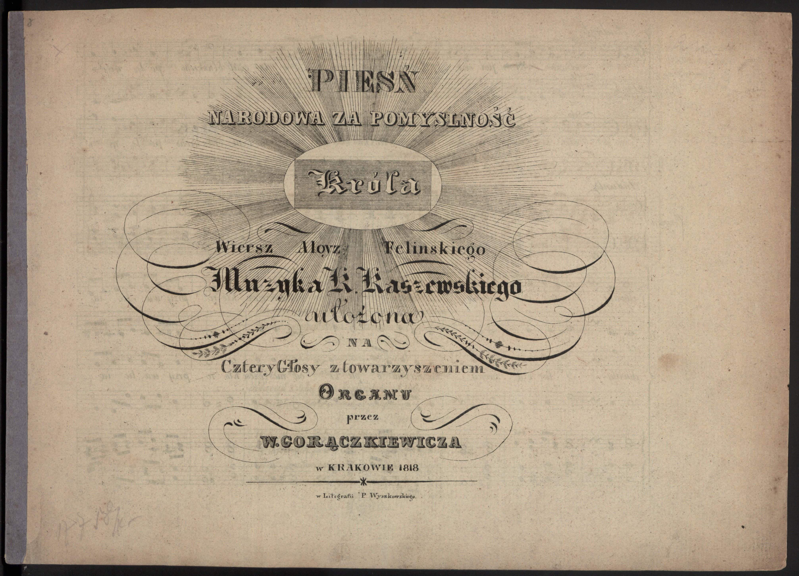
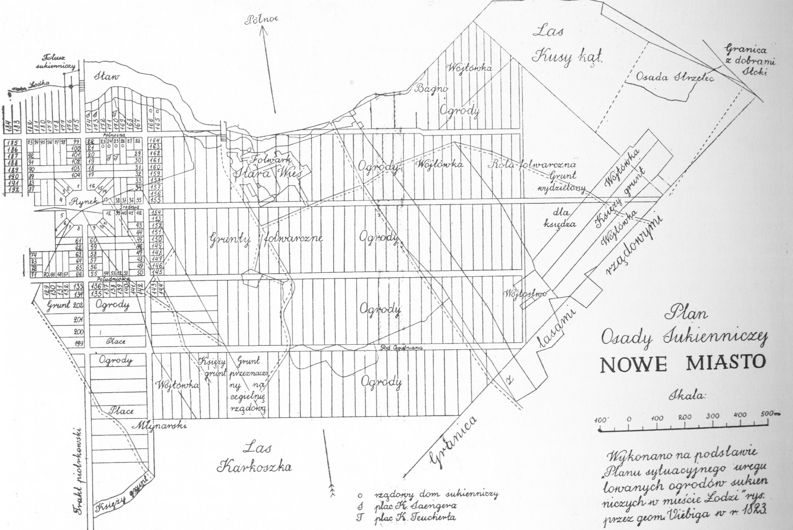
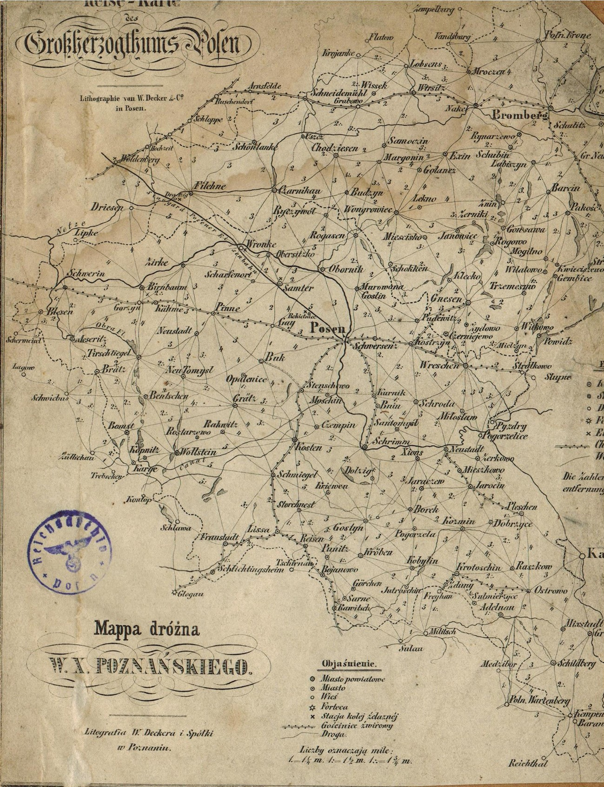
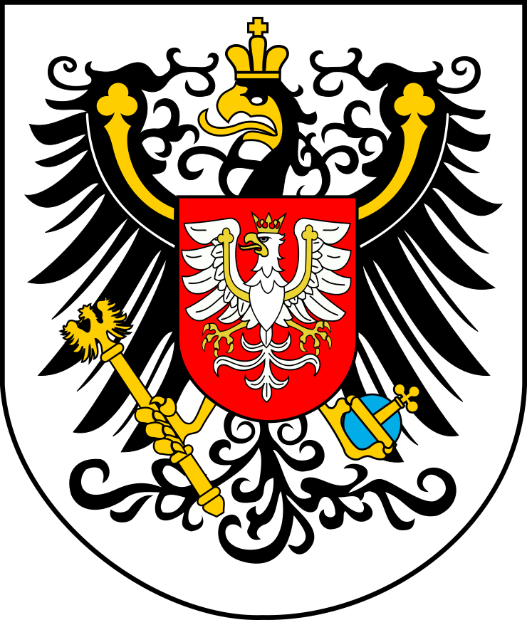
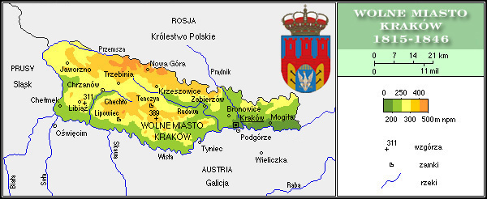

<!-- .slide: id="otwarcie" data-purpose="opening" data-layout="hero-source" -->

HISTORIA · KLASA VII
<h1>Po upadku Księstwa Warszawskiego</h1>
Trzy ziemie. Ile samodzielności?
<small>Aleksander I — od 1815 r. car Rosji i król Polski. Portret z epoki.</small>

notes:
Zacznij: „Gdy państwo znika z mapy, czy jego mieszkańcy mogą nadal sami o sobie decydować?” Portret Lawrence’a z lat 1814–1818 przedstawia Aleksandra I. Nie jest ilustracją obrad kongresu. Dziś zbadamy trzy różne rozwiązania; mapa pojawi się raz, na kolejnym slajdzie.

---

<!-- .slide: id="podzial" data-purpose="evidence" data-layout="map-focus" data-goals="G1" -->
<figure class="wide-map"></figure>
notes:
Po klęsce Napoleona zlikwidowano Księstwo Warszawskie. Większość jego ziem weszła do Królestwa Polskiego złączonego z Rosją; zachodnia część utworzyła Poznańskie w Prusach; Kraków z okolicą otrzymał osobny status. Część ziem wróciła bezpośrednio do Prus i Austrii. Czerwona linia na mapie to granica Rzeczypospolitej z 1772 r., nie Księstwa Warszawskiego.

---

<!-- .slide: id="mapa-uczniow" data-purpose="practice" data-layout="activity-brief" data-goals="G1" -->
## Zaznacz trzy obszary

<ol><li>Na otrzymanej <strong>mapie konturowej</strong> oznacz trzy ziemie różnymi barwami.</li><li>Podpisz <strong>Warszawę, Poznań i Kraków</strong>.</li><li>Dodaj legendę.</li></ol>
3 min w parach · potem porównaj z poprzednim slajdem

notes:
Rozdaj przygotowane przez nauczyciela kontury z granicami po 1815 r. Daj 3 min pracy w parach, 2 min sprawdzenia ze slajdem i minutę omówienia. Jeśli konturów nie ma, uczniowie wskazują obszary na mapie ZPE i szkicują ich układ bez udawania dokładnych granic.

---

<!-- .slide: id="krolestwo" data-purpose="explanation" data-layout="split" data-goals="G2" -->
## Królestwo Polskie: własna nazwa, wspólny monarcha

<figure></figure>

<strong>Stolica:</strong> Warszawa.

<strong>Unia personalna:</strong> jedna osoba była carem Rosji i królem Polski.

<strong>Aleksander I</strong> został królem w 1815 r.

<strong>Konstytucja:</strong> ustawa o ustroju i prawach.

notes:
Unia personalna nie znaczy, że oba państwa były tym samym. Królestwo miało własną konstytucję, sejm, administrację i wojsko, lecz nie było niezależne. Konstytucję nadano w listopadzie 1815 r.

---

<!-- .slide: id="kto-rzadzil" data-purpose="explanation" data-layout="split" data-goals="G2" -->
## Kto decydował w Królestwie?

<h3>Król</h3>
Mianował urzędników, zwoływał sejm i dowodził wojskiem; uczestniczył w stanowieniu praw.

<h3>Namiestnik</h3>
<strong>Józef Zajączek</strong> zastępował króla (1815–1826).

<h3>Wpływ poza urzędem</h3>
Wielki książę <strong>Konstanty</strong> silnie wpływał na rządy i wojsko.

notes:
Król miał szerokie, lecz konstytucyjnie opisane uprawnienia. Konstanty był bratem cara, nie namiestnikiem; jego faktyczny wpływ wykraczał poza formalne dowództwo wojska. Portret monarchy pokazano na otwarciu; tutaj rozróżniamy formalne urzędy i faktyczny wpływ.

---

<!-- .slide: id="konstytucja" data-purpose="explanation" data-layout="comparison" data-goals="G2" -->
## Konstytucja Królestwa Polskiego · 1815

<h3>Gwarantowane prawa</h3><ul><li><strong>Równość wobec prawa.</strong></li><li><strong>Wolność osobista, religii i druku.</strong></li><li><strong>Nietykalność osobista</strong> — ochrona przed bezprawnym aresztowaniem.</li></ul>
<strong>Język polski</strong> w urzędach i szkołach.

<h3>Sejm · władza ustawodawcza</h3>
Król<b aria-hidden="true">+</b>Senat<b aria-hidden="true">+</b>Izba poselska

Uchwalał prawo i decydował o <strong>podatkach oraz budżecie</strong>.

<h3>Rada Administracyjna</h3>
Pełniła funkcje rządu.

<h3>Obietnica a praktyka</h3>
Rosnąca ingerencja monarchy; cenzura od 1819 r.; po obradach w 1820 r. sejm zwołano dopiero w 1825 r.

notes:
Konstytucję nadano 27 listopada 1815 r. Równość oznacza tu ochronę prawa bez różnicy stanu, nie powszechne prawo wyborcze. Religia katolicka miała szczególną opiekę rządu, przy zagwarantowanej wolności innych wyznań; nie utożsamiaj tego z pełną współczesną równością praw politycznych wszystkich wyznań. Nietykalność chroniła przed zatrzymaniem poza przypadkami i formami określonymi prawem. Polski był językiem urzędów i nauczania. W miniukładzie król jest jednym z trzech składników sejmu, NIE trzecią izbą: sejm miał dwie izby, senat i izbę poselską. Król miał inicjatywę ustawodawczą i sankcjonował ustawy; sejm nie decydował niezależnie od niego. Konstytucja określała udział sejmu w uchwalaniu podatków i budżetu. Rada Administracyjna z namiestnikiem i ministrami pełniła funkcje rządu pod władzą monarchy. „Cenzura prewencyjna” to kontrola tekstu przed publikacją. Naruszenia gwarancji narastały; nie twierdź, że wszystkie prawa przestały istnieć już w dniu nadania konstytucji.

---

<!-- .slide: id="piesn" data-purpose="evidence" data-layout="source-split" data-goals="G2" -->
## „Boże, coś Polskę…” · tekst z 1816 r.

<figure><figcaption>Karta tytułowa druku z 1818 r.; nie tekst z gazety z 1816 r.</figcaption></figure>
<blockquote>„Boże! Coś Polskę przez tak liczne wieki / Otaczał blaskiem potęgi i chwały […] / Naszego Króla zachowaj nam Panie!”</blockquote>
Wersja ogłoszona w 1816 r. prosiła o pomyślność <strong>Aleksandra I</strong>.

Później słowa pieśni zmieniano.

notes:
Cytat z tekstu ogłoszonego w „Gazecie Warszawskiej” 20 lipca 1816 r. Obok jest późniejsza karta tytułowa z 1818 r. — nie przedstawiaj jej jako gazety. Zapytaj, kto był „naszym królem” w 1816 r. Nie podstawiaj późniejszego refrenu „Ojczyznę wolną racz nam wrócić”.

---

<!-- .slide: id="krolestwo-gospodarka" data-purpose="explanation" data-layout="split" data-goals="G2" -->
## Królestwo: rolnictwo i nowe ośrodki przemysłu

<figure><figcaption>Plan Łodzi, 1823 r.</figcaption></figure>

Większość mieszkańców żyła z <strong>rolnictwa</strong>.

W latach 20. XIX w. wspierano <strong>przemysł i handel</strong>; rozwijała się Łódź.

Towarzystwo Kredytowe Ziemskie (1825) i Bank Polski (1828) ułatwiały finansowanie gospodarki.

notes:
Plan pokazuje Łódź u progu rozwoju, a nie wielkie miasto przemysłowe już w 1815 r. Ksawery Drucki-Lubecki wspierał zmiany gospodarcze w latach 20. Daty instytucji finansowych są późniejsze od kongresu wiedeńskiego.

---

<!-- .slide: id="poznanskie" data-purpose="explanation" data-layout="split" data-goals="G3" -->
## Wielkie Księstwo Poznańskie: część Prus

<figure></figure>

<strong>Ośrodek:</strong> Poznań; zwierzchnikiem był król Prus.

<strong>Autonomia:</strong> obiecana, ograniczona samodzielność w obrębie Prus.

Ważne decyzje administracyjne zależały od Berlina.

notes:
Autonomia nie oznacza pełnej niepodległości. Antoni Henryk Radziwiłł jako książę-namiestnik pełnił głównie funkcje reprezentacyjne, podczas gdy administracją kierował naczelny prezes mianowany przez rząd pruski. To mapa historyczna, nie skan mapy z 1815 r.

---

<!-- .slide: id="poznanskie-herb" data-purpose="evidence" data-layout="split" data-goals="G3" -->
## Herb Poznańskiego: dwa znaki na jednej tarczy

<figure><figcaption>Współczesne opracowanie herbu, nie oryginał z 1815 r.</figcaption></figure>

<strong>Czarny orzeł:</strong> znak Prus.

<strong>Biały orzeł na małej tarczy:</strong> znak polski.

Co takie połączenie mówi o położeniu księstwa?

notes:
Ciekawostka: polski znak mieści się na piersi pruskiego orła — księstwo było częścią Prus. Grafika przedstawia tradycyjny skład herbu, ale nie dowodzi formalnej daty przyjęcia konkretnego wzoru.

---

<!-- .slide: id="poznanskie-praktyka" data-purpose="explanation" data-layout="split" data-goals="G3" -->
## Poznańskie: obietnica a codzienność

<h3>Język w urzędach</h3>
Zapowiadano miejsce dla <strong>języka polskiego</strong>; w praktyce niemiecki miał coraz silniejszą pozycję.

<h3>1823 · wieś</h3>
Gospodarkę opierało głównie <strong>rolnictwo</strong>; rozszerzano reformy na wsi.

<h3>1827 · sejm</h3>
<strong>Sejm Prowincjonalny</strong> był zgromadzeniem doradczym. W tym roku obradował po raz pierwszy.

notes:
Nie mów „jedynym językiem urzędowym był niemiecki” dla całego okresu 1815–1830. Zapowiedź dwujęzyczności i praktyka urzędowa rozmijały się. Sejm nie obradował już w 1815 r. i nie uchwalał samodzielnie praw.

---

<!-- .slide: id="krakow" data-purpose="explanation" data-layout="split" data-goals="G3" -->
## Wolne Miasto Kraków: małe i nadzorowane

<figure></figure>

<strong>Protektorat:</strong> „opieka” i kontrola Rosji, Prus i Austrii.

<strong>Republika:</strong> zamiast króla — własne organy władzy.

<strong>Zgromadzenie Reprezentantów</strong> i <strong>Senat Rządzący</strong>; ich swobodę ograniczały mocarstwa.

notes:
Protektorat oznacza zewnętrzny nadzór mimo własnych instytucji. Nie nazywaj Krakowa w pełni niepodległą Polską. Osobna mapka pomaga zobaczyć mały obszar niewidoczny na mapie całych ziem.

---

<!-- .slide: id="krakow-gospodarka" data-purpose="explanation" data-layout="split" data-goals="G3" -->
## Kraków: handel na styku trzech państw

<h3>Miasto</h3>
<strong>Handel i rzemiosło.</strong> Położenie na styku trzech państw sprzyjało wymianie towarów.

<h3>Okręg</h3>
Okolice utrzymywały się także z <strong>rolnictwa</strong>.

„Wolne” w nazwie nie znaczyło wolne od obcego nadzoru.

notes:
Nie udało się potwierdzić historycznej daty przyjęcia konkretnego wzoru flagi Wolnego Miasta, dlatego jej nie pokazujemy. Mapę obszaru pokazano raz na poprzednim slajdzie. Miasto i wiejski okręg miały różne zajęcia gospodarcze.

---

<!-- .slide: id="porownanie" data-purpose="synthesis" data-layout="comparison" data-goals="G2 G3" -->
## Trzy ziemie — trzy zakresy samodzielności

Ziemia

Władza zewnętrzna

Własne instytucje

Królestwo

car jako król

konstytucja, sejm, wojsko

Poznańskie

król Prus / Berlin

ograniczone; sejm doradczy od 1827

Kraków

Rosja, Prusy, Austria

zgromadzenie i senat pod nadzorem

W parach uzupełnij tabelę w karcie pracy: obietnica, praktyka, gospodarka.

notes:
Daj 4 min w parach na tabelę i 4 min na omówienie. To nie ranking wolności: zależności miały różny charakter. Notatka graficzna: trzy kolumny, znaki korony, orła i trzech strzałek, a pod nimi „na papierze / w praktyce”.

---

<!-- .slide: id="podsumowanie" data-purpose="synthesis" data-layout="takeaways" data-goals="G1 G2 G3" -->
## Co pozostało po Księstwie?

<strong>1815:</strong> nowe granice i trzy różne rozwiązania.

<strong>Podobieństwo:</strong> każda ziemia zależała od obcej władzy.

<strong>Różnica:</strong> własne prawa i instytucje miały różny zakres — i działały inaczej, niż obiecywano.

notes:
Ciekawostka: pieśń pochwalna dla cara-króla z czasem zyskała patriotyczny refren. Druga: Kraków miał własny senat, choć nadzorowały go aż trzy mocarstwa. Zapytaj, gdzie różnica między nazwą a rzeczywistością jest największa.

---

<!-- .slide: id="bilet" data-purpose="exit-ticket" data-layout="activity-brief" data-goals="G1 G2 G3" -->
## Bilet wyjścia: trzy zdania

<ol><li>Podaj jedną zmianę na mapie po 1815 r.</li><li>Podaj jeden przykład różnicy między obietnicą a praktyką.</li><li>Kto nadzorował Wolne Miasto Kraków?</li></ol>
Samodzielnie · 3 min

notes:
Na ostatnie 3 min zbierz odpowiedzi. Przykład 1: większość Księstwa weszła do Królestwa; 2: obietnica wolności druku i późniejsza cenzura; 3: Rosja, Prusy i Austria. Nie wymagaj wszystkich dat gospodarczych.

---

<!-- .slide: id="zrodla" data-purpose="reference" data-layout="plain" -->
## Źródła do tej lekcji

<ul><li>ZPE: „Decyzje kongresu wiedeńskiego w sprawie polskiej” — mapa.</li><li>ZPE: materiały o konstytucji, Poznańskiem i gospodarce.</li><li>Wikimedia Commons / Polona: mapy szczegółowe, portret, herb, druk pieśni.</li><li>Pełne adresy i atrybucje: <code>sources.md</code>.</li></ul>

notes:
Wskazane materiały ZPE /b/ posłużyły za punkt wyjścia; szczegóły sprawdzono w dostępnych pełnych tekstach. Nie przenosimy opisów gospodarki z połowy XIX wieku do roku 1815. Pełna lista źródeł i ograniczeń przy plikach w sources.md.
