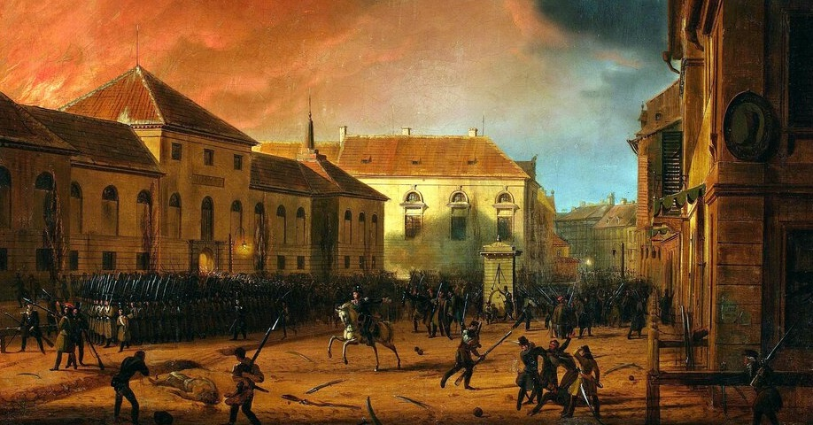
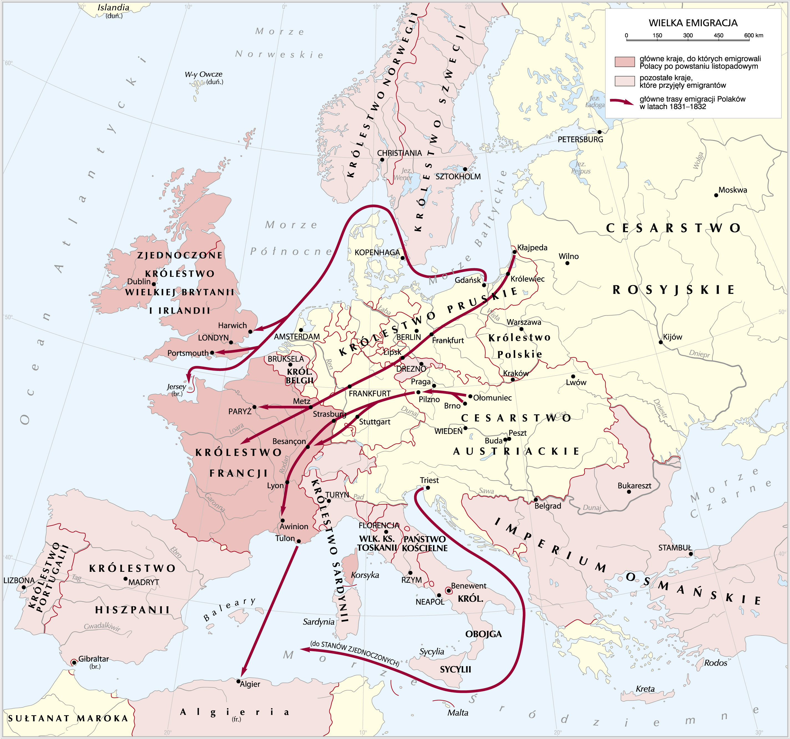
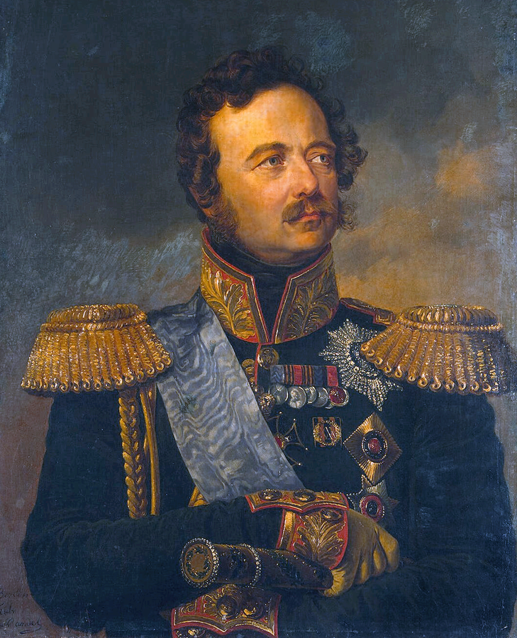
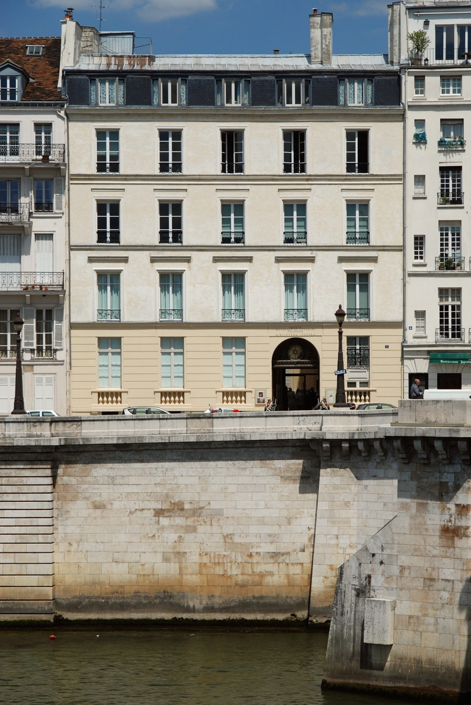
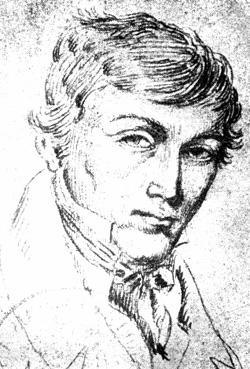
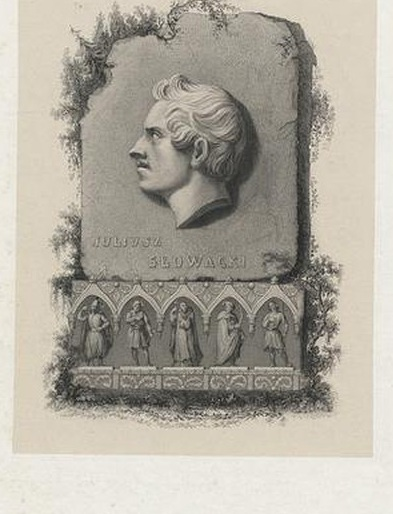
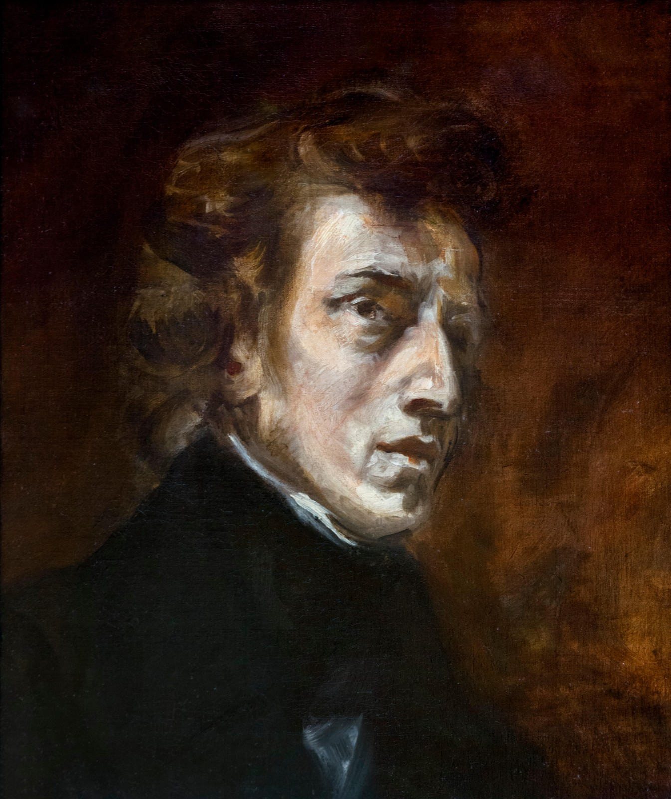
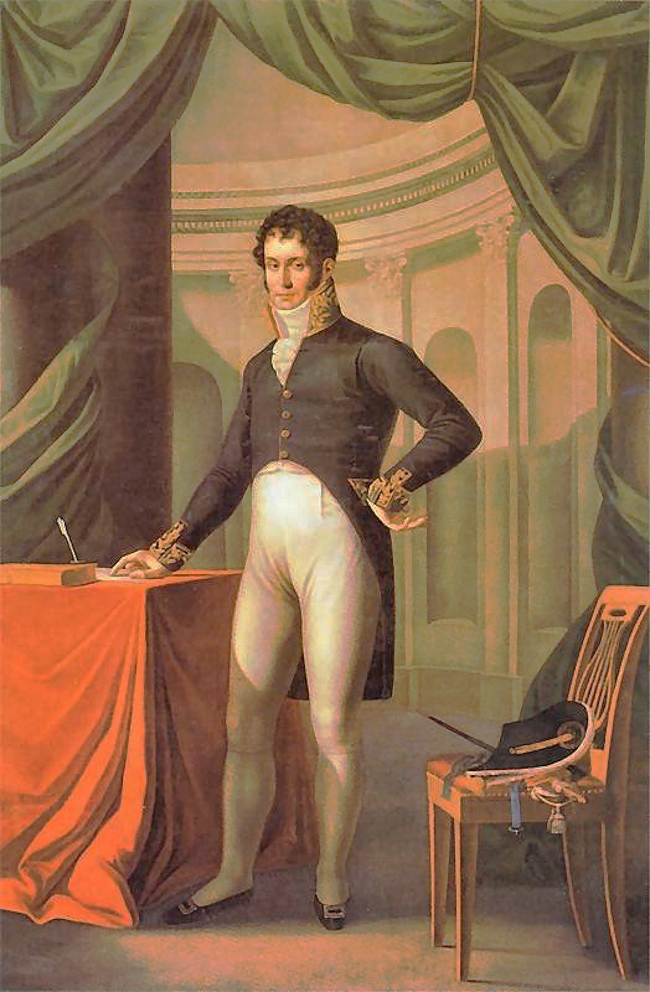
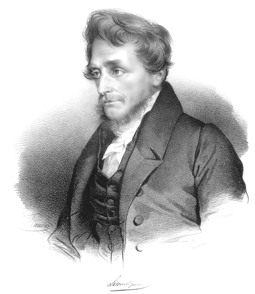

<!-- .slide: id="otwarcie" data-purpose="opening" data-layout="split" -->
<div class="opening-grid"><div><p class="eyebrow">Historia · klasa VII</p><h1>Wielka Emigracja. Polacy po powstaniu listopadowym</h1><p class="opening-question">Jak działać dla Polski, gdy nie można do niej wrócić?</p></div><figure class="source-figure"><figcaption>Marcin Zaleski, Wzięcie Arsenału, 1831</figcaption></figure></div>

notes:
## Wielka Emigracja. Polacy po powstaniu listopadowym

**Dokładna treść slajdu:** Historia · klasa VII Wielka Emigracja. Polacy po powstaniu listopadowym Jak działać dla Polski, gdy nie można do niej wrócić? Marcin Zaleski, Wzięcie Arsenału, 1831

**Prowadzenie:** 30 s. Zacznij: „Przegrana nie zakończyła polskich dążeń do niepodległości. Jedni wyjechali, inni zostali pod rządami zaborców. Zobaczymy, jak nadal działali dla Polski”. Obraz z epoki przedstawia wydarzenie z 29 listopada 1830 r.; nie jest sceną emigracji.

**Obraz:** assets/arsenal.jpg; Zdobycie warszawskiego Arsenału w noc listopadową.


**Atrybucja i prawa:** Wzięcie Arsenału; Marcin Zaleski; 1831; wydarzenie29XI1830; domena publiczna (https://creativecommons.org/publicdomain/mark/1.0/). Źródło: https://zpe.gov.pl/a/przeczytaj/Du8MtYJOY; ID RFiQv6Gq1cEbm. Bez zmian treści.

**Kroje i prawa:** lokalne Source Sans 3 i Source Serif 4; licencje poniżej dotyczą osadzonych fontów, nie obrazów.

### sourcesans3 — SIL Open Font License1.1

https://raw.githubusercontent.com/google/fonts/main/ofl/sourcesans3/OFL.txt

```text
Copyright 2010-2020 Adobe (http://www.adobe.com/), with Reserved Font Name 'Source'. All Rights Reserved. Source is a trademark of Adobe in the United States and/or other countries.

This Font Software is licensed under the SIL Open Font License, Version 1.1.

This license is copied below, and is also available with a FAQ at: http://scripts.sil.org/OFL


-----------------------------------------------------------
SIL OPEN FONT LICENSE Version 1.1 - 26 February 2007
-----------------------------------------------------------

PREAMBLE
The goals of the Open Font License (OFL) are to stimulate worldwide
development of collaborative font projects, to support the font creation
efforts of academic and linguistic communities, and to provide a free and
open framework in which fonts may be shared and improved in partnership
with others.

The OFL allows the licensed fonts to be used, studied, modified and
redistributed freely as long as they are not sold by themselves. The
fonts, including any derivative works, can be bundled, embedded,
redistributed and/or sold with any software provided that any reserved
names are not used by derivative works. The fonts and derivatives,
however, cannot be released under any other type of license. The
requirement for fonts to remain under this license does not apply
to any document created using the fonts or their derivatives.

DEFINITIONS
"Font Software" refers to the set of files released by the Copyright
Holder(s) under this license and clearly marked as such. This may
include source files, build scripts and documentation.

"Reserved Font Name" refers to any names specified as such after the
copyright statement(s).

"Original Version" refers to the collection of Font Software components as
distributed by the Copyright Holder(s).

"Modified Version" refers to any derivative made by adding to, deleting,
or substituting -- in part or in whole -- any of the components of the
Original Version, by changing formats or by porting the Font Software to a
new environment.

"Author" refers to any designer, engineer, programmer, technical
writer or other person who contributed to the Font Software.

PERMISSION & CONDITIONS
Permission is hereby granted, free of charge, to any person obtaining
a copy of the Font Software, to use, study, copy, merge, embed, modify,
redistribute, and sell modified and unmodified copies of the Font
Software, subject to the following conditions:

1) Neither the Font Software nor any of its individual components,
in Original or Modified Versions, may be sold by itself.

2) Original or Modified Versions of the Font Software may be bundled,
redistributed and/or sold with any software, provided that each copy
contains the above copyright notice and this license. These can be
included either as stand-alone text files, human-readable headers or
in the appropriate machine-readable metadata fields within text or
binary files as long as those fields can be easily viewed by the user.

3) No Modified Version of the Font Software may use the Reserved Font
Name(s) unless explicit written permission is granted by the corresponding
Copyright Holder. This restriction only applies to the primary font name as
presented to the users.

4) The name(s) of the Copyright Holder(s) or the Author(s) of the Font
Software shall not be used to promote, endorse or advertise any
Modified Version, except to acknowledge the contribution(s) of the
Copyright Holder(s) and the Author(s) or with their explicit written
permission.

5) The Font Software, modified or unmodified, in part or in whole,
must be distributed entirely under this license, and must not be
distributed under any other license. The requirement for fonts to
remain under this license does not apply to any document created
using the Font Software.

TERMINATION
This license becomes null and void if any of the above conditions are
not met.

DISCLAIMER
THE FONT SOFTWARE IS PROVIDED "AS IS", WITHOUT WARRANTY OF ANY KIND,
EXPRESS OR IMPLIED, INCLUDING BUT NOT LIMITED TO ANY WARRANTIES OF
MERCHANTABILITY, FITNESS FOR A PARTICULAR PURPOSE AND NONINFRINGEMENT
OF COPYRIGHT, PATENT, TRADEMARK, OR OTHER RIGHT. IN NO EVENT SHALL THE
COPYRIGHT HOLDER BE LIABLE FOR ANY CLAIM, DAMAGES OR OTHER LIABILITY,
INCLUDING ANY GENERAL, SPECIAL, INDIRECT, INCIDENTAL, OR CONSEQUENTIAL
DAMAGES, WHETHER IN AN ACTION OF CONTRACT, TORT OR OTHERWISE, ARISING
FROM, OUT OF THE USE OR INABILITY TO USE THE FONT SOFTWARE OR FROM
OTHER DEALINGS IN THE FONT SOFTWARE.
```

### sourceserif4 — SIL Open Font License1.1

https://raw.githubusercontent.com/google/fonts/main/ofl/sourceserif4/OFL.txt

```text
Copyright 2014 The Source Serif 4 Project Authors (https://github.com/adobe-fonts/source-serif)

This Font Software is licensed under the SIL Open Font License, Version 1.1.
This license is copied below, and is also available with a FAQ at:
https://openfontlicense.org


-----------------------------------------------------------
SIL OPEN FONT LICENSE Version 1.1 - 26 February 2007
-----------------------------------------------------------

PREAMBLE
The goals of the Open Font License (OFL) are to stimulate worldwide
development of collaborative font projects, to support the font creation
efforts of academic and linguistic communities, and to provide a free and
open framework in which fonts may be shared and improved in partnership
with others.

The OFL allows the licensed fonts to be used, studied, modified and
redistributed freely as long as they are not sold by themselves. The
fonts, including any derivative works, can be bundled, embedded,
redistributed and/or sold with any software provided that any reserved
names are not used by derivative works. The fonts and derivatives,
however, cannot be released under any other type of license. The
requirement for fonts to remain under this license does not apply
to any document created using the fonts or their derivatives.

DEFINITIONS
"Font Software" refers to the set of files released by the Copyright
Holder(s) under this license and clearly marked as such. This may
include source files, build scripts and documentation.

"Reserved Font Name" refers to any names specified as such after the
copyright statement(s).

"Original Version" refers to the collection of Font Software components as
distributed by the Copyright Holder(s).

"Modified Version" refers to any derivative made by adding to, deleting,
or substituting -- in part or in whole -- any of the components of the
Original Version, by changing formats or by porting the Font Software to a
new environment.

"Author" refers to any designer, engineer, programmer, technical
writer or other person who contributed to the Font Software.

PERMISSION & CONDITIONS
Permission is hereby granted, free of charge, to any person obtaining
a copy of the Font Software, to use, study, copy, merge, embed, modify,
redistribute, and sell modified and unmodified copies of the Font
Software, subject to the following conditions:

1) Neither the Font Software nor any of its individual components,
in Original or Modified Versions, may be sold by itself.

2) Original or Modified Versions of the Font Software may be bundled,
redistributed and/or sold with any software, provided that each copy
contains the above copyright notice and this license. These can be
included either as stand-alone text files, human-readable headers or
in the appropriate machine-readable metadata fields within text or
binary files as long as those fields can be easily viewed by the user.

3) No Modified Version of the Font Software may use the Reserved Font
Name(s) unless explicit written permission is granted by the corresponding
Copyright Holder. This restriction only applies to the primary font name as
presented to the users.

4) The name(s) of the Copyright Holder(s) or the Author(s) of the Font
Software shall not be used to promote, endorse or advertise any
Modified Version, except to acknowledge the contribution(s) of the
Copyright Holder(s) and the Author(s) or with their explicit written
permission.

5) The Font Software, modified or unmodified, in part or in whole,
must be distributed entirely under this license, and must not be
distributed under any other license. The requirement for fonts to
remain under this license does not apply to any document created
using the Font Software.

TERMINATION
This license becomes null and void if any of the above conditions are
not met.

DISCLAIMER
THE FONT SOFTWARE IS PROVIDED "AS IS", WITHOUT WARRANTY OF ANY KIND,
EXPRESS OR IMPLIED, INCLUDING BUT NOT LIMITED TO ANY WARRANTIES OF
MERCHANTABILITY, FITNESS FOR A PARTICULAR PURPOSE AND NONINFRINGEMENT
OF COPYRIGHT, PATENT, TRADEMARK, OR OTHER RIGHT. IN NO EVENT SHALL THE
COPYRIGHT HOLDER BE LIABLE FOR ANY CLAIM, DAMAGES OR OTHER LIABILITY,
INCLUDING ANY GENERAL, SPECIAL, INDIRECT, INCIDENTAL, OR CONSEQUENTIAL
DAMAGES, WHETHER IN AN ACTION OF CONTRACT, TORT OR OTHERWISE, ARISING
FROM, OUT OF THE USE OR INABILITY TO USE THE FONT SOFTWARE OR FROM
OTHER DEALINGS IN THE FONT SOFTWARE.
```

---

<!-- .slide: id="powstanie" data-purpose="explanation" data-layout="timeline-band" data-goals="G1" -->
<h2>Powstanie listopadowe: od nadziei do klęski</h2>
<div class="recap-top"><div><h3>Dlaczego?</h3><p>Car łamał konstytucję, działała cenzura i prześladowano opozycję. Spiskowcy obawiali się aresztowań.</p></div><div><h3>Kto?</h3><p><b>Piotr Wysocki</b> rozpoczął zryw podchorążych. <b>Józef Chłopicki</b>, pierwszy dyktator, próbował porozumienia z carem.</p></div></div><ol class="recap-axis"><li><b>29 XI 1830</b><span>Wybuch w Warszawie.</span></li><li><b>25 I 1831</b><span>Sejm pozbawił Mikołaja I polskiego tronu.</span></li><li><b>II–V 1831</b><span>Wojna z Rosją: Grochów, klęska pod Ostrołęką.</span></li><li><b>IX–X 1831</b><span>Upadek Warszawy i końcowy upadek powstania.</span></li></ol><p class="bottom-line">Przewaga Rosji, błędy dowódców i brak pomocy mocarstw → klęska, represje i emigracja.</p>

notes:
## Powstanie listopadowe: od nadziei do klęski

**Dokładna treść slajdu:** Powstanie listopadowe: od nadziei do klęski Dlaczego? Car łamał konstytucję, działała cenzura i prześladowano opozycję. Spiskowcy obawiali się aresztowań. Kto? Piotr Wysocki rozpoczął zryw podchorążych. Józef Chłopicki , pierwszy dyktator, próbował porozumienia z carem. 29 XI 1830 Wybuch w Warszawie. 25 I 1831 Sejm pozbawił Mikołaja I polskiego tronu. II–V 1831 Wojna z Rosją: Grochów, klęska pod Ostrołęką. IX–X 1831 Upadek Warszawy i końcowy upadek powstania. Przewaga Rosji, błędy dowódców i brak pomocy mocarstw → klęska, represje i emigracja.

**Prowadzenie:** 2 min 30 s. Zapytaj: „Przeciw czyjej władzy wystąpili powstańcy? Co zmieniła klęska?”. Uzupełnij braki z wyświetlonego tekstu. Grochów 25 II, Ostrołęka 26 V; Warszawa upadła we wrześniu, ostatnie oddziały i twierdze w październiku. Nie utożsamiaj upadku stolicy z końcem wszystkich walk. G1: przyczyna i następstwo.

**Obrazy:** brak; układ tekstowy.

---

<!-- .slide: id="wyjazd" data-purpose="explanation" data-layout="statement" data-goals="G1" -->
<h2>Wielka Emigracja: wyjazd z powodów politycznych</h2>
<p class="lead">Po klęsce 1831 r. wielu Polaków wyjechało na Zachód, by uniknąć kar i dalej działać dla niepodległości.</p><div class="definition"><p><b>Emigracja</b> — opuszczenie ojczyzny i zamieszkanie za granicą.</p><p><b>Wielka Emigracja</b> — emigracja polityczna po powstaniu listopadowym, ważna dla polskiej polityki i kultury.</p></div><p>Wyjeżdżali żołnierze, politycy, pisarze i inni działacze. „Wielka” oznacza przede wszystkim jej znaczenie, nie największą liczbę emigrantów.</p><p class="bottom-line">Nie myl jej z późniejszymi masowymi wyjazdami za pracą.</p>

notes:
## Wielka Emigracja: wyjazd z powodów politycznych

**Dokładna treść slajdu:** Wielka Emigracja: wyjazd z powodów politycznych Po klęsce 1831 r. wielu Polaków wyjechało na Zachód, by uniknąć kar i dalej działać dla niepodległości. Emigracja — opuszczenie ojczyzny i zamieszkanie za granicą. Wielka Emigracja — emigracja polityczna po powstaniu listopadowym, ważna dla polskiej polityki i kultury. Wyjeżdżali żołnierze, politycy, pisarze i inni działacze. „Wielka” oznacza przede wszystkim jej znaczenie, nie największą liczbę emigrantów. Nie myl jej z późniejszymi masowymi wyjazdami za pracą.

**Prowadzenie:** 60 s. Połącz strach przed represjami z możliwością swobodnej działalności za granicą. Nie sprowadzaj wszystkich emigrantów do arystokracji ani wszystkich wyjazdów XIX wieku do jednej przyczyny.

**Obrazy:** brak; układ tekstowy.

---

<!-- .slide: id="mapa" data-purpose="evidence" data-layout="evidence" data-goals="G1" -->


notes:
## Kierunki Wielkiej Emigracji

**Dokładna treść slajdu:** wyłącznie pełny obraz źródłowej mapy „Wielka Emigracja”; kierunki wyjazdów po1831 i ośrodki emigracji. Bez dodatkowego tekstu na obrazie.

**Prowadzenie:** 90 s. Mapa: Krystian Chariza i zespół, „Wielka Emigracja”, ZPE, RcBr6Rqq2VrtL, CC BY-SA 3.0. To opracowanie kartograficzne, nie mapa z epoki. Pokaż szlaki przez państwa niemieckie do Francji; wskaż Paryż — główne centrum, oraz Wielką Brytanię, Belgię i Szwajcarię. W razie potrzeby powiększ kliknięciem. Nie jest to mapa całej emigracji do 1914 r. Pełny obraz bez podpisu pozwala maksymalnie powiększyć legendę.

**Obraz:** assets/mapa-emigracji.jpg; Wielka Emigracja: kierunki wyjazdów Polaków po powstaniu listopadowym i ośrodki w Europie.


**Atrybucja i prawa:** Wielka Emigracja; Krystian Chariza i zespół; data publikacji figury nieustalona; CC BY-SA 3.0 (https://creativecommons.org/licenses/by-sa/3.0/). Źródło: https://zpe.gov.pl/a/na-europejskich-salonach-wielka-emigracja/D9Q9OKGPu; ID RcBr6Rqq2VrtL. Bez zmian treści.

---

<!-- .slide: id="represje" data-purpose="explanation" data-layout="split" data-goals="G1" -->
<h2>Królestwo Polskie: car ogranicza odrębność</h2>
<div class="repression-grid"><div><dl class="dates"><dt>1832</dt><dd><b>Statut Organiczny</b> zastąpił konstytucję. Zlikwidowano sejm i odrębne wojsko.</dd><dt>1833</dt><dd><b>Stan wojenny</b>: większa władza wojska i sądów wojskowych.</dd><dt>1837</dt><dd>Województwa przemianowano na <b>gubernie</b> — rosyjską nazwę jednostek administracji.</dd><dt>1847</dt><dd>Ogłoszono kodeks karny oparty na rosyjskim; obowiązywał od 1848 r.</dd></dl></div><div><figure class="source-figure"><figcaption>Iwan Paskiewicz, namiestnik Królestwa</figcaption></figure><p class="portrait-mini">Rządził w imieniu cara i nadzorował represje.</p></div></div><p class="bottom-line">Więzienia, zsyłki i konfiskaty majątków. <b>Kontrybucja</b> — przymusowa opłata nałożona przez zwycięzcę.</p>

notes:
## Królestwo Polskie: car ogranicza odrębność

**Dokładna treść slajdu:** Królestwo Polskie: car ogranicza odrębność 1832 Statut Organiczny zastąpił konstytucję. Zlikwidowano sejm i odrębne wojsko. 1833 Stan wojenny : większa władza wojska i sądów wojskowych. 1837 Województwa przemianowano na gubernie — rosyjską nazwę jednostek administracji. 1847 Ogłoszono kodeks karny oparty na rosyjskim; obowiązywał od 1848 r. Iwan Paskiewicz, namiestnik Królestwa Rządził w imieniu cara i nadzorował represje. Więzienia, zsyłki i konfiskaty majątków. Kontrybucja — przymusowa opłata nałożona przez zwycięzcę.

**Prowadzenie:** 120 s. „Namiestnik” to zastępca władcy. Autonomia oznacza własne instytucje w państwie zależnym; Statut nie zlikwidował od razu wszystkich odrębności. Gubernie w 1837 były przemianowaniem województw, nie nową mapą granic. Kodeks z 1847 to dostosowany kodeks rosyjski z 1845, z mocą od 1 I 1848. Konfiskata: odebranie majątku przez państwo; zsyłka: przymusowy wyjazd do odległej części imperium.

**Obraz:** assets/paskiewicz.png; Iwan Paskiewicz w mundurze i z odznaczeniami.


**Atrybucja i prawa:** Portret Iwana Paskiewicza; Friedrich Randel; około1830; domena publiczna (https://creativecommons.org/publicdomain/mark/1.0/). Źródło: https://zpe.gov.pl/a/przeczytaj/DnEUgMmvy; ID R1GkiwNEgZ4Ru. Bez zmian treści.

---

<!-- .slide: id="zabory" data-purpose="explanation" data-layout="comparison" data-goals="G1" -->
<h2>Ograniczanie polskiej kultury — dwa różne zabory</h2>
<div class="comparison-grid"><div><h3>Władze rosyjskie</h3><p><b>Rusyfikacja</b>: narzucanie języka i kultury rosyjskiej.</p><ul><li>Uniwersytet Warszawski zamknięto w <b>1831 r.</b>; rozwiązano Towarzystwo Przyjaciół Nauk.</li><li>Uniwersytet Wileński zamknięto w <b>1832 r.</b> Wilno leżało na ziemiach zabranych, poza Królestwem.</li></ul></div><div><h3>Władze pruskie</h3><p><b>Germanizacja</b>: narzucanie języka i kultury niemieckiej.</p><ul><li>Wprowadzano język niemiecki do urzędów.</li><li>Karano wielkopolskich uczestników powstania, m.in. konfiskatami majątków.</li></ul></div></div><p class="bottom-line"><b>„Noc paskiewiczowska” (1831–1856)</b> to przenośna nazwa okresu represji w Królestwie, a nie jednej nocy.</p>

notes:
## Ograniczanie polskiej kultury — dwa różne zabory

**Dokładna treść slajdu:** Ograniczanie polskiej kultury — dwa różne zabory Władze rosyjskie Rusyfikacja : narzucanie języka i kultury rosyjskiej. Uniwersytet Warszawski zamknięto w 1831 r. ; rozwiązano Towarzystwo Przyjaciół Nauk. Uniwersytet Wileński zamknięto w 1832 r. Wilno leżało na ziemiach zabranych, poza Królestwem. Władze pruskie Germanizacja : narzucanie języka i kultury niemieckiej. Wprowadzano język niemiecki do urzędów. Karano wielkopolskich uczestników powstania, m.in. konfiskatami majątków. „Noc paskiewiczowska” (1831–1856) to przenośna nazwa okresu represji w Królestwie, a nie jednej nocy.

**Prowadzenie:** 110 s. Nie przypisuj Prusom Statutu Organicznego, Paskiewicza ani rosyjskich guberni. Wilno należało do Imperium Rosyjskiego bezpośrednio, Warszawa do Królestwa zależnego od Rosji. Paskiewicz został namiestnikiem w 1832, a tradycyjną nazwą „noc paskiewiczowska” obejmujemy represje od klęski 1831 do 1856. Nie rozszerzaj całego XIX-wiecznego Kulturkampfu na lata 1830.

**Obrazy:** brak; układ tekstowy.

---

<!-- .slide: id="paryz" data-purpose="explanation" data-layout="split" data-goals="G3" -->
<h2>Paryż: polskie życie poza ojczyzną</h2>
<div class="person-grid"><figure class="source-figure"><figcaption>Biblioteka Polska w Paryżu, fotografia współczesna</figcaption></figure><div><p class="lead">Główne centrum Wielkiej Emigracji.</p><p>Tu powstawały organizacje polityczne, polska prasa i książki. Działały szkoły i stowarzyszenia pomocy.</p><p class="fact"><b>1838</b><br>Założono Bibliotekę Polską. Gromadzono książki i pamiątki, aby chronić polską kulturę.</p><p>Nie wszyscy mieszkali w Paryżu: emigranci żyli także w innych miastach i państwach.</p></div></div>

notes:
## Paryż: polskie życie poza ojczyzną

**Dokładna treść slajdu:** Paryż: polskie życie poza ojczyzną Biblioteka Polska w Paryżu, fotografia współczesna Główne centrum Wielkiej Emigracji. Tu powstawały organizacje polityczne, polska prasa i książki. Działały szkoły i stowarzyszenia pomocy. 1838 Założono Bibliotekę Polską. Gromadzono książki i pamiątki, aby chronić polską kulturę. Nie wszyscy mieszkali w Paryżu: emigranci żyli także w innych miastach i państwach.

**Prowadzenie:** 75 s. Ciekawostka 1: Biblioteka jako trwała instytucja, nie tylko zbiór dla jednego pisarza. Zdjęcie jest współczesne — nie pokazuje Paryża w 1838. Wskaż, jak brak cenzury ułatwiał wydawanie książek i sporów politycznych.

**Obraz:** assets/biblioteka.jpg; Fasada Biblioteki Polskiej w Paryżu nad Sekwaną.


**Atrybucja i prawa:** Paryż2011, Biblioteka Polska w Paryżu. Quai d’Orléans; oznaczenie źródłaZPE: Paryż2011; personalny autor niepodany; 2011; CC BY-SA 4.0 (https://creativecommons.org/licenses/by-sa/4.0/). Źródło: https://zpe.gov.pl/a/emigracja-polakow-w-xix-wieku/D1AdKA3qM; ID RkPsWcc2mVmVt. Zmniejszenie reprodukcji do maks.1600px (bez zmiany treści).

---

<!-- .slide: id="mickiewicz" data-purpose="explanation" data-layout="split" data-goals="G3" -->
<h2>Adam Mickiewicz</h2>
<div class="person-grid"><figure class="source-figure"><figcaption>Joachim Lelewel, Adam Mickiewicz, 1861</figcaption></figure><div><p class="role">Poeta romantyczny</p><p>Na emigracji pisał o ojczyźnie, tęsknocie i walce o wolność.</p><p class="work"><i>Pan Tadeusz</i><br>Paryż, <b>1834</b></p><p>Jego twórczość pomagała zachować polski język, pamięć i poczucie wspólnoty.</p></div></div>

notes:
## Adam Mickiewicz

**Dokładna treść slajdu:** Adam Mickiewicz Joachim Lelewel, Adam Mickiewicz, 1861 Poeta romantyczny Na emigracji pisał o ojczyźnie, tęsknocie i walce o wolność. Pan Tadeusz Paryż, 1834 Jego twórczość pomagała zachować polski język, pamięć i poczucie wspólnoty.

**Prowadzenie:** 30 s. Wyjaśnij „romantyczny”: epoka podkreślała uczucia, wolność i więź z narodem. Mickiewicz nie walczył w powstaniu listopadowym; nie nazywaj go żołnierzem uciekającym z pola bitwy. Reprodukcja niewielka w oryginale, ale liniowy portret jest czytelny; nie dopisuj nieznanego muzeum.

**Obraz:** assets/mickiewicz.jpg; Rysunkowy portret Adama Mickiewicza.


**Atrybucja i prawa:** Adam Mickiewicz; Joachim Lelewel; 1861; domena publiczna (https://creativecommons.org/publicdomain/mark/1.0/). Źródło: https://zpe.gov.pl/a/na-europejskich-salonach-wielka-emigracja/D9Q9OKGPu; ID RDoY9sV3kzQoo. Bez zmian treści.

---

<!-- .slide: id="slowacki" data-purpose="explanation" data-layout="split" data-goals="G3" -->
<h2>Juliusz Słowacki</h2>
<div class="person-grid"><figure class="source-figure"><figcaption>Antoni Oleszczyński, Juliusz Słowacki, 1852 — detal</figcaption></figure><div><p class="role">Poeta i autor dramatów</p><p>Pisał o losie Polski i pytaniu, jak walczyć o jej wolność.</p><p class="work"><i>Kordian</i><br>wydany w Paryżu, <b>1834</b></p><p>Żył m.in. we Francji i Szwajcarii. Jego utwory łączyły emigrantów z polską kulturą.</p></div></div>

notes:
## Juliusz Słowacki

**Dokładna treść slajdu:** Juliusz Słowacki Antoni Oleszczyński, Juliusz Słowacki, 1852 — detal Poeta i autor dramatów Pisał o losie Polski i pytaniu, jak walczyć o jej wolność. Kordian wydany w Paryżu, 1834 Żył m.in. we Francji i Szwajcarii. Jego utwory łączyły emigrantów z polską kulturą.

**Prowadzenie:** 30 s. Rycina jest pośmiertnym przedstawieniem popiersia, oparta na wzorze Władysława Oleszczyńskiego. To portret, nie fotografia poety. Słowacki opuścił Warszawę w marcu 1831 jeszcze podczas powstania; nie sprowadzaj wszystkich biografii do tej samej ucieczki po upadku.

**Obraz:** assets/slowacki-detal.jpg; Portretowe popiersie Juliusza Słowackiego na rycinie.


**Atrybucja i prawa:** Juliusz Słowacki; Antoni Oleszczyński, według wzoru Władysława Oleszczyńskiego; Biblioteka Narodowa, G.3460; 1852; domena publiczna (https://creativecommons.org/publicdomain/mark/1.0/). Źródło: https://zpe.gov.pl/kronika/656991; ID 885679. Bez zmian treści; osobny detal slowacki-detal.jpg: wycięcie samego popiersia, bez dopisywania elementów.

---

<!-- .slide: id="chopin" data-purpose="explanation" data-layout="split" data-goals="G3" -->
<h2>Fryderyk Chopin</h2>
<div class="person-grid"><figure class="source-figure"><figcaption>Eugène Delacroix, Portret Chopina, 1838</figcaption></figure><div><p class="role">Kompozytor i pianista</p><p>Osiadł w Paryżu. Komponował, koncertował i uczył gry na fortepianie.</p><p>Mazurki i polonezy nawiązywały do polskich tańców; jego muzyka rozsławiała polską kulturę.</p><p class="fact"><b>Wyjechał w listopadzie 1830 r., przed wybuchem powstania.</b> Nie uciekł dopiero po jego klęsce.</p></div></div>

notes:
## Fryderyk Chopin

**Dokładna treść slajdu:** Fryderyk Chopin Eugène Delacroix, Portret Chopina, 1838 Kompozytor i pianista Osiadł w Paryżu. Komponował, koncertował i uczył gry na fortepianie. Mazurki i polonezy nawiązywały do polskich tańców; jego muzyka rozsławiała polską kulturę. Wyjechał w listopadzie 1830 r., przed wybuchem powstania. Nie uciekł dopiero po jego klęsce.

**Prowadzenie:** 30 s. Ciekawostka 2: chronologia wyjazdu odróżnia Chopina od głównej fali popowstaniowej; z emigracją łączy go życie i twórczość za granicą. Nie przedstawiaj obrazu Siemiradzkiego z 1887 (koncert u Radziwiłła w 1829) jako emigracyjnego salonu paryskiego.

**Obraz:** assets/chopin.jpg; Portret Fryderyka Chopina pędzla Eugène Delacroix.


**Atrybucja i prawa:** Portret Chopina; Eugène Delacroix; reprodukcja online-skills; 1838; CC BY 3.0 (https://creativecommons.org/licenses/by/3.0/). Źródło: https://zpe.gov.pl/a/wybrani-kompozytorzy-xix-wieku---fryderyk-chopin/DeoY4I6LS; ID RoNNCX4JI9XZA. Zmniejszenie reprodukcji do maks.1600px (bez zmiany treści).

---

<!-- .slide: id="czartoryski" data-purpose="explanation" data-layout="split" data-goals="G2" -->
<h2>Adam Jerzy Czartoryski</h2>
<div class="person-grid"><figure class="source-figure"><figcaption>Józef Oleszkiewicz, Portret Czartoryskiego, 1810</figcaption></figure><div><p class="role">Polityk i dyplomata</p><p>W powstaniu był prezesem Rządu Narodowego. Na emigracji kierował obozem <b>Hotel Lambert</b>.</p><p>Szukał poparcia Francji i Wielkiej Brytanii dla niepodległej Polski.</p><p class="fact"><b>Hotel Lambert to rezydencja, nie hotel dla turystów.</b> Czartoryscy kupili ją w <b>1843 r.</b>; obóz działał już w latach 30.</p></div></div>

notes:
## Adam Jerzy Czartoryski

**Dokładna treść slajdu:** Adam Jerzy Czartoryski Józef Oleszkiewicz, Portret Czartoryskiego, 1810 Polityk i dyplomata W powstaniu był prezesem Rządu Narodowego. Na emigracji kierował obozem Hotel Lambert . Szukał poparcia Francji i Wielkiej Brytanii dla niepodległej Polski. Hotel Lambert to rezydencja, nie hotel dla turystów. Czartoryscy kupili ją w 1843 r. ; obóz działał już w latach 30.

**Prowadzenie:** 30 s. Ciekawostka 3: francuskie hôtel particulier oznacza prywatną miejską rezydencję. Nazwa obozu pochodzi od późniejszej siedziby. ZPE podaje 1833 jako początek obozu — nie jest to data zakupu budynku. Na portrecie młodszy Czartoryski, sprzed emigracji.

**Obraz:** assets/czartoryski.jpg; Adam Jerzy Czartoryski stojący przy stoliku na portrecie.


**Atrybucja i prawa:** Portret Adama Jerzego Czartoryskiego; Józef Oleszkiewicz; 1810; domena publiczna (https://creativecommons.org/publicdomain/mark/1.0/). Źródło: https://zpe.gov.pl/a/przeczytaj/Du8MtYJOY; ID Res85jufqIHGT. Bez zmian treści.

---

<!-- .slide: id="lelewel" data-purpose="explanation" data-layout="split" data-goals="G2" -->
<h2>Joachim Lelewel</h2>
<div class="person-grid"><figure class="source-figure"><figcaption>Joachim Lelewel — portret z XIX wieku</figcaption></figure><div><p class="role">Historyk i działacz polityczny</p><p>Stał na czele <b>Komitetu Narodowego Polskiego</b>, utworzonego w Paryżu w <b>1831 r.</b></p><p>Chciał odbudować Polskę jako republikę i współpracować z europejskimi demokratami.</p><p class="fact">Po wydaleniu z Francji w <b>1833 r.</b> zamieszkał w <b>Brukseli</b>, w Belgii.</p></div></div>

notes:
## Joachim Lelewel

**Dokładna treść slajdu:** Joachim Lelewel Joachim Lelewel — portret z XIX wieku Historyk i działacz polityczny Stał na czele Komitetu Narodowego Polskiego , utworzonego w Paryżu w 1831 r. Chciał odbudować Polskę jako republikę i współpracować z europejskimi demokratami. Po wydaleniu z Francji w 1833 r. zamieszkał w Brukseli , w Belgii.

**Prowadzenie:** 30 s. Republika nie ma dziedzicznego monarchy; władze wybierają obywatele. Nie przypisuj Lelewelowi przywództwa TDP. ZPE daje źródło Wikimedia Commons/domena publiczna; autor i dokładny rok tego portretu nie podane, pozostają jawnie nieustalone.

**Obraz:** assets/lelewel.png; Joachim Lelewel na dziewiętnastowiecznym portrecie.


**Atrybucja i prawa:** Joachim Lelewel; autor nieustalony; ZPE wskazuje Wikimedia Commons; dokładny rok nieustalony, XIX wiek; domena publiczna (https://creativecommons.org/publicdomain/mark/1.0/). Źródło: https://zpe.gov.pl/a/przeczytaj/D3lr4Qfk2; ID RMaEGwd1gFWD3. Bez zmian treści.

---

<!-- .slide: id="polityka-pierwsza" data-purpose="explanation" data-layout="comparison" data-goals="G2" -->
<h2>Ta sama niepodległość, różne drogi</h2>
<table class="program-table"><thead><tr><th>Ugrupowanie</th><th>Na czyją pomoc liczyło?</th><th>Jakiej Polski chciało?</th></tr></thead><tbody><tr><th>Komitet Narodowy Polski<br><span>1831 · Joachim Lelewel</span></th><td>Polskich patriotów i demokratów innych narodów; wspólnej walki przeciw monarchom.</td><td>Niepodległej <b>republiki</b>, z prawami obywatelskimi.</td></tr><tr><th>Hotel Lambert<br><span>obóz z lat 30. XIX w.<br>Adam Jerzy Czartoryski</span></th><td>Rządów <b>Francji i Wielkiej Brytanii</b>; działań dyplomatycznych i konfliktu mocarstw z zaborcami.</td><td><b>Monarchii konstytucyjnej</b>: król ograniczony prawem; stopniowe reformy społeczne.</td></tr></tbody></table><p class="bottom-line">Poparcie europejskich demokratów to nie to samo co obietnica pomocy rządów.</p>

notes:
## Ta sama niepodległość, różne drogi

**Dokładna treść slajdu:** Ta sama niepodległość, różne drogi Ugrupowanie Na czyją pomoc liczyło? Jakiej Polski chciało? Komitet Narodowy Polski 1831 · Joachim Lelewel Polskich patriotów i demokratów innych narodów; wspólnej walki przeciw monarchom. Niepodległej republiki , z prawami obywatelskimi. Hotel Lambert obóz z lat 30. XIX w. Adam Jerzy Czartoryski Rządów Francji i Wielkiej Brytanii ; działań dyplomatycznych i konfliktu mocarstw z zaborcami. Monarchii konstytucyjnej : król ograniczony prawem; stopniowe reformy społeczne. Poparcie europejskich demokratów to nie to samo co obietnica pomocy rządów.

**Prowadzenie:** 110 s. Przedstaw dwa różne źródła pomocy. Nie mów, że Hotel Lambert wykluczał walkę zbrojną — stawiał na korzystną sytuację międzynarodową. Są to autorskie, uproszczone streszczenia programów, nie cytaty.

**Obrazy:** brak; układ tekstowy.

---

<!-- .slide: id="polityka-druga" data-purpose="explanation" data-layout="comparison" data-goals="G2" -->
<h2>Kto ma walczyć — i kto ma dostać ziemię?</h2>
<table class="program-table"><thead><tr><th>Ugrupowanie</th><th>Na czyją pomoc liczyło?</th><th>Jakiej Polski chciało?</th></tr></thead><tbody><tr><th>Towarzystwo Demokratyczne Polskie<br><span>1832 · Wiktor Heltman<br>Tadeusz Krępowiecki — początkowo</span></th><td>Sił własnego narodu, szczególnie <b>chłopów</b>; powstania zbrojnego.</td><td>Demokratycznej <b>republiki</b> i <b>uwłaszczenia</b> chłopów; zachowania własności prywatnej.</td></tr><tr><th>Gromady Ludu Polskiego<br><span>1835 · Stanisław Worcell<br>Tadeusz Krępowiecki</span></th><td><b>Ludu</b> — chłopów, robotników i ubogich; rewolucji przeciw zaborcom i przywilejom.</td><td>Równości społecznej i <b>wspólnej własności</b> ziemi oraz środków produkcji.</td></tr></tbody></table><p class="bottom-line"><b>Uwłaszczenie</b> — chłop staje się właścicielem uprawianej ziemi. To nie to samo co własność wspólna.</p>

notes:
## Kto ma walczyć — i kto ma dostać ziemię?

**Dokładna treść slajdu:** Kto ma walczyć — i kto ma dostać ziemię? Ugrupowanie Na czyją pomoc liczyło? Jakiej Polski chciało? Towarzystwo Demokratyczne Polskie 1832 · Wiktor Heltman Tadeusz Krępowiecki — początkowo Sił własnego narodu, szczególnie chłopów ; powstania zbrojnego. Demokratycznej republiki i uwłaszczenia chłopów; zachowania własności prywatnej. Gromady Ludu Polskiego 1835 · Stanisław Worcell Tadeusz Krępowiecki Ludu — chłopów, robotników i ubogich; rewolucji przeciw zaborcom i przywilejom. Równości społecznej i wspólnej własności ziemi oraz środków produkcji. Uwłaszczenie — chłop staje się właścicielem uprawianej ziemi. To nie to samo co własność wspólna.

**Prowadzenie:** 110 s. Heltman dołączył do TDP we wrześniu 1832, później należał do przywódców i autorów Manifestu1836; nie nazywaj go założycielem TDP w marcu1832. Krępowiecki przeszedł od TDP do nurtu Gromad. Różnica społeczna TDP–Gromady jest osią porównania; „środki produkcji” wyjaśnij jako np. warsztat, maszyny, ziemię.

**Obrazy:** brak; układ tekstowy.

---

<!-- .slide: id="emisariusze" data-purpose="explanation" data-layout="split" data-goals="G3" -->
<h2>Emigracja utrzymywała kontakt z krajem</h2>
<div class="emissary-grid"><div><h3>Konspiracja</h3><p>Tajna działalność przed władzami zaborczymi. Spiskowcy przygotowywali walkę i rozpowszechniali idee.</p><h3>Emisariusz</h3><p>Wysłannik organizacji. Przekazywał wiadomości i programy, łączył emigrację z krajem.</p></div><div class="example"><h3>Szymon Konarski</h3><p>Powstaniec i emigrant. Wrócił, by organizować tajne <b>Stowarzyszenie Ludu Polskiego</b>.</p><p>Aresztowany przez władze rosyjskie, został stracony w <b>Wilnie w 1839 r.</b></p></div></div><p class="bottom-line">Polityka, kultura i konspiracja pozwalały działać dla Polski także po klęsce.</p>

notes:
## Emigracja utrzymywała kontakt z krajem

**Dokładna treść slajdu:** Emigracja utrzymywała kontakt z krajem Konspiracja Tajna działalność przed władzami zaborczymi. Spiskowcy przygotowywali walkę i rozpowszechniali idee. Emisariusz Wysłannik organizacji. Przekazywał wiadomości i programy, łączył emigrację z krajem. Szymon Konarski Powstaniec i emigrant. Wrócił, by organizować tajne Stowarzyszenie Ludu Polskiego . Aresztowany przez władze rosyjskie, został stracony w Wilnie w 1839 r. Polityka, kultura i konspiracja pozwalały działać dla Polski także po klęsce.

**Prowadzenie:** 75 s. Konarski działał na ziemiach zabranych, poza Królestwem Polskim. Podaj związek emigracja→emisariusz→konspiracja bez sugerowania masowego sukcesu każdego spisku. Bez drastycznych opisów tortur. Obie nazwy Stowarzyszenie Ludu Polskiego i Gromady Ludu Polskiego oznaczają różne organizacje.

**Obrazy:** brak; układ tekstowy.

---

<!-- .slide: id="porownaj" data-purpose="practice" data-layout="activity-brief" data-goals="G2" -->
<h2>Porównajcie cztery programy</h2>
<div class="student-task"><div data-task-role="prompt"><p><b>Pracujcie w parach lub trójce. Każdy zapisuje własne odpowiedzi na karcie.</b></p><ol><li>Na czyją pomoc liczyło każde ugrupowanie?</li><li>Jaką Polskę chciało odbudować?</li></ol><p>Na końcu zapisz jedno podobieństwo i jedną różnicę między wybranymi ugrupowaniami.</p></div></div><p class="task-time">6 minut · programy są na waszej karcie pracy</p>

notes:
## Porównajcie cztery programy

**Dokładna treść slajdu:** Porównajcie cztery programy Pracujcie w parach lub trójce. Każdy zapisuje własne odpowiedzi na karcie. Na czyją pomoc liczyło każde ugrupowanie? Jaką Polskę chciało odbudować? Na końcu zapisz jedno podobieństwo i jedną różnicę między wybranymi ugrupowaniami. 6 minut · programy są na waszej karcie pracy

**Prowadzenie:** 6 min razem z rozdaniem i przejściem do pracy. 1 min zapoznanie z tekstem; 3 min porównanie i własne krótkie wpisy; 1 min wniosek; 1 min sprawdzenie w parze i powrót uwagi do prezentacji. Do 15 uczniów: maks. 6 par i jedna trójka; przy parzystej liczbie same pary. Nie przypisuj literowych kodów. Osoba potrzebująca pomocy porównuje najpierw Hotel Lambert z TDP; potem uzupełnia pozostałe wiersze.

**Obrazy:** brak; układ tekstowy.

---

<!-- .slide: id="notatka" data-purpose="synthesis" data-layout="statement" data-goals="G1 G2 G3" -->
<h2>Wielka Emigracja nie była rezygnacją</h2>
<p class="synthesis-answer">Wyjazd zmienił miejsce działania,<br>nie zakończył dążeń do niepodległości.</p><div class="notebook"><h3>Notatka do zeszytu</h3><p>Po klęsce powstania listopadowego w 1831 r. władze rosyjskie nasiliły represje. Wielka Emigracja była emigracją polityczną, której głównym centrum stał się Paryż. Emigranci walczyli o niepodległość przez politykę, kulturę i kontakty z krajem. Różnili się sposobem odzyskania wolności i wizją przyszłej Polski.</p></div>

notes:
## Wielka Emigracja nie była rezygnacją

**Dokładna treść slajdu:** Wielka Emigracja nie była rezygnacją Wyjazd zmienił miejsce działania, nie zakończył dążeń do niepodległości. Notatka do zeszytu Po klęsce powstania listopadowego w 1831 r. władze rosyjskie nasiliły represje. Wielka Emigracja była emigracją polityczną, której głównym centrum stał się Paryż. Emigranci walczyli o niepodległość przez politykę, kulturę i kontakty z krajem. Różnili się sposobem odzyskania wolności i wizją przyszłej Polski.

**Prowadzenie:** 4 min. Dwie pary podają po jednej różnicy między programami; popraw pomylenie rządów i demokratów oraz uwłaszczenia i własności wspólnej. Następnie uczniowie przepisują krótką notatkę. Zamknij: „Nie mieli własnego państwa, ale zachowali język, tworzyli instytucje i spierali się, jak je odzyskać”.

**Obrazy:** brak; układ tekstowy.

---

<!-- .slide: id="bilet" data-purpose="exit-ticket" data-layout="plain" data-goals="G1 G2 G3" -->
<h2>Na koniec — samodzielnie</h2>
<p class="lead">Dlaczego po 1831 r. wielu Polaków wyjechało? Podaj jedną przyczynę polityczną.</p><p>Wybierz jedno ugrupowanie: napisz, <b>na czyją pomoc liczyło</b> i <b>jakiej Polski chciało</b>.</p><p>Podaj jeden przykład, jak emigranci chronili lub rozwijali polską kulturę.</p><p class="task-time">2 minuty · trzy krótkie odpowiedzi na odwrocie karty</p>

notes:
## Na koniec — samodzielnie

**Dokładna treść slajdu:** Na koniec — samodzielnie Dlaczego po 1831 r. wielu Polaków wyjechało? Podaj jedną przyczynę polityczną. Wybierz jedno ugrupowanie: napisz, na czyją pomoc liczyło i jakiej Polski chciało . Podaj jeden przykład, jak emigranci chronili lub rozwijali polską kulturę. 2 minuty · trzy krótkie odpowiedzi na odwrocie karty

**Prowadzenie:** 2 min indywidualnie, bez konsultacji; zbierz karty. Klucz i kryteria tylko w assessment.md. Przy ograniczonej sprawności pisania dopuszczaj krótkie frazy, nie wymagaj pełnych zdań. Odpowiedź dotycząca kultury może wskazać bibliotekę, książkę poety lub muzykę Chopina.

**Obrazy:** brak; układ tekstowy.

---

<!-- .slide: id="zrodla" data-purpose="reference" data-layout="plain" -->
<h2>Źródła</h2>
<ul><li><b>ZPE:</b> „Na europejskich salonach. Wielka Emigracja” oraz „Emigracja Polaków w XIX wieku”.</li><li><b>ZPE:</b> opracowania powstania listopadowego, represji po 1831 r. i biografie emigrantów.</li><li><b>Muzeum Pamięci Sybiru:</b> opracowanie działalności i egzekucji Szymona Konarskiego.</li><li><b>Ilustracje:</b> Zaleski, Oleszkiewicz, Delacroix, Oleszczyński i Lelewel; mapa — Krystian Chariza i zespół.</li></ul>
<p>Dokładne adresy, autorzy, licencje i granice uproszczeń: <b>sources.md</b> w pakiecie lekcji.</p>

notes:
## Źródła
Slajd informacyjny bez nowej części wykładowej. Pokaz po zebraniu odpowiedzi, bez wydłużania 30-minutowego rdzenia. Oba adresy nauczyciela: https://zpe.gov.pl/a/na-europejskich-salonach-wielka-emigracja/D9Q9OKGPu i https://zpe.gov.pl/a/emigracja-polakow-w-xix-wieku/D1AdKA3qM. Programy na karcie są autorskimi streszczeniami, nie cytatami. Źródła i licencje poszczególnych ilustracji opisano szczegółowo w sources.md.
