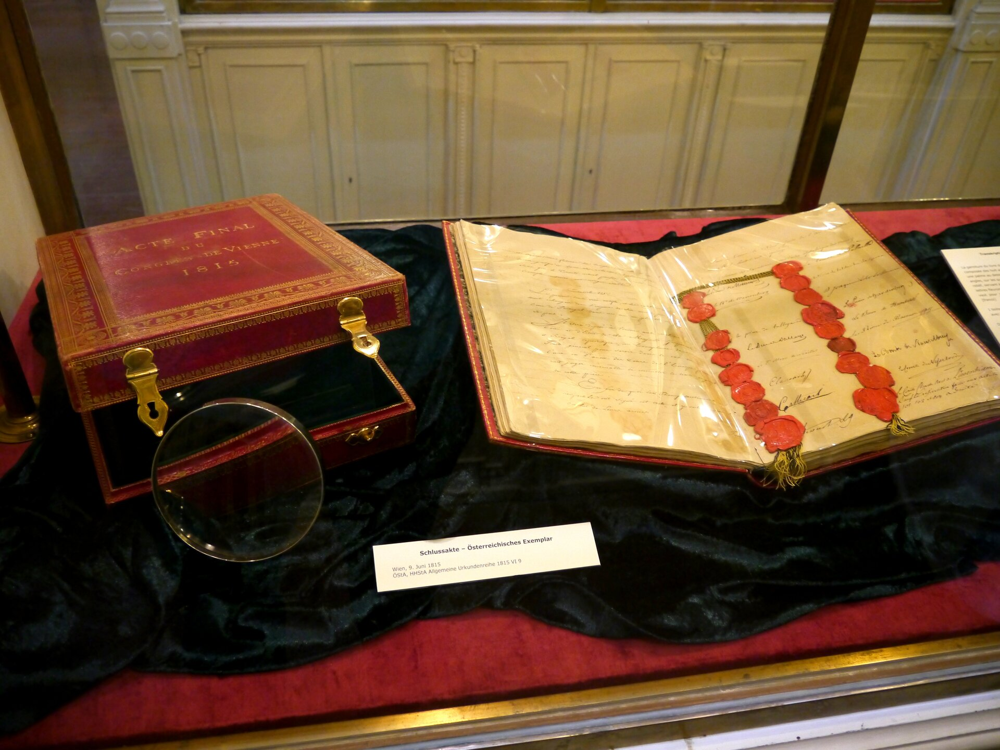
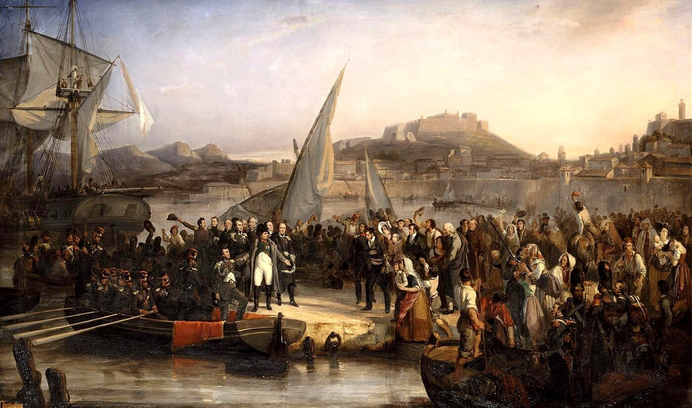
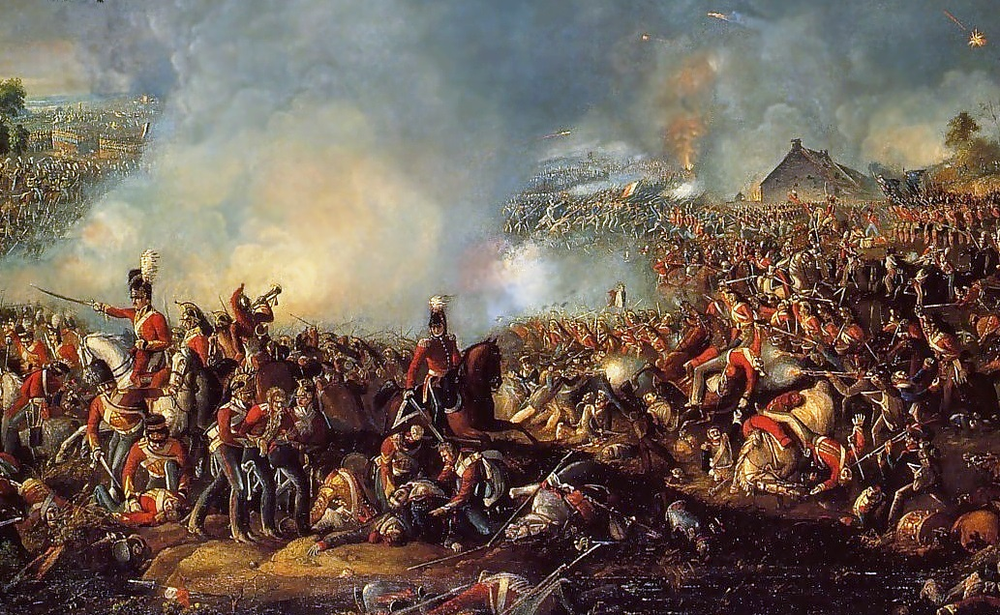
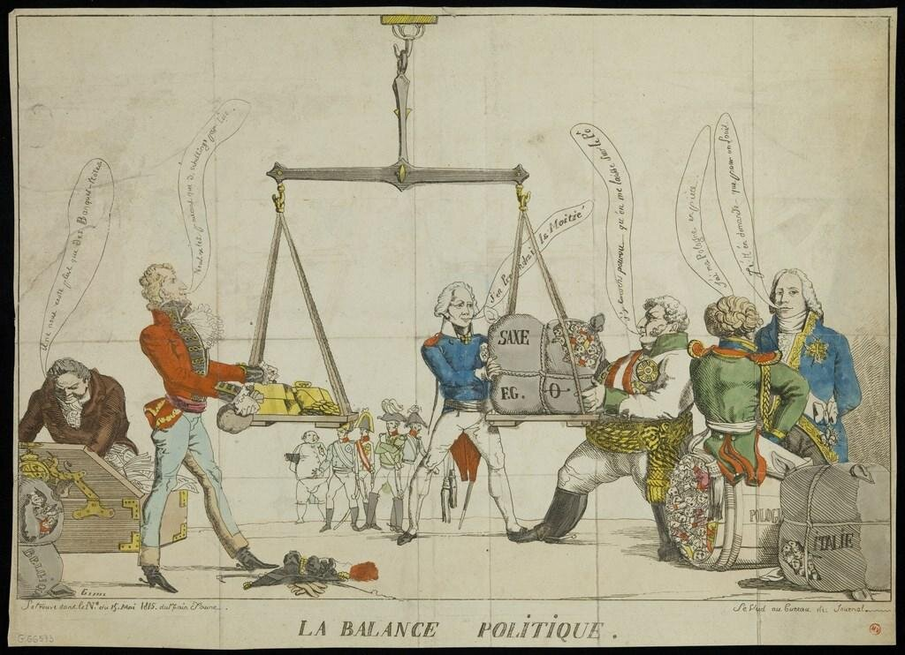
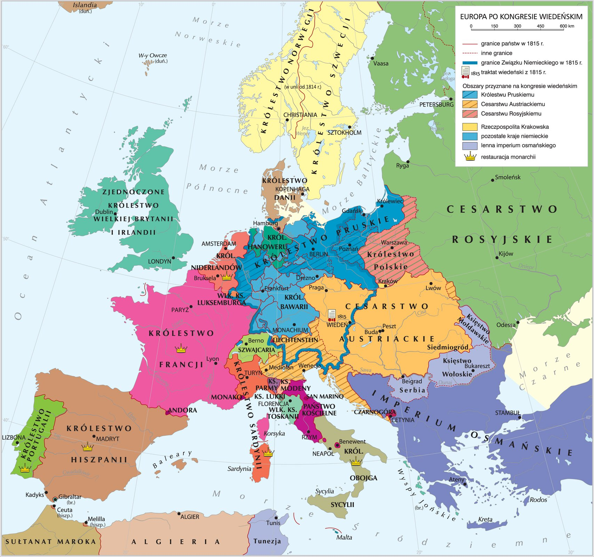
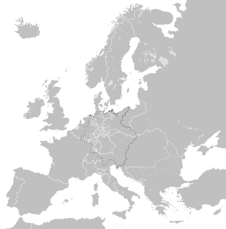
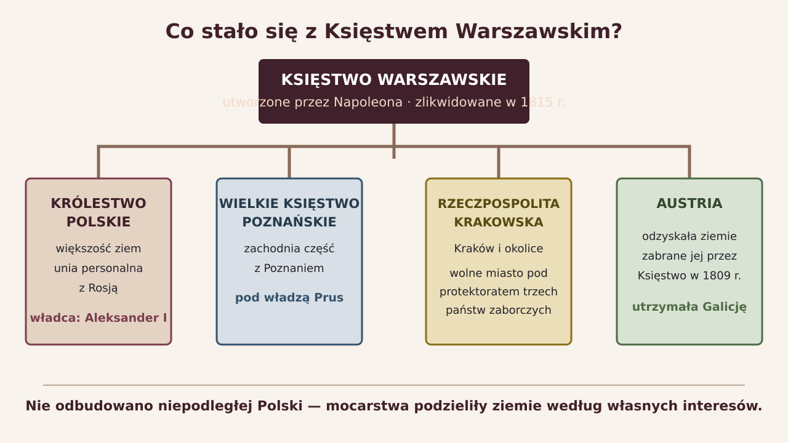
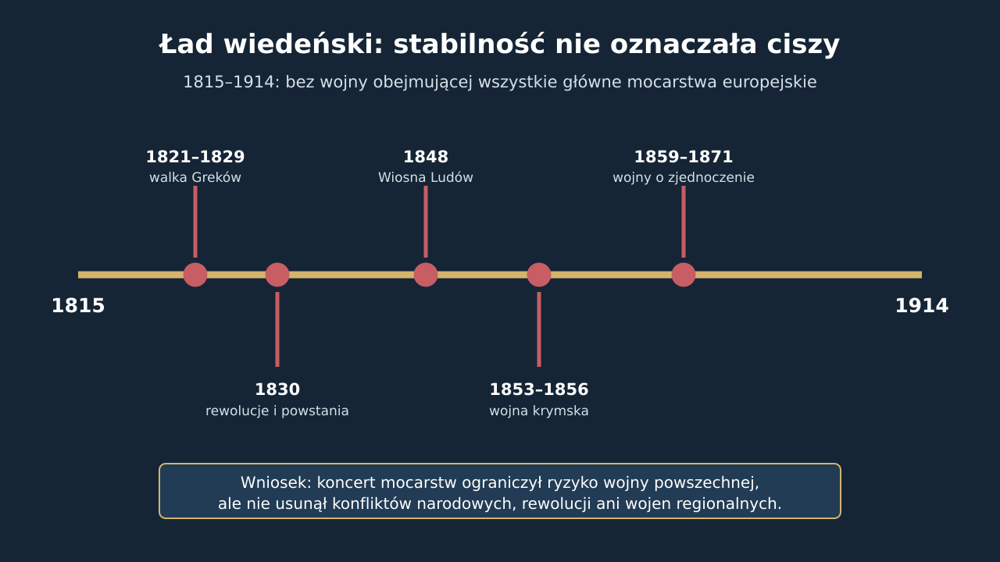

<!-- .slide: id="otwarcie" class="opening-slide congress-hero" data-purpose="opening" data-layout="hero-source" -->

dokument podpisany 9 czerwca 1815 r.
<h1>Kongres wiedeński</h1>

Jak urządzić Europę po Napoleonie?

notes:
Nie rozpoczynaj od dyktowania definicji. Pokaż dokument i daj parom 40 sekund: „Po ponad dwudziestu latach rewolucji i wojen lepiej odtworzyć dawny porządek czy zbudować nowy?”. Zbierz po jednym uzasadnieniu obu stanowisk.

---

<!-- .slide: id="pytanie" class="question-slide dark-statement" data-purpose="question" data-layout="statement-centered" -->
## Pytanie główne

**Jak zwycięskie mocarstwa urządziły Europę po Napoleonie — i czy naprawdę przywróciły dawny porządek?**

odtworzyć<b>czy</b>przeprojektować?

notes:
Zachowaj pierwsze hipotezy. Uczniowie wrócą do nich w syntezie: przywrócono część dynastii, ale mapa i sposób współpracy mocarstw były nowe.

---

<!-- .slide: id="chronologia" class="context-slide treaty-timeline" data-purpose="explanation" data-layout="process" -->
## Wiedeń i Napoleon: wydarzenia nakładają się

  
KONGRES

  
<b>jesień 1814 – 9 VI 1815</b><small>obrady w Wiedniu → akt końcowy</small>

  
NAPOLEON

  
<i style="--point:5%">Elba <small>1814</small></i><b>1 III – 22 VI 1815</b><small>„sto dni”</small><i style="--point:86%">Waterloo <small>18 VI</small></i>

<strong>9 VI:</strong> akt końcowy przed <strong>18 VI:</strong> Waterloo

notes:
To najważniejsza korekta chronologiczna. Kongres rozpoczął się jesienią 1814 r. i nie został zwołany po Waterloo. Powrót Napoleona przyspieszył decyzje. ZPE ujmuje „sto dni” jako 1 marca–22 czerwca 1815 r.; w innych ujęciach nazwa bywa liczona od wejścia do Paryża 20 marca.

---

<!-- .slide: id="elba" class="source-slide" data-purpose="evidence" data-layout="source-split" -->
Joseph Beaume, 1836 · późniejsze przedstawienie

## Z Elby do Paryża

<figure class="source-figure">

<figcaption>Napoleon opuszczający Elbę — obraz powstał 21 lat po wydarzeniu.</figcaption>
</figure>
<aside class="analysis-panel napoleon-return">

<strong>26 II</strong> opuszcza Elbę

<strong>1 III</strong> ląduje we Francji

<strong>marsz na Paryż</strong> — część żołnierzy wysłanych przeciw niemu przechodzi na jego stronę

<strong>20 III</strong> odzyskuje władzę i gromadzi armię

</aside>

notes:
Nie mów, że „cała Francja” jednomyślnie poparła Napoleona. Jego szybki marsz był możliwy dzięki przechodzeniu oddziałów i rozpadowi oporu Burbonów, ale kraj pozostawał podzielony. Obraz nie jest zapisem naocznym.

---

<!-- .slide: id="waterloo" class="source-slide waterloo-slide" data-purpose="evidence" data-layout="source-split" -->
## Waterloo kończy „sto dni”

<figure class="source-figure">

<figcaption>Bitwa pod Waterloo, 18 czerwca 1815 r. — obraz Williama Sadlera.</figcaption>
</figure>
<aside class="analysis-panel battle-chain">

<b>18 VI 1815</b>

armia Napoleona
przeciw

wojskom Wellingtona
+

nadciągającym Prusakom Blüchera

<strong>klęska → abdykacja 22 VI → Święta Helena</strong>
</aside>

notes:
Nie sprowadzaj wyniku wyłącznie do jednego dowódcy. Armia angielsko-niderlandzko-niemiecka Wellingtona utrzymała pozycje, a przybycie armii pruskiej Blüchera miało kluczowe znaczenie. Po drugiej abdykacji Napoleon został zesłany na odległą Świętą Helenę, nie ponownie na Elbę.

---

<!-- .slide: id="wieden" class="context-slide congress-room" data-purpose="explanation" data-layout="split" -->
## Kto decydował w Wiedniu?

<b>AUSTRIA</b>Metternich<small>gospodarz; obrona cesarstwa</small>

<b>WIELKA BRYTANIA</b>Castlereagh<small>równowaga i bezpieczeństwo mórz</small>

<b>ROSJA</b>Aleksander I<small>Księstwo Warszawskie i wpływy</small>

<b>PRUSY</b>Fryderyk Wilhelm III<small>Saksonia i ziemie na zachodzie</small>

<b>FRANCJA</b>Talleyrand<small>powrót do grona mocarstw</small>

Nie odbyło się jedno wspólne posiedzenie wszystkich delegacji. Najważniejsze kompromisy powstawały podczas spotkań i negocjacji mocarstw.

notes:
ZPE wskazuje początkowo cztery decydujące państwa: Austrię, Wielką Brytanię, Rosję i Francję włączoną dzięki Talleyrandowi. W standardowym ujęciu „wielkiej piątki” trzeba uwzględnić również Prusy. Nie wymagaj zapamiętania nazw wszystkich dyplomatów.

---

<!-- .slide: id="cele" class="explanation-slide goals-slide" data-purpose="explanation" data-layout="equation" -->
## Co trzeba było rozstrzygnąć?

<b>granice</b><small>kto dostanie ziemie?</small>
+
<b>trony</b><small>kto ma prawo rządzić?</small>
+
<b>bezpieczeństwo</b><small>jak zatrzymać nową dominację?</small>
=
<b>ład wiedeński</b><small>umowa mocarstw o Europie</small>

O granicach decydowali władcy i dyplomaci — nie mieszkańcy przenoszonych terytoriów.

---

<!-- .slide: id="zasady" class="explanation-slide principles-slide" data-purpose="explanation" data-layout="process" -->
## Trzy zasady — trzy różne pytania

<article>1<h3>LEGITYMIZM</h3>
<b>Kto ma prawo rządzić?</b>

„Prawowite” dynastie zachowują prawo do tronu.
</article>
<article>2<h3>RESTAURACJA</h3>
<b>Co należy przywrócić?</b>

Dynastie i monarchie obalone przez rewolucję lub Napoleona.
</article>
<article>3<h3>RÓWNOWAGA</h3>
<b>Jak zapobiec dominacji?</b>

Żadne mocarstwo nie może podporządkować sobie Europy.
</article>

<strong>prawo do tronu → przywrócenie → układ sił</strong>

notes:
Legitymizm i restauracja są bliskie, ale nie tożsame. Legitymizm to uzasadnienie prawa dynastii; restauracja to działanie polegające na jej przywróceniu. Przykład: uznano prawa Burbonów (legitymizm) i ponownie osadzono ich na tronach Francji czy Hiszpanii (restauracja).

---

<!-- .slide: id="karykatura" class="source-slide caricature-slide" data-purpose="evidence" data-layout="source-split" -->
anonimowa karykatura · Bodleian Library · domena publiczna

## Kto jest ważony, a kto waży?

<figure class="source-figure">

<figcaption>„La balance politique” — satyryczny komentarz do równowagi mocarstw.</figcaption>
</figure>
<aside class="analysis-panel inquiry-panel">

<b>Najpierw obserwacja:</b> co znajduje się na obu szalach?

<b>Potem wniosek:</b> jak autor ocenia sposób podejmowania decyzji?

<b>Jedno zdanie:</b> „Karykatura krytykuje…, ponieważ…”

</aside>

notes:
Nie podawaj od razu interpretacji. Uczniowie powinni zauważyć ludzi traktowanych jak pakunki i dyplomatów kontrolujących wagę. Karykatura krytykuje przedmiotowe traktowanie narodów i terytoriów; nie jest dosłownym zapisem obrad.

---

<!-- .slide: id="decyzje-europa" class="explanation-slide decisions-slide" data-purpose="explanation" data-layout="split" -->
## Najważniejsze decyzje w Europie

<b>FRANCJA</b>powrót Burbonów; państwa „zaporowe” na granicach

<b>PÓŁNOC</b>Belgia + Holandia → Królestwo Niderlandów

<b>NIEMCY</b>Związek Niemiecki: 39 państw zamiast jednego cesarstwa

<b>WŁOCHY</b>silne wpływy Austrii; odtworzenie monarchii

<b>MOCARSTWA</b>Prusy wzmocnione na zachodzie; Rosja zachowuje Finlandię i uzyskuje większość Księstwa Warszawskiego

<b>SZWAJCARIA</b>potwierdzenie wieczystej neutralności

notes:
Nie wymagaj pełnego katalogu nabytków. Uczeń ma umieć omówić mechanizm: osłabienie możliwości ekspansji Francji, kompromisy terytorialne, wzmocnienie kilku mocarstw i brak zjednoczenia Niemiec oraz Włoch.

---

<!-- .slide: id="mapa-europy" class="map-slide europe-map-slide" data-purpose="evidence" data-layout="map-focus" -->
opracowanie kartograficzne ZPE · CC BY-SA 3.0

<figure class="source-figure"><figcaption>Europa w 1815 r.; kolory oznaczają m.in. obszary przyznane Rosji, Prusom i Austrii.</figcaption></figure>
<aside class="analysis-panel map-questions">
<h3>Europa po kongresie: mapa decyzji</h3>

Wskaż:

<ol>
<li>państwo otaczane „zaporami”,</li>
<li>nowe Niderlandy,</li>
<li>Związek Niemiecki,</li>
<li>obszary wpływów Austrii we Włoszech,</li>
<li>ziemie polskie podzielone w 1815 r.</li>
</ol>
</aside>

notes:
Mapa ma drobne etykiety, dlatego zajmuje większość slajdu i można ją powiększyć kliknięciem. Najpierw wykonaj wskazania na mapie, dopiero potem przejdź do mapy konturowej. Nie każ uczniom przepisywać całej legendy.

---

<!-- .slide: id="mapa-konturowa" class="practice-slide outline-map-slide" data-purpose="practice" data-layout="map-focus" -->
## Zaznacz decyzje na konturze

<figure class="source-figure"><figcaption>Mapa Europy w 1815 r.</figcaption></figure>
<aside class="analysis-panel task-map-panel">

Na mapie z karty pracy wpisz:

<b>N</b> — Niderlandy

<b>ZN</b> — Związek Niemiecki

<b>KP</b> — Królestwo Polskie

<b>W</b> — obszar dominacji Austrii w północnych Włoszech

2 minuty

</aside>

notes:
Uczniowie korzystają z poprzedniej mapy. Dopuszczaj przybliżone położenie liter — celem jest orientacja przestrzenna, nie odtwarzanie granic z pamięci. Uczeń potrzebujący pomocy może wpisać tylko N, ZN i KP.

---

<!-- .slide: id="sprawa-polska" class="map-slide polish-settlement-slide" data-purpose="explanation" data-layout="evidence" -->
schemat edukacyjny na podstawie ustaleń kongresu · nie mapa

notes:
Najważniejsze zdanie: nie powstała niepodległa Polska. Królestwo Polskie otrzymało konstytucję i pewną odrębność, ale car Rosji był królem Polski. Rzeczpospolita Krakowska pozostawała pod protektoratem Rosji, Prus i Austrii. Szczegółowe ustroje to temat następnej lekcji.

---

<!-- .slide: id="swiete-przymierze" class="explanation-slide alliance-slide" data-purpose="explanation" data-layout="split" -->
## Święte Przymierze — strażnik porządku

ROSJAAUSTRIAPRUSY<b>wrzesień 1815</b>

<h3>Założenia</h3>

współpraca monarchów w duchu chrześcijańskim

obrona legalnych dynastii i pokoju między władcami

w praktyce: sprzeciw wobec rewolucji i zmian zagrażających monarchiom

<strong>Nie należała:</strong> Wielka Brytania. <strong>Nie pomyl:</strong> Święte Przymierze podpisano po akcie końcowym kongresu.

notes:
Akt Świętego Przymierza podpisali 26 września 1815 r. Aleksander I, Franciszek I i Fryderyk Wilhelm III. Jego język był religijno-moralny. Nie utożsamiaj dokumentu automatycznie ze wszystkimi późniejszymi interwencjami koncertu mocarstw, ale pokaż, że stał się symbolem obrony konserwatywnego ładu.

---

<!-- .slide: id="aktywnosc" class="practice-slide negotiation-task" data-purpose="practice" data-layout="activity-brief" -->
## Dyplomaci przy mapie

W parze wybierzcie <strong>cztery decyzje</strong> z tabeli na karcie pracy.

<ol>
<li>Dopasujcie decyzję do zasady: legitymizm, restauracja albo równowaga.</li>
<li>Zapiszcie, kto zyskał lub jaki problem rozwiązano.</li>
<li>Przy jednej decyzji dopiszcie: <strong>„zasada czy interes mocarstwa?”</strong></li>
</ol>

7 minut

notes:
Każda para opracowuje cztery z sześciu wierszy, aby zadanie zmieściło się w czasie. Nie pokazuj jeszcze modelu. Jeśli uczniowie przypiszą jednej decyzji dwie zasady, zaakceptuj odpowiedź, o ile potrafią ją uzasadnić.

---

<!-- .slide: id="model" class="synthesis-slide model-slide" data-purpose="synthesis" data-layout="takeaways" -->
## Sprawdź tok rozumowania

<lesson-table>
<table>
<thead><tr><th>Decyzja</th><th>Najlepsze dopasowanie</th><th>Co pokazuje?</th></tr></thead>
<tbody>
<tr><td>powrót Burbonów</td><td>restauracja + legitymizm</td><td>przywrócono dynastię i uznano jej prawa</td></tr>
<tr><td>silne Niderlandy przy Francji</td><td>równowaga</td><td>stworzono zaporę przed nową ekspansją</td></tr>
<tr><td>podział Księstwa Warszawskiego</td><td>równowaga + interesy</td><td>ograniczono pełne żądania Rosji, ale nie oddano decyzji Polakom</td></tr>
<tr><td>Związek Niemiecki</td><td>równowaga</td><td>obszar był zorganizowany, lecz nie zjednoczony</td></tr>
</tbody>
</table>
</lesson-table>

Popraw jeden własny wiersz i dopisz krótkie uzasadnienie.

notes:
To model częściowy — celowo nie rozwiązuje wszystkich sześciu wierszy karty. Zwróć uwagę, że decyzje nie zawsze wynikają z jednej czystej zasady. W sprawie polsko-saskiej kompromis i siła mocarstw były równie ważne jak deklarowane reguły.

---

<!-- .slide: id="skutek" class="source-slide legacy-slide" data-purpose="evidence" data-layout="evidence" -->
wykres czasu · opracowanie edukacyjne na podstawie materiału ZPE

notes:
Nie mów „sto lat całkowitego pokoju”. W Europie trwały rewolucje i wojny regionalne, w tym krymska oraz wojny o zjednoczenie Włoch i Niemiec. Osiągnięciem systemu było ograniczenie wojny obejmującej wszystkie główne mocarstwa aż do 1914 r., nie brak przemocy.

---

<!-- .slide: id="synteza" class="synthesis-slide dark-statement" data-purpose="synthesis" data-layout="statement-centered" -->
## Stary ład czy nowy projekt?

<strong>Przywrócono</strong> część dynastii i monarchii,

<strong>lecz stworzono</strong> nową mapę, nowe państwa i system współpracy mocarstw.

Dokończ: „Kongres był jednocześnie powrotem i zmianą, ponieważ…”

notes:
Wróć do hipotez z początku. Oczekuj dwóch przykładów: jednego ustrojowego (np. Burbonowie) i jednego terytorialnego lub międzynarodowego (Niderlandy, Związek Niemiecki, koncert mocarstw, podział Księstwa).

---

<!-- .slide: id="bilet" class="exit-ticket-slide" data-purpose="exit-ticket" data-layout="plain" -->
## Bilet wyjścia

**W trzech zdaniach omów decyzje kongresu wiedeńskiego:**

1. jedna decyzja dotycząca Europy;
2. jedna decyzja dotycząca ziem polskich;
3. wyjaśnienie, którą zasadę widać w jednej z tych decyzji.

Użyj co najmniej dwóch nazw własnych i jednego związku: <strong>ponieważ → dlatego</strong>.

notes:
Kryterium rdzenia: poprawna decyzja europejska, poprawna decyzja wobec ziem polskich oraz sensowne użycie jednej zasady. Pełny przykładowy model znajduje się w assessment.md, nie na slajdzie ucznia.
