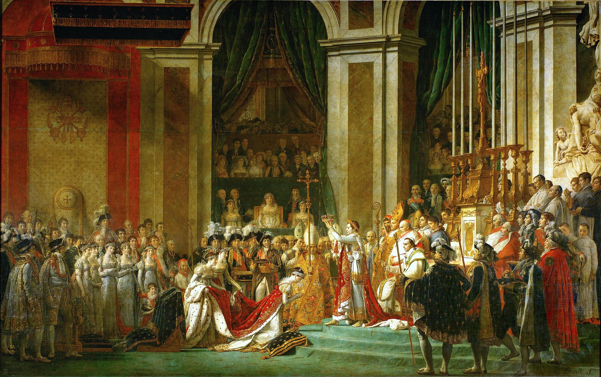
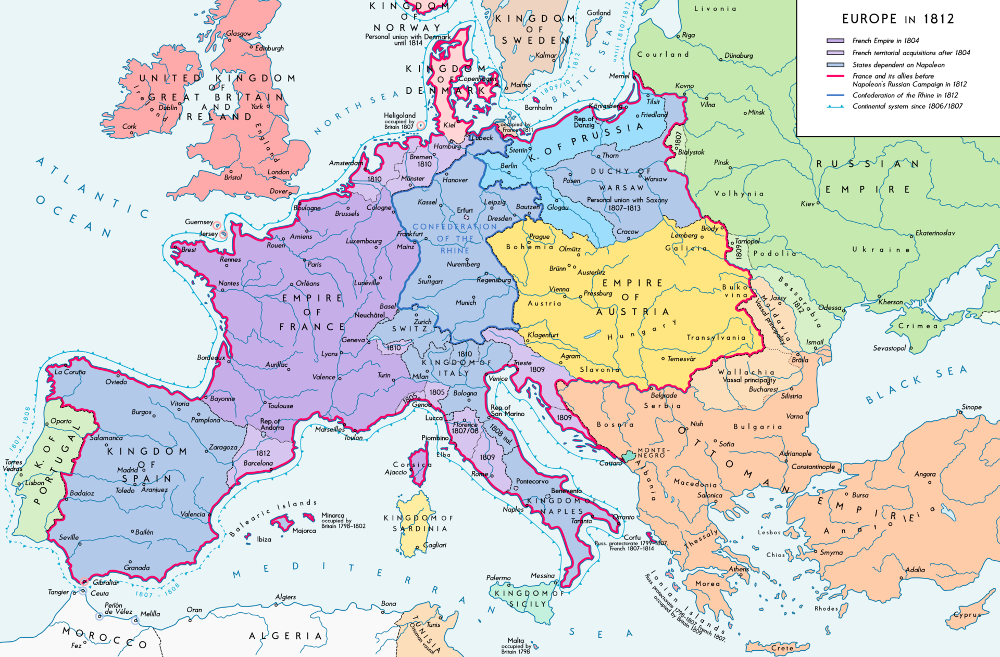
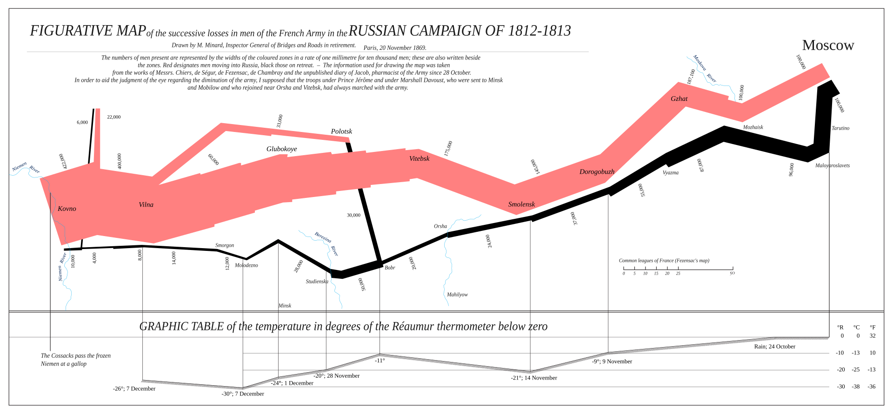
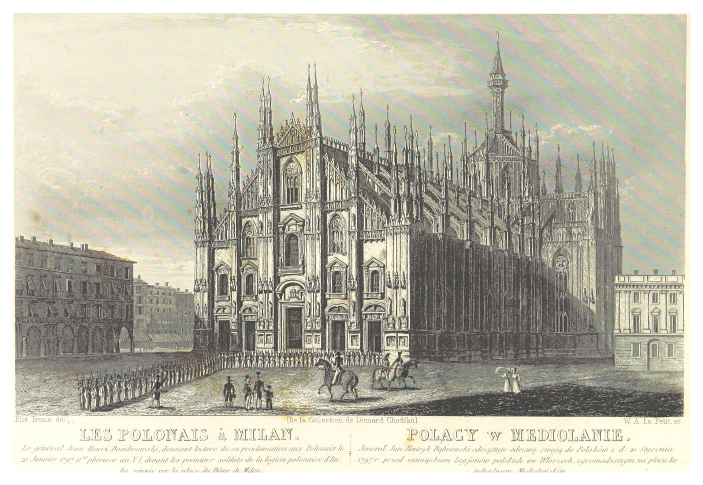
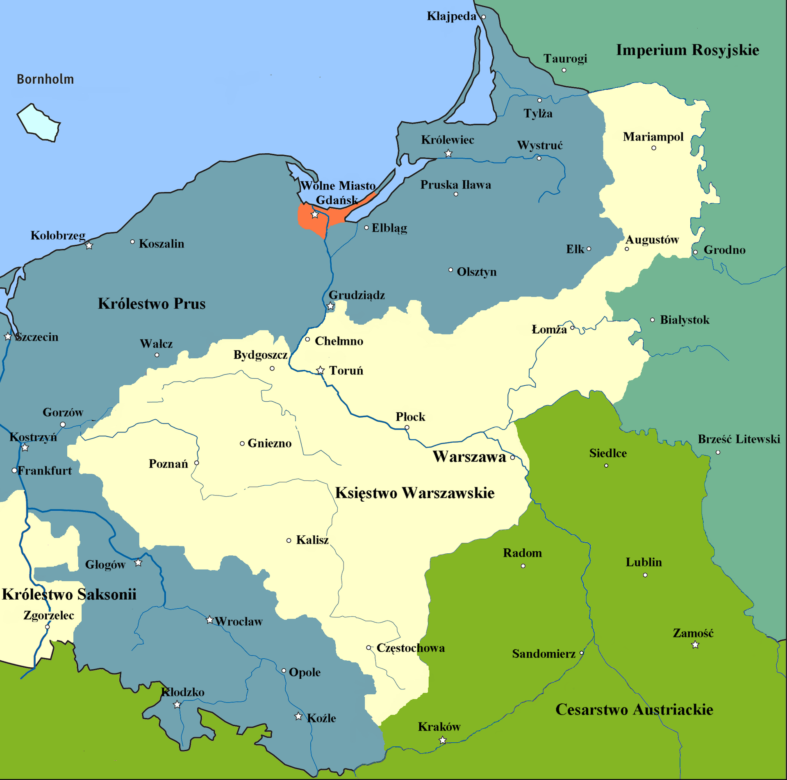
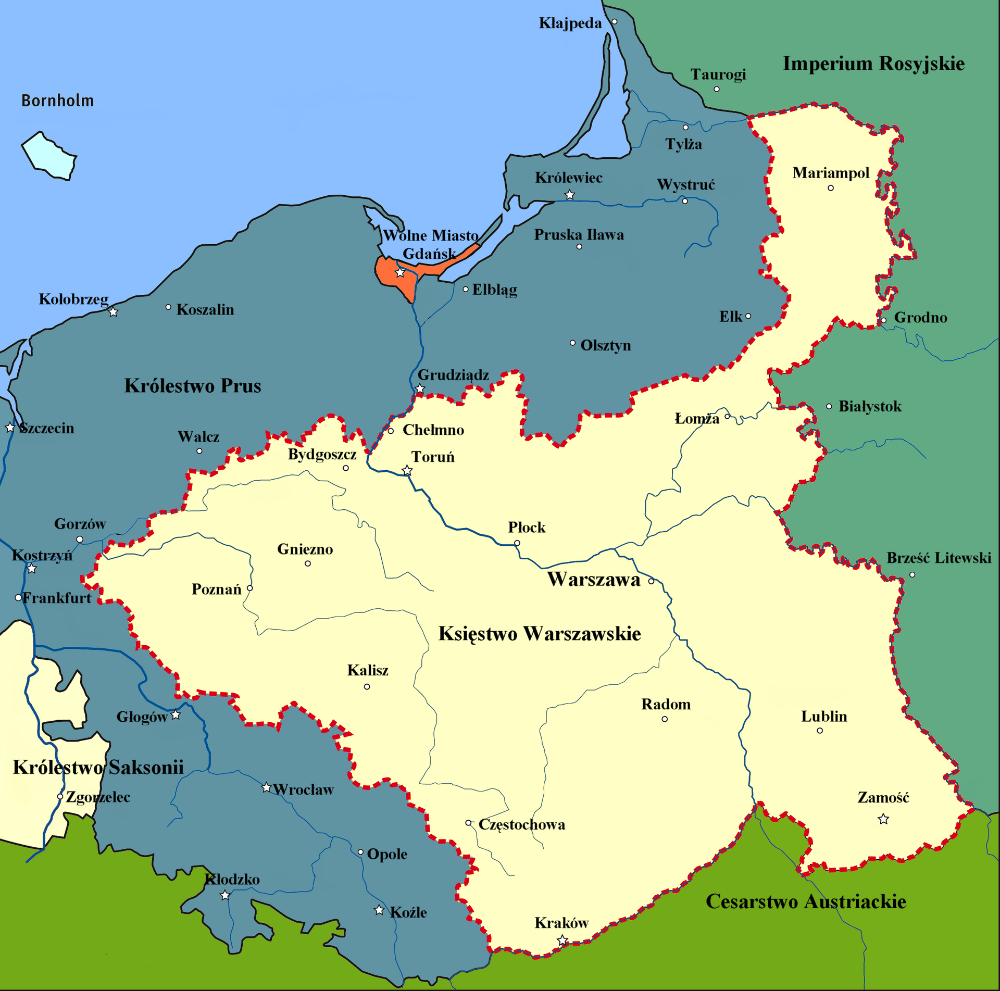
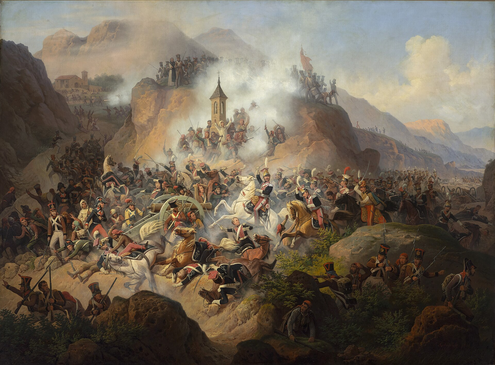
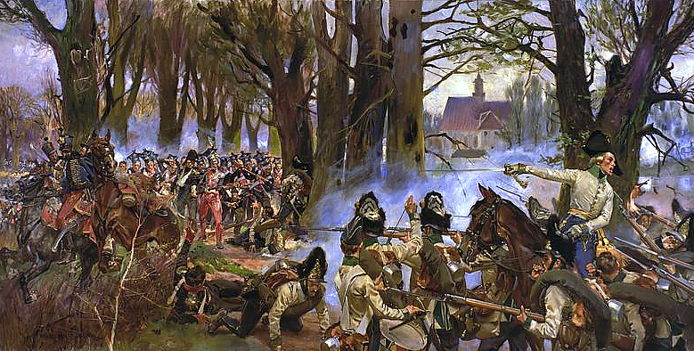
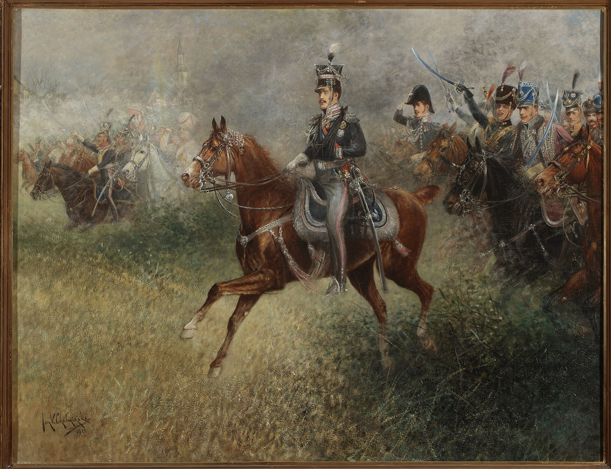

# Od Napoleona do Kongresu wiedeńskiego

**Powtórka: władza · wojny · sprawa polska · upadek**

Klasa VII · 45 minut

notes:
Typ lekcji: practice. Celem nie jest ponowne wygłoszenie całego działu, lecz odzyskanie chronologii i zbudowanie pomostu do kongresu wiedeńskiego.

---

<!-- .slide: id="slide-01" class="question-slide napoleon-title" data-purpose="question" data-layout="statement" -->
## Pytanie na start

<article><h3>rewolucja</h3>
upadek dawnego porządku
</article>

→

<article><h3>Napoleon</h3>
nowe prawa i francuska dominacja
</article>

→

<article><h3>kongres?</h3>
kto i po co ma urządzić Europę na nowo?
</article>

**Dlaczego po epoce Napoleona europejscy władcy uznali, że muszą na nowo urządzić Europę?**

notes:
Daj 45 sekund na rozmowę w parach. Zbierz dwie hipotezy. Nie oceniaj ich jeszcze — wrócą na slajdzie syntezy.

---

<!-- .slide: id="slide-02" class="practice-slide" data-purpose="practice" data-layout="activity-brief" -->
## Co pamiętasz z klasy VI?

Połącz cztery hasła w jedno wyjaśnienie:

<article><h3>rewolucja</h3>
zmiana ustroju i wojna w Europie
</article>
<article><h3>armia</h3>
awans dzięki talentowi i zwycięstwom
</article>
<article><h3>dyrektoriat</h3>
kryzys, korupcja i słaba władza
</article>
<article><h3>zamach stanu</h3>
18 brumaire’a — 9 XI 1799
</article>

> **Wniosek:** sława wojskowa + kryzys państwa = droga Napoleona do władzy.

notes:
Uczniowie mogą pamiętać koronację, lecz pomijać konsulat. Dopytaj: „Czy w 1799 r. Napoleon został cesarzem?”. Odpowiedź: nie, pierwszym konsulem.

---

<!-- .slide: id="droga-do-cesarstwa" class="context-slide napoleon-title" data-purpose="explanation" data-layout="statement" -->
## Od generała do cesarza

<article><h3>1796–1797</h3>
Zwycięska kampania włoska buduje popularność generała.
</article>
<article><h3>1799</h3>
Zamach stanu obala dyrektoriat. Napoleon zostaje pierwszym konsulem.
</article>
<article><h3>1802</h3>
Plebiscyt daje mu urząd konsula dożywotniego.
</article>
<article><h3>1804</h3>
Koronuje się na cesarza Francuzów.
</article>

**Co się zmienia?** Źródłem władzy nie ma być wyłącznie dynastia — Napoleon odwołuje się do rewolucji, zwycięstw i plebiscytów, ale skupia władzę w swoich rękach.

notes:
Podkreśl stopniowe przejście, nie jeden skok. Plebiscyty nie czyniły systemu demokratycznym: brakowało wolnej rywalizacji politycznej, a wyniki służyły legitymizacji decyzji.

---

<!-- .slide: id="koronacja" class="image-slide" data-purpose="evidence" data-layout="evidence" -->
późniejsze przedstawienie wydarzenia · obraz z lat 1805–1807

## Koronacja — nowa dynastia

<figure>

<figcaption class="caption">David, 1805–1807: scena koronowania Józefiny. Napoleon koronował siebie wcześniej — obraz nie pokazuje chwili samokoronacji.</figcaption>
</figure>

<strong>2 XII 1804</strong>

<ul>
<li>cesarz <strong>Francuzów</strong>, nie „z Bożej łaski król Francji”;</li>
<li>papież obecny, lecz Napoleon sam wkłada koronę;</li>
<li>rewolucyjny awans łączy się z monarchią i nową dynastią.</li>
</ul>

Pytanie: co obraz ma powiedzieć o legalności tej władzy?

notes:
David był oficjalnym malarzem Napoleona. Obraz przedstawia koronowanie Józefiny; samokoronowanie Napoleona nastąpiło wcześniej podczas tej samej ceremonii. Nie traktuj kompozycji jako neutralnej fotografii.

---

<!-- .slide: id="kodeks" class="compare-slide" data-purpose="explanation" data-layout="split" -->
## Kodeks Napoleona: zmiana i ograniczenia

<lesson-table>
<table>
<thead><tr><th>Co utrwalał?</th><th>Czego nie oznaczał?</th></tr></thead>
<tbody>
<tr><td>równość mężczyzn wobec prawa i koniec przywilejów stanowych</td><td>demokracji politycznej</td></tr>
<tr><td>ochronę własności prywatnej i jednolite prawo cywilne</td><td>wolności prasy i opozycji</td></tr>
<tr><td>świeckie rejestry stanu cywilnego i trwałość części zmian rewolucji</td><td>równych praw kobiet — kodeks wzmacniał władzę ojca i męża</td></tr>
</tbody>
</table>
</lesson-table>

> **Paradoks epoki:** nowoczesne reformy prawa + autorytarne, scentralizowane rządy.

notes:
Kodeks cywilny ogłoszono 21 marca 1804 r. Unikaj uproszczenia, że „zrównał wszystkich”: kobiety pozostawały prawnie podporządkowane, a niewolnictwo w koloniach francuskich przywrócono w 1802 r.

---

<!-- .slide: id="timeline-napoleonska" class="context-slide timeline-slide" data-purpose="explanation" data-layout="process" -->
## Oś epoki napoleońskiej — część I

<lesson-timeline>
<lesson-event year="1797"><strong>Legiony Polskie</strong> nadzieja na powrót sprawy polskiej</lesson-event>
<lesson-event year="1799"><strong>zamach stanu</strong> Napoleon pierwszym konsulem</lesson-event>
<lesson-event year="1804"><strong>Kodeks + cesarstwo</strong> reformy i nowa dynastia</lesson-event>
<lesson-event year="1805"><strong>Trafalgar i Austerlitz</strong> morze dla Brytanii, przewaga lądowa Francji</lesson-event>
<lesson-event year="1807"><strong>pokój w Tylży</strong> powstaje Księstwo Warszawskie</lesson-event>
</lesson-timeline>

Na karcie pracy wpisz litery B–E przy właściwych datach.

notes:
Oś ma zostać uzupełniona, nie tylko obejrzana. Trafalgar był 21 października, Austerlitz 2 grudnia 1805 r.

---

<!-- .slide: id="koalicje" class="compare-slide compact-table" data-purpose="explanation" data-layout="split" -->
## Wielkie koalicje: przeciwnicy wracają

<lesson-table>
<table>
<thead><tr><th>Koalicja</th><th>Kiedy?</th><th>Najważniejszy zwrot</th></tr></thead>
<tbody>
<tr><td>I–II</td><td>1792–1802</td><td>monarchie walczą przede wszystkim z rewolucyjną Francją</td></tr>
<tr><td>III</td><td>1805</td><td>Trafalgar: brytyjskie morze; Austerlitz: francuski ląd</td></tr>
<tr><td>IV</td><td>1806–1807</td><td>klęska Prus i Rosji; pokój w Tylży</td></tr>
<tr><td>V</td><td>1809</td><td>Austria przegrywa pod Wagram</td></tr>
<tr><td>VI</td><td>1813–1814</td><td>po Rosji koalicja zwycięża pod Lipskiem i wchodzi do Paryża</td></tr>
<tr><td>VII</td><td>1815</td><td>po powrocie Napoleona zwycięża pod Waterloo</td></tr>
</tbody>
</table>
</lesson-table>

> Brytania finansuje i współtworzy kolejne koalicje; ich skład się zmienia, lecz cel pozostaje: zatrzymać dominację Francji.

notes:
Nie każ uczniom zapamiętywać pełnego składu każdej koalicji. Ważny jest mechanizm ich odtwarzania i różnica między wojnami z rewolucyjną Francją a cesarstwem Napoleona.

---

<!-- .slide: id="mapa-kampanii" class="map-slide full-map" data-purpose="evidence" data-layout="evidence" -->
współczesne opracowanie kartograficzne · Europa przed kampanią rosyjską

## Europa u szczytu dominacji Napoleona — 1812

notes:
Mapa polityczna, nie mapa przebiegu wszystkich bitew. Objaśnij angielską legendę i poproś o wskazanie Francji, Wielkiej Brytanii, Hiszpanii, Księstwa Warszawskiego, Rosji, Austerlitz oraz Lipska. Mapa nie obejmuje Moskwy i nie oznacza Waterloo — nie żądaj ich lokalizacji na tym slajdzie.

---

<!-- .slide: id="bitwy" class="context-slide" data-purpose="explanation" data-layout="statement" -->
## Bitwy, które zmieniały układ sił

<article><strong>Trafalgar · 1805</strong>
Nelson niszczy flotę francusko-hiszpańską. Inwazja na Brytanię staje się nierealna.
</article>
<article><strong>Austerlitz · 1805</strong>
Napoleon rozbija Austrię i Rosję — szczyt jego przewagi na lądzie.
</article>
<article><strong>Jena–Auerstedt · 1806</strong>
Armia pruska ponosi klęskę; Francja dominuje w Niemczech.
</article>
<article><strong>Frydland · 1807</strong>
Klęska Rosji prowadzi do pokoju w Tylży i utworzenia Księstwa.
</article>
<article><strong>Wagram · 1809</strong>
Austria znów przegrywa, ale opór wobec Francji nie znika.
</article>
<article><strong>Borodino · 1812</strong>
Krwawa bitwa nie niszczy armii rosyjskiej ani nie kończy wojny.
</article>
<article><strong>Lipsk · 1813</strong>
„Bitwa narodów” łamie francuską dominację w Niemczech.
</article>
<article><strong>Waterloo · 1815</strong>
Koalicja kończy „sto dni” i ostatecznie obala Napoleona.
</article>

notes:
Rdzeń pamięciowy to Trafalgar + Austerlitz + Lipsk + Waterloo. Pozostałe bitwy budują mapę i wyjaśniają Księstwo, ale mogą zostać skrócone.

---

<!-- .slide: id="rosja-1812" class="context-slide napoleon-title" data-purpose="explanation" data-layout="statement" -->
## Dlaczego 1812 r. był katastrofą?

<article><h3>1. blokada</h3>
Rosja nie chce dalej ponosić kosztów blokady kontynentalnej.
</article>
<article><h3>2. odległość</h3>
Wielka Armia maszeruje daleko od magazynów i uzupełnień.
</article>
<article><h3>3. strategia Rosji</h3>
odwrót, spalone zasoby, unikanie rozstrzygnięcia
</article>
<article><h3>4. pusta Moskwa</h3>
brak pokoju i bezpiecznego zaopatrzenia
</article>
<article><h3>5. odwrót</h3>
głód, choroby, walki, mróz i rozpad armii
</article>

> **Nie pomyl:** zima pogłębiła klęskę — nie była jej jedyną przyczyną.

notes:
Napoleon wkroczył do Moskwy po Borodino, lecz car nie poprosił o pokój. Wielka Armia zaczęła tracić ludzi jeszcze przed najcięższymi mrozami wskutek chorób, dezercji i problemów logistycznych.

---

<!-- .slide: id="minard-1812" class="map-slide full-map" data-purpose="evidence" data-layout="evidence" -->
współczesne angielskie przerysowanie wykresu Charles’a Minarda z 1869 r.

## 1812 na jednej infografice

<strong>szerokość</strong> = liczba żołnierzy
<strong>czerwony</strong> = marsz na Moskwę
<strong>czarny</strong> = odwrót
<strong>dół</strong> = temperatura podczas odwrotu

notes:
Poproś o dwa dowody, że armia słabła przed najniższymi temperaturami. To wykres statystyczny na mapie, nie dosłowny plan marszu każdej jednostki. Szerokość pasma koduje szacowaną liczebność. Dolny wykres temperatur dotyczy odwrotu i jest połączony z miejscami oraz datami.

---

<!-- .slide: id="timeline-upadku" class="context-slide timeline-slide" data-purpose="explanation" data-layout="process" -->
## Oś epoki napoleońskiej — część II

<lesson-timeline>
<lesson-event year="1812"><strong>Rosja</strong> Wielka Armia traci zdolność narzucania pokoju</lesson-event>
<lesson-event year="1813"><strong>Lipsk</strong> VI koalicja wypiera Napoleona z Niemiec</lesson-event>
<lesson-event year="1814"><strong>abdykacja</strong> Elba; mocarstwa rozpoczynają kongres w Wiedniu</lesson-event>
<lesson-event year="1815"><strong>sto dni</strong> powrót Napoleona przerywa obrady</lesson-event>
<lesson-event year="18 VI 1815"><strong>Waterloo</strong> ostateczna klęska; zesłanie na Świętą Helenę</lesson-event>
</lesson-timeline>

Uzupełnij na karcie pracy lata 1812–1815.

notes:
Kongres zaczął się we wrześniu 1814 r., akt końcowy podpisano 9 czerwca 1815 r., a Waterloo miało miejsce 18 czerwca. Pozwala to skorygować popularny skrót „po Waterloo zwołano kongres”.

---

<!-- .slide: id="legiony" class="image-slide" data-purpose="evidence" data-layout="evidence" -->
sprawa polska · od rozbiorów do Legionów

## 1797: Legiony Polskie we Włoszech

<figure>

<figcaption class="caption">„Polacy w Mediolanie”: Dąbrowski odczytuje odezwę 20 I 1797 r. Rycina z 1839 r. — późniejsze wyobrażenie, nie zapis naoczny.</figcaption>
</figure>

<ul>
<li><strong>Jan Henryk Dąbrowski</strong> organizuje oddziały z polskich emigrantów i jeńców.</li>
<li><strong>Józef Wybicki</strong> pisze „Pieśń Legionów Polskich we Włoszech”.</li>
<li>Cel Polaków: wrócić z bronią do kraju i odbudować państwo.</li>
<li>Cel Francji: użyć polskich oddziałów w swoich wojnach.</li>
</ul>

Nadzieja i zależność pojawiają się jednocześnie.

notes:
Wspomnij San Domingo 1802–1803: część dawnych legionistów wysłano do tłumienia rewolucji haitańskiej. To ważny dowód, że interes Francji nie był równy sprawie polskiej.

---

<!-- .slide: id="mapa-ksiestwa" class="map-slide full-map" data-purpose="evidence" data-layout="evidence" -->
współczesne mapy porównawcze · Księstwo w latach 1807–1809 i 1809–1815

## Księstwo Warszawskie

<figure><figcaption><strong>1807–1809:</strong> ziemie zabrane Prusom</figcaption></figure>
<figure><figcaption><strong>od 1809:</strong> także ziemie odebrane Austrii</figcaption></figure>

<strong>Tylża 1807 → Raszyn i wojna 1809 → powiększenie Księstwa → wyprawa 1812 → okupacja i likwidacja 1813–1815.</strong> Polskie instytucje i armia, lecz państwo zależne od Napoleona.

notes:
Władcą był Fryderyk August I, król Saksonii. Konstytucja znosiła poddaństwo osobiste chłopów, lecz nie dawała im automatycznie ziemi. Kodeks Napoleona obowiązywał również w Księstwie.

---

<!-- .slide: id="polacy-w-walkach" class="image-slide" data-purpose="evidence" data-layout="evidence" -->
późniejsze przedstawienia artystyczne · sprawdź ograniczenia źródłowe

## Polacy w wojnach Napoleona

<figure><figcaption><strong>Somosierra, 1808</strong> January Suchodolski, 1860 — późniejsze wyobrażenie szarży</figcaption></figure>
<figure><figcaption><strong>Raszyn, 1809</strong> Wojciech Kossak, 1913 — Poniatowski i wojsko Księstwa</figcaption></figure>
<figure><figcaption><strong>Lipsk, 1813</strong> Jan Chełmiński, 1913 — Poniatowski prowadzi wojsko, nie scena jego śmierci</figcaption></figure>

> Co łączy te obrazy? Pokazują bohaterstwo — ale nie pokazują pełnych kosztów wojny ani zależności politycznej.

notes:
Wszystkie trzy prace mogą być późniejszymi wyobrażeniami. Podaj datę dzieła z sources.md i zapytaj, czego nie można na ich podstawie ustalić: liczebności, pełnego przebiegu, opinii wszystkich żołnierzy.

---

<!-- .slide: id="bilans-polski" class="compare-slide napoleon-title" data-purpose="explanation" data-layout="split" -->
## Czy Napoleon spełnił polskie nadzieje?

<article><h3>Nadzieje</h3>
odbudowa państwa, powrót armii polskiej, pokonanie zaborców
</article>
<article><h3>Korzyści</h3>
Legiony, Księstwo, konstytucja, administracja, armia, przywrócenie sprawy polskiej w Europie
</article>
<article><h3>Koszty i granice</h3>
pobór, podatki, San Domingo, Hiszpania, Rosja; brak pełnej niepodległości i dawnych granic
</article>

Zapisz ocenę: „Polacy popierali Napoleona, ponieważ… Jednocześnie…”. Użyj dwóch konkretnych dowodów.

notes:
Dobra odpowiedź nie brzmi po prostu „tak” albo „nie”. Uczeń ma uchwycić racjonalność nadziei oraz podporządkowanie sprawy polskiej interesom Francji.

---

<!-- .slide: id="slide-17" class="practice-slide" data-purpose="practice" data-layout="activity-brief" -->
## Zadanie: od ekspansji do nowego ładu

Każda para uzupełnia jeden przydzielony wiersz na karcie pracy. Podczas omówienia dopiszcie odpowiedzi pozostałych par:

1. Dlaczego Napoleon długo zwyciężał?
2. Dlaczego ostatecznie przegrał?
3. Dlaczego Polacy go popierali?
4. Dlaczego Europa potrzebowała nowego porządku?

**Warunek dobrej odpowiedzi:** każdy wniosek ma zawierać dwa dowody — datę, bitwę, reformę, mapę albo decyzję polityczną.

notes:
Daj 4 minuty pracy nad przydzielonym wierszem i 2 minuty na zebranie czterech odpowiedzi na forum. Nie wymagaj, by każda para samodzielnie opracowała wszystkie cztery problemy.

---

<!-- .slide: id="pomost-do-kongresu" class="compare-slide napoleon-title" data-purpose="explanation" data-layout="split" -->
## Dlaczego potrzebny był kongres?

<article><h3>1792–1815</h3>
ponad dwie dekady rewolucji i wojen
</article>
<article><h3>granice</h3>
państwa znikają, powstają lub zmieniają obszar
</article>
<article><h3>władcy</h3>
dynastie zostają obalone albo przywrócone
</article>
<article><h3>równowaga</h3>
mocarstwa chcą powstrzymać nową hegemonię
</article>
<article><h3>sprawa polska</h3>
trzeba zdecydować o ziemiach Księstwa Warszawskiego
</article>

> **Odpowiedź:** zwycięzcy musieli ustalić granice, władców i zasady współpracy po upadku systemu stworzonego przez Napoleona.

notes:
Wróć do hipotez z początku. Zapowiedz, że następna lekcja pokaże trzy zasady kongresu: restaurację, legitymizm i równowagę sił — nie wyjaśniaj ich jeszcze w pełni.

---

<!-- .slide: id="slide-19" class="exit-ticket-slide napoleon-title" data-purpose="exit-ticket" data-layout="plain" -->
## Bilet wyjścia

**W trzech zdaniach wyjaśnij, dlaczego zwycięskie mocarstwa zwołały kongres wiedeński.**

Użyj:
- jednego przykładu zmiany w Europie;
- jednego przykładu dotyczącego ziem polskich;
- związku przyczynowego: **ponieważ → dlatego**.

notes:
Zbierz odpowiedzi. Kryterium 3/3: poprawny związek, dwa konkretne przykłady i odniesienie do kongresu. Nie wymagaj nazw wszystkich koalicji.
