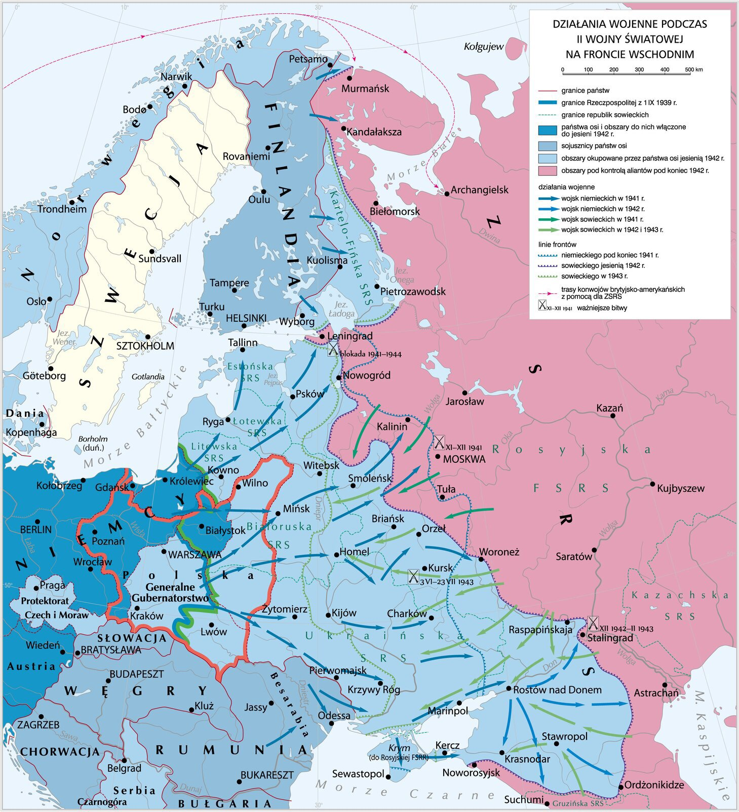
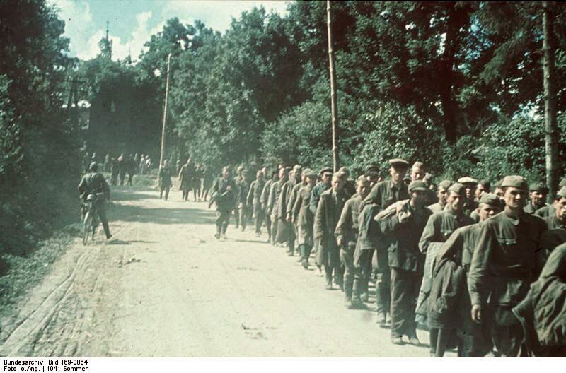

<!-- .slide: id="otwarcie" data-purpose="opening" data-layout="statement" -->
# Wojna III Rzeszy z ZSRR
## Front wschodni 1941–1943

Dlaczego plan szybkiego zwycięstwa zamienił się w wojnę wyniszczenia?

---

<!-- .slide: id="atak" data-purpose="explanation" data-layout="statement" -->
## 22 czerwca 1941 r.

Operacja „Barbarossa”

<strong>złamany pakt</strong>Niemcy uderzają na dotychczasowego partnera

<strong>krótka kampania</strong>plan zwycięstwa przed zimą

<strong>ogromna skala</strong>front od Bałtyku po Morze Czarne

---

<!-- .slide: id="cele" data-purpose="explanation" data-layout="comparison" -->
## Cele militarne i ideologiczne

<strong>Militarne</strong><ul><li>zniszczyć główne siły Armii Czerwonej</li><li>zdobyć kluczowe miasta i surowce</li><li>uniemożliwić ZSRR dalszą walkę</li></ul>

<strong>Ideologiczne</strong><ul><li>zniszczyć komunizm</li><li>zdobyć „przestrzeń życiową”</li><li>podporządkować i wyniszczać ludność uznaną za „niższą”</li></ul>

To od początku miała być także wojna rasowa i kolonialna.

---

<!-- .slide: id="barbarossa-mapa" data-purpose="evidence" data-layout="hero-source" -->
## Trzy kierunki uderzenia

<figure class="source-figure front-map"><figcaption>Mapa syntetyczna frontu wschodniego. ZPE, Krystian Chariza i zespół, CC BY 3.0.</figcaption></figure>

<strong>Północ:</strong> Leningrad &nbsp;•&nbsp; <strong>Środek:</strong> Moskwa &nbsp;•&nbsp; <strong>Południe:</strong> Ukraina

<!-- notes:
Mapa jest szczegółowa. Najpierw pokaż tylko niebieskie strzałki 1941 r. Potem wskaż trzy pola bitew: Moskwa, Stalingrad i Kursk.
Opcjonalny film IWM 2:28–2:48: https://www.youtube.com/watch?v=gr_-HjefPi0&t=148s . Pytanie: Jakie trzy grupy armii i cele wymienia narrator? Plan B: sama mapa.
-->

---

<!-- .slide: id="pierwsze-miesiace" data-purpose="explanation" data-layout="timeline-band" -->
## Sukcesy bez rozstrzygnięcia

lato 1941<strong>okrążenia</strong>
ogromne straty Armii Czerwonej i setki tysięcy jeńców

jesień 1941<strong>długi front</strong>
wydłużone dostawy, straty, opór i nowe oddziały ZSRR

zima 1941<strong>brak zwycięstwa</strong>
Moskwa niezdobyta; wojna trwa dalej

Pogoda pogłębiała kryzys. <strong>Nie była jedyną przyczyną.</strong>

---

<!-- .slide: id="wojna-ojczyzniana" data-purpose="explanation" data-layout="comparison" -->
## „Wielka Wojna Ojczyźniana”

<strong>Sowieckie i rosyjskie określenie</strong> wojny ZSRR z Niemcami i ich sojusznikami w latach <strong>1941–1945</strong>.

≠

Nie oznacza całej II wojny światowej. Nie obejmuje m.in. sowieckiej agresji na Polskę 17 września 1939 r.

---

<!-- .slide: id="dyrektywa" data-purpose="evidence" data-layout="hero-source" -->
## Źródło A: co zakładał plan?

<figure class="document-source">
<blockquote class="document-quote">„Niemieckie siły zbrojne muszą być przygotowane do pokonania Rosji radzieckiej w <strong>krótkotrwałej kampanii</strong> […]. Gros […] sił rosyjskich […] powinno zostać zniszczone w wyniku […] głębokiego manewru klinów pancernych”.</blockquote>
<figcaption class="citation">Dyrektywa nr 21, 18 XII 1940; przekład przytoczony w e‑materiale ZPE.</figcaption>
</figure>

Jakie dwa założenia planu widać w tym fragmencie?

---

<!-- .slide: id="wojna-wyniszczenia" data-purpose="explanation" data-layout="impact-flow" -->
## Wojna wyniszczenia

<strong>ideologia</strong>rasizm, antykomunizm, „przestrzeń życiowa”

<strong>okupacja</strong>terror, grabież i celowe głodzenie

<strong>masowe mordy</strong>Einsatzgruppen i inne formacje zabijały Żydów oraz ludność cywilną

<strong>jeńcy</strong>systemowe zaniedbanie, głód, choroby i egzekucje

---

<!-- .slide: id="jency" data-purpose="evidence" data-layout="split" -->
## Los jeńców sowieckich

<strong>ok. 5,7 mln</strong>żołnierzy Armii Czerwonej w niemieckiej niewoli

<strong>ok. 3,3 mln</strong>zmarłych lub zamordowanych do końca wojny

Brak podpisu ZSRR pod konwencją genewską nie dawał Niemcom prawa do mordowania ani głodzenia jeńców.

<figure class="source-figure"><figcaption>Jeńcy sowieccy po ataku Niemiec. Autor nieznany, CC BY-SA 3.0, za ZPE. Zdjęcie niedrastyczne.</figcaption></figure>

---

<!-- .slide: id="moskwa" data-purpose="explanation" data-layout="impact-flow" -->
## Moskwa: koniec planu szybkiej wojny

jesień 1941<strong>operacja „Tajfun”</strong>
Niemcy próbują zdobyć stolicę i rozbić siły na kierunku centralnym.

5 grudnia 1941<strong>sowiecka kontrofensywa</strong>
Niemcy zostają odrzuceni od Moskwy. Wojna nie kończy się przed zimą.

Znaczenie: załamanie planu zwycięstwa w 1941 r.

---

<!-- .slide: id="lancuch" data-purpose="practice" data-layout="activity-brief" -->
## Dlaczego plan się załamał?

<strong>Pracujcie w parach. Macie 6 minut.</strong>
<ol>
<li>Wybierzcie co najmniej cztery czynniki z banku w zadaniu 3.</li>
<li>Połączcie je strzałkami w logiczny łańcuch.</li>
<li>Podkreślcie najważniejszy czynnik i uzasadnijcie wybór.</li>
</ol>

Samo hasło „zima” nie wystarczy.

---

<!-- .slide: id="stalingrad" data-purpose="explanation" data-layout="timeline-band" -->
## Stalingrad: armia w okrążeniu

23 VIII 1942<strong>walki o miasto</strong>
ciężkie walki uliczne nad Wołgą

19 XI 1942<strong>operacja „Uran”</strong>
uderzenie na słabsze skrzydła i okrążenie 6. Armii

2 II 1943<strong>kapitulacja</strong>
wielka klęska militarna i psychologiczna Niemiec

<!-- notes:
Opcjonalny film IWM o Stalingradzie 12:17–13:05: https://www.youtube.com/watch?v=F679phS3xT0&t=737s . Pytanie: Dlaczego Armia Czerwona uderzyła na skrzydła, a nie w centrum miasta? Plan B: trzy etapy widoczne na tym slajdzie.
-->

---

<!-- .slide: id="komunikat" data-purpose="evidence" data-layout="hero-source" -->
## Źródło B: informacja czy propaganda?

<figure class="document-source">
<blockquote class="document-quote compact">„Wojska Frontu Dońskiego w bojach z 27–31 stycznia zakończyły likwidację grupy wojsk niemiecko‑faszystowskich, otoczonych na zachód od centralnej części Stalingradu”.</blockquote>
<figcaption class="citation">Komunikat radzieckiego Biura Informacji, 31 I 1943; przekład przytoczony w e‑materiale ZPE.</figcaption>
</figure>

Co komunikat informuje — i jakie słowo zdradza jego język propagandowy?

---

<!-- .slide: id="kursk" data-purpose="explanation" data-layout="comparison" -->
## Kursk: inicjatywa przechodzi do ZSRR

<strong>5 VII 1943</strong>
Niemcy rozpoczynają operację „Cytadela” przeciw występowi kurskiemu.

<strong>do 23 VIII 1943</strong>
ofensywa nie przełamuje przygotowanej obrony; Armia Czerwona przechodzi do działań zaczepnych.

Po Kursku Niemcy nie odzyskali strategicznej inicjatywy na froncie wschodnim.

---

<!-- .slide: id="trzy-etapy" data-purpose="synthesis" data-layout="takeaways" -->
## Trzy etapy przełomu

<strong>Moskwa</strong>koniec planu zwycięstwa w 1941 r.

<strong>Stalingrad</strong>okrążenie i zniszczenie 6. Armii

<strong>Kursk</strong>trwała inicjatywa strategiczna ZSRR

wojna błyskawiczna zatrzymana → wielka armia zniszczona → inicjatywa utracona

---

<!-- .slide: id="bilet" data-purpose="exit-ticket" data-layout="activity-brief" -->
## Bilet wyjścia

<ol>
<li>Podaj datę ataku i dwa kierunki planu „Barbarossa”.</li>
<li>Rozróżnij znaczenie Moskwy, Stalingradu i Kurska.</li>
<li>Podaj jeden militarny i jeden ideologiczny cel niemieckiej wojny przeciw ZSRR.</li>
</ol>

3 minuty • odpowiedz samodzielnie

