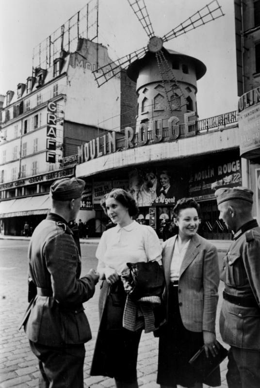
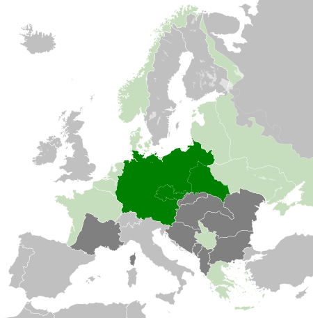
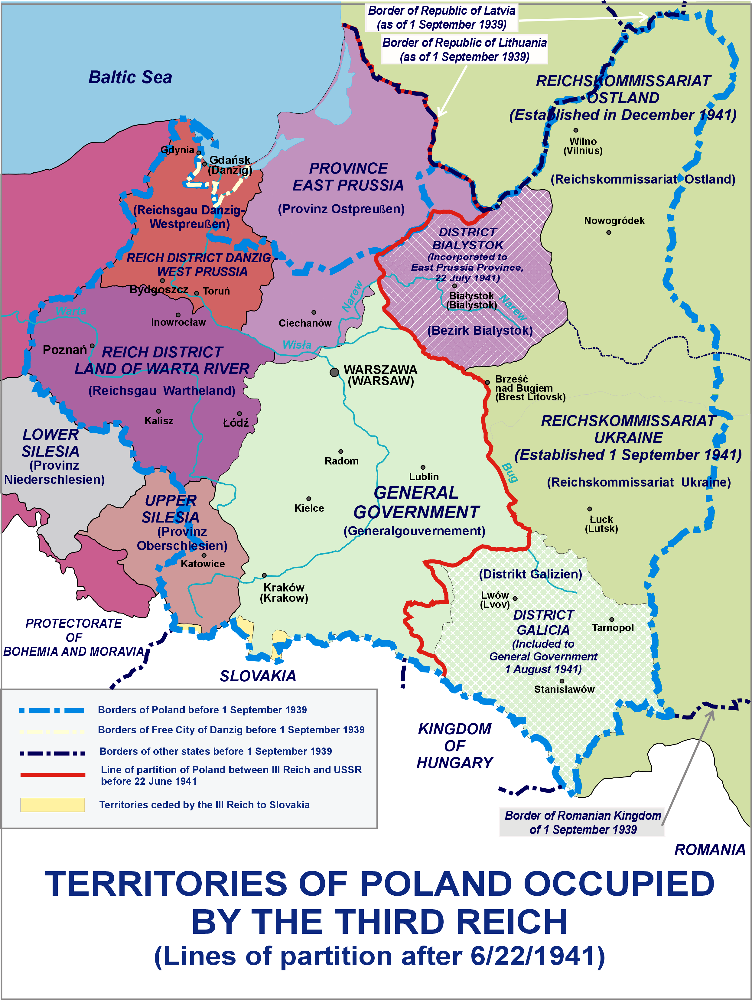
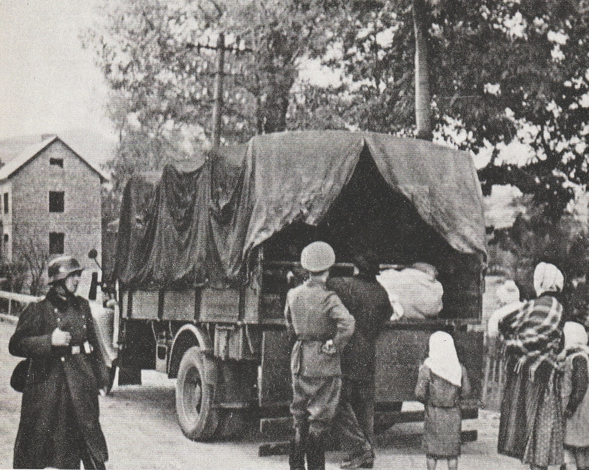
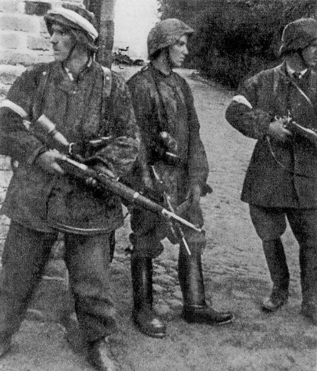
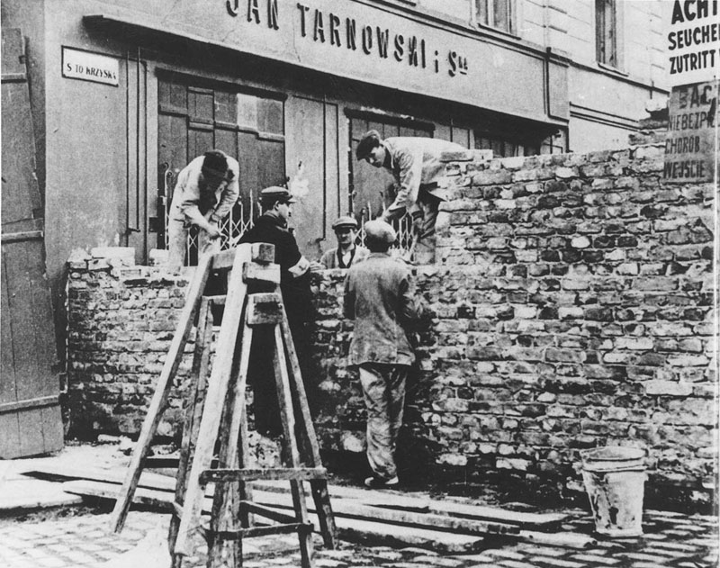
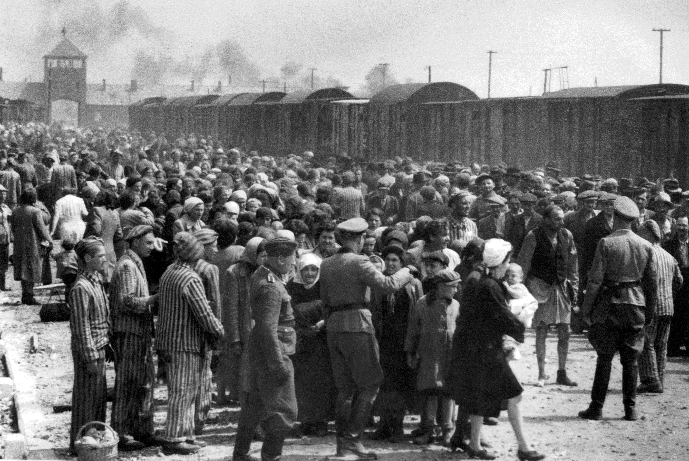

<!-- .slide: id="otwarcie" data-purpose="opening" data-layout="statement" -->

  

II WOJNA ŚWIATOWA · OKUPACJA
<h1>Polityka okupacyjna III Rzeszy</h1><h2>i Zagłada Żydów</h2>
Dlaczego niemiecka okupacja przybierała różne formy, a polityka wobec Żydów doprowadziła do Zagłady?

  <figure><figcaption>Paryż pod niemiecką okupacją. Fotografia z epoki.</figcaption></figure>

---

<!-- .slide: id="mapa-europy" data-purpose="evidence" data-layout="hero-source" -->
## Europa pod niemiecką dominacją w 1942 r.
<figure class="map-hero"><figcaption>Europa w 1942 r. Mapa orientacyjna: odczytaj zasięg kontroli, okupacji i sojuszy.</figcaption></figure>

Zanim porównamy politykę okupacyjną: wskaż jeden kraj okupowany i jeden sojuszniczy III Rzeszy.

---

<!-- .slide: id="lebensraum" data-purpose="explanation" data-layout="impact-flow" -->
## „Lebensraum” — ideologia podboju

<strong>„Przestrzeń życiowa”</strong>
Nazistowska nazwa rzekomego prawa Niemców do zdobywania ziem, zwłaszcza na Wschodzie.

podbić terytorium

wysiedlać i podporządkować ludność

germanizować, eksploatować, kolonizować

To nie był neutralny plan rozwoju. U podstaw leżał rasizm i przekonanie o „wyższości” Niemców.

---

<!-- .slide: id="dwa-modele" data-purpose="explanation" data-layout="comparison" -->
## Okupacja: wspólny cel, różne natężenie przemocy
<table class="occupation-table"><thead><tr><th></th><th>Europa Zachodnia</th><th>Europa Środkowa i Wschodnia</th></tr></thead><tbody><tr><th>Wspólne</th><td colspan="2">kontrola, eksploatacja gospodarcza, cenzura, represje i terror</td></tr><tr><th>Często szczególnie widoczne</th><td>administracja okupacyjna; wykorzystywanie gospodarki; współpraca części władz miejscowych</td><td>wysiedlenia, germanizacja, praca przymusowa, masowe egzekucje, plany kolonizacyjne</td></tr><tr><th>Związek z ideologią</th><td>dominacja polityczna i gospodarcza</td><td>„Lebensraum” i rasowa hierarchia miały szczególnie bezpośrednie skutki</td></tr></tbody></table>

To porównanie nie oznacza, że na Zachodzie nie było terroru ani prześladowań.

---

<!-- .slide: id="polska-mapa" data-purpose="evidence" data-layout="hero-source" -->
## Ziemie polskie pod okupacją

<figure><figcaption>Ziemie polskie pod okupacją niemiecką, 1941 r.</figcaption></figure>

<strong>Ziemie wcielone do III Rzeszy</strong> germanizacja, wysiedlenia i bezpośrednia administracja niemiecka.

<strong>Generalne Gubernatorstwo</strong> okupacyjna administracja, terror, grabież, przymus i getta.

Wskaż na mapie oba obszary. Dlaczego podział administracyjny nie oznaczał braku wspólnych represji?

---

<!-- .slide: id="codziennosc" data-purpose="evidence" data-layout="split" -->
## Okupacja ingerowała w codzienne życie

<figure><figcaption>Wysiedlenie ludności z Łodzi. Fotografia z epoki.</figcaption></figure>
<h3>Przymus i kontrola</h3><ul><li>wysiedlenia oraz odbieranie mieszkań i majątku</li><li>praca przymusowa i łapanki</li><li>cenzura, propaganda, represje za opór</li></ul>
Fotografia jest przykładem jednego działania okupanta; nie opisuje sama całej polityki w Europie.

---

<!-- .slide: id="opor" data-purpose="explanation" data-layout="matrix" -->
## Opór miał wiele form

<strong>Polska</strong>Armia Krajowa, Polskie Państwo Podziemne: konspiracja, wywiad, sabotaż i walka zbrojna.

<strong>Jugosławia</strong>Partyzanci Josipa Broza Tity prowadzili szeroką walkę partyzancką.

<strong>Grecja</strong>Ruch oporu walczył przeciw niemieckim, włoskim i bułgarskim okupantom.

<strong>Francja</strong>Résistance: wywiad, sabotaż, pomoc aliantom i walka zbrojna.

<figure class="small-source"><figcaption>Żołnierze batalionu „Zośka”, 1944 r.</figcaption></figure>

---

<!-- .slide: id="antysemityzm-nazistowski" data-purpose="explanation" data-layout="statement" -->
## Zagłada nie zaczęła się nagle

- **Przed 1939 r.:** propaganda antysemicka, ustawy norymberskie i „noc kryształowa”.
- **Po 1939 r.:** odebranie praw, przymusowe oznakowanie oraz getta.
- **Od 1941 r.:** masowe rozstrzeliwania Żydów na okupowanym Wschodzie.

> Antysemityzm był częścią ideologii i polityki państwa nazistowskiego jeszcze przed wojną.

---

<!-- .slide: id="getto-warszawskie" data-purpose="evidence" data-layout="statement" -->
## Getto: izolacja, głód i kontrola

<figure><figcaption>Mur getta warszawskiego, 1940 r. Fotografia z epoki.</figcaption></figure>

<strong>Getto:</strong> przymusowo wydzielona, zamknięta część miasta; Niemcy izolowali w niej Żydów, ograniczając ruch i dostęp do żywności.

<strong>Oznakowanie:</strong> w okupowanej Polsce nakazywano opaskę z gwiazdą Dawida; gdzie indziej często stosowano żółtą gwiazdę.

<strong>Pytanie do źródła:</strong> co widoczny mur mówi o funkcji getta?

---

<!-- .slide: id="eskalacja" data-purpose="explanation" data-layout="timeline-band" -->
## Od gett do masowej Zagłady

1941<strong>masowe rozstrzeliwania</strong>
Einsatzgruppen i inne formacje mordują Żydów na okupowanym Wschodzie.

20 I 1942<strong>Wannsee</strong>
urzędnicy koordynują „ostateczne rozwiązanie kwestii żydowskiej”.

1942–1945<strong>deportacje</strong>
transporty kierowane do ośrodków zagłady.

Konferencja w Wannsee koordynowała zbrodnię; nie była początkiem antysemityzmu ani pierwszych mordów.

---

<!-- .slide: id="holocaust" data-purpose="evidence" data-layout="split" -->
## Holocaust — planowa Zagłada Żydów

około <strong>6 mln</strong>zamordowanych Żydów europejskich

<strong>Holocaust / Zagłada</strong> — systematyczne ludobójstwo dokonane przez nazistowskie Niemcy i ich współpracowników.

<strong>Adolf Eichmann</strong> był urzędnikiem SS współorganizującym deportacje. Zbrodnia miała wielu sprawców i opierała się na całym systemie państwa nazistowskiego.

<figure><figcaption>Rampa kolejowa w Auschwitz-Birkenau, 1944 r.</figcaption></figure>

---

<!-- .slide: id="obozy" data-purpose="explanation" data-layout="comparison" -->
## Nie każdy obóz miał tę samą funkcję

<strong>koncentracyjny</strong>
więzienie, terror i przymus; więźniowie byli prześladowani i wykorzystywani.

<strong>pracy</strong>
wykorzystywanie pracy przymusowej w skrajnych, często śmiertelnych warunkach.

<strong>ośrodek zagłady</strong>
miejsce przeznaczone przede wszystkim do masowego mordowania.

<strong>Auschwitz-Birkenau</strong> był kompleksem obozowym, miejscem pracy przymusowej i największym niemieckim ośrodkiem zagłady.

---

<!-- .slide: id="postawy" data-purpose="practice" data-layout="activity-brief" -->
## Postawy wobec okupacji: nazwij działanie, nie naród

<strong>Pracujcie w parach · 5 minut</strong><ol><li>W zadaniu 5B nazwijcie cztery postawy.</li><li>Przy każdej dopiszcie jedno uzasadnienie.</li><li>Na końcu zapiszcie zdanie: „Pod okupacją ludzie mogli…”.</li></ol>

<strong>Pomoc:</strong> Rada Pomocy Żydom „Żegota” organizowała pomoc; Irena Sendlerowa współpracowała z siecią pomocy dzieciom.

<strong>Szantaż:</strong> szmalcownicy szantażowali Żydów w ukryciu i osoby, które im pomagały.

<strong>Ważne:</strong> oceniaj konkretne działania osób, organizacji lub władz — nie całe narody.

---

<!-- .slide: id="synteza-bilet" data-purpose="exit-ticket" data-layout="activity-brief" -->
## Bilet wyjścia

<ol><li>Wyjaśnij jednym zdaniem, jak Lebensraum wpłynął na okupację na Wschodzie.</li><li>Dlaczego Wannsee nie oznacza początku Zagłady?</li><li>Podaj różnicę między obozem koncentracyjnym a ośrodkiem zagłady oraz nazwij jedną postawę pomocy.</li></ol>

3 minuty · odpowiedz samodzielnie

