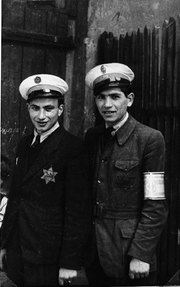
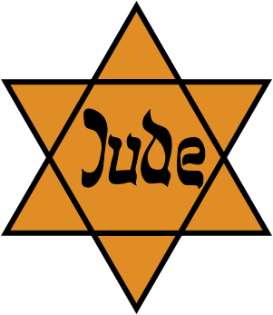
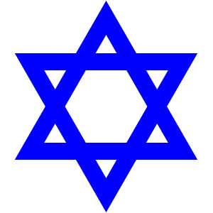
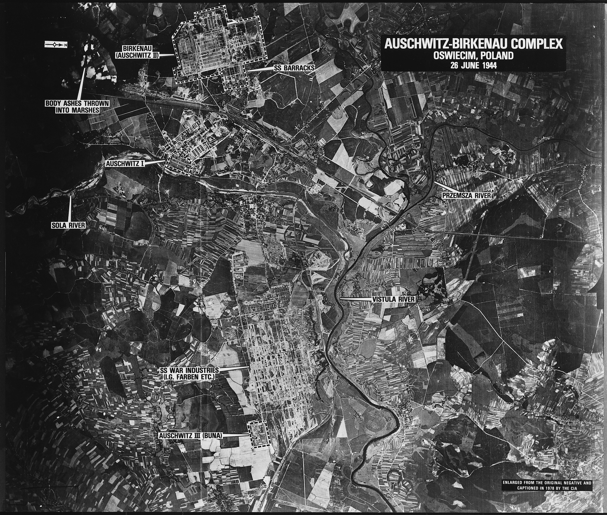
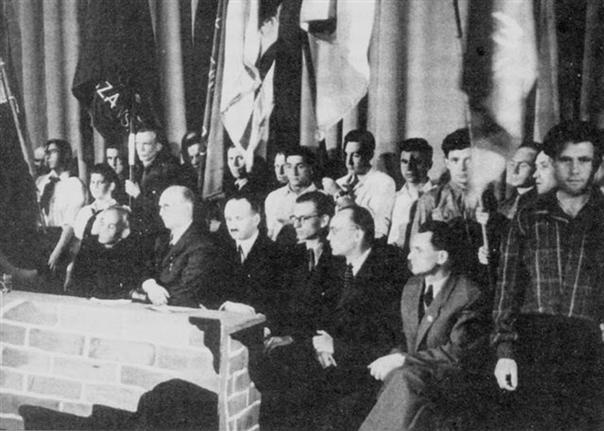

<!-- .slide: id="otwarcie" data-purpose="opening" data-layout="statement" -->
<h1>Polityka okupacyjna III Rzeszy</h1>

---

<!-- .slide: id="mapa-europy" data-purpose="reference" data-layout="plain" -->

<button class="map-link" type="button" data-lightbox-src="assets/mapa-europa-1942.svg" data-lightbox-alt="Mapa Europy w 1942 roku, przedstawiająca zasięg III Rzeszy, okupacji i państw sojuszniczych" data-lightbox-uncaptioned="true" aria-label="Powiększ mapę Europy"></button>

---

<!-- .slide: id="lebensraum" data-purpose="explanation" data-layout="impact-flow" -->
## „Lebensraum” — ideologia podboju

<strong>„Przestrzeń życiowa”</strong>
Nazistowska nazwa rzekomego prawa Niemców do zdobywania ziem, zwłaszcza na Wschodzie.

podbić terytorium

wysiedlać i podporządkować ludność

germanizować, eksploatować, kolonizować

---

<!-- .slide: id="dwa-modele" data-purpose="explanation" data-layout="comparison" -->
## Dwa modele niemieckiej okupacji
<table class="occupation-table"><thead><tr><th></th><th>Europa Zachodnia</th><th>Europa Środkowa i Wschodnia</th></tr></thead><tbody><tr><th>Rasowa ideologia nazistów</th><td>część ludności uznawano za rasowo bliższą Niemcom; nazizm nie traktował jej jednak jako równorzędnej</td><td>Słowian, Żydów i Romów uznawano za „podludzi”; planowano ich wyniszczenie, niewolniczą pracę lub usunięcie</td></tr><tr><th>Codzienne rządy</th><td>w wielu miejscach życie codzienne toczyło się względnie podobnie; w części państw działały rządy kolaborujące z Niemcami</td><td>bezpośrednia dominacja, germanizacja, grabież i kolonizacja; szczególnie brutalne podporządkowanie ludności</td></tr><tr><th>Przemoc</th><td>kontrola, represje, deportacje i terror — różne w zależności od kraju</td><td>terror, odpowiedzialność zbiorowa, obozy koncentracyjne, masowe egzekucje i praca przymusowa</td></tr></tbody></table>

---

<!-- .slide: id="polska-mapa" data-purpose="reference" data-layout="plain" -->

<button class="map-link" type="button" data-lightbox-src="assets/mapa-polska-okupacja-zpe.jpg" data-lightbox-alt="Mapa ziem polskich pod okupacją: obszary wcielone do III Rzeszy oraz Generalne Gubernatorstwo" data-lightbox-uncaptioned="true" aria-label="Powiększ mapę ziem polskich pod okupacją"></button>

---

<!-- .slide: id="codziennosc" data-purpose="evidence" data-layout="split" -->
## Okupacja ingerowała w codzienne życie

<figure><figcaption>Wysiedlenie ludności z Łodzi. Fotografia z epoki.</figcaption></figure>
<h3>Przymus i kontrola</h3><ul><li>wysiedlenia oraz odbieranie mieszkań i majątku</li><li>praca przymusowa i łapanki</li><li>cenzura, propaganda, represje za opór</li></ul>
Fotografia jest przykładem jednego działania okupanta; nie opisuje sama całej polityki w Europie.

---

<!-- .slide: id="opor" data-purpose="explanation" data-layout="matrix" -->
## Opór miał wiele form

<strong>Polska</strong>Armia Krajowa, Polskie Państwo Podziemne: konspiracja, wywiad, sabotaż i walka zbrojna.

<strong>Jugosławia</strong>Partyzanci Josipa Broza Tity prowadzili szeroką walkę partyzancką.

<strong>Grecja</strong>Ruch oporu walczył przeciw niemieckim, włoskim i bułgarskim okupantom.

<strong>Francja</strong>Résistance: wywiad, sabotaż, pomoc aliantom i walka zbrojna.

<figure class="small-source"><figcaption>Żołnierze batalionu „Zośka”, 1944 r.</figcaption></figure>

---

<!-- .slide: id="antysemityzm-nazistowski" data-purpose="evidence" data-layout="split" -->
## Oznakowanie i getta: izolacja ludności żydowskiej

<figure><figcaption>Getto w Będzinie: opaska i gwiazda jako narzucone oznakowanie Żydów. Kadr propagandowy okupanta.</figcaption></figure>

<strong>Oznakowanie</strong> ułatwiało rozpoznanie, wykluczenie i kontrolę osób żydowskich. W okupowanej Polsce nakazywano opaskę z gwiazdą Dawida; w innych krajach stosowano często żółtą gwiazdę.

<strong>Getta</strong> były przymusowo wydzielonymi, zamkniętymi częściami miast. Niemcy izolowali w nich Żydów, ograniczając ruch i dostęp do żywności.

<strong>Przyjrzyj się zdjęciu:</strong> jakie dwa sposoby kontroli ludzi przez okupanta można na nim wskazać?

---

<!-- .slide: id="gwiazdy-dawida" data-purpose="reference" data-layout="comparison" -->
## Przymusowe oznakowanie Żydów

<figure><figcaption>Gwiazda Dawida — żółta z napisem „Jude”. Noszona była przez Żydów na ziemiach wcielonych do III Rzeszy w postaci opaski.</figcaption></figure><figure><figcaption>Gwiazda Dawida — niebieska. Noszona była przez Żydów w Generalnym Gubernatorstwie.</figcaption></figure>

---

<!-- .slide: id="getto-warszawskie" data-purpose="evidence" data-layout="statement" -->
## Getto: izolacja, głód i kontrola

<figure><figcaption>Mur getta warszawskiego, 1940 r. Fotografia z epoki.</figcaption></figure>

<strong>Getto:</strong> przymusowo wydzielona, zamknięta część miasta; Niemcy izolowali w niej Żydów, ograniczając ruch i dostęp do żywności.

<strong>Oznakowanie:</strong> w okupowanej Polsce nakazywano opaskę z gwiazdą Dawida; gdzie indziej często stosowano żółtą gwiazdę.

<strong>Pytanie do źródła:</strong> co widoczny mur mówi o funkcji getta?

---

<!-- .slide: id="eskalacja" data-purpose="explanation" data-layout="statement" -->
## Od gett do masowej Zagłady

<ol><li><strong>1941</strong>masowe rozstrzeliwania</li><li><strong>20 I 1942</strong>Wannsee: koordynacja „ostatecznego rozwiązania”</li><li><strong>1942–1945</strong>deportacje do ośrodków zagłady</li></ol>
<article class="einsatz-definition">
<h3>Einsatzgruppen</h3>

Specjalne oddziały SS i policji, które mordowały Żydów i komunistów oraz inne grupy uznane przez nazistów za wrogów. <small>Konferencja w Wannsee koordynowała zbrodnię; nie była początkiem antysemityzmu ani pierwszych mordów.</small>
</article>

---

<!-- .slide: id="frank-zrodlo" data-purpose="evidence" data-layout="source-split" -->
## Fragment przemówienia Hansa Franka, wygłoszonego 16 grudnia 1941 r. w Krakowie na posiedzeniu rządu Generalnego Gubernatorstwa

[...] Powiem Panom otwarcie, że z Żydami trzeba skończyć tak czy owak. Führer powiedział kiedyś: jeśli zjednoczonemu żydostwu znowu uda się rozpętać wojnę światową, wówczas nie tylko podburzone do wojny narody złożą swą krew w ofierze, lecz przyjdzie również kres na Żyda w Europie. (…) Dlatego mój zasadniczy stosunek do Żydów opiera się na nadziei, że Żydzi znikną. Trzeba ich usunąć. Rozpocząłem pertraktacje w celu deportowania ich na Wschód. [...]

Ale co ma się stać z Żydami? (…) Musimy wytępić Żydów, gdziekolwiek ich spotkamy i gdzie się tylko da, aby utrzymać tu strukturalną całość Rzeszy. (...). Żydzi są dla nas niezwykle szkodliwymi żarłokami. Mamy teraz w Generalnym Gubernatorstwie w przybliżeniu 2,5 miliona Żydów, a wliczając spokrewnionych z Żydami i wszystko co się z tym wiąże — być może 3,5 miliona. Owych 3,5 miliona Żydów nie możemy rozstrzelać, nie możemy ich wytruć; będziemy jednak mogli podjąć kroki, prowadzące w jakikolwiek sposób do wyników w tępieniu ich, a to w związku z posunięciami na wielką skalę, które mają być omówione w Rzeszy. Generalne Gubernatorstwo musi być wolne od Żydów tak samo jak Rzesza. Gdzie i jak się to stanie — jest to sprawa instancji, które musimy tu powołać i utworzyć i o działalności których powiadomię Panów we właściwym czasie.

---

<!-- .slide: id="holocaust" data-purpose="evidence" data-layout="split" -->
## Holocaust — planowa Zagłada Żydów

około <strong>6 mln</strong>zamordowanych Żydów europejskich

<strong>Holocaust / Zagłada</strong> — systematyczne ludobójstwo dokonane przez nazistowskie Niemcy i ich współpracowników.

<strong>Adolf Eichmann</strong> był urzędnikiem SS współorganizującym deportacje. Zbrodnia miała wielu sprawców i opierała się na całym systemie państwa nazistowskiego.

<figure><figcaption>Rampa kolejowa w Auschwitz-Birkenau, 1944 r.</figcaption></figure>

---

<!-- .slide: id="obozy" data-purpose="explanation" data-layout="comparison" -->
## Nie każdy obóz miał tę samą funkcję

<figure><figcaption>Auschwitz-Birkenau z lotu rozpoznawczego, 26 czerwca 1944 r.</figcaption></figure>

<strong>koncentracyjny</strong>
więzienie, terror i przymus; więźniowie byli prześladowani i wykorzystywani.

<strong>pracy</strong>
wykorzystywanie pracy przymusowej w skrajnych, często śmiertelnych warunkach.

<strong>ośrodek zagłady</strong>
miejsce przeznaczone przede wszystkim do masowego mordowania.

<strong>Auschwitz-Birkenau</strong> był kompleksem obozowym, miejscem pracy przymusowej i największym niemieckim ośrodkiem zagłady.

---

<!-- .slide: id="postawy" data-purpose="practice" data-layout="activity-brief" -->
## Pomoc, współpraca, szantaż — konkretne działania

<strong>Pomoc</strong>
Rada Pomocy Żydom „Żegota” organizowała fałszywe dokumenty, wsparcie finansowe i kryjówki.

<strong>Szantaż</strong>
Szmalcownicy szantażowali Żydów w ukryciu i osoby, które im pomagały.

<strong>Odpowiedzialność</strong>
Opisuj działanie konkretnych osób, organizacji i władz — nie przypisuj jednej postawy całym narodom.

---

<!-- .slide: id="zegota" data-purpose="evidence" data-layout="split" -->
## Żegota — konspiracyjna pomoc dla Żydów

<figure><figcaption>Fotografia związana z Żegotą, 1946 r. Materiał powojenny.</figcaption></figure>

<strong>Rada Pomocy Żydom „Żegota”</strong> działała od 1942 r. przy Delegaturze Rządu RP na Kraj.

Była konspiracyjną organizacją, która organizowała fałszywe dokumenty, pieniądze, kryjówki i kontakty dla Żydów ukrywających się po „aryjskiej stronie”.

<strong>Dlaczego pomoc wymagała konspiracji?</strong> Odnieś odpowiedź do terroru i kar nakładanych przez okupanta.

---

<!-- .slide: id="statystyki-zaglady" data-purpose="reference" data-layout="plain" -->

<button class="map-link" type="button" data-lightbox-src="assets/statystyki-zaglada-dzieje.png" data-lightbox-alt="Grafika statystyczna przedstawiająca minimalną liczbę zamordowanych Żydów w poszczególnych krajach Europy podczas II wojny światowej" data-lightbox-uncaptioned="true" aria-label="Powiększ grafikę statystyczną"></button>

---

<!-- .slide: id="mapa-obozow" data-purpose="reference" data-layout="plain" -->

<button class="map-link" type="button" data-lightbox-src="assets/mapa-obozy.jpg" data-lightbox-alt="Mapa niemieckich nazistowskich obozów koncentracyjnych i ośrodków zagłady" data-lightbox-uncaptioned="true" aria-label="Powiększ mapę obozów"></button>

---

<!-- .slide: id="notatka" data-purpose="synthesis" data-layout="takeaways" -->
## Notatka do zeszytu

<strong>Okupacja niemiecka</strong> opierała się na terrorze, grabieży i pracy przymusowej; na ziemiach polskich obejmowała obszary wcielone do III Rzeszy oraz Generalne Gubernatorstwo.

<strong>Holocaust</strong> był planową Zagładą Żydów dokonaną przez nazistowskie Niemcy. Getta izolowały ludność żydowską, a deportacje prowadziły do ośrodków zagłady.

<strong>Postawy:</strong> pomoc organizowała m.in. Żegota; szmalcownicy szantażowali osoby ukrywające się i pomagające.

---

<!-- .slide: id="synteza-bilet" data-purpose="exit-ticket" data-layout="activity-brief" -->
## Bilet wyjścia

<ol><li>Wyjaśnij jednym zdaniem, jak Lebensraum wpłynął na okupację na Wschodzie.</li><li>Dlaczego Wannsee nie oznacza początku Zagłady?</li><li>Podaj różnicę między obozem koncentracyjnym a ośrodkiem zagłady oraz nazwij jedną postawę pomocy.</li></ol>

3 minuty · odpowiedz samodzielnie

