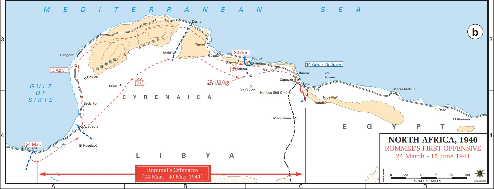
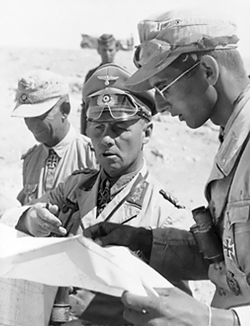
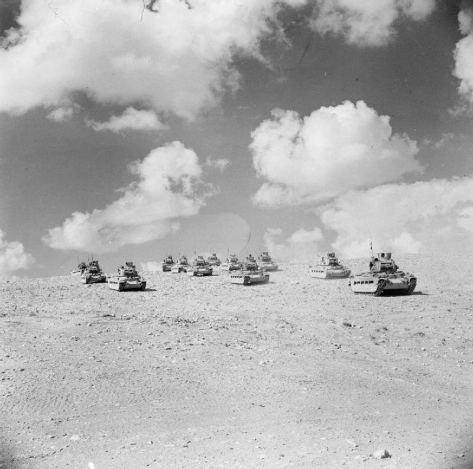
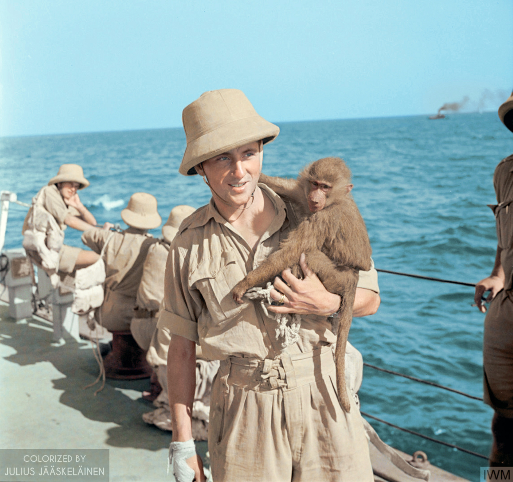
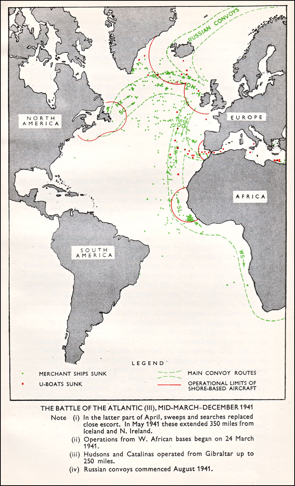
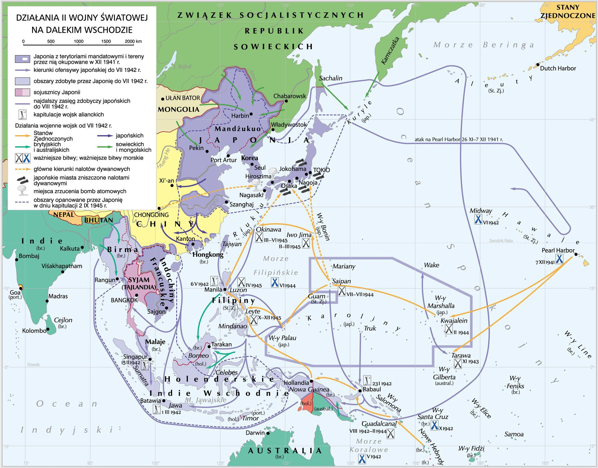

<!-- .slide: id="otwarcie" data-purpose="opening" data-layout="statement" -->

  

    
KLASA VIII · 45 MIN

    <h1>Wojna poza Europą</h1>
    
Trzy teatry. Trzy punkty zwrotne.

    
Jak od pustyni po ocean alianci odebrali państwom Osi inicjatywę?

  

  <figure class="opening-photo source-figure">
    <figcaption>Pearl Harbor, 7 XII 1941 · US Navy / ZPE, domena publiczna</figcaption>
  </figure>

Note:
> Rozpocznij: „Wyobraźcie sobie wojnę, w której zwycięstwo zależy od paliwa dowiezionego przez pustynię, statków ukrytych pod Atlantykiem i lotniskowców, których przeciwnik nie widzi”. Poproś o pierwszą hipotezę: co łączy te trzy sytuacje? Nie zdradzaj jeszcze odpowiedzi: kontrola szlaków i informacji.

---

<!-- .slide: id="trzy-teatry" data-purpose="explanation" data-layout="map-focus" data-goals="G1" -->
## Jedna wojna — trzy ogromne przestrzenie

  
  
<strong>AFRYKA PŁN.</strong>droga do Kanału Sueskiego

  
<strong>ATLANTYK</strong>szlak dostaw do Europy

  
<strong>AZJA I PACYFIK</strong>wyspy, morze, lotniskowce

Wskaż: gdzie odległość najbardziej utrudniała dostawy?

Note:
> To mapa orientacyjna, nie mapa granic. Uczniowie wskazują Afrykę Północną, Atlantyk i Pacyfik. Wyjaśnij pojęcie teatr działań wojennych: wielki obszar, na którym toczą się powiązane operacje. Zwróć uwagę, że „poza Europą” nie znaczy „na marginesie wojny”.

---

<!-- .slide: id="chronologia" data-purpose="explanation" data-layout="timeline-band" data-goals="G2" -->
## Oś wydarzeń: 1939–1943

  
<time>IX 1939</time><strong>Bitwa o Atlantyk</strong>trwa do V 1945

  
<time>13 IX 1940</time><strong>Włosi wkraczają do Egiptu</strong>początek ofensywy z Libii

  
<time>27 IX 1940</time><strong>Pakt trzech</strong>Niemcy · Włochy · Japonia

  
<time>7–8 XII 1941</time><strong>Pearl Harbor i wojna USA z Japonią</strong>

  
<time>VI 1942</time><strong>Midway</strong>przełom strategiczny

  
<time>X 1942 – V 1943</time><strong>El Alamein · „Torch” · kapitulacja Osi</strong>

Note:
> Oś porządkuje wydarzenia, ale trzy teatry omawiamy osobno. Podkreśl, że Atlantyk trwa niemal przez całą wojnę, a Japonia prowadziła pełnoskalową wojnę z Chinami już od 1937 r.; w grudniu 1941 r. rozszerzyła konflikt na USA i zachodnich aliantów.

---

<!-- .slide: id="afryka-mapa" data-purpose="evidence" data-layout="map-focus" data-goals="G1 G2" -->
<a class="map-link" href="assets/mapa-afryka-rommel-1941.jpg" aria-label="Otwórz mapę Afryki Północnej w pełnym rozmiarze">
  
  

</a>

Note:
> Odczytajcie tylko cztery elementy: Libię, Egipt, Tobruk i kierunek na Kanał Sueski. Mapa pokazuje ofensywę Rommla do 1941 r.; nie przedstawia całej kampanii. Pytanie: dlaczego port w Tobruku mógł skrócić drogę zaopatrzenia wojsk Osi? Kliknięcie otwiera mapę w pełnym rozmiarze.

---

<!-- .slide: id="afrika-korps" data-purpose="explanation" data-layout="split" data-goals="G2" -->
## Pustynia: paliwo, porty i odległość

  

    
<strong>IX 1940</strong> · włoskie wojska z Libii uderzają na Egipt.

    
<strong>II 1941</strong> · Niemcy wysyłają <b>Afrika Korps</b>, aby wesprzeć Włochów.

    
<strong>Erwin Rommel</strong> · rozpoznawalny dowódca niemiecki; nie dowodził wszystkimi wojskami Osi przez całą kampanię.

    
<strong>Stawka</strong> · porty, Kanał Sueski i dostawy przez Morze Śródziemne.

  

  <figure class="source-figure portrait-frame">
    
    <figcaption>Erwin Rommel w Afryce Północnej · Bundesarchiv / ZPE, CC BY-SA 3.0 DE</figcaption>
  </figure>

Note:
> Wyjaśnij, że Afrika Korps był niemieckim korpusem ekspedycyjnym, a nie nazwą wszystkich wojsk Osi w Afryce. Działania na pustyni zależały od paliwa, wody i części zamiennych. Szybki marsz mógł wydłużyć własne linie zaopatrzenia i osłabić armię.

---

<!-- .slide: id="tobruk" data-purpose="evidence" data-layout="evidence" data-goals="G2 G3" -->
## Tobruk 1941: port, którego nie udało się szybko zdobyć

  <figure class="source-figure tobruk-main">
    
    <figcaption>Niemieckie czołgi przed Tobrukiem · Bundesarchiv / ZPE, CC BY-SA 3.0 DE</figcaption>
  </figure>
  

    
Obrońcy utrzymali port mimo oblężenia wojsk Osi.

    
<b>Samodzielna Brygada Strzelców Karpackich</b> walczyła w Tobruku od sierpnia do grudnia 1941 r.

    
„<b>Szczury Tobruku</b>” — początkowo drwiące określenie obrońców, przyjęte przez nich jako honorowy przydomek.

    <figure class="source-figure inset-photo">
      
      <figcaption>Polski żołnierz w Tobruku, 1941 · AWM, domena publiczna</figcaption>
    </figure>
  

Note:
> Nie sugeruj, że Polacy bronili Tobruku od początku oblężenia. Brygada przybyła w sierpniu 1941 r. i walczyła tam do grudnia. Zapytaj: co dawało aliantom utrzymanie portu na tyłach przeciwnika? Oczekuj: utrudniało dostawy i wiązało siły Osi.

---

<!-- .slide: id="afryka-przelom" data-purpose="explanation" data-layout="timeline-band" data-goals="G2 G3" -->
## Dwa uderzenia — jeden koniec kampanii

  

    WSCHÓD
    <strong>El Alamein</strong>
    <time>23 X – 4 XI 1942</time>
    
8 Armia gen. <b>Bernarda Montgomery’ego</b> zatrzymuje i odrzuca wojska Osi.

  

  

    ZACHÓD
    <strong>operacja „Torch”</strong>
    <time>od 8 XI 1942</time>
    
Desant aliantów w Maroku i Algierii; naczelnym dowódcą jest gen. <b>Dwight D. Eisenhower</b>.

  

  

    <b>13 V 1943</b> · po etapowych kapitulacjach kończy się kampania w Afryce Północnej.
  

Note:
> Rozdziel postacie: Montgomery — brytyjska 8 Armia i El Alamein; Eisenhower — naczelne dowództwo „Torch”. Nie mów, że Rommel kapitulował: opuścił Afrykę w marcu 1943 r. Wyjaśnij mechanizm „kleszczy”: od wschodu natarcie 8 Armii, od zachodu wojska lądujące w ramach „Torch”.

---

<!-- .slide: id="atlantyk-mapa" data-purpose="evidence" data-layout="map-focus" data-goals="G1 G3" -->
<a class="map-link" href="assets/mapa-konwoje-atlantyk-1941.jpg" aria-label="Otwórz mapę konwojów atlantyckich w pełnym rozmiarze">
  
  

</a>

Note:
> Tytuł mapy jest po angielsku, ale legenda jest zbędna do zadania. Poproś o wskazanie: skąd wypływały konwoje i do jakich portów zmierzały. Dostrzeżcie skupienie tras na północnym Atlantyku. Pytanie: co stałoby się z Wielką Brytanią bez tych dostaw? Kliknięcie otwiera mapę.

---

<!-- .slide: id="konwoj-kontra-u-boot" data-purpose="explanation" data-layout="comparison" data-goals="G2 G3" -->
## Bitwa o Atlantyk: wyścig wykrycia i ochrony

  

    U-BOOTY
    <strong>„wilcze stada”</strong>
    
Grupy okrętów podwodnych szukały konwojów i atakowały nocą.

  

  
VS

  

    ALIANCI
    <strong>system warstwowy</strong>
    <ul>
      <li>konwoje i eskorty;</li>
      <li>radar, sonar i radionamierzanie;</li>
      <li>lotnictwo dalekiego zasięgu;</li>
      <li>wywiad, w tym odczytywanie Enigmy;</li>
      <li>rosnąca produkcja statków.</li>
    </ul>
  

<b>Wiosna 1943:</b> przełom na korzyść aliantów — ale walka trwa do maja 1945 r.

Note:
> Bitwa trwała od września 1939 do maja 1945 r. Unikaj wyjaśnienia jednym czynnikiem. Sukces powstał z połączenia informacji, technologii, eskorty, lotnictwa, szkolenia i produkcji. Wyjaśnij konwój: grupa statków handlowych płynąca wspólnie pod ochroną okrętów wojennych.

---

<!-- .slide: id="enigma-film" data-purpose="practice" data-layout="plain" data-goals="G3" -->
## Enigma: informacja, która skracała poszukiwanie

  
<b>Przed filmem:</b> zanotuj jedno zdanie — jak informacja może chronić konwój?

  <lesson-video>
    
<strong>Film · 3:18</strong>
Polski wkład w złamanie Enigmy.
<button data-video-play type="button">Odtwórz film</button>

    <iframe data-video-src="https://www.youtube-nocookie.com/embed/cF4RL9UXbTY" title="Złamanie przez Polaków kodów maszyny szyfrującej Enigma" allow="accelerometer; autoplay; clipboard-write; encrypted-media; gyroscope; picture-in-picture" allowfullscreen hidden></iframe>
  </lesson-video>
  
<b>Po filmie:</b> ułóż łańcuch: meldunek → odczyt → zmiana trasy → …

  
<b>Plan B:</b> Rejewski, Różycki i Zygalski przełamali podstawy systemu przed wojną; alianci rozwijali odczyt podczas wojny.

Note:
> Film nie może prowadzić do wniosku „Enigma wygrała bitwę”. Po odpowiedzi uczniów dopowiedz: odczyt pomagał omijać koncentracje U-Bootów lub kierować eskortę, ale trzeba było jeszcze wykryć okręt, ochronić statki i utrzymać produkcję. Polski wkład dotyczył przełamania podstaw systemu przed wojną; późniejsza praca była aliancka i ciągła.

---

<!-- .slide: id="pakt-i-ekspansja" data-purpose="explanation" data-layout="process" data-goals="G2" -->
## Japonia rozszerza wojnę

  
<time>od 1937</time><strong>Wojna z Chinami</strong>Japonia prowadzi pełnoskalowe działania w Azji.

  
<time>27 IX 1940</time><strong>Pakt trzech</strong>Niemcy, Włochy i Japonia tworzą sojusz polityczno-wojskowy.

  
<time>1941</time><strong>Spór o surowce</strong>Ekspansja Japonii i sankcje USA pogłębiają konflikt.

  
<time>7 XII 1941</time><strong>Pearl Harbor</strong>Atak ma czasowo sparaliżować amerykańską Flotę Pacyfiku.

Note:
> Nie mów „Japonia przystąpiła do II wojny światowej dopiero w 1941 r.”. Od 1937 r. prowadziła wojnę z Chinami. W grudniu 1941 r. zaatakowała USA, Wielką Brytanię i ich posiadłości, rozszerzając konflikt. Pakt trzech nie był jednym wspólnym planem wszystkich operacji, lecz sojuszem i próbą odstraszania USA.

---

<!-- .slide: id="pearl-harbor-film" data-purpose="practice" data-layout="plain" data-goals="G2 G3" -->
## Pearl Harbor: zwycięstwo taktyczne, skutek strategiczny

  
<b>Obserwuj:</b> ① cel ataku ② czego nie zniszczono ③ skutek polityczny.

  <lesson-video>
    
<strong>Film · 3:09</strong>
Atak na Pearl Harbor, 7 XII 1941.
<button data-video-play type="button">Odtwórz film</button>

    <iframe data-video-src="https://www.youtube-nocookie.com/embed/JpLsmnQbSW8" title="Atak na Pearl Harbor" allow="accelerometer; autoplay; clipboard-write; encrypted-media; gyroscope; picture-in-picture" allowfullscreen hidden></iframe>
  </lesson-video>
  
<b>Po filmie:</b> dlaczego atak nie wyeliminował USA z wojny?

  
<b>Plan B:</b> lotniskowce były poza portem; 8 grudnia Kongres USA wypowiedział Japonii wojnę.

Note:
> Uporządkuj odpowiedzi: celem była Flota Pacyfiku; lotniskowce ocalały, ponieważ były poza bazą; atak zjednoczył opinię publiczną i doprowadził do wypowiedzenia wojny przez USA 8 grudnia. 11 grudnia Niemcy i Włochy wypowiedziały wojnę USA. Nie używaj sformułowania „ogłoszenie stanu wojennego”.

---

<!-- .slide: id="roosevelt-zrodlo" data-purpose="explanation" data-layout="source-split" data-goals="G3" -->
## Głos źródła: Roosevelt do Kongresu

  
8 grudnia 1941 r.

  <blockquote>„Wczoraj, 7 grudnia 1941 roku — data, która okryje się hańbą — Stany Zjednoczone Ameryki zostały nagle i z rozmysłem zaatakowane przez siły morskie i lotnicze Cesarstwa Japonii”.</blockquote>
  
Franklin D. Roosevelt, orędzie do Kongresu, tłumaczenie dydaktyczne krótkiego fragmentu za National Archives.

<b>Zaznacz dwa słowa lub wyrażenia</b>, którymi prezydent buduje przekonanie, że USA są ofiarą zaplanowanej agresji. Dopisz ich cel.

Note:
> To krótkie tłumaczenie dydaktyczne, nie oficjalny polski przekład. Oczekiwane zwroty: „data, która okryje się hańbą”, „nagle”, „z rozmysłem”, „zaatakowane”. Cel: uzasadnić wypowiedzenie wojny i zjednoczyć społeczeństwo. Nie pytaj tylko „co autor powiedział?”, lecz jak dobór słów działa na odbiorcę.

---

<!-- .slide: id="pacyfik-mapa" data-purpose="evidence" data-layout="map-focus" data-goals="G1 G2" -->
<a class="map-link" href="assets/mapa-daleki-wschod-zpe.jpg" aria-label="Otwórz mapę wojny na Dalekim Wschodzie w pełnym rozmiarze">
  
  

</a>

Note:
> Mapa pokazuje podboje i kierunki działań Japonii w latach 1941–1942 oraz obszar wpływów z 1939 r. Uczniowie wskazują: Filipiny, Malaje/Singapur, Holenderskie Indie Wschodnie, Midway i Guadalcanal. Pytanie: dlaczego odległość od Japonii utrudniała utrzymanie zdobyczy? Zwróć uwagę na rozproszenie wysp i długie szlaki morskie.

---

<!-- .slide: id="midway-film" data-purpose="practice" data-layout="plain" data-goals="G2 G3" -->
## Midway, 4–7 czerwca 1942: inicjatywa zaczyna się zmieniać

  
<b>Obserwuj:</b> dlaczego lotniskowce, rozpoznanie i informacja były ważniejsze niż spotkanie pancerników?

  <lesson-video>
    
<strong>Fragment · 4:35–7:42</strong>
Midway i zmiana inicjatywy.
<button data-video-play type="button">Odtwórz fragment</button>

    <iframe data-video-src="https://www.youtube-nocookie.com/embed/CjtLLYdEEpQ?start=275&amp;end=462" title="Decydujące starcia na Pacyfiku — fragment o Midway" allow="accelerometer; autoplay; clipboard-write; encrypted-media; gyroscope; picture-in-picture" allowfullscreen hidden></iframe>
  </lesson-video>
  
<b>Wniosek w 12 słowach:</b> Midway było przełomem, ponieważ…

  
<b>Plan B:</b> kryptolodzy pomogli przewidzieć cel; samoloty zatopiły cztery japońskie lotniskowce.

Note:
> Odtwórz tylko fragment 4:35–7:42. Midway było przełomem strategicznym, ale nie „wygrało wojny w jeden dzień”. USA nadal musiały przejść do długiej ofensywy. Zwiąż z głównym problemem lekcji: informacja umożliwiła koncentrację sił we właściwym miejscu.

---

<!-- .slide: id="guadalcanal" data-purpose="explanation" data-layout="process" data-goals="G2 G3" -->
## Guadalcanal: od obrony do ofensywy

  

    7 VIII 1942 – 9 II 1943
    <strong>KAMPANIA</strong>
    
ląd + morze + powietrze

  

  

    
<b>1.</b> Marines zajmują powstające lotnisko.

    
<b>2.</b> Japonia próbuje dowozić ludzi i zaopatrzenie nocą.

    
<b>3.</b> Obie strony walczą o kontrolę morza i przestrzeni powietrznej.

    
<b>4.</b> Japonia wycofuje wojska; alianci utrzymują inicjatywę.

  

Nie jedna bitwa, lecz półroczna kampania wielu starć.

Note:
> Wyjaśnij, że zdobycie lotniska Henderson Field wpływało na walki morskie: samoloty mogły atakować transporty w dzień. Nocne rejsy japońskich niszczycieli nazywano „Tokyo Express”. Ciekawostka, ale służy mechanizmowi: szybkie dostawy żołnierzy nie rozwiązywały problemu dostarczania ciężkiego sprzętu i żywności.

---

<!-- .slide: id="trzy-punkty-zwrotne" data-purpose="practice" data-layout="plain" data-goals="G3" -->
## Trzy teatry — trzy punkty zwrotne

  
AFRYKA<strong>El Alamein + „Torch”</strong>
Wojska Osi cofają się i zostają ujęte w kleszcze.

  
ATLANTYK<strong>przełom 1943</strong>
Warstwowa ochrona konwojów ogranicza skuteczność U-Bootów.

  
PACYFIK<strong>Midway + Guadalcanal</strong>
Japonia traci swobodę ofensywy, a alianci przechodzą do natarcia.

<b>W parach:</b> wybierzcie jeden teatr i ułóżcie zdanie „Alianci przejęli inicjatywę, ponieważ…”. Użyjcie dwóch konkretnych dowodów.

Note:
> Daj parom 2 minuty, potem poproś trzy pary — po jednej na teatr — o odczytanie zdania. Kryterium: mechanizm plus dwa fakty, nie sama data. W razie potrzeby podpowiedz bank pojęć: zaopatrzenie, konwój, informacja, lotniskowiec, kleszcze.

---

<!-- .slide: id="notatka" data-purpose="synthesis" data-layout="takeaways" data-goals="G1 G2 G3" -->
## Notatka: co łączyło zwycięstwa aliantów?

  
<b>Afryka:</b> utrata przez Oś inicjatywy po El Alamein i „Torch”; koniec kampanii 13 V 1943.

  
<b>Atlantyk:</b> konwoje + eskorta + lotnictwo + technika + wywiad; przełom wiosną 1943.

  
<b>Pacyfik:</b> Pearl Harbor wciągnęło USA do wojny; Midway osłabiło siły lotniskowców Japonii.

  
<b>Guadalcanal:</b> alianci przeszli do ofensywy w kampanii lądowej, morskiej i powietrznej.

  
<b>Wspólny mechanizm:</b> kontrola szlaków, przewaga informacji i zdolność uzupełniania strat.

Note:
> To gotowa notatka do zdjęcia lub przepisania. Wróć do pytania z otwarcia. Uczniowie powinni dostrzec, że nie jedna „wielka bitwa”, lecz połączenie logistyki, informacji i narastającej przewagi materialnej pozwalało aliantom przejąć inicjatywę.

---

<!-- .slide: id="bilet" data-purpose="exit-ticket" data-layout="plain" data-goals="G1 G2 G3" -->
## Bilet wyjścia · 3 minuty

  
1Wybierz jeden teatr wojny i nazwij jego punkt zwrotny.

  
2Wyjaśnij mechanizm zmiany inicjatywy jednym zdaniem.

  
3Dodaj konkretny dowód: datę, miejsce, technologię albo decyzję.

„Na pustyni, oceanie i wyspach wygrywał nie tylko ten, kto atakował — lecz ten, kto potrafił dowieźć, wykryć i uzupełnić”.

Note:
> Zbierz odpowiedzi. Poprawna odpowiedź musi zawierać nazwany teatr, punkt zwrotny i mechanizm. Nie wymagaj tej samej interpretacji od wszystkich, ale odrzuć zdania typu „alianci wygrali, bo byli lepsi” bez dowodu.

---

<!-- .slide: id="zrodla" data-purpose="reference" data-layout="plain" -->
## Źródła i materiały

  

    <h3>Treść historyczna</h3>
    
Zintegrowana Platforma Edukacyjna, „Wojna poza Europą”.

    
National Archives, „Day of Infamy” Speech.

    
U.S. Department of State, Pearl Harbor.

    
National WWII Museum: Midway i Guadalcanal.

  

  

    <h3>Mapy i fotografie</h3>
    
ZPE; Bundesarchiv; US Navy; Australian War Memorial.

    
Wikimedia Commons: AfricaMap2, Atlantic Convoy Routes 1941, BlankMap-World.

    
Pełne adresy, licencje i sumy kontrolne: <b>sources.md</b>.

  

Dostęp do stron: 22 IX 2026 · prezentacja działa offline poza opcjonalnymi filmami.

Note:
> Nie omawiaj slajdu w trakcie lekcji. Zostaw go do wglądu. Przypomnij, że mapy upraszczają rzeczywistość, a każda służyła konkretnemu pytaniu przestrzennemu.
