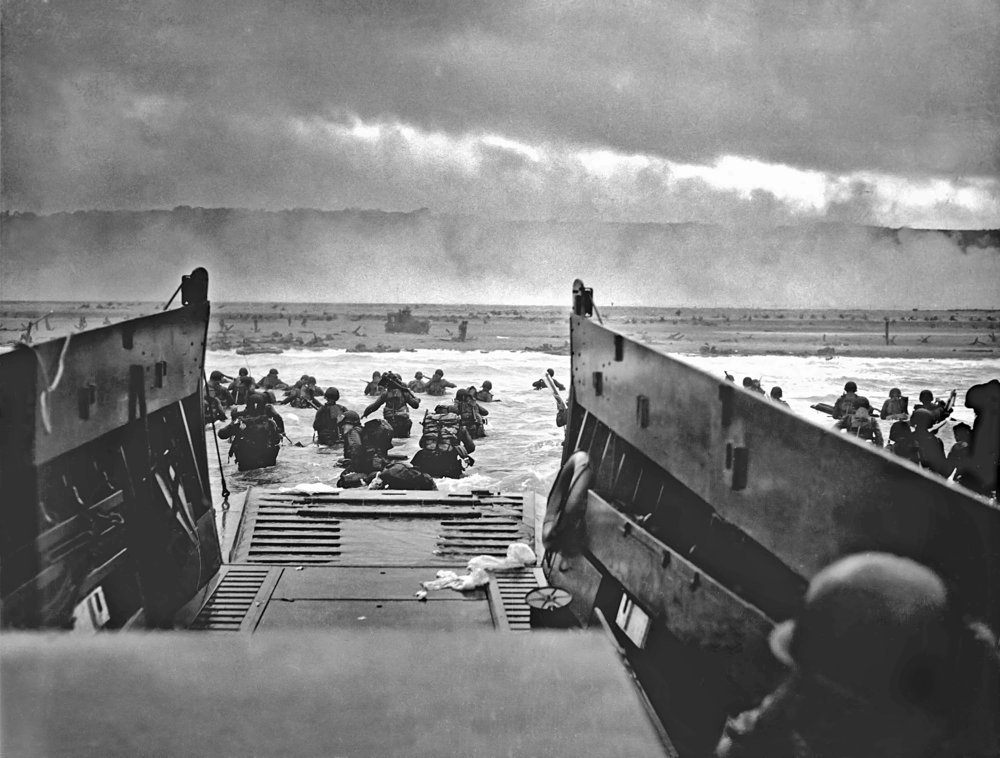
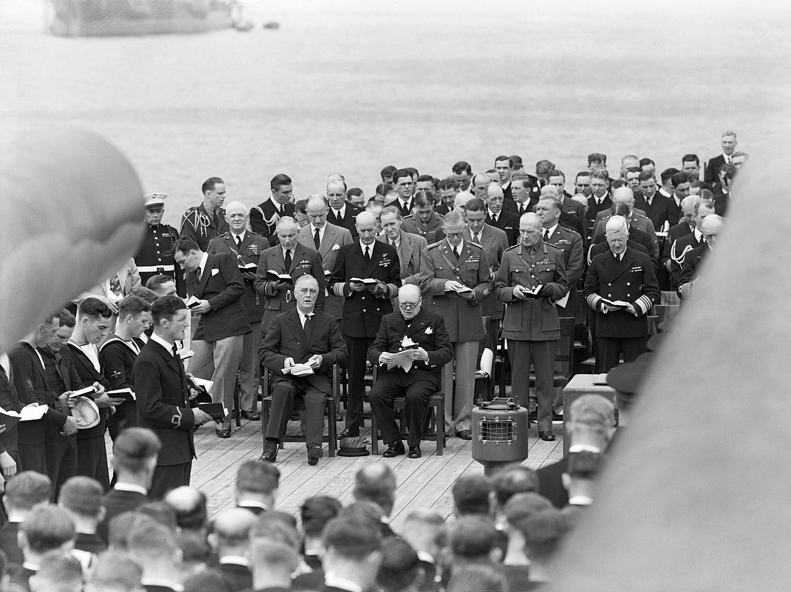
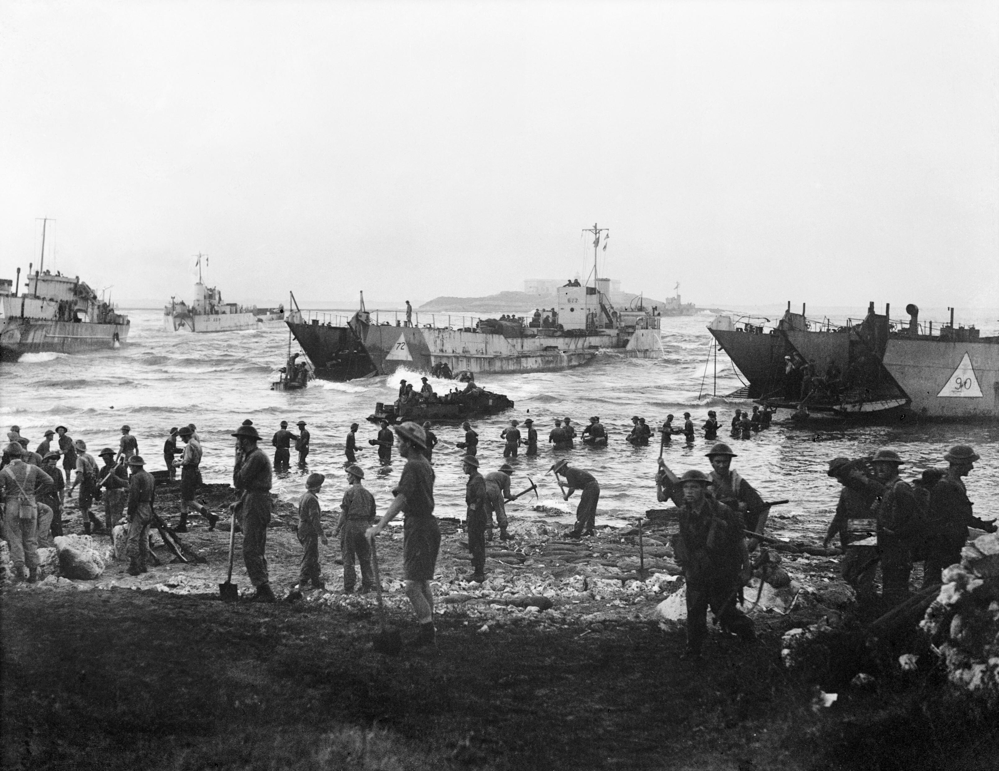
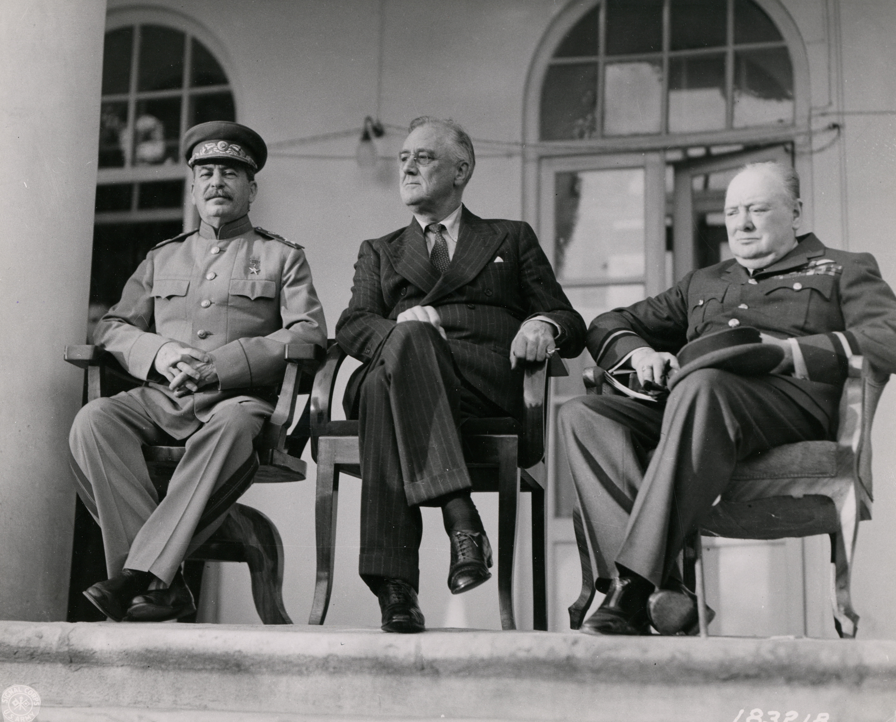
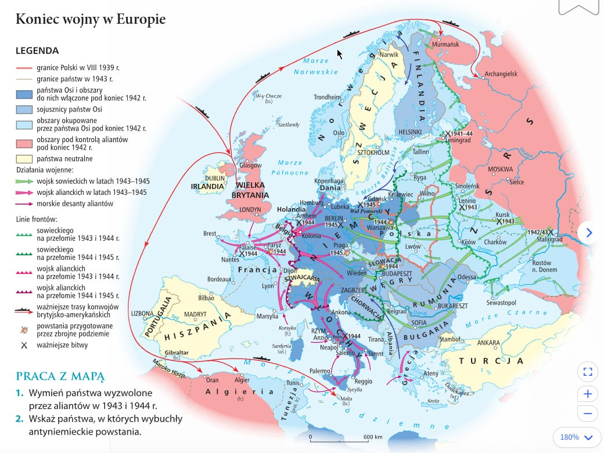
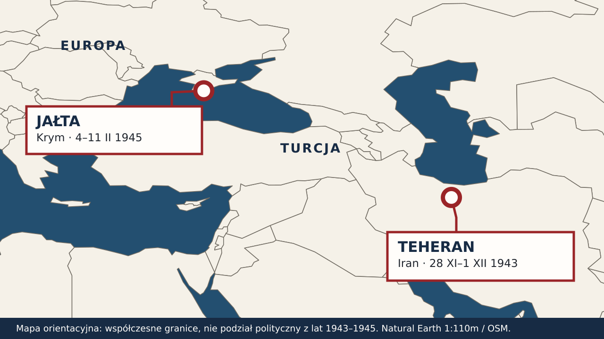
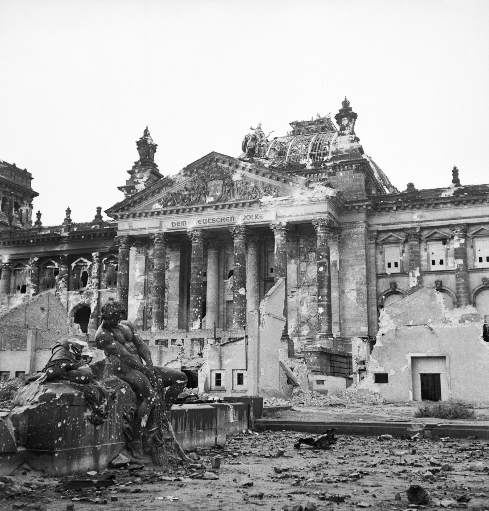
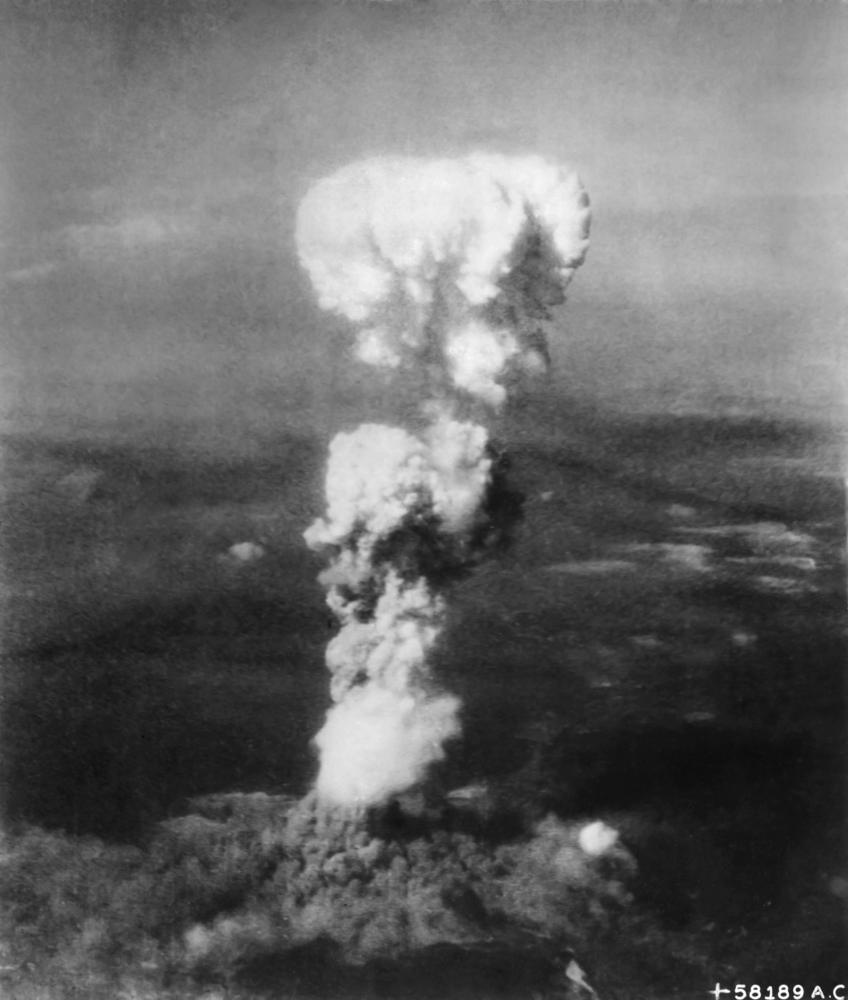

<!-- .slide: id="otwarcie" data-purpose="opening" data-layout="hero-source" data-goals="G1" -->

HISTORIA · KLASA VIII
<h1>Droga do zwycięstwa</h1>
Od pomocy dla aliantów do kapitulacji Niemiec i Japonii

<figure class="source-figure"><figcaption>Desant w Normandii, 6 VI 1944</figcaption></figure>

Note:
> „Wojna nie skończyła się jednym uderzeniem. Jak państwa o różnych celach potrafiły działać razem?” Zdjęcie Roberta F. Sargenta pokazuje jedną plażę, nie całą operację.

---

<!-- .slide: id="izolacjonizm" data-purpose="explanation" data-layout="split" data-goals="G1" -->
## USA: daleko od wojny?

<b>Izolacjonizm lat 30.</b>
Wielu Amerykanów nie chciało kolejnej wojny w Europie.

Ustawy o neutralności ograniczały udział USA w konfliktach.

<b>Zmiana krok po kroku</b>
Władze USA chciały pomóc Wielkiej Brytanii walczącej z Niemcami.

Pomoc nie oznaczała jeszcze wejścia USA do wojny.

<b>Izolacjonizm:</b> dążenie do niewłączania się w konflikty i sojusze za oceanem.

Note:
> Nie mów, że USA całkowicie odcięły się od świata: nadal handlowały i prowadziły politykę zagraniczną. Chodzi o silną niechęć do nowej wojny i ograniczenia prawne.

---

<!-- .slide: id="lend-lease" data-purpose="explanation" data-layout="process" data-goals="G1" -->
## Lend-Lease Act · 11 marca 1941

<strong>Pomoc przed przystąpieniem do wojny</strong>
USA mogły przekazywać sprzęt, żywność i surowce państwom ważnym dla swojej obrony.

Początkowo pomoc miała szczególne znaczenie dla <b>Wielkiej Brytanii</b>.

<b>Lend-Lease</b> — „pożyczka i dzierżawa”: dostawy bez konieczności natychmiastowej zapłaty.

Note:
> To decyzja sprzed ataku Niemiec na ZSRR i sprzed wejścia USA do wojny. Ilustracją jest informacyjny blok dostaw, bez dekoracyjnego niezweryfikowanego plakatu.

---

<!-- .slide: id="karta-atlantycka" data-purpose="evidence" data-layout="split" data-goals="G1" -->
## Karta atlantycka · 14 sierpnia 1941

<figure class="source-figure"><figcaption>Roosevelt i Churchill podczas spotkania, 10 VIII 1941</figcaption></figure>

<b>USA i Wielka Brytania</b> ogłaszają cele wojny i zasady przyszłego pokoju.

Bez podbojów; narody mają decydować o swojej przyszłości.

To <b>deklaracja zasad</b>, nie traktat wojskowy ani przystąpienie USA do wojny.

Note:
> Po Lend-Lease pokaż drugi krok zbliżenia USA i Wielkiej Brytanii: wspólna wizja ładu powojennego. Spotkanie Roosevelta z Churchillem odbyło się w sierpniu na Atlantyku, tekst ogłoszono 14 VIII. Wcześniej, 22 VI, Niemcy zaatakowały ZSRR, a 12 VII podpisano układ brytyjsko-sowiecki; te wydarzenia uporządkuje następny slajd. Sama Karta nie była formalnym sojuszem i nie oznaczała wejścia USA do wojny.

---

<!-- .slide: id="rok-1941" data-purpose="explanation" data-layout="timeline-band" data-goals="G1" -->
## Rok 1941: nowi partnerzy

<time>22 VI</time>
Niemcy napadają na ZSRR. Wielka Brytania i ZSRR podejmują wspólną walkę; <b>12 VII podpisują układ</b>.

<time>14 VIII</time>
<b>Roosevelt i Churchill</b> ogłaszają Kartę atlantycką — cele wojny i przyszłego pokoju.

<time>7 XII</time>
Japonia atakuje Pearl Harbor. <b>USA przystępują do wojny</b>.

Karta atlantycka była <b>deklaracją zasad</b>, nie formalnym traktatem wojskowym.

Note:
> Rozdziel układ brytyjsko-sowiecki, Kartę atlantycką i wejście USA do wojny. Niemcy wypowiedziały USA wojnę 11 XII.

---

<!-- .slide: id="wielka-koalicja" data-purpose="explanation" data-layout="comparison" data-goals="G1" -->
## Wielka Koalicja

<b>Wielka Brytania</b>walczy z III Rzeszą od 1939 r.

<b>ZSRR</b>walczy z Niemcami od VI 1941 r.

<b>USA</b>wchodzą do wojny w XII 1941 r.

Łączył ich wspólny przeciwnik. Różniły ich ustrój i wizja powojennej Europy.

Note:
> Wielka Koalicja obejmowała także inne państwa alianckie. Tutaj skupiamy się na trzech mocarstwach. Wielka Trójka to przywódcy Wielkiej Brytanii, USA i ZSRR na konferencjach w Teheranie i Jałcie.

---

<!-- .slide: id="kursk-wlochy" data-purpose="explanation" data-layout="split" data-goals="G2" -->
## Rok 1943: Niemcy pod presją

<figure class="source-figure"><figcaption>Lądowanie na Sycylii, 10 VII 1943</figcaption></figure>

<b>Łuk Kurski · VII:</b> nieudana ofensywa Niemiec; Armia Czerwona umacnia inicjatywę.

<b>Sycylia · VII:</b> alianci zachodni rozpoczynają inwazję.

<b>Włochy · od IX:</b> desant na kontynencie; Włochy wychodzą z sojuszu, lecz Niemcy bronią się dalej.

Note:
> Sycylia i Kursk są równoległymi wydarzeniami, nie przypisuj między nimi prostego związku przyczynowego. Na kontynencie alianci lądowali od 3 IX, kapitulację Włoch ogłoszono 8 IX. Zdjęcie przedstawia rozładunek zaopatrzenia podczas desantu.

---

<!-- .slide: id="teheran" data-purpose="evidence" data-layout="split" data-goals="G1 G2" -->
## Teheran · 1943

<figure class="source-figure"><figcaption>Stalin, Roosevelt i Churchill, Teheran 1943</figcaption></figure>

<b>Wielka Trójka</b> uzgadnia współdziałanie przeciw Niemcom.

Alianci planują desant w <b>północnej Francji</b> i natarcie ZSRR na wschodzie w 1944 r.

Rozmawiają także o przyszłości Europy.

Note:
> Spotkanie 28 XI–1 XII 1943 r. Odróżnij decyzję o desancie od wykonania jej pół roku później. Już tu dyskutowano o powojennej Europie; zestawienie z Jałtą dotyczy dominującego celu konferencji.

---

<!-- .slide: id="normandia" data-purpose="explanation" data-layout="split" data-goals="G2" -->
## Normandia · 6 czerwca 1944

<figure class="source-figure"><figcaption>Omaha Beach podczas desantu w Normandii</figcaption></figure>

<b>Operacja „Overlord”:</b> desant aliantów zachodnich w północnej Francji.

Otwiera tzw. <b>drugi front</b> przeciw III Rzeszy na zachodzie.

Niemcy muszą bronić się jednocześnie na wschodzie i zachodzie.

Note:
> Drugi front we Francji nie oznacza, że wcześniej nie walczono we Włoszech. Alianci wyzwolili Paryż w sierpniu 1944 r.

---

<!-- .slide: id="mapa-europy" data-purpose="evidence" data-layout="plain" data-goals="G2" -->

Note:
> To dokładnie mapa z s. 41 przekazana przez nauczyciela. Wskaż Sycylię, Normandię, Białoruś i Berlin; porównaj drogę wojsk zachodnich i Armii Czerwonej oraz obszary zdobyte do przełomu 1944/45. Nie przypisuj wszystkich strzałek jednemu rokowi. Jeśli legenda jest za mała, uczniowie otwierają papierowy podręcznik. Nie publikuj reprodukcji bez ustalenia praw.

---

<!-- .slide: id="bagration" data-purpose="explanation" data-layout="process" data-goals="G2" -->
## Operacja „Bagration” · 22 czerwca 1944

<strong>Ofensywa Armii Czerwonej na Białorusi</strong>
Wojska radzieckie rozbijają niemiecką <b>Grupę Armii „Środek”</b> i zdobywają Mińsk.

Front wschodni przesuwa się daleko na zachód, ku ziemiom polskim.

Normandia i „Bagration” to <b>równoległe ofensywy</b> przeciw Niemcom, nie jedna operacja.

Note:
> Operacja rozpoczęła się 22 VI, Mińsk zdobyto 3 VII 1944. Nie twierdź, że zdobycie Berlina nastąpiło wtedy — dopiero wiosną 1945 r. Miejsce wskaż na poprzedniej mapie. Unikaj niesprawdzonych liczb strat.

---

<!-- .slide: id="przelom-1944-45" data-purpose="explanation" data-layout="timeline-band" data-goals="G2" -->
## Na przełomie 1944 i 1945 roku

<time>Zachód</time>
Wyzwolona większość Francji i Belgii; alianci docierają do zachodnich granic Niemiec.

<time>Wschód</time>
Armia Czerwona wypiera Niemców z Białorusi i dociera na ziemie polskie.

Niemcy walczą na kilku frontach, ale wojna w Europie <b>jeszcze trwa</b>.

Note:
> Oddziel zdobycze do końca 1944 r. od ofensywy styczniowej i bitwy o Berlin w 1945 r. W grudniu Niemcy kontratakowali w Ardenach.

---

<!-- .slide: id="porownanie-konferencji" data-purpose="explanation" data-layout="comparison" data-goals="G1 G3" -->
## Teheran a Jałta

TEHERAN · 1943
Wojna trwa. Jak wspólnie uderzyć na Niemcy?
<b>Desant we Francji + natarcie ZSRR</b>

JAŁTA · II 1945
Klęska Niemiec jest blisko. Co po wojnie?
<b>Los Niemiec, Polski i powstanie ONZ</b>

Churchill · Roosevelt · Stalin uczestniczyli w obu spotkaniach.

Note:
> To zestawienie priorytetów, nie wyłącznych tematów. W Jałcie mówiono też o wojnie z Japonią, w Teheranie o przyszłości Europy. Jałta 4–11 II 1945. Dla Polski ważne są kwestie granic i przyszłych wyborów; nie przedstawiaj deklaracji wolnych wyborów jako ich późniejszego spełnienia.

---

<!-- .slide: id="tekst-jalta" data-purpose="evidence" data-layout="evidence" data-goals="G3" -->
## Postanowienia jałtańskie wobec Niemiec

<figure class="document-surface"><blockquote>„Jesteśmy zdecydowani rozbroić i rozwiązać wszystkie niemieckie siły zbrojne; raz na zawsze zniszczyć niemiecki sztab generalny, który wielokrotnie doprowadzał do wskrzeszenia militaryzmu niemieckiego; usunąć lub zniszczyć wszelkie niemieckie urządzenia wojskowe; znieść lub poddać kontroli wszelkiego rodzaju przemysł niemiecki, który mógłby być użyty do produkcji wojennej; ukarać sprawiedliwie i szybko wszystkich zbrodniarzy wojennych oraz wyegzekwować odszkodowania w naturze za zniszczenia dokonane przez Niemców; unicestwić narodowosocjalistyczną partię, narodowosocjalistyczne ustawy, organizacje i instytucje; usunąć wszelkie wpływy narodowosocjalistyczne i militarystyczne z urzędów publicznych i z życia kulturalnego i gospodarczego narodu niemieckiego […]”.</blockquote><figcaption>Fragment sprawozdania z konferencji jałtańskiej; przekład: <i>Wiek XX w źródłach</i>, oprac. M. Sobańska-Bondaruk i S. B. Lenard, 2002, s. 308–309; podręcznik ucznia, s. 39.</figcaption></figure>

Note:
> Przepisano cały fragment widoczny na dostarczonym zdjęciu, zachowując końcowe […]. Tekst dotyczy planów wobec Niemiec, a nie miejsca desantu we Francji. Odczytaj wybrane zdania o rozbrojeniu i usunięciu nazistowskich instytucji. To polski przekład dokumentu przytoczony w późniejszym zbiorze, nie oryginalny tekst w języku angielskim. Przed lekcją porównaj transkrypcję z podręcznikiem.

---

<!-- .slide: id="mapa-konferencje" data-purpose="evidence" data-layout="map-focus" data-goals="G1" -->

Note:
> Po porównaniu postanowień i przeczytaniu tekstu pokaż, gdzie obie konferencje się odbyły: Teheran w Iranie, Jałta na Krymie nad Morzem Czarnym. To mapa współczesnych granic służąca wyłącznie lokalizacji, nie mapa polityczna II wojny światowej. Dane linii brzegowych i granic: Natural Earth 1:110m; współrzędne miast: OpenStreetMap/Nominatim.

---

<!-- .slide: id="berlin" data-purpose="explanation" data-layout="split" data-goals="G2" -->
## Berlin i kapitulacja Niemiec

<figure class="source-figure"><figcaption>Zniszczony Reichstag, 3 VI 1945 · po bitwie</figcaption></figure>

<b>IV–V 1945:</b> Armia Czerwona szturmuje Berlin; alianci zachodni nacierają z zachodu.

<b>2 V:</b> kończą się walki o Berlin.

<b>8/9 V:</b> kapitulacja Niemiec kończy wojnę w Europie.

Note:
> Fotografia jest późniejsza niż bitwa, nie przedstawia szturmu. Pierwszy akt kapitulacji podpisano 7 V w Reims; wszedł w życie 8 V wieczorem czasu środkowoeuropejskiego, potwierdzenie w Berlinie podpisano nocą 8/9 V. Berlin zdobyła Armia Czerwona.

---

<!-- .slide: id="mapa-pacyfik" data-purpose="evidence" data-layout="map-focus" data-goals="G3" -->

Note:
> Mapa ZPE pokazuje ogrom przestrzeni, na której nadal toczyła się wojna po kapitulacji Niemiec. Poproś o wskazanie Japonii i wybranych wysp na trasie amerykańskich działań. Nie zasłaniaj legendy dodatkowym podpisem.

---

<!-- .slide: id="daleki-wschod" data-purpose="explanation" data-layout="plain" data-goals="G3" -->
## Na Dalekim Wschodzie wojna trwa

<strong>„Żabie skoki”</strong>
USA zajmują wybrane wyspy, omijając część silnie bronionych baz.

<strong>Kamikadze</strong>
Japońscy piloci wykonują samobójcze ataki na alianckie okręty.

Mimo kapitulacji Niemiec Japonia walczy dalej.

Note:
> Taktyka przeskakiwania między wyspami zbliżała lotnictwo i flotę USA do Japonii, ograniczając koszt szturmowania każdej bazy. Kamikadze byli pilotami samobójczych ataków, nie wszystkimi żołnierzami Japonii. To kolejny teatr wojny, nie „dokończenie” europejskiej bitwy.

---

<!-- .slide: id="bomba-atomowa" data-purpose="evidence" data-layout="split" data-goals="G3" -->
## Sierpień 1945: bomby atomowe

<figure class="source-figure"><figcaption>Chmura nad Hiroszimą, 6 VIII 1945</figcaption></figure>

<b>6 VIII:</b> USA zrzucają bombę na Hiroszimę.

<b>9 VIII:</b> bomba spada na Nagasaki; ZSRR przystępuje do wojny z Japonią.

Bombardowania powodują ogromne cierpienie ludności cywilnej.

<b>2 IX:</b> Japonia podpisuje kapitulację.

Note:
> Nie przedstawiaj bomb jako bezkosztowego „skrócenia wojny”. Nie sprowadzaj decyzji o kapitulacji do jednej przyczyny; znaczenie miało też wejście ZSRR do wojny i wyczerpanie Japonii. Fotografia pokazuje Hiroszimę, nie Nagasaki.

---

<!-- .slide: id="rownolegle" data-purpose="synthesis" data-layout="timeline-band" data-goals="G2 G3" -->
## Trzy teatry wojny — ten sam czas

<b>1943</b><b>1944</b><b>1945</b>

<h3>EUROPA ZACHODNIA</h3>
<i></i><b>Sycylia</b><small>VII · desant</small>

<i></i><b>Normandia</b><small>VI · drugi front</small>

<i></i><b>Niemcy</b><small>V · kapitulacja</small>

<h3>FRONT WSCHODNI</h3>
<i></i><b>Łuk Kurski</b><small>VII · przełom</small>

<i></i><b>„Bagration”</b><small>VI · Białoruś</small>

<i></i><b>Berlin</b><small>V · zdobycie miasta</small>

<h3>AZJA I PACYFIK</h3>
<i></i><b>Guadalcanal</b><small>do II · koniec walk</small>

<i></i><b>Leyte</b><small>X · desant USA</small>

<i></i><b>Japonia</b><small>VIII–IX · bomby, kapitulacja</small>

Ta sama kolumna oznacza <b>ten sam rok</b>, nie tę samą datę.

Note:
> Poproś o odczytanie w pionie roku 1944: Normandia w czerwcu, operacja „Bagration” od czerwca, Leyte w październiku. Dwa pierwsze wydarzenia rzeczywiście zaczęły się w tym samym miesiącu; wydarzenia w jednej kolumnie nie musiały być jednoczesne co do dnia. Na Pacyfiku walki o Guadalcanal zakończyły się w lutym 1943 r., Amerykanie lądowali na Leyte w październiku 1944 r. W sierpniu 1945 r. spadły bomby atomowe, a we wrześniu Japonia podpisała kapitulację. Nie wywódź jednej ofensywy bezpośrednio z drugiej.

---

<!-- .slide: id="synteza" data-purpose="synthesis" data-layout="takeaways" data-goals="G1 G2 G3" -->
## Co prowadziło do zwycięstwa?

<ul class="takeaways"><li><b>Koalicja:</b> zasoby, pomoc i wspólne plany mimo różnic między sojusznikami.</li><li><b>Wiele frontów:</b> Włochy, Normandia i natarcie Armii Czerwonej osłabiały Niemcy.</li><li><b>Dwa finały:</b> Niemcy skapitulowały w maju, Japonia we wrześniu 1945 r.</li></ul>

Note:
> Wróć do pytania z początku. Zwycięstwo nie było skutkiem jednej bitwy, a koniec wojny nie oznaczał braku ofiar cywilnych.

---

<!-- .slide: id="bilet" data-purpose="exit-ticket" data-layout="activity-brief" data-goals="G2" -->
## Powiedz w parze

W parach wskażcie na osi <b>Normandię</b> i <b>„Bagration”</b>. Powiedzcie, co działo się równolegle w 1944 r. i dlaczego Niemcy musieli dzielić siły.

Note:
> 90 sekund: jedna osoba wskazuje wydarzenie na zachodzie, druga na wschodzie. Oczekiwana odpowiedź: w czerwcu 1944 r. alianci lądowali we Francji, a Armia Czerwona rozpoczęła ofensywę na Białorusi; Niemcy musieli bronić dwóch frontów. Nie sugeruj, że to była jedna operacja.

---

<!-- .slide: id="zrodla" data-purpose="reference" data-layout="plain" -->
## Źródła

- Podręcznik ucznia: mapa „Koniec wojny w Europie” (s. 41), fragment o Jałcie (s. 39) — materiały nauczyciela.
- Office of the Historian (USA): izolacjonizm, Lend-Lease, Karta atlantycka, Teheran i Jałta.
- ZPE: mapa wojny na Dalekim Wschodzie; Natural Earth i OpenStreetMap: orientacyjna mapa Teheranu i Jałty.
- Fotografie: US Coast Guard, Royal Navy/IWM, FDR Library, NARA — pełne dane w `sources.md`.

Note:
> Nie omawiaj w 35 minut. Reprodukcje podręcznika i jego przekładu nie są przeznaczone do publicznej dystrybucji bez weryfikacji praw.
