<!-- .slide: id="otwarcie" data-purpose="opening" data-layout="hero-source" -->

Historia · klasa VIII
<h1>Władze polskie na uchodźstwie</h1>
Układ, który dawał nadzieję

<figure class="source-figure">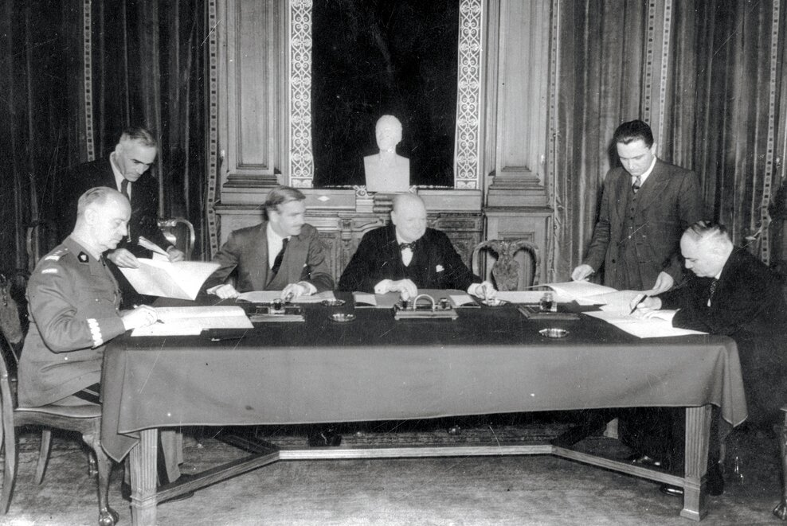<figcaption>Londyn, 30 lipca 1941 r.</figcaption></figure>

notes:
Rozpoczęcie: „Cały kraj zajmują wrogie armie. Prezydent i rząd muszą wyjechać. Czy Polska przestaje wtedy mieć władze? Zobaczymy, jak działało państwo poza krajem i dlaczego układ z niedawnym agresorem mógł dać nadzieję jego obywatelom”. Fotografia zapowiada kluczowy dokument; jego okoliczności wyjaśnimy przed analizą. Ilustracja: autentyczna fotografia podpisania układu, nie rekonstrukcja.

---

<!-- .slide: id="wrzesien-1939" data-purpose="explanation" data-layout="comparison" data-goals="G1" -->
## Władze Polski we wrześniu 1939 r.

<figure>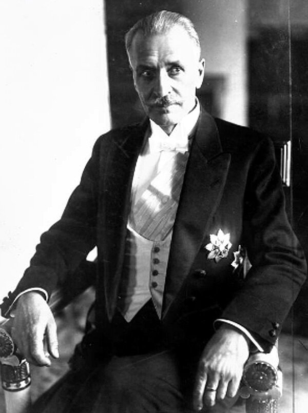<figcaption><b>Ignacy Mościcki</b> prezydent</figcaption></figure><figure>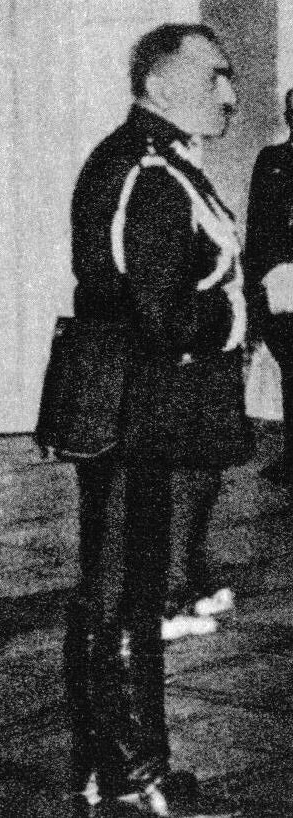<figcaption><b>Felicjan Sławoj Składkowski</b> premier</figcaption></figure><figure>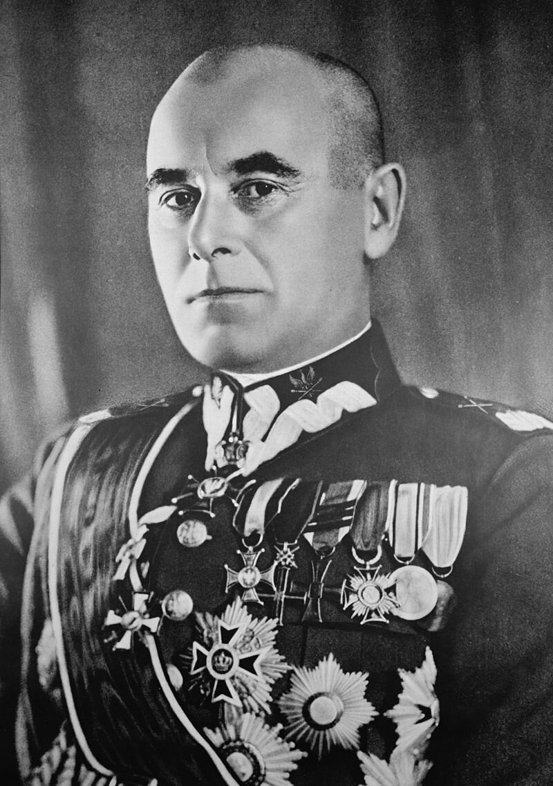<figcaption><b>Edward Rydz-Śmigły</b> Naczelny Wódz</figcaption></figure>

notes:
Rozróżnij funkcje: prezydent był głową państwa, premier kierował rządem, Naczelny Wódz dowodził siłami zbrojnymi w czasie wojny. Po ataku ZSRS dotychczasowe władze znalazły się w szczególnie trudnej sytuacji. Uczniowie wpisują trzy nazwiska w części A karty; nie przepisują całego slajdu. Ilustracja: trzy portrety historyczne.

---

<!-- .slide: id="mapa-ewakuacja" data-purpose="evidence" data-layout="evidence" data-goals="G1" -->
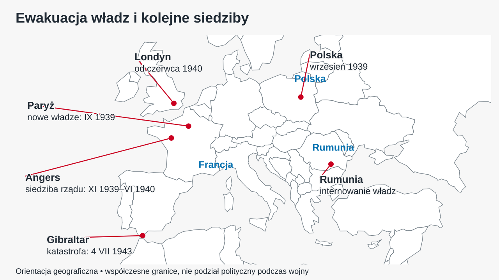
notes:
Wskaż: Polska — Rumunia — Francja — Wielka Brytania. W nocy 17/18 IX 1939 dotychczasowe władze przekroczyły granicę Rumunii; powołane później nowe władze działały w Paryżu i Angers, następnie w Londynie. Nie oznacza to, że te same osoby przebyły identyczną trasę. Warszawa orientuje Polskę, nie punkt przekroczenia granicy; punkt Rumunii przy Bukareszcie nie jest miejscem internowania wszystkich osób. Gibraltar wróci przy 1943 r. Linie to odnośniki podpisów, nie trasy. Mapa oparta na Natural Earth i zweryfikowanych współrzędnych OSM, ze współczesnymi granicami — nie mapa polityczna 1939. Ilustracja: pełnoekranowa mapa orientacyjna.

---

<!-- .slide: id="internowanie" data-purpose="explanation" data-layout="split" data-goals="G1" -->
## Rumunia: ewakuacja i internowanie

<figure class="source-figure"><figcaption>Ignacy Mościcki</figcaption></figure>

<b>17/18 IX 1939:</b> dotychczasowe władze opuszczają kraj.

W Rumunii zostają <b>internowane</b>.

<b>Internowanie</b> — przymusowe zatrzymanie i ograniczenie swobody działania.

Potrzebne są nowe władze, które mogą działać poza okupowaną Polską.

notes:
Nie był to zwykły wyjazd polityków do bezpiecznej siedziby, z której mogli dalej swobodnie rządzić. Internowanie ograniczyło ich możliwość działania. Rząd na uchodźstwie miał podtrzymać ciągłość państwa. Powtórzenie portretu służy tu innemu celowi: wyjaśnieniu sytuacji prezydenta, nie kolejnemu rozpoznawaniu nazwiska. Ilustracja: portret Mościckiego.

---

<!-- .slide: id="nowe-wladze" data-purpose="explanation" data-layout="comparison" data-goals="G1" -->
## Nowy prezydent i nowy premier

<figure>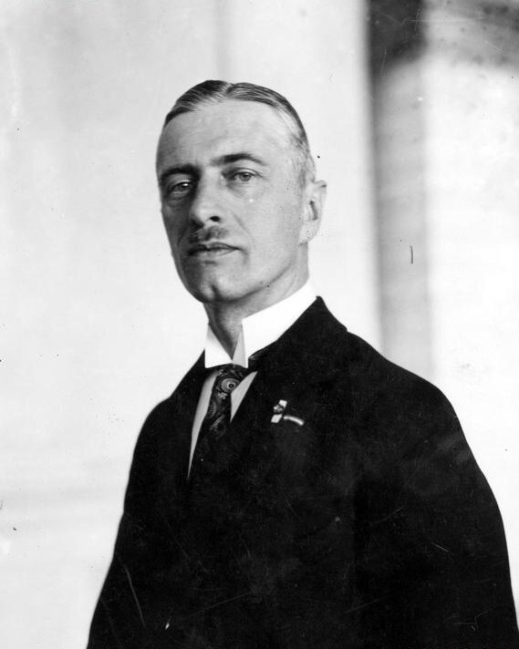<figcaption><b>Władysław Raczkiewicz</b> prezydent od 30 IX 1939</figcaption></figure><figure>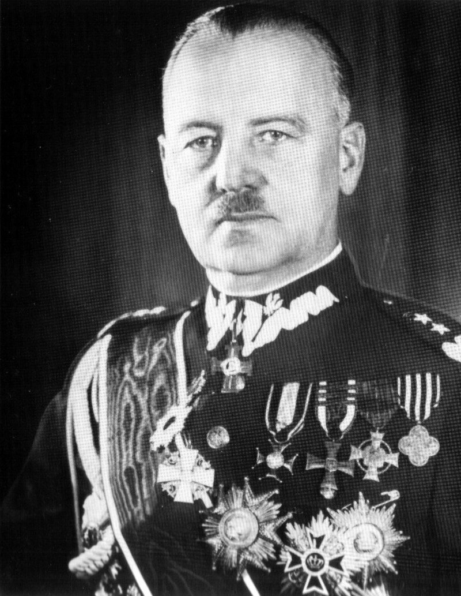<figcaption><b>Władysław Sikorski</b> premier od 30 IX 1939 Naczelny Wódz od 7 XI 1939</figcaption></figure>

Następstwo prezydenta oparto na konstytucji kwietniowej.

notes:
Mościcki wyznaczył następcę na podstawie przepisów konstytucji dotyczących wojny. Nie było to przejęcie urzędu w wyniku nowych wyborów powszechnych. Raczkiewicz powołał Sikorskiego na premiera; urząd Naczelnego Wodza Sikorski objął później. Ciekawostka: jedna osoba połączyła kierowanie rządem i wojskiem, lecz nie zaczęła obu funkcji tego samego dnia. Ilustracja: dwa portrety z datami i funkcjami.

---

<!-- .slide: id="siedziby" data-purpose="explanation" data-layout="timeline-band" data-goals="G1" -->
## Francja, a potem Londyn

<time>IX 1939</time><h3>Paryż</h3>
Powstają nowe władze RP.

<time>XI 1939</time><h3>Angers</h3>
Siedziba polskiego rządu we Francji.

<time>VI 1940</time><h3>Londyn</h3>
Ewakuacja po klęsce Francji.

Rząd reprezentuje Polskę, organizuje wojsko i utrzymuje łączność z krajem.

notes:
Wyjaśnij „rząd na uchodźstwie”: uznawane władze działające poza swoim krajem z powodu okupacji i zagrożenia. Nie pomyl siedziby rządu z dokładną rezydencją prezydenta pod Angers. Ciekawostka: nie tylko Paryż — przez kilka miesięcy ważnym polskim ośrodkiem politycznym było mniej znane Angers. Ilustracja: oś kolejnych siedzib, odczytywana po wcześniejszym wskazaniu miejsc na mapie.

---

<!-- .slide: id="wojsko-zachod" data-purpose="explanation" data-layout="split" data-goals="G1" -->
## Armia Polska we Francji i siły na Zachodzie

<figure class="source-figure">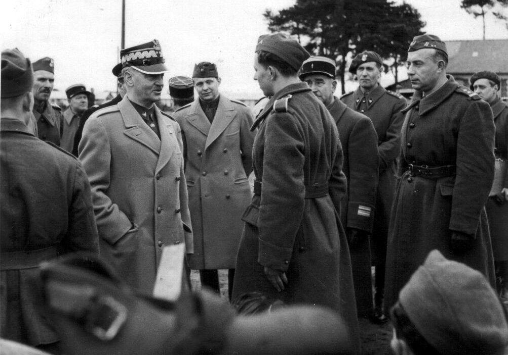<figcaption>Polskie wojsko we Francji</figcaption></figure>

<b>1939–1940:</b> tworzenie oddziałów we Francji.

Żołnierze ewakuowani z kraju oraz polscy emigranci.

<b>1940:</b> walki z Niemcami; po klęsce Francji część wojska trafia do Wielkiej Brytanii.

<b>Polskie Siły Zbrojne na Zachodzie:</b> wojska lądowe, lotnictwo i marynarka.

notes:
Rząd bez własnego terytorium mógł organizować wojsko na terytorium sojuszników. Przykład: 1 Dywizja Grenadierów walczyła we Francji; polscy lotnicy walczyli później w bitwie o Anglię. Nie sugeruj ewakuacji wszystkich oddziałów — część żołnierzy dostała się do niewoli lub internowania. Rozbudowane fronty i bitwy należą do innych lekcji. Ilustracja: archiwalna fotografia polskich żołnierzy we Francji.

---

<!-- .slide: id="relacje-zsrs" data-purpose="explanation" data-layout="timeline-band" data-goals="G2" -->
## Od agresji do wspólnego przeciwnika

<time>17 IX 1939</time><h3>Agresja ZSRS</h3>
Okupacja, represje i zerwane kontakty dyplomatyczne.

<time>22 VI 1941</time><h3>Niemcy atakują ZSRS</h3>
ZSRS staje się przeciwnikiem III Rzeszy.

<time>VII 1941</time><h3>Rozmowy</h3>
Wielka Brytania sprzyja porozumieniu Polski z ZSRS.

Wspólny wróg nie usuwał wcześniejszych krzywd i sporów.

notes:
Chronologia wyjaśnia zmianę, nie sugeruje nagłego zaufania do Stalina. Polska miała interes w uwolnieniu obywateli i utworzeniu armii; Brytyjczykom zależało na współpracy państw walczących z Hitlerem. Układ nie miał uzasadniać agresji ani represji z 1939–1941. Ilustracja: oś czasu z trzema zweryfikowanymi wydarzeniami; nie dekoracyjny schemat.

---

<!-- .slide: id="uklad" data-purpose="explanation" data-layout="split" data-goals="G2" -->
## Układ Sikorski–Majski · 30 VII 1941

<figure class="source-figure"><figcaption>Podpisanie porozumienia w Londynie</figcaption></figure>

<b>Władysław Sikorski</b> — premier RP.

<b>Iwan Majski</b> — ambasador ZSRS w Londynie.

Porozumienie umożliwia odbudowę oficjalnych kontaktów i współpracę przeciw Niemcom.

<b>Stosunki dyplomatyczne</b> — oficjalne kontakty między państwami, m.in. przez ambasadorów.

notes:
Majski nie był premierem ani przywódcą ZSRS. Nazwa układu pochodzi od nazwisk podpisujących. Wprowadź dokument: zaraz uczniowie odczytają jego artykuły, a nie tylko wysłuchają naszego streszczenia. Ilustracja: historyczna fotografia podpisania, ukazana ponownie po wyjaśnieniu kontekstu.

---

<!-- .slide: id="tekst-ukladu" data-purpose="evidence" data-layout="evidence" data-goals="G2" -->
## Układ Sikorski–Majski

<b>Art. 1.</b> Rząd Związku Socjalistycznych Republik Rad uznaje, że traktaty sowiecko-niemieckie z 1939 roku, dotyczące zmian terytorialnych w Polsce, utraciły swoją moc. Rząd Rzeczypospolitej Polskiej oświadcza, że Polska nie jest związana z jakimkolwiek trzecim państwem żadnym układem zwróconym przeciwko Związkowi Socjalistycznych Republik Rad.

<b>Art. 2.</b> Stosunki dyplomatyczne między obu rządami będą przywrócone po podpisaniu niniejszego układu i nastąpi niezwłocznie wymiana ambasadorów.

<b>Art. 3.</b> Oba rządy zobowiązują się wzajemnie do udzielenia sobie wszelkiego rodzaju pomocy i poparcia w obecnej wojnie przeciwko hitlerowskim Niemcom.

<b>Art. 4.</b> Rząd Związku Socjalistycznych Republik Rad oświadcza swą zgodę na tworzenie na terytorium Związku Socjalistycznych Republik Rad Armii Polskiej, której dowódca będzie mianowany przez Rząd Rzeczypospolitej Polskiej w porozumieniu z rządem Związku Socjalistycznych Republik Rad. […]

„Historia. Teksty źródłowe do ustnego egzaminu maturalnego”, red. J. Chańko, Warszawa 1997, s. 80–81; fragment ze str. 61 podręcznika.

notes:
To transkrypcja całego widocznego fragmentu art. 1–4 ze zdjęcia nauczyciela. Zachowano […] z książki, nie dopisano protokołu. Daj czas na czytanie w podręczniku. Nie zamieniaj tego slajdu w dodatkowy wykład ani nie nakładaj pytań na cytat. Ilustracja/materiał: oryginalny tekst dokumentu z 1941 r., złożony czytelnie zamiast powiększonego niskiej jakości zdjęcia strony.

---

<!-- .slide: id="praca-z-tekstem" data-purpose="practice" data-layout="activity-brief" data-goals="G2" -->
## Przeczytajcie i uzasadnijcie

<ol><li>Wyjaśnijcie, jakie zobowiązania nakładał na ZSRS układ Sikorski–Majski.</li><li>Wskażcie artykuł mówiący o sformowaniu w ZSRS polskich jednostek wojskowych.</li><li>Wybierzcie jedną korzyść i wyjaśnijcie, dlaczego mogła być ważna dla Polaków.</li></ol>
Pracujcie w parach. Każdy zapisuje własne odpowiedzi w części B karty.

notes:
Pierwsze dwa polecenia zachowują treść pytań z podręcznika, z drobną zmianą liczby na mnogą; trzeci to zadanie autorskie. Pary wskazują artykuły zamiast przepisywać je w całości. Osiem minut obejmuje czytanie, rozmowę i wspólne omówienie; nie dodawaj kolejnych ośmiu na to samo. Model: art. 1–4, przywrócenie kontaktów, wspólna pomoc i zgoda na armię. Ilustracja/materiał: tekst dokumentu w podręczniku, poprzedni slajd; nie dołączamy obrazka sugerującego odpowiedź.

---

<!-- .slide: id="korzysci-ryzyko" data-purpose="explanation" data-layout="comparison" data-goals="G2" -->
## Co uzyskano, a czego nie rozstrzygnięto?

<h3>Szansa na działanie</h3><ul><li>Przywrócenie stosunków dyplomatycznych.</li><li>Wspólna walka przeciw Niemcom.</li><li>Możliwość tworzenia polskiej armii.</li><li>Zwolnienie obywateli — „amnestia” w odrębnym protokole.</li></ul>

<h3>Nierozwiązany spór</h3>
Nie potwierdzono jednoznacznie <b>przedwojennej granicy Polski</b>.

Porozumienie nie oznaczało pełnego zaufania do władz ZSRS.

notes:
Pokaż po wypowiedziach uczniów. Wyjaśnij protokół o zwolnieniu: nie ma go w cytowanym fragmencie. „Amnestia” to kontrowersyjne określenie, ponieważ represjonowani nie byli sprawiedliwie skazanymi przestępcami. Brak gwarancji granicy wywoływał spory także w polskim rządzie. Pytanie o nierozstrzygniętą kwestię dopiszcie po wspólnym omówieniu. Ilustracja: znaczeniowe porównanie dwóch aspektów jednego dokumentu.

---

<!-- .slide: id="anders" data-purpose="explanation" data-layout="split" data-goals="G3" -->
## Armia Andersa w ZSRS

<figure class="source-figure">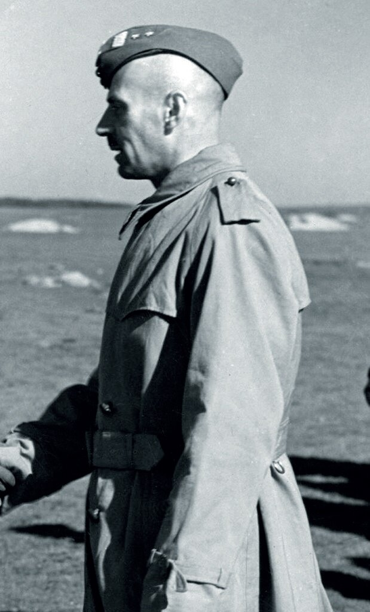<figcaption>Gen. Władysław Anders</figcaption></figure>

<b>1941:</b> powstaje Armia Polska w ZSRS.

Dowódca: <b>Władysław Anders</b>, zwolniony z sowieckiego więzienia.

Do armii docierają obywatele uwalniani z więzień, łagrów i zesłania.

Trudne warunki, braki zaopatrzenia i spory z władzami ZSRS.

notes:
Umowę wojskową podpisano 14 VIII 1941. Nie wszyscy uwolnieni mogli dotrzeć do oddziałów; przy wojsku szukali ratunku również cywile. Oficerów przetrzymywanych w Kozielsku, Starobielsku i Ostaszkowie nie odnajdywano — ich los stanie się jasny w 1943. Nie nazywaj tej armii od początku II Korpusem; to późniejsza organizacja z 1943 r. Ilustracja: portret Andersa.

---

<!-- .slide: id="mapa-anders" data-purpose="evidence" data-layout="evidence" data-goals="G3" -->
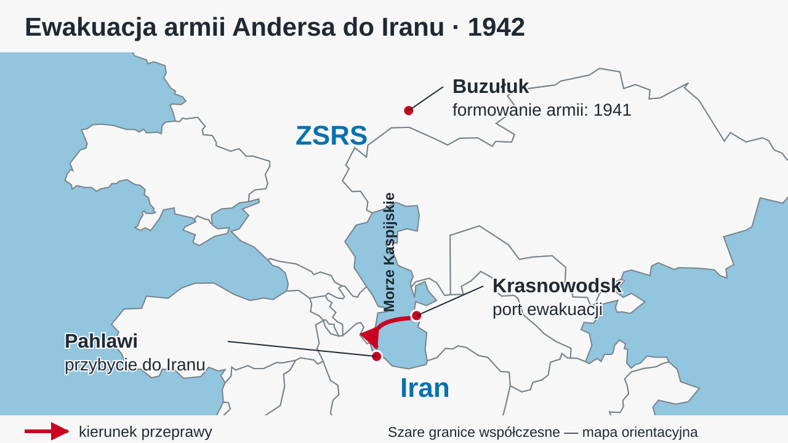
notes:
W 1942 r. przeprowadzono dwie główne fale ewakuacji, wiosną i latem. Wskaż port Krasnowodsk i przybycie do Pahlawi w Iranie, dziś Bandar-e Anzali. Następnie siły polskie działały na Bliskim Wschodzie, a później m.in. we Włoszech. Ciekawostka: razem z żołnierzami wyjeżdżali cywile, także dzieci. Buzułuk orientuje początkowe formowanie, nie jedyne miejsce zbiórki całej ewakuacji. Czerwona strzałka wskazuje przybliżony kierunek przeprawy Krasnowodsk–Pahlawi, nie dokładny przebieg rejsu. Czarne linie łączą podpisy z punktami. Ilustracja: mapa orientacyjna z prawdziwych danych geograficznych.

---

<!-- .slide: id="katyn" data-purpose="explanation" data-layout="split" data-goals="G3" -->
## Sprawa katyńska i zerwanie stosunków

<figure class="source-figure">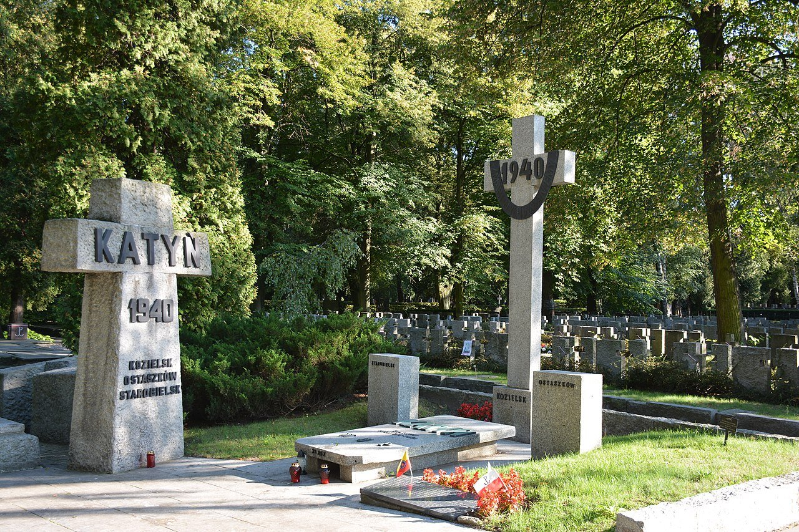<figcaption>Pomnik Katyński w Warszawie — współczesne upamiętnienie</figcaption></figure>

<b>Wiosna 1940:</b> NKWD morduje polskich jeńców i więźniów.

<b>13 IV 1943:</b> Niemcy ogłaszają odkrycie grobów w Katyniu.

Rząd polski zabiega o niezależne zbadanie zbrodni.

<b>25 IV 1943:</b> ZSRS zrywa stosunki z Polską.

notes:
Nie myl daty popełnienia zbrodni z ujawnieniem. Niemcy użyli odkrycia w propagandzie, ale sprawcą zbrodni było NKWD. Rząd polski zwrócił się do Międzynarodowego Czerwonego Krzyża. Władze sowieckie zaprzeczały sprawstwu i wykorzystały polskie zabiegi jako pretekst do zerwania stosunków. Nie pokazujemy drastycznych fotografii ekshumacji. Jeśli zdjęcie przedstawia współczesny pomnik, nazwij je współczesnym upamiętnieniem, nie zdjęciem z 1943. Ilustracja: niegraficzne upamiętnienie/źródłowy dokument dotyczący Katynia.

---

<!-- .slide: id="gibraltar" data-purpose="explanation" data-layout="split" data-goals="G3" -->
## Śmierć Sikorskiego · 4 VII 1943

<figure class="source-figure"><figcaption>Premier i Naczelny Wódz</figcaption></figure>

Katastrofa samolotu po starcie z <b>Gibraltaru</b>.

Powrót z wizyty u polskich żołnierzy na Bliskim Wschodzie.

<b>Stanisław Mikołajczyk</b> — nowy premier.

<b>Kazimierz Sosnkowski</b> — nowy Naczelny Wódz.

Śmierć Sikorskiego osłabia pozycję rządu.

notes:
Gibraltar wskazano już na mapie Europy. Nie przedstawiaj tezy o zamachu jako udowodnionego wyjaśnienia. Można powiedzieć: „Sikorski zginął w katastrofie; szczegółowe przyczyny budzą spory, ale nie mamy podstaw, by na tej lekcji ogłaszać sprawcę zamachu”. Urzędy premiera i Naczelnego Wodza po jego śmierci powierzono dwóm różnym osobom. Ilustracja: portret Sikorskiego; lokalizacja widoczna na wcześniej pokazanej mapie.

---

<!-- .slide: id="zpp" data-purpose="explanation" data-layout="comparison" data-goals="G3" -->
## Ośrodek wspierany przez Stalina · 1943

<figure>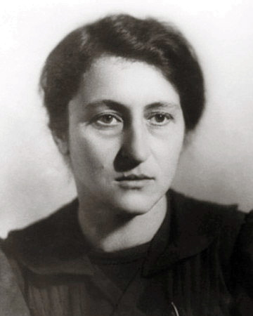<figcaption><b>Wanda Wasilewska</b> Związek Patriotów Polskich</figcaption></figure><figure>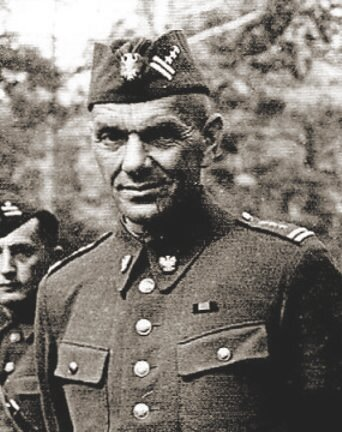<figcaption><b>Zygmunt Berling</b> dywizja im. Tadeusza Kościuszki</figcaption></figure>

Konkurencyjny ośrodek polityczno-wojskowy pod patronatem ZSRS. <b>ZPP nie był rządem; wojsko Berlinga nie było armią Andersa.</b>

notes:
ZPP rozwijał się wiosną 1943, dywizję zaczęto formować w maju. Zjazd ZPP odbył się w czerwcu; nie umieszczaj organizacji dopiero po lipcowej śmierci Sikorskiego. Układ slajdów pokazuje osobny równoległy proces z tego samego roku. Wanda Wasilewska kierowała ZPP; Stalin miał instrument wpływania na przyszłą Polskę i podważania pozycji rządu londyńskiego. PKWN powstał dopiero w 1944 r. i jest poza rdzeniem. Ilustracja: dwa portrety z nazwami organizacji i formacji.

---

<!-- .slide: id="podsumowanie" data-purpose="synthesis" data-layout="takeaways" data-goals="G1 G2 G3" -->
## Państwo działało mimo okupacji
<ul class="takeaways"><li><b>1939:</b> nowe władze RP podtrzymały ciągłość państwa.</li><li><b>Francja → Londyn:</b> reprezentacja Polski i organizowanie sił zbrojnych.</li><li><b>1941:</b> układ z ZSRS otworzył możliwość tworzenia armii i uwalniania obywateli, ale nie rozstrzygnął granicy.</li><li><b>1942:</b> ewakuacja armii Andersa i cywilów do Iranu.</li><li><b>1943:</b> Katyń, zerwanie stosunków, śmierć Sikorskiego i ośrodek wspierany przez Stalina — coraz trudniejsza sytuacja rządu.</li></ul>
notes:
Podsumuj mechanizm, a nie czytaj wszystkich punktów. Gotową notatkę ucznia można otrzymać po pracy; nie poświęcać reszty czasu na długie przepisywanie. Zwróć uwagę na różnicę: wyjazd z kraju nie oznaczał końca uznawanych władz, a współpraca z ZSRS nie oznaczała rozwiązania wszystkich sporów. Ilustracja: uporządkowana chronologicznie synteza, odpowiadająca osi na karcie ucznia.

---

<!-- .slide: id="bilet" data-purpose="exit-ticket" data-layout="activity-brief" data-goals="G2" -->
## Dokończ samodzielnie

Układ dawał Polakom nadzieję, ponieważ…

Nie rozwiązywał jednak…

Podaj konkretną korzyść i nierozstrzygniętą kwestię.

notes:
Każdy kończy oba zdania sam, nie w parze. Dwie krótkie odpowiedzi możesz odczytać; pozostałe sprawdzić na kartach. Korzyść: polskie wojsko lub zwolnienie obywateli, przywrócenie kontaktów — z wyjaśnieniem sensu. Nierozstrzygnięta kwestia: przedwojenna granica. Ilustracja: dwuwierszowa karta odpowiedzi; bez fotografii podpowiadającej treść.

---

<!-- .slide: id="zrodla" data-purpose="reference" data-layout="plain" -->
## Źródła i materiały
<ul class="source-list"><li>„Wczoraj i dziś”, klasa VIII, Nowa Era — fragment dokumentu ze str. 61, fotografia nauczyciela.</li><li>„Historia. Teksty źródłowe do ustnego egzaminu maturalnego”, red. J. Chańko, Warszawa 1997, s. 80–81.</li><li>ZPE — „Rząd polski na uchodźstwie”; opracowania instytucjonalne wskazane w materiałach prowadzącego.</li><li>Fotografie i portrety: indywidualnie opisane zasoby ZPE i Wikimedia Commons; dokładni autorzy, adresy oraz prawa w <code>sources.md</code>.</li><li>Mapy: dane Natural Earth, domena publiczna; lokalizacje OpenStreetMap/Nominatim. Współczesne granice służą orientacji.</li></ul>
notes:
Nie prowadź nowego wykładu z bibliografii. Slajd wskazuje podstawowe źródła; pełne metadane każdego lokalnego obrazu i ograniczenia znajdują się w sources.md oraz manifestach. Film nie jest konieczny do odtworzenia treści lekcji. Ilustracja/materiał: bibliografia dokumentu i zasobów, bez dekoracji udających źródło historyczne.
