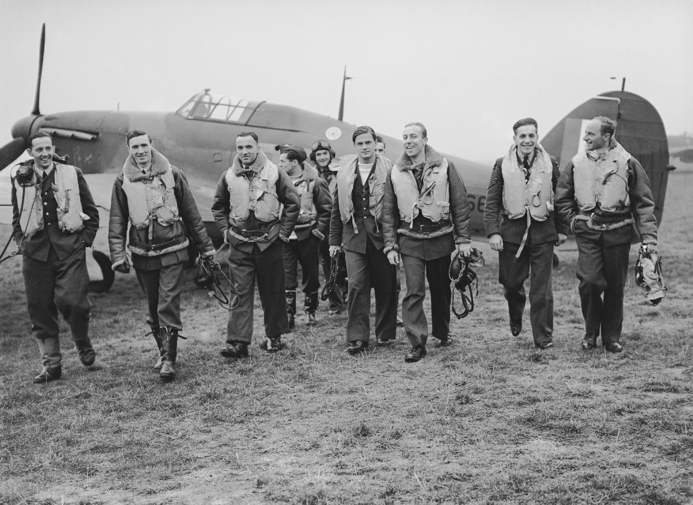
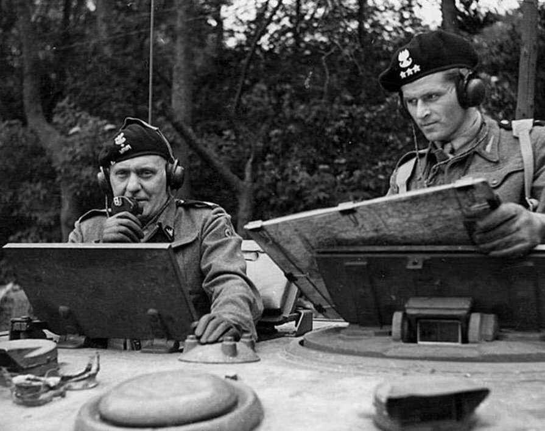
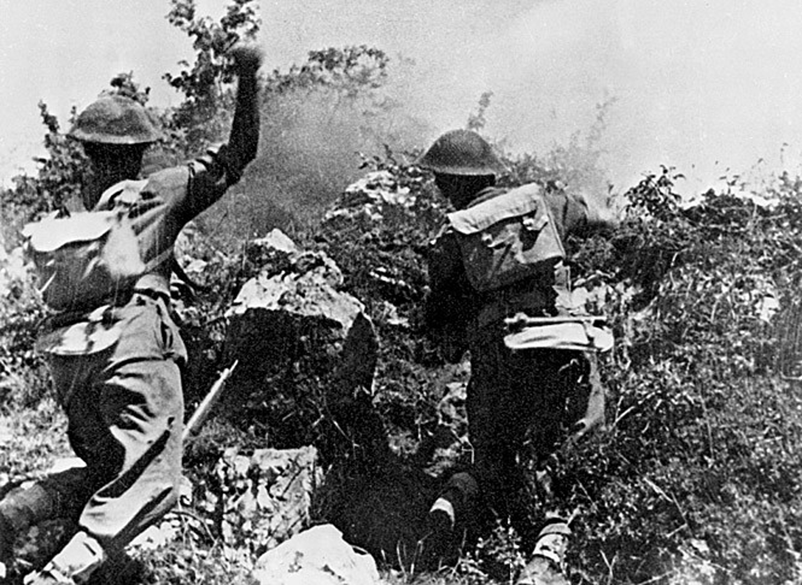
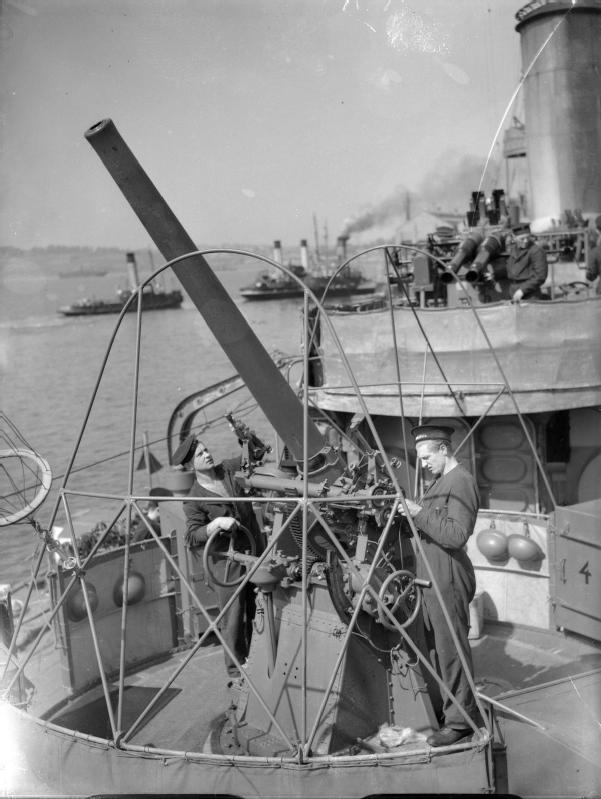
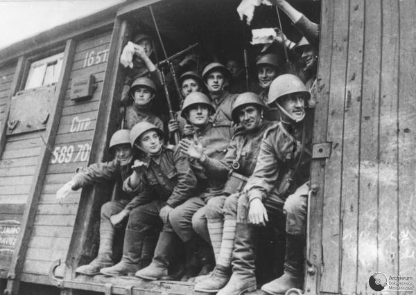
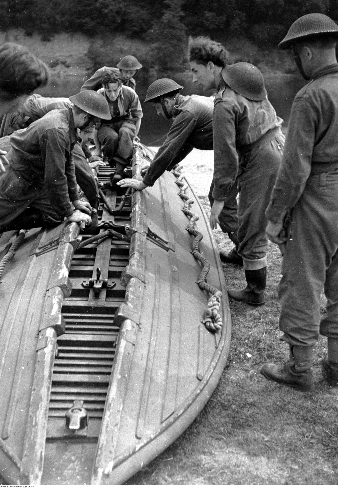
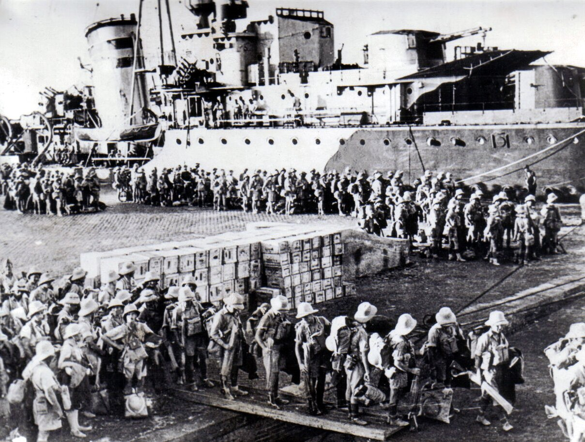
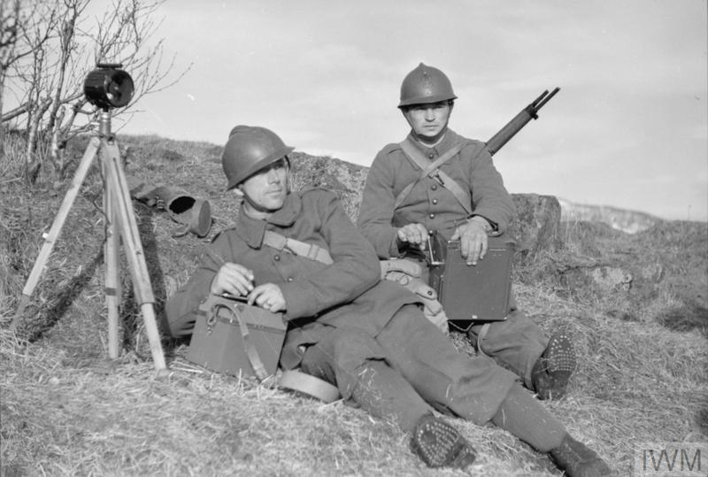

# 1. Dywizjon 303

Polska była okupowana. Polscy żołnierze kontynuowali walkę przeciw Niemcom poza krajem, u boku sojuszników. Sprawdźcie jeden konkretny przypadek — nie zakładajcie z góry, że każda walka była zwycięstwem.

## Fotografia

Piloci Dywizjonu 303 obok Hurricane’a, październik 1940. To fotografia jednostki, nie portret Urbanowicza.

**Przyjrzyjcie się:** Wskażcie samolot i jeden element wyposażenia lotnika.

## Dowódca
**Witold Urbanowicz** — Doświadczony pilot i instruktor; we wrześniu 1940 objął polskie dowodzenie dywizjonem po zranieniu Zdzisława Krasnodębskiego.

## Opis walk

Autorskie opracowanie dydaktyczne na podstawie sprawdzonych źródeł. Nie cytat ani relacja świadka.

Po okupacji Polski lotnicy przedostawali się do sojuszników, aby dalej walczyć z Niemcami. Latem i jesienią 1940 roku niemieckie lotnictwo atakowało Wielką Brytanię. Dywizjon 303 uczestniczył w jej obronie w ramach brytyjskich Królewskich Sił Powietrznych, czyli RAF. Polacy otrzymali samoloty Hurricane i korzystali z brytyjskich baz. Nie zaczynali jednak nauki latania od zera. Urbanowicz był wcześniej instruktorem, ale musiał przejść kurs angielskiego oraz przeszkolenie na nowym typie samolotu. Język i inne wyposażenie utrudniały początki, nie przekreślały doświadczenia. Lotnicy atakowali niemieckie samoloty i pomagali powstrzymać ofensywę powietrzną. Nie bronili kraju sami: sukces był wspólnym wysiłkiem wielu dywizjonów i ich zaplecza. Ich służba pokazywała, że polskie wojsko nadal walczy.

## Pytanie śledczych
Czy kurs języka i przeszkolenie oznaczają, że Polacy byli początkującymi lotnikami? W polach 4–5 połączcie wcześniejsze doświadczenie z wkładem w obronę.

## Na mapie
Wielka Brytania, 1940: zaznaczcie obszar nieba w pobliżu Londynu, nie pojedyncze miejsce całej bitwy. Punkt Londyn znajdziecie też w powiększeniu.

Uzupełnijcie każdy swoją kartę: <strong>1. jednostka; 2. dowódca; 3. miejsce i czas; 4. osiągnięcie lub wkład; 5. dlaczego pamiętamy.</strong> Potem zaznaczcie miejsce na własnej mapie. Przygotujcie raport 30 s: „Jesteśmy przedstawicielami… Walczyliśmy w… Najważniejsze było…”. Ostatnie zdanie niech zawiera wasze sprawdzone odkrycie.

<!-- page -->
# 2. 1. Dywizja Pancerna Maczka

Polska była okupowana. Polscy żołnierze kontynuowali walkę przeciw Niemcom poza krajem, u boku sojuszników. Sprawdźcie jeden konkretny przypadek — nie zakładajcie z góry, że każda walka była zwycięstwem.

## Fotografia

Stanisław Maczek podczas dowodzenia dywizją, 1944. Fotografia nie przedstawia samego wyzwolenia Bredy.

**Przyjrzyjcie się:** Wskażcie sprzęt służący do łączności.

## Dowódca
**gen. Stanisław Maczek** — Dowódca 1. Dywizji Pancernej, odtworzonej w Wielkiej Brytanii; pod Falaise i w Bredzie dowodził tą dywizją, nie brygadą z 1939 roku.

## Opis walk

Autorskie opracowanie dydaktyczne na podstawie sprawdzonych źródeł. Nie cytat ani relacja świadka.

Po klęsce Polski żołnierze Maczka kontynuowali walkę u zachodnich sojuszników. W sierpniu 1944 roku 1. Dywizja Pancerna walczyła pod Falaise w Normandii. Pomagała zamknąć okrążenie wojsk niemieckich i odpierała ich silne ataki. Działała razem z innymi oddziałami alianckimi; pomoc Kanadyjczyków miała znaczenie dla utrzymania pozycji. Potem dywizja ruszyła przez Francję i Belgię do Niderlandów. Bredę wyzwoliła 29 października 1944 roku. Maczek zastosował manewr oskrzydlający i zrezygnował z silnego przygotowania artyleryjskiego oraz wsparcia lotniczego. Ograniczało to niszczenie zabudowy. Nie znaczy, że nie było walk ani że każdy budynek pozostał nienaruszony. Ważnym osiągnięciem było pokonanie obrońców miasta przy oszczędzaniu jego mieszkańców i zabudowy, a nie samo użycie jak największej siły ognia.

## Pytanie śledczych
Czy dobry dowódca musi użyć jak największej siły ognia? W polach 4–5 sprawdźcie tę myśl na przykładzie Bredy; fotografia pokazuje inny potrzebny element dowodzenia.

## Na mapie
Falaise, sierpień 1944: północ Francji. Breda, 29.10.1944: południe Niderlandów, blisko Belgii. Oba punkty są w powiększeniu; oznaczcie oba numerem 2.

Uzupełnijcie każdy swoją kartę: <strong>1. jednostka; 2. dowódca; 3. miejsce i czas; 4. osiągnięcie lub wkład; 5. dlaczego pamiętamy.</strong> Potem zaznaczcie miejsce na własnej mapie. Przygotujcie raport 30 s: „Jesteśmy przedstawicielami… Walczyliśmy w… Najważniejsze było…”. Ostatnie zdanie niech zawiera wasze sprawdzone odkrycie.

<!-- page -->
# 3. Armia Andersa → 2. Korpus Polski

Polska była okupowana. Polscy żołnierze kontynuowali walkę przeciw Niemcom poza krajem, u boku sojuszników. Sprawdźcie jeden konkretny przypadek — nie zakładajcie z góry, że każda walka była zwycięstwem.

## Fotografia

Żołnierze 2. Korpusu w bitwie o Monte Cassino, maj 1944. To już etap korpusu, nie formowania armii w 1941 roku.

**Przyjrzyjcie się:** Wskażcie cechę terenu utrudniającą poruszanie się żołnierzy.

## Dowódca
**gen. Władysław Anders** — Dowodził Armią Polską w ZSRS, a później 2. Korpusem Polskim. Te nazwy oznaczają kolejne etapy, nie jedną niezmienną jednostkę.

## Opis walk

Autorskie opracowanie dydaktyczne na podstawie sprawdzonych źródeł. Nie cytat ani relacja świadka.

W 1941 roku po porozumieniu polsko-sowieckim zaczęto tworzyć w ZSRS Armię Polską pod dowództwem Andersa. Wstępowali do niej także ludzie wcześniej więzieni przez Sowietów. W 1942 roku armię ewakuowano przez Iran na Bliski Wschód. W nowych warunkach mogła się szkolić i otrzymywać wyposażenie. Dopiero w 1943 roku powstał 2. Korpus Polski. W 1944 roku walczył we Włoszech u boku aliantów. W maju uczestniczył w ciężkich atakach na górskie pozycje pod Monte Cassino. Wspólna ofensywa zmusiła Niemców do odwrotu; 18 maja polski patrol dotarł do ruin klasztoru. Sukces otwierał drogę dalszego natarcia w stronę Rzymu, lecz kosztował życie wielu żołnierzy. Fotografia pokazuje trudny teren walk, nie całą wcześniejszą drogę armii.

## Pytanie śledczych
Czy zdjęcie rekrutów Armii Andersa z 1941 roku można podpisać „2. Korpus zdobywa Monte Cassino”? W polach 4–5 wykorzystajcie daty oraz fotografię z tej teczki.

## Na mapie
Monte Cassino, 18.05.1944: Włochy, na południe od Rzymu. Znajdźcie podpisany punkt przy Półwyspie Apenińskim i wpiszcie numer 3.

Uzupełnijcie każdy swoją kartę: <strong>1. jednostka; 2. dowódca; 3. miejsce i czas; 4. osiągnięcie lub wkład; 5. dlaczego pamiętamy.</strong> Potem zaznaczcie miejsce na własnej mapie. Przygotujcie raport 30 s: „Jesteśmy przedstawicielami… Walczyliśmy w… Najważniejsze było…”. Ostatnie zdanie niech zawiera wasze sprawdzone odkrycie.

<!-- page -->
# 4. Polska Marynarka Wojenna

Polska była okupowana. Polscy żołnierze kontynuowali walkę przeciw Niemcom poza krajem, u boku sojuszników. Sprawdźcie jeden konkretny przypadek — nie zakładajcie z góry, że każda walka była zwycięstwem.

## Fotografia

Załoga przy dziale przeciwlotniczym ORP „Błyskawica”, 13 września 1940. Zdjęcie wcześniejsze niż obrona Cowes; nie zapis nalotu z 1942.

**Przyjrzyjcie się:** Wskażcie działo i pracujących przy nim marynarzy.

## Dowódca
**Wojciech Francki** — W omawianym wydarzeniu dowódca ORP „Błyskawica”, nie całej Polskiej Marynarki Wojennej. Niszczyciel to szybki, uzbrojony okręt wojenny.

## Opis walk

Autorskie opracowanie dydaktyczne na podstawie sprawdzonych źródeł. Nie cytat ani relacja świadka.

Polskie okręty kontynuowały wojnę razem z flotami sojuszniczymi: osłaniały konwoje, walczyły na morzu i wspierały inne działania. Jednym z nich był niszczyciel ORP „Błyskawica”. Wiosną 1942 roku przebywał w remoncie w Cowes na brytyjskiej wyspie Wight. Dowódca Wojciech Francki, obawiając się ataku, zatrzymał na okręcie amunicję, którą zwykle przed remontem wyładowywano. W nocy z 4 na 5 maja Niemcy przeprowadzili nalot na miasto. Dzięki pozostawionej amunicji artyleria przeciwlotnicza mogła od razu wzmocnić obronę. Marynarze następnie gasili pożary i pomagali poszkodowanym. W mieście były ofiary i zniszczenia: pomoc okrętu nie oznacza ocalenia wszystkich. Ten przypadek pokazuje, że osiągnięcie marynarki mogło polegać także na obronie i ratowaniu ludności, nie tylko zatapianiu wrogich okrętów.

## Pytanie śledczych
Czy okręt w remoncie był bezbronny? W polach 4–5 połączcie wyposażenie widoczne na zdjęciu z decyzją Franckiego i pomocą mieszkańcom.

## Na mapie
Cowes, noc 4/5.05.1942: wyspa Wight przy południowym wybrzeżu Wielkiej Brytanii. Punkt Cowes w powiększeniu jest przybliżony; ta skala nie pokazuje wyspy osobno.

Uzupełnijcie każdy swoją kartę: <strong>1. jednostka; 2. dowódca; 3. miejsce i czas; 4. osiągnięcie lub wkład; 5. dlaczego pamiętamy.</strong> Potem zaznaczcie miejsce na własnej mapie. Przygotujcie raport 30 s: „Jesteśmy przedstawicielami… Walczyliśmy w… Najważniejsze było…”. Ostatnie zdanie niech zawiera wasze sprawdzone odkrycie.

<!-- page -->
# 5. Armia Berlinga

Polska była okupowana. Polscy żołnierze kontynuowali walkę przeciw Niemcom poza krajem, u boku sojuszników. Sprawdźcie jeden konkretny przypadek — nie zakładajcie z góry, że każda walka była zwycięstwem.

## Fotografia

1. Dywizja Piechoty im. Tadeusza Kościuszki wyrusza na front, lato 1943. To nie fotografia późniejszej 1. Armii ani samej bitwy pod Lenino.

**Przyjrzyjcie się:** Wskażcie środek transportu; samo zdjęcie wyjazdu nie pokazuje wyniku bitwy.

## Dowódca
**Zygmunt Berling** — Dowódca 1. Dywizji Piechoty pod Lenino w 1943 roku, a następnie armii w 1944. „Armia Berlinga” jest skrótem, nie nazwą dywizji.

## Opis walk

Autorskie opracowanie dydaktyczne na podstawie sprawdzonych źródeł. Nie cytat ani relacja świadka.

W maju 1943 roku w ZSRS utworzono 1. Dywizję Piechoty imienia Tadeusza Kościuszki pod dowództwem Berlinga. Formacja powstała pod kontrolą sowiecką, poza władzą polskiego rządu na uchodźstwie. Wielu żołnierzy chciało walczyć z Niemcami i wrócić do kraju; ich motywacji nie należy mylić z politycznymi planami Stalina. Pod Lenino na dzisiejszej Białorusi dywizja walczyła 12–13 października 1943 roku. Żołnierze nacierali na niemieckie pozycje i ponieśli ciężkie straty. Natarcie nie przyniosło oczekiwanego przełamania, a dywizję wycofano. Odwaga nie zamieniła tego starcia w zwycięstwo. W 1944 roku Berling dowodził większą formacją: najpierw 1. Armią Polską w ZSRS, potem 1. Armią Wojska Polskiego. Brała ona udział w walkach przeciw Niemcom na ziemiach polskich.

## Pytanie śledczych
Czy odważni żołnierze zawsze wygrywają? W polu 4 odróżnijcie rzeczywisty udział w walce od nieosiągniętego celu pod Lenino; w polu 5 wyjaśnijcie, dlaczego pamiętamy o ludziach.

## Na mapie
Lenino, 12–13.10.1943: dzisiejsza Białoruś, blisko granicy z Rosją. To najbardziej na wschód położony podpisany punkt mapy. Oznaczcie go numerem 5.

Uzupełnijcie każdy swoją kartę: <strong>1. jednostka; 2. dowódca; 3. miejsce i czas; 4. osiągnięcie lub wkład; 5. dlaczego pamiętamy.</strong> Potem zaznaczcie miejsce na własnej mapie. Przygotujcie raport 30 s: „Jesteśmy przedstawicielami… Walczyliśmy w… Najważniejsze było…”. Ostatnie zdanie niech zawiera wasze sprawdzone odkrycie.

<!-- page -->
# 6. Spadochroniarze Sosabowskiego

Polska była okupowana. Polscy żołnierze kontynuowali walkę przeciw Niemcom poza krajem, u boku sojuszników. Sprawdźcie jeden konkretny przypadek — nie zakładajcie z góry, że każda walka była zwycięstwem.

## Fotografia

Żołnierze 1. Samodzielnej Brygady Spadochronowej przy budowie mostu pontonowego, Wielka Brytania, 1944. Ćwiczenia, nie fotografia przeprawy pod Driel.

**Przyjrzyjcie się:** Wskażcie element łodzi lub pontonu potrzebny do przeprawy.

## Dowódca
**gen. Stanisław Sosabowski** — Dowódca 1. Samodzielnej Brygady Spadochronowej, przygotowanej do działań po przerzuceniu żołnierzy drogą powietrzną.

## Opis walk

Autorskie opracowanie dydaktyczne na podstawie sprawdzonych źródeł. Nie cytat ani relacja świadka.

Brygada Sosabowskiego szkoliła się w Wielkiej Brytanii, aby walczyć z Niemcami. We wrześniu 1944 roku uczestniczyła w alianckiej operacji Market Garden w Niderlandach. Plan zakładał opanowanie mostów i otwarcie drogi dalszego natarcia. Główna część polskiej brygady została zrzucona 21 września koło Driel, w rejonie Arnhem. Brytyjskie oddziały walczyły po drugiej stronie Renu. Polacy musieli więc pokonać nie tylko obronę przeciwnika, ale także przeszkodę wodną; łodzie miały kluczowe znaczenie. Część żołnierzy przeprawiła się, by wesprzeć sojuszników. Ostatecznie nie utrzymano kluczowego mostu w Arnhem, a cała operacja nie osiągnęła celu. Polacy pomagali również podczas odwrotu Brytyjczyków przez rzekę. Można zatem doceniać konkretną pomoc brygady, nie ogłaszając nieudanej operacji zwycięstwem.

## Pytanie śledczych
Po co spadochroniarzom umiejętność budowy przepraw? W polach 4–5 połączcie fotografię ćwiczeń z przeszkodą pod Driel i pomocą mimo niepowodzenia operacji.

## Na mapie
Driel / Arnhem, wrzesień 1944: Niderlandy, na wschód od Bredy. Punkt oznacza rejon; mapa kontynentu nie pokazuje Renu ani stron przeprawy. Wpiszcie numer 6.

Uzupełnijcie każdy swoją kartę: <strong>1. jednostka; 2. dowódca; 3. miejsce i czas; 4. osiągnięcie lub wkład; 5. dlaczego pamiętamy.</strong> Potem zaznaczcie miejsce na własnej mapie. Przygotujcie raport 30 s: „Jesteśmy przedstawicielami… Walczyliśmy w… Najważniejsze było…”. Ostatnie zdanie niech zawiera wasze sprawdzone odkrycie.

<!-- page -->
# 7. Strzelcy Karpaccy

Polska była okupowana. Polscy żołnierze kontynuowali walkę przeciw Niemcom poza krajem, u boku sojuszników. Sprawdźcie jeden konkretny przypadek — nie zakładajcie z góry, że każda walka była zwycięstwem.

## Fotografia

Żołnierze Samodzielnej Brygady Strzelców Karpackich podczas załadunku w Aleksandrii przed rejsem do Tobruku, 1941.

**Przyjrzyjcie się:** Wskażcie sposób wejścia żołnierzy na okręt.

## Dowódca
**gen. Stanisław Kopański** — Dowódca Samodzielnej Brygady Strzelców Karpackich. To nie Brygada Podhalańska i nie późniejsza 3. Dywizja Strzelców Karpackich.

## Opis walk

Autorskie opracowanie dydaktyczne na podstawie sprawdzonych źródeł. Nie cytat ani relacja świadka.

Brygadę Strzelców Karpackich tworzono poza okupowaną Polską, początkowo w Syrii. Pod dowództwem Kopańskiego przeszła następnie pod rozkazy brytyjskie. W 1941 roku walczyła w Afryce Północnej, broniąc portu Tobruk w Libii. Miasto było otoczone przez wojska niemieckie i włoskie. Żołnierze potrzebowali amunicji, wody i możliwości dostarczania posiłków. Drogą dojścia pozostawało morze. W sierpniu Polaków przewożono z Aleksandrii szybkimi okrętami pod osłoną nocy, gdy malało zagrożenie atakami lotnictwa. Zastępowali na pozycjach wyczerpanych Australijczyków, przejmując także część ich ciężkiej broni. Utrzymanie obrony portu było wspólnym wysiłkiem; oblężenie przerwano w szerszej ofensywie aliantów. Nazwa brygady może kojarzyć się z górami, lecz jej ważnym osiągnięciem stała się wytrwała walka w pustynnych warunkach.

## Pytanie śledczych
Jak dostać się do miasta otoczonego od strony lądu? W polach 4–5 wykorzystajcie zdjęcie transportu, porę rejsów i znaczenie portu.

## Na mapie
Tobruk, 1941: północna Afryka, Libia, nad Morzem Śródziemnym. Znajdźcie podpisany punkt na południowym brzegu tego morza i wpiszcie numer 7.

Uzupełnijcie każdy swoją kartę: <strong>1. jednostka; 2. dowódca; 3. miejsce i czas; 4. osiągnięcie lub wkład; 5. dlaczego pamiętamy.</strong> Potem zaznaczcie miejsce na własnej mapie. Przygotujcie raport 30 s: „Jesteśmy przedstawicielami… Walczyliśmy w… Najważniejsze było…”. Ostatnie zdanie niech zawiera wasze sprawdzone odkrycie.

<!-- page -->
# 8. Strzelcy Podhalańscy

Polska była okupowana. Polscy żołnierze kontynuowali walkę przeciw Niemcom poza krajem, u boku sojuszników. Sprawdźcie jeden konkretny przypadek — nie zakładajcie z góry, że każda walka była zwycięstwem.

## Fotografia

Łącznościowcy Samodzielnej Brygady Strzelców Podhalańskich w Borkenes w Norwegii, czerwiec 1940. Zdjęcie z kampanii, nie moment zdobycia Narwiku.

**Przyjrzyjcie się:** Wskażcie radiostację albo słuchawki łącznościowca.

## Dowódca
**gen. Zygmunt Bohusz-Szyszko** — Dowódca Samodzielnej Brygady Strzelców Podhalańskich. W maju 1940 był już generałem brygady; nie mylcie go z Kopańskim spod Tobruku.

## Opis walk

Autorskie opracowanie dydaktyczne na podstawie sprawdzonych źródeł. Nie cytat ani relacja świadka.

Po zajęciu Polski polskie oddziały odtwarzano we Francji. Jednym z nich była Samodzielna Brygada Strzelców Podhalańskich, nawiązująca do tradycji piechoty górskiej. W maju 1940 roku walczyła w północnej Norwegii pod dowództwem Bohusza-Szyszki. Narwik był ważnym portem, przez który wysyłano szwedzką rudę żelaza potrzebną niemieckiemu przemysłowi. Górzysty teren utrudniał działania; oddziały musiały współpracować i utrzymywać łączność. Polacy nacierali na pozycje niemieckie w rejonie Ankenes i zdobywali wzgórza. Pomogli aliantom odzyskać Narwik 28 maja. To był rzeczywisty sukces, lecz nie zakończył kampanii zwycięstwem: w czerwcu sprzymierzeni wycofali się z Norwegii wobec sytuacji we Francji. Osiągnięcie brygady pokazywało, że po klęsce 1939 roku Polacy nadal mogą skutecznie walczyć z Niemcami.

## Pytanie śledczych
Czy zdobycie ważnego portu oznacza wygranie całej kampanii? W polach 4–5 odróżnijcie sukces pod Narwikiem od późniejszego odwrotu; zdjęcie pomaga rozpoznać rolę łączności.

## Na mapie
Narwik, 28.05.1940: północna Norwegia, powyżej koła podbiegunowego. Szukajcie daleko na północy mapy, nie w polskich górach. Wpiszcie numer 8.

Uzupełnijcie każdy swoją kartę: <strong>1. jednostka; 2. dowódca; 3. miejsce i czas; 4. osiągnięcie lub wkład; 5. dlaczego pamiętamy.</strong> Potem zaznaczcie miejsce na własnej mapie. Przygotujcie raport 30 s: „Jesteśmy przedstawicielami… Walczyliśmy w… Najważniejsze było…”. Ostatnie zdanie niech zawiera wasze sprawdzone odkrycie.

