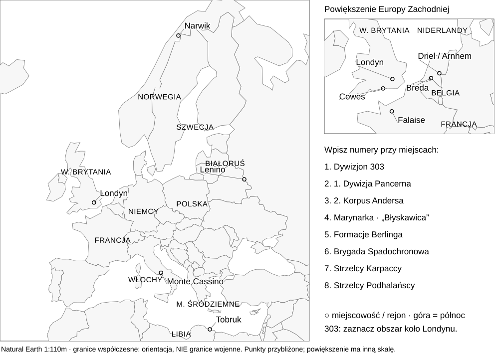

# Polacy na frontach · moja karta
Imię: .......................................................... Numer teczki: ........

Przeczytaj teczkę, porozmawiaj z grupą i zapisz własnymi słowami. W polach 4–5 odpowiedz także na pytanie śledczych. Wystarczą krótkie hasła i jedno wyjaśnienie.

<strong>1. Jak nazywała się badana jednostka?</strong>

<strong>2. Kto nią dowodził w omawianym przypadku?</strong>

<strong>3. Gdzie i kiedy walczyła? Miejsce + rok lub data.</strong>

<strong>4. Co osiągnęła lub jaki był jej wkład? Podaj wynik zgodny z opisem.</strong>

<strong>5. Dlaczego warto o niej pamiętać? Wyjaśnij konkretnym faktem.</strong>

## Mapa polskich walk · zaznaczaj, słuchając raportów

Wpisz numer teczki przy właściwym punkcie lub obszarze. Najpierw swój, potem wszystkie pozostałe. Dla numeru 2 oznacz dwa miejsca. Możesz użyć powiększenia; miejsca już podpisano, ale jednostki przyporządkujesz samodzielnie.

<strong>Bilet wyjścia:</strong> Czy odwaga zawsze oznacza zwycięstwo całej operacji? Uzasadnij jednym przypadkiem z lekcji.

