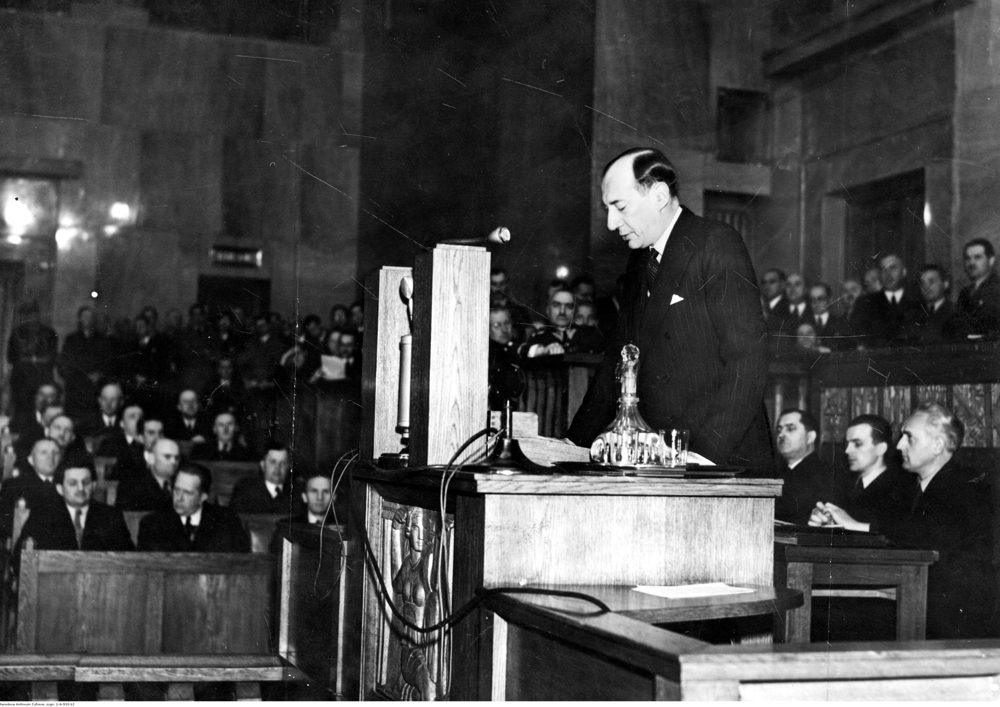
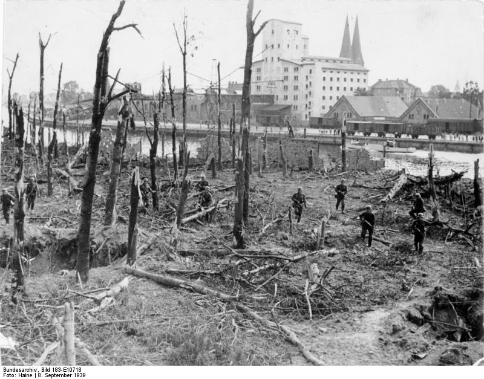
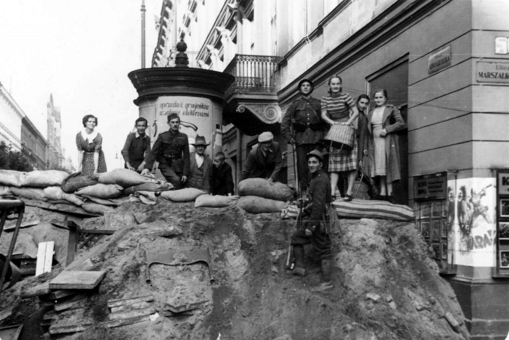

<!-- .slide: id="otwarcie" class="opening-slide" data-purpose="opening" data-layout="hero-source" -->

Warszawa, koniec września 1939 r.

1&nbsp;IX&nbsp;1939
<h1>Wojna obronna Polski</h1>
Jak długo można się bronić, gdy przeciwnik ma przewagę, a od wschodu uderza drugi agresor?

---

<!-- .slide: id="pytanie" class="question-slide" data-purpose="question" data-layout="statement-centered" -->
## Pytanie przewodnie

Dlaczego Polska przegrała kampanię 1939 roku mimo oporu żołnierzy i ludności cywilnej?

Szukajmy przyczyn w sytuacji międzynarodowej, sposobie prowadzenia wojny i decyzjach obu agresorów.

---

<!-- .slide: id="polozenie" class="explanation-slide" data-purpose="explanation" data-layout="source-split" -->
## Polska przed wybuchem wojny

Sojusznicy Polski<strong>Francja i Wielka Brytania</strong>
Polskę łączyły z nimi układy sojusznicze. Miały udzielić jej pomocy w razie niemieckiego ataku.

Europa, 1939<strong>Polska</strong>

Tajny układ<strong>Niemcy i Związek Sowiecki</strong>
23 sierpnia zawarły pakt Ribbentrop–Mołotow. Tajny protokół przewidywał podział ziem polskich między oba państwa.

Polska odrzuciła niemieckie żądania i liczyła na układy sojusznicze z państwami zachodnimi. Jednocześnie Niemcy i ZSRR przygotowały własny podział tej części Europy.

---

<!-- .slide: id="glos-epoki" class="quote-source-slide" data-purpose="evidence" data-layout="source-split" data-backdrop="off" -->
## Głos epoki: decyzja przed wojną

<figure class="source-figure quote-portrait"><figcaption>Józef Beck w Sejmie, 5 maja 1939 r. · autor fotografii nieustalony</figcaption></figure>
<blockquote>„My w Polsce nie znamy pojęcia pokoju za wszelką cenę. Jest jedna tylko rzecz w życiu ludzi, narodów i państw, która jest bezcenna. Tą rzeczą jest honor.”</blockquote>
Minister spraw zagranicznych odpowiadał na wystąpienie Adolfa Hitlera i uzasadniał odrzucenie polityki ustępstw.

Co cytat wyjaśnia o decyzji Polski, a czego nie mówi o szansach obrony?

---

<!-- .slide: id="mapa-kampanii" class="map-slide" data-purpose="evidence" data-layout="map-focus" data-backdrop="off" -->
## Dwa kierunki agresji

<figure class="source-figure"><figcaption>Kierunki niemieckiego i sowieckiego natarcia na Polskę w 1939 r.</figcaption></figure><aside class="analysis-panel"><strong>Spójrz na mapę.</strong> Z ilu stron nacierały wojska niemieckie?  Jak po 17 września zmieniło się położenie obrońców?</aside>

---

<!-- .slide: id="przewaga-sil" class="force-evidence-slide" data-purpose="evidence" data-layout="evidence" -->
## Skala niemieckiego uderzenia
<figure class="force-figure">
<article data-force-metric="personnel">blisko 1,5 mln<strong>żołnierzy</strong>
Niemcy skierowali do inwazji 60 dywizji.
</article><article data-force-metric="tanks">ponad 2000<strong>czołgów</strong>
Tworzyły siłę uderzeniową wspartą lotnictwem.
</article><article data-force-metric="aircraft">ok. 1300 : ponad 300<strong>samolotów bojowych</strong>
Niemieckie bombowce i myśliwce wobec polskich maszyn możliwych do użycia.
</article>
<figcaption class="source-note">Dane przybliżone: United States Holocaust Memorial Museum, „Invasion of Poland, Fall 1939”.</figcaption></figure>

Przewaga sprzętu i mobilności pozwalała Niemcom szybko przełamywać front. Same liczby nie wyjaśniają jednak całej kampanii.

---

<!-- .slide: id="pierwsze-dni" class="explanation-slide" data-purpose="explanation" data-layout="timeline-band" -->
## Trzy daty, które zmieniły kampanię
<ol class="campaign-timeline"><li><time>1&nbsp;IX</time><strong>Niemcy napadają na Polskę.</strong> Walki rozpoczynają się m.in. na Westerplatte; bombardowany jest Wieluń.</li><li><time>3&nbsp;IX</time><strong>Francja i Wielka Brytania wypowiadają wojnę.</strong> Nie rozpoczynają skutecznej ofensywy odciążającej Polskę.</li><li><time>17&nbsp;IX</time><strong>Związek Sowiecki napada od wschodu.</strong> Trwająca obrona musi mierzyć się z drugim agresorem.</li></ol>

---

<!-- .slide: id="opor" class="resistance-slide" data-purpose="explanation" data-layout="process" -->
## Opór trwał dłużej niż pierwszy tydzień
<ol class="resistance-route"><li><time>1–7 IX</time><strong>Westerplatte</strong>siedem dni obrony odizolowanej placówki</li><li><time>9–19 IX</time><strong>Bzura</strong>największa polska operacja zaczepna kampanii</li><li><time>do 28 IX</time><strong>Warszawa</strong>naloty od 1 IX, walki na przedpolach od 8 IX</li><li><time>2–5 X</time><strong>Kock</strong>ostatnia duża bitwa; złożenie broni 6 X</li></ol>

Kapitulacja kolejnych punktów oporu nie oznaczała braku walki: obrona była rozproszona i stopniowo pozbawiana możliwości dalszego działania.

---

<!-- .slide: id="bohaterstwo-zolnierzy" class="case-study-slide" data-purpose="evidence" data-layout="source-split" data-backdrop="off" -->
## Studium przypadku: Westerplatte

<figure class="source-figure"><figcaption>Zniszczony teren Westerplatte po kapitulacji, 8 IX 1939 · fot. Haine, Bundesarchiv</figcaption></figure>

ŻOŁNIERZE · 1–7 IX
<h3 data-case-role="place">Westerplatte: siedem dni w odizolowanej placówce</h3><ul><li data-case-role="action">Załoga Wojskowej Składnicy Tranzytowej odpierała kolejne ataki i ostrzał.</li><li>Obrona zakończyła się kapitulacją po siedmiu dniach.</li></ul>
<strong>Znaczenie i granica źródła:</strong> obrona stała się symbolem oporu. Zdjęcie pokazuje zniszczony teren, ale wykonano je już po walce i z niemieckiej perspektywy.

---

<!-- .slide: id="bohaterstwo-cywilow" class="case-study-slide civilian-case" data-purpose="evidence" data-layout="source-split" data-backdrop="off" -->
## Studium przypadku: cywile w Warszawie

<figure class="source-figure"><figcaption>Budowa barykady przy Nowogrodzkiej i Marszałkowskiej, IX 1939 · fot. Julien Bryan</figcaption></figure>

LUDNOŚĆ CYWILNA · WRZESIEŃ 1939
<h3 data-case-role="place">Warszawa: obrona miasta nie była wyłącznie zadaniem wojska</h3><ul><li data-case-role="action">Mieszkańcy pomagali przygotowywać barykady i inne umocnienia uliczne.</li><li>Ich praca wspierała obronę miasta podczas nalotów, ostrzału i walk na przedpolach.</li></ul>
<strong>Znaczenie i granica źródła:</strong> fotografia dokumentuje konkretną pracę cywilów; nie dowodzi, że wszyscy mieszkańcy walczyli z bronią.

---

<!-- .slide: id="dlaczego-kleska" class="explanation-slide" data-purpose="explanation" data-layout="argument" -->
## Dlaczego obrona zakończyła się klęską?

<article><strong>Przewaga i sposób walki Niemiec</strong> Lotnictwo, wojska pancerne i szybkie przełamania utrudniały utworzenie trwałego frontu.</article><article><strong>Niebezpieczne położenie i mobilizacja</strong> Obrona rozciągniętych granic, opóźniona mobilizacja i zerwana łączność osłabiały współdziałanie.</article><article><strong>Brak skutecznego odciążenia</strong> Alianci nie przeprowadzili ofensywy, która zmusiłaby Niemcy do przerzucenia głównych sił.</article><article><strong>Agresja ZSRR 17 września</strong> Drugi atak nastąpił, gdy obrona już trwała, i ograniczył możliwość jej dalszego organizowania.</article>

---

<!-- .slide: id="chronologia" class="practice-slide" data-purpose="practice" data-layout="task-board" -->
## Zadanie w parach: oś wydarzeń i przyczyn

Ułóżcie pięć kart wydarzeń na osi czasu. Następnie połączcie strzałkami trzy wybrane wydarzenia lub informacje z przyczynami klęski. Pod osią zapiszcie jedno zdanie zaczynające się od: <em>„Polska broniła się mimo…, ale…”</em>

Czas7 minut

sytuacja przed wojnądziałania Niemiec17 wrześniaprzykład oporu

Który dowód najlepiej pokazuje różnicę między <strong>oporem</strong> a <strong>szansą na zwycięstwo</strong>?

---

<!-- .slide: id="synteza" class="synthesis-slide" data-purpose="synthesis" data-layout="argument" -->
## Odpowiedź na pytanie przewodnie

Polska przegrała kampanię nie dlatego, że nie stawiała oporu, lecz dlatego, że…

<article><strong>Niemcy miały przewagę</strong> w liczbie i ruchliwości sił oraz w możliwościach lotnictwa i wojsk pancernych.</article><article><strong>Obrona była osamotniona</strong> sojusznicy nie przeprowadzili skutecznej ofensywy odciążającej.</article><article><strong>17 września zaatakował ZSRR</strong> otwierając drugi front w trakcie walk.</article><article><strong>Opór miał znaczenie</strong> objął żołnierzy i część ludności cywilnej, lecz nie mógł zrównoważyć przewagi agresorów.</article>

---

<!-- .slide: id="bilet" class="exit-ticket-slide" data-purpose="exit-ticket" data-layout="statement-centered" -->
## Bilet wyjścia

W dwóch zdaniach wyjaśnij, dlaczego jeden przykład bohaterstwa nie wystarczył do odwrócenia wyniku kampanii.

Użyj jednego przykładu oporu i co najmniej dwóch przyczyn klęski.

