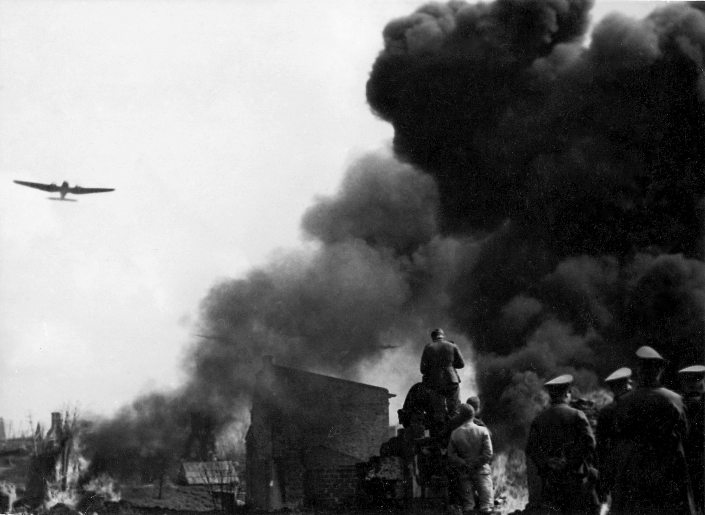
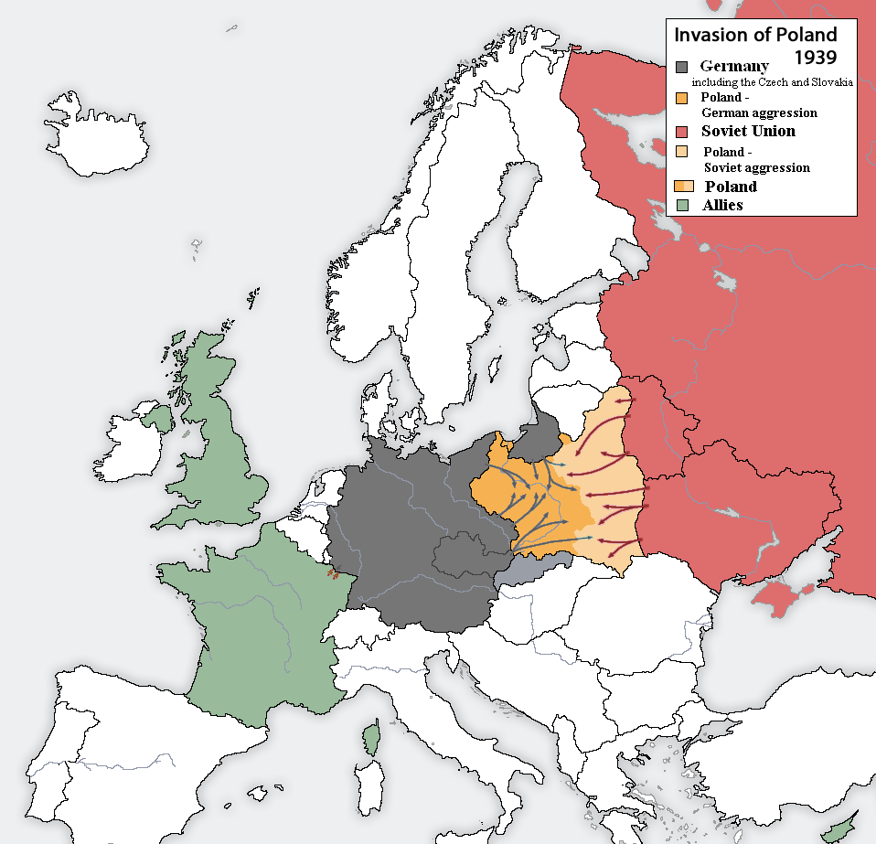
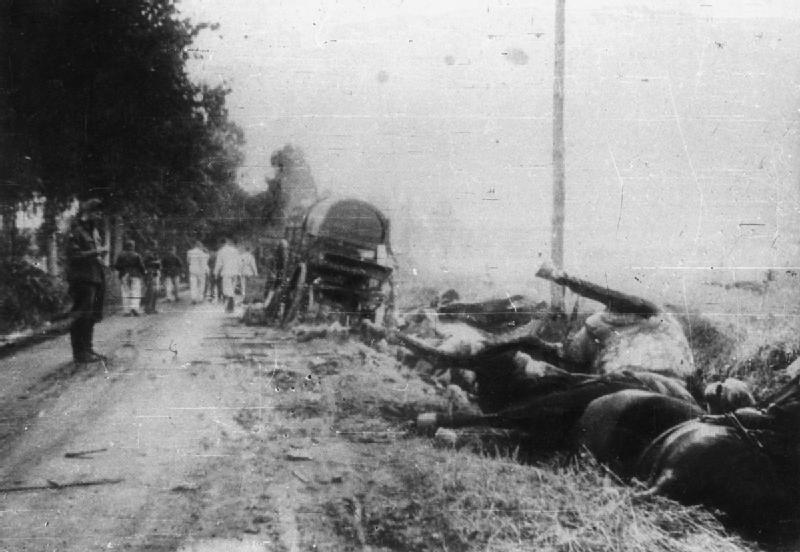

<!-- .slide: id="otwarcie" class="opening-slide" data-purpose="opening" data-layout="hero-source" -->

Wojskowa Agencja Fotograficzna · koniec września 1939 · domena publiczna

1&nbsp;IX&nbsp;1939
<h1>Wojna obronna Polski</h1>

---

<!-- .slide: id="pytanie" class="question-slide" data-purpose="question" data-layout="statement-centered" -->
## Pytanie przewodnie
**Dlaczego Polska mimo oporu nie mogła obronić się przed agresją Niemiec, a od 17&nbsp;IX także Związku Sowieckiego?**

---

<!-- .slide: id="polozenie" class="explanation-slide" data-purpose="explanation" data-layout="source-split" -->
## Położenie Polski przed wojną

<figure class="source-figure"><figcaption>Listowy, mapa opracowania, 2006, CC BY-SA 3.0. Podpisy są po angielsku.</figcaption></figure><aside class="analysis-panel"><strong>Odczytaj układ:</strong> Niemcy dążyły do wojny; Polska miała sojusze z Francją i Wielką Brytanią; pakt Ribbentrop–Mołotow otworzył drogę do agresji dwóch państw.  Sojusz nie oznaczał automatycznie szybkiej i skutecznej pomocy wojskowej.</aside>

---

<!-- .slide: id="mapa-kampanii" class="map-slide" data-purpose="evidence" data-layout="map-focus" data-backdrop="off" -->
## Kampania polska: atak z dwóch stron

<figure class="source-figure"><figcaption>Listowy, mapa opracowania, 2006, CC BY-SA 3.0. Podpisy są po angielsku.</figcaption></figure><aside class="analysis-panel"><strong>Odczytaj mapę.</strong> Wskaż kierunek ataku Niemiec, a następnie Związku Sowieckiego.  Dopisz, czego taka mapa nie mówi o losie pojedynczej osoby.</aside>

---

<!-- .slide: id="pierwsze-dni" class="explanation-slide" data-purpose="explanation" data-layout="timeline-band" -->
## Pierwsze dni: daty, które trzeba połączyć

<article><strong>1&nbsp;IX</strong>Niemcy napadają na Polskę.</article><article><strong>3&nbsp;IX</strong>Wielka Brytania i Francja wypowiadają Niemcom wojnę.</article><article><strong>17&nbsp;IX</strong>Związek Sowiecki napada na Polskę od wschodu.</article>

Wypowiedzenie wojny przez aliantów nie przyniosło Polsce skutecznej ofensywy na Zachodzie.

---

<!-- .slide: id="opor" class="explanation-slide" data-purpose="explanation" data-layout="comparison" -->
## Opór był rzeczywisty — kampania miała wiele miejsc

<article><strong>Westerplatte</strong> obrona 1–7 września</article><article><strong>Bzura</strong> największa polska operacja zaczepna, 9–19 września</article><article><strong>Warszawa</strong> obrona miasta do 28 września</article><article><strong>Kock</strong> walki trwały do 5 października</article>

Przykłady oporu nie są zaprzeczeniem klęski państwa; pokazują, że klęska miała przyczyny strategiczne.

---

<!-- .slide: id="fotografie" class="evidence-slide" data-purpose="evidence" data-layout="photo-pair" data-backdrop="off" -->
## Co mówi fotografia?

<strong>Zobacz → opisz → sprawdź podpis → nazwij ograniczenie</strong>

<lesson-gallery class="photo-pair" aria-label="Dwie fotografie do porównania"><figure class="source-figure" data-gallery-item><figcaption>Wojskowa Agencja Fotograficzna, koniec września 1939, domena publiczna.</figcaption></figure><figure class="source-figure" data-gallery-item><figcaption>Polish Official Photographer, 6 października 1939, domena publiczna.</figcaption></figure></lesson-gallery>

---

<!-- .slide: id="dlaczego-kleska" class="explanation-slide" data-purpose="explanation" data-layout="argument" -->
## Dlaczego opór nie wystarczył?

<article><strong>Klęska wynikała z przewagi strategicznej agresorów, nie z braku oporu.</strong></article><article><strong>Dwaj agresorzy</strong> Od 17&nbsp;IX Polska musiała liczyć się także z atakiem ze wschodu.</article><article><strong>Brak odciążenia</strong> Alianci wypowiedzieli wojnę, lecz nie otworzyli skutecznego frontu zachodniego.</article>

---

<!-- .slide: id="bohaterstwo" class="explanation-slide" data-purpose="explanation" data-layout="comparison" -->
## Bohaterstwo: mów konkretnie

<article><strong>Żołnierze</strong> Bronili m.in. Westerplatte, Warszawy i wielu innych miejsc.</article><article><strong>Mieszkańcy</strong> Doświadczali bombardowań, ewakuacji i obrony cywilnej.</article><article><strong>Język dowodu</strong> Podaj miejsce, czas i działanie — bez tworzenia legendy zamiast wyjaśnienia.</article>

---

<!-- .slide: id="chronologia" class="practice-slide" data-purpose="practice" data-layout="task-board" -->
## Praca w parach: uporządkuj kampanię

Ułóż oś: <strong>1&nbsp;IX, 3&nbsp;IX, 17&nbsp;IX, 28&nbsp;IX, 5&nbsp;X</strong>. Przy dwóch datach wyjaśnij zmianę sytuacji Polski.

Czas5 minut

ProduktOś z dwoma dopiskami

Kryterium sukcesuData połączona z wydarzeniem i przyczyną

---

<!-- .slide: id="synteza" class="synthesis-slide" data-purpose="synthesis" data-layout="argument" -->
## Co porządkuje tę lekcję?

<article><strong>Agresja dwóch państw i przewaga strategiczna przesądziły o klęsce państwa.</strong></article><article>Sojusznicy wypowiedzieli Niemcom wojnę, lecz nie udzielili Polsce skutecznej pomocy militarnej na Zachodzie.</article><article>Opór żołnierzy i cywilów był ważny, ale nie usuwał przewagi agresorów.</article>

---

<!-- .slide: id="bilet" class="exit-ticket-slide" data-purpose="exit-ticket" data-layout="statement-centered" -->
## Bilet wyjścia
W 3–4 zdaniach odpowiedz: <strong>dlaczego Polska mimo oporu nie mogła obronić się we wrześniu 1939 r.?</strong> Użyj daty lub wydarzenia oraz przyczyny strategicznej.
