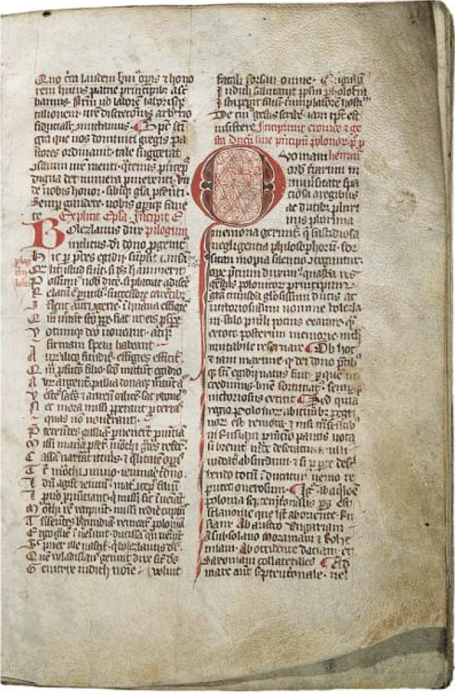

<!-- .slide: id="proto-opening" class="prototype-opening" data-purpose="opening" data-layout="hero-source" -->

HISTORIA · KLASA IV
<h1>Skąd wiemy, co było dawniej?</h1>
Przeszłość nie może opowiedzieć sama o sobie. Zostawia nam ślady.

<figure><figcaption>Kodeks Zamoyskich · XIV wiek</figcaption></figure>

---

<!-- .slide: id="proto-explanation" class="prototype-explanation" data-purpose="explanation" data-layout="comparison" -->

JEDNO SŁOWO · TRZY ZNACZENIA

<h2>Historia ma trzy twarze</h2>

<article>01<strong>przeszłość</strong>
To, co już się wydarzyło.
</article>
<article>02<strong>badanie</strong>
Szukanie i sprawdzanie śladów.
</article>
<article>03<strong>opowieść</strong>
Przedstawienie dawnych wydarzeń.
</article>

„Historia mojego miasta” — które znaczenie pasuje?

---

<!-- .slide: id="proto-source" class="prototype-source" data-purpose="evidence" data-layout="source-split" -->

ŹRÓDŁO A · FOTOGRAFIA

<h2>Zajrzyjmy do dawnej klasy</h2>

<figure><figcaption>Klasa w Keene, USA · około 1900–1920</figcaption></figure>

<strong>Przyjrzyj się fotografii.</strong>
Co różni tę klasę od naszej sali?

Podaj dwa szczegóły ze zdjęcia.

---

<!-- .slide: id="proto-activity" class="prototype-activity" data-purpose="practice" data-layout="activity-brief" -->

NAJPIERW ODPOWIEDZ · POTEM ODSŁOŃ

<h2>Baśń, legenda czy historia?</h2>
<lesson-disclosure class="proto-riddles">

ZAGADKA 1<b>Dziewczynie na balu pomaga dobra wróżka.</b>

<strong>BAŚŃ</strong>
Czary należą do świata fikcji.

ZAGADKA 2<b>Pod Wawelem mieszka smok.</b>

<strong>LEGENDA</strong>
Prawdziwe miejsce łączy się z fantastycznym wydarzeniem.

ZAGADKA 3<b>Na świadectwie z 1922 roku zapisano oceny ucznia.</b>

<strong>HISTORIA</strong>
Informację można sprawdzić w zachowanym dokumencie.

</lesson-disclosure>

---

<!-- .slide: id="proto-synthesis" class="prototype-synthesis" data-purpose="synthesis" data-layout="equation" -->

ZASADA HISTORYKA

<h2>Dobry wniosek ma trzy podpory</h2>

źródło<b>+</b>kontekst<b>+</b>porównanie<b>→</b><strong>wniosek oparty na dowodach</strong>

Historyk potrafi również powiedzieć: „Tego jeszcze nie wiem”.

