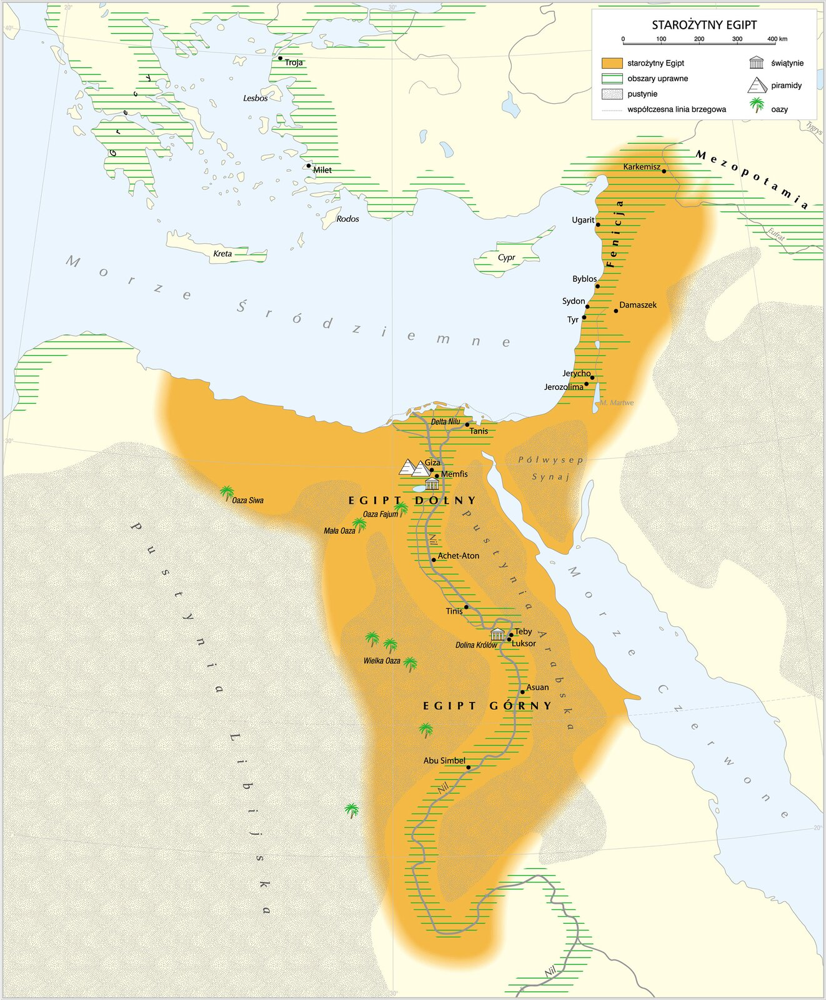

# Sprawdzian — pradzieje, pierwsze cywilizacje i starożytny Izrael

**Klasa V** · **Czas: 45–50 minut** · **Maksymalnie: 32 punkty**

**Imię i nazwisko: ...................................................................  Data: ........................**

Odpowiadaj własnymi słowami. W zadaniach otwartych wystarczą krótkie, rzeczowe zdania.

## 1. Porównaj dwa sposoby życia. *(4 pkt)*

Wpisz po **jednej różnicy** w każdym wierszu. Opisz obie strony porównania.

| Co porównujesz? | Ludzie prowadzący tryb koczowniczy | Ludzie prowadzący tryb osiadły |
|---|---|---|
| Zdobywanie żywności | ...................................... | ...................................... |
| Miejsce zamieszkania | ...................................... | ...................................... |

## 2. Zmiana, która trwała długo. *(4 pkt)*

a) Wyjaśnij, na czym polegała **rewolucja neolityczna**. *(2 pkt)*

........................................................................................................................................

b) Podaj **jedną korzyść i jeden problem** wynikające z życia w osadzie rolniczej. *(2 pkt)*

Korzyść: ...........................................................................................................................

Problem: ...........................................................................................................................

## 3. Chronologia: epoki i pismo. *(3 pkt)*

a) Ułóż epoki od najwcześniejszej do najpóźniejszej: **epoka żelaza · epoka kamienia · epoka brązu**. *(1 pkt)*

........................................ → ........................................ → ........................................

b) Z jakich dwóch metali powstaje brąz? *(1 pkt)* .........................................................................

c) Ułóż w uproszczonym porządku od najwcześniejszego do najpóźniejszego: **alfabet łaciński · pismo hieroglificzne · alfabet grecki · alfabet fenicki**. *(1 pkt)*

........................................................................................................................................

## 4. Cywilizacje nad wielkimi rzekami. *(4 pkt)*

Dopasuj cywilizację do rzeki. Każdej odpowiedzi użyj raz. Następnie odpowiedz na pytanie do mapy.

1. Mezopotamia
2. Egipt
3. Indie — cywilizacja doliny Indusu
4. Starożytne Chiny

- **A.** Huang He (Rzeka Żółta)
- **B.** Indus
- **C.** Nil
- **D.** Tygrys i Eufrat

| 1 | 2 | 3 | 4 |
|:---:|:---:|:---:|:---:|
|  |  |  |  |

*Mapa: Krystian Chariza i zespół / ZPE, CC BY 3.0.*

Gdzie na mapie skupia się więcej osad: wzdłuż Nilu czy w głębi pustyni? Dlaczego właśnie tam?

........................................................................................................................................

## 5. Indie i Chiny. *(2 pkt)*

a) W jakim regionie rozwinął się hinduizm? *(1 pkt)* ....................................................................

b) Wymień **jedno osiągnięcie** starożytnych Chin. *(1 pkt)* ...........................................................

## 6. Kto czym się zajmował w Egipcie? *(3 pkt)*

| Rola | Odpowiedź |
|---|---|
| Rola faraona | ........................................................................ |
| Zajęcie kapłanów | ........................................................................ |
| Zajęcie urzędników lub pisarzy | ........................................................................ |

## 7. Wierzenia i zwyczaj. *(3 pkt)*

a) Co oznacza słowo **politeizm**? *(1 pkt)* ..................................................................................

b) Wyjaśnij związek między wiarą Egipcjan w życie po śmierci a **mumifikacją**. *(2 pkt)*

........................................................................................................................................

........................................................................................................................................

## 8. Dzieje Izraelitów. *(4 pkt)*

Wpisz litery wydarzeń w kolejności od najwcześniejszego do najpóźniejszego. **A** to opowieści tradycji biblijnej; nie trzeba podawać dokładnych dat.

- **A** — opowieści o Abrahamie, Mojżeszu i wyjściu z Egiptu;
- **B** — Dawid czyni Jerozolimę stolicą, a Salomonowi tradycja przypisuje budowę Pierwszej Świątyni;
- **C** — Rzymianie niszczą Drugą Świątynię w 70 r. n.e.;
- **D** — Babilończycy niszczą Pierwszą Świątynię, część ludności Judy trafia na wygnanie.

Najwcześniej: .......... → .......... → .......... → .......... :najpóźniej

Wyjaśnij, dlaczego Jerozolima była ważna dla starożytnych Izraelitów:

........................................................................................................................................

## 9. Religie i ich pojęcia. *(3 pkt)*

a) Czym różnił się **monoteizm** Izraelitów od wierzeń starożytnych Egipcjan? *(1 pkt)*

........................................................................................................................................

b) Co to jest **Tora**? *(1 pkt)* ................................................................................................

c) Co to jest **menora**? *(1 pkt)* .............................................................................................

## 10. Początki chrześcijaństwa. *(2 pkt)*

Podaj **wiek** narodzin chrześcijaństwa i **krainę**, w której się narodziło.

Wiek: ........................................  Kraina: ........................................

<!-- teacher-key -->

## Klucz odpowiedzi — dla nauczyciela

**32 pkt; 45–50 min.** Przyjmuj równoważne sformułowania i odpowiedzi w punktach. Nie odejmuj punktów za drobne błędy językowe, jeżeli sens historyczny jest jasny. W zadaniach z kilkoma składnikami przyznawaj punkty niezależnie; nie przyznawaj ich za odpowiedź przeczącą istocie zjawiska. Progi ocen stosuj zgodnie ze szkolnymi zasadami, nie wyprowadzaj ich z tego arkusza.

| Zadanie | Oczekiwana odpowiedź i punktowanie | Maks. |
|---|---|:---:|
| 1 | Zdobywanie żywności: koczownicy polowali, zbierali lub łowili ryby, osiadli uprawiali rośliny i/lub hodowali zwierzęta — po 1 pkt za każdą trafną stronę porównania. Zamieszkanie: częsta zmiana miejsc / tymczasowe schronienia wobec stałego albo długotrwałego pobytu / domów w osadzie — po 1 pkt za każdą stronę. Akceptuj inne trafne kontrasty odpowiadające nagłówkom. | 4 |
| 2 | a) Przejście do wytwarzania żywności: uprawa roślin (1) i hodowla zwierząt (1). Można uznać równoważny opis obu zajęć bez słowa „przejście”. b) Jedna korzyść (1), np. zapasy, stały dom, więcej żywności; jeden problem (1), np. zależność od plonów, ciężka praca, szybsze szerzenie chorób w skupiskach. Nie wymagaj tezy, że wszędzie stało się to jednocześnie. | 4 |
| 3 | a) kamienia → brązu → żelaza (1, tylko pełna kolejność); b) miedź i cyna (1, obie); c) hieroglify → alfabet fenicki → grecki → łaciński (1, pełna kolejność). To szkolne uproszczenie: historyczne przejście do alfabetu obejmowało wcześniejsze pismo alfabetyczne, a pismo klinowe rozwijało się niezależnie. | 3 |
| 4 | 1–D, 2–C, 3–B, 4–A — po 0,75 pkt. Pytanie do mapy: 0,5 pkt za wskazanie doliny Nilu, a nie pustyni; 0,5 pkt za wyjaśnienie, że rzeka dostarczała wody potrzebnej do życia i uprawy. Przy Indiach akceptuj „Indus” lub „dolina Indusu”; przy Chinach „Huang He” lub „Rzeka Żółta”. | 4 |
| 5 | a) Indie / subkontynent indyjski; b) np. papier lub jedwab — po 1 pkt. Uznaj inne poprawnie wskazane osiągnięcie starożytnych Chin; nie punktuj prochu ani druku jako osiągnięć starożytnych. | 2 |
| 6 | Faraon rządził państwem / armią / administracją (1); kapłani prowadzili kult lub opiekowali się świątyniami (1); urzędnicy/pisarze prowadzili zapisy, podatki lub pomagali zarządzać państwem (1). | 3 |
| 7 | a) wiara w wielu bogów (1). b) Wiara w życie po śmierci / potrzebę zachowania ciała (1) → zabezpieczanie zwłok przez mumifikację, np. osuszanie i owijanie (1). Sam opis zabiegu bez związku z wierzeniem daje najwyżej 1 pkt w b). | 3 |
| 8 | A → B → D → C: 1 pkt za A na pierwszym miejscu, 1 za B po A i przed D, 1 za D po B i przed C (razem za kolejność maks. 3; każdą przesłankę licz osobno). Jerozolima: stolica królestwa i/lub miejsce Świątyni, centrum kultu (1). Nie wymagaj dokładnego datowania biblijnych opowieści o Abrahamie i Mojżeszu; zniszczenie Pierwszej Świątyni bywa datowane na 587/586 r. p.n.e., ale data nie jest tu pytana. | 4 |
| 9 | a) Izraelici wierzyli w jednego Boga, Egipcjanie czcili wielu bogów (1, obie strony); b) Tora — pięć pierwszych ksiąg Biblii hebrajskiej / najważniejsze nauczanie i prawo judaizmu (1); c) menora — siedmioramienny świecznik związany ze Świątynią i judaizmem (1). Nie utożsamiaj menory z późniejszą Gwiazdą Dawida. | 3 |
| 10 | I wiek n.e. (1); rzymska Judea / Judea / Palestyna w znaczeniu historycznego regionu (1). Samo „Izrael” bez określenia starożytnego regionu jest nieprecyzyjne; nie myl ze współczesnym państwem powstałym w 1948 r. | 2 |

### Zgodność z podstawą i zakres

Dla **klasy V w roku 2026/2027** obowiązuje wariant `stara-przejsciowa` (zob. `curriculum/rollout-2026.md`): **Dz.U. 2024 poz. 996, historia, klasy V–VIII, I „Cywilizacje starożytne”**, tekst urzędowy w `curriculum/official/D2024000099601-historia-pp-104-117.txt`, s. 107. Mapowanie: **I.1** — zad. 1–2; **I.2** — zad. 4, 5a i 8 (cywilizacje nad rzekami; hinduizm w Indiach; Jerozolima i chronologia); **I.3** — zad. 7 i 9a; **I.4** — zad. 6; **I.5** — zad. 3c, 5b oraz 9b–c; **I.6** — zad. 10. Zad. 3a–b o epokach metali, uproszczona sekwencja rozwoju alfabetu oraz szczegółowe przykłady z Indii i Chin są szkolnym rozszerzeniem lub uszczegółowieniem działu, nie osobnymi literalnymi punktami podstawy. Cele ogólne: I (chronologia, zmiany), II (związki przyczynowo-skutkowe), III (pojęcia i krótkie wyjaśnienia). Zakres Indii, Chin i rozwoju pisma dodano zgodnie z uwagą nauczyciela; lokalne pakiety lekcji nie zawierają pełnego opracowania tych treści. Należy je omówić przed sprawdzianem. Arkusz obejmuje wybrane treści, nie cały dział I.

Szkolny dokument `curriculum/sources/teacher-2026-09-06/original/wymagania-edukacyjne-klasa-5.docx` i wskazany w nim podręcznik **„Wczoraj i dziś”, klasa 5 (Nowa Era)** służą tu do doboru poziomu i tematów; nie są tekstem podstawy programowej. **Nie wskazano wydania ani stron podręcznika; nie potwierdzono zgodności zadanie–strona i nie cytowano ani nie reprodukowano zadań, ilustracji lub fragmentów podręcznika.** Treść opracowano własnymi słowami na podstawie pakietów lekcji `classes/5/01-od-epoki-kamienia-do-epoki-zelaza/`, `classes/5/02-starozytny-egipt/` i `classes/5/03-starozytny-izrael/` (ich `lesson.md`, `worksheet.md`, `student-summary.md`, `sources.md`).

Mapa Egiptu: Krystian Chariza i zespół, ZPE, CC BY 3.0; lokalna kopia z `classes/5/02-starozytny-egipt/assets/mapa-starozytnego-egiptu-zpe.jpg`. Źródło i pełne prawa: `classes/5/02-starozytny-egipt/sources.md`.
