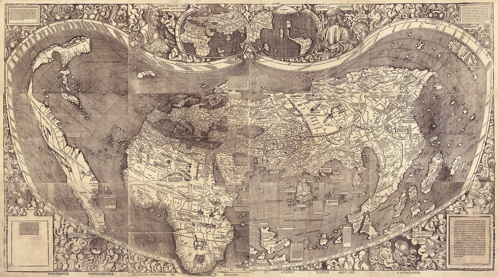

# Sprawdzian — odkrycia geograficzne, renesans i reformacja (wersja dostosowana)

**Klasa VI · 35–40 minut · 21 pkt**
**Imię i nazwisko: ........................................................................ Klasa: ........ Data: ................**

Czytaj po jednym poleceniu. Zaznacz odpowiedź albo wpisz krótkie hasło.

## 1. Chronologia *(2 pkt)*
Wybierz wydarzenie najwcześniejsze i najpóźniejsze. *(po 1 pkt)*

- A. Druk z ruchomej czcionki rozpowszechnia się w Europie.
- B. Wyprawa Kolumba dociera do Ameryki (1492).
- C. Marcin Luter ogłasza 95 tez (1517).
- D. Pokój westfalski (1648).

Najwcześniejsze: ........  Najpóźniejsze: ........

## 2. Trzy wyprawy *(3 pkt)*
Dopasuj podróżnika do wydarzenia. Każdej litery użyj raz.

- A. Krzysztof Kolumb
- B. Vasco da Gama
- C. Ferdynand Magellan

- 1492 — wyprawa dociera do Ameryki: ........
- 1498 — wyprawa wokół Afryki dociera drogą morską do Indii: ........
- 1519–1522 — wyprawa jako pierwsza opływa Ziemię; dowódca umiera w drodze: ........

## 3. Przyczyny i skutki wypraw *(4 pkt)*
Uzupełnij tabelę informacjami z banku odpowiedzi.

**Bank odpowiedzi:** poszukiwanie morskiej drogi do towarów z Azji · nowe rośliny trafiają do Europy · epidemie i utrata ziem dotykają wielu mieszkańców Ameryki

| Pytanie | Odpowiedź |
|---|---|
| Jedna przyczyna wypraw | ........................................................................ |
| Jeden skutek dla Europy | ........................................................................ |
| Jeden skutek dla rdzennych mieszkańców Ameryki | ........................................................................ |

Wybierz jeden skutek i dokończ: **Stało się tak, ponieważ…** *(1 pkt)*

..................................................................................................................................................................

## 4. Mapa z 1507 r. *(2 pkt)*
Martin Waldseemüller umieścił na swojej mapie nazwę **America**.

a) Odszukaj Amerykę na mapie. Po której stronie Afryki ją przedstawiono? *(1 pkt)*

- [ ] po lewej;
- [ ] po prawej.

b) Napisz jedną rzecz o mieszkańcach Ameryki przed 1492 r., której mapa nie opisuje. *(1 pkt)*

..................................................................................................................................................................

## 5. Renesans *(3 pkt)*
a) Humanizm to zainteresowanie: *(1 pkt)*

- [ ] człowiekiem, jego rozumem i możliwościami poznania;
- [ ] wyłącznie budową zamków obronnych.

b) W opisie zaznacz **dwie** cechy renesansu. *(2 pkt)*

„Fasada budowli jest symetryczna, z kolumnami i arkadami; na obrazie użyto perspektywy”.

- [ ] symetria
- [ ] perspektywa
- [ ] brak kolumn i arkad

## 6. Reformacja *(3 pkt)*
a) Kto ogłosił 95 tez w 1517 r.? **Marcin Luter / Jan Kalwin**. *(1 pkt)*

b) Luter krytykował nadużycia związane z: **odpustami / budową statków**. *(1 pkt)*

c) Jan Kalwin jest kojarzony z nauką o: **predestynacji / mumifikacji**. *(1 pkt)*

## 7. Odpowiedź Kościoła i pokój westfalski *(4 pkt)*
a) Zaznacz jedną reformę soboru trydenckiego. *(1 pkt)*

- [ ] tworzenie seminariów dla duchownych;
- [ ] zniesienie wszystkich sakramentów.

b) Jezuici zakładali m.in. **szkoły / stocznie**. *(1 pkt)*

c) Pokój westfalski zawarto w roku **1648 / 1492**. *(1 pkt)*

d) Zaznacz jedno następstwo pokoju westfalskiego. *(1 pkt)*

- [ ] zakończenie wojny trzydziestoletniej;
- [ ] początek wyprawy Kolumba.

<!-- teacher-key -->

## Klucz odpowiedzi — dla nauczyciela

**21 pkt · 35–40 minut.** To wersja z krótszymi poleceniami, wyborem odpowiedzi, bankiem pojęć i mniejszą liczbą samodzielnych zapisów. Dostosuj sposób podania poleceń, czas i formę odpowiedzi do zaleceń dotyczących konkretnego ucznia; sam arkusz nie zastępuje indywidualnych dostosowań.

| Zadanie | Odpowiedź i punktowanie | Maks. |
|---|---|:---:|
| 1 | Najwcześniejsze A (druk Gutenberga); najpóźniejsze D (pokój westfalski). | 2 |
| 2 | A, B, C — po 1 pkt. Magellan zmarł podczas wyprawy. | 3 |
| 3 | Jedna przyczyna z banku (1); jeden skutek dla Europy (1); jeden skutek dla rdzennych mieszkańców Ameryki (1); sensowny związek przyczynowy w zdaniu końcowym (1). | 4 |
| 4 | a) po lewej stronie Afryki; b) np. wiele społeczeństw i miast istniało w Ameryce przed 1492 r. — po 1 pkt. | 2 |
| 5 | a) człowiek, rozum i możliwości poznania; b) symetria i perspektywa. | 3 |
| 6 | a) Marcin Luter; b) odpusty; c) predestynacja. | 3 |
| 7 | a) seminaria dla duchownych; b) szkoły; c) 1648; d) zakończenie wojny trzydziestoletniej. | 4 |

Zakres zachowuje najważniejsze treści sprawdzianu standardowego, ale ogranicza liczbę kroków i długość odpowiedzi otwartych. Dostosuj arkusz do indywidualnych zaleceń ucznia. Progi ocen stosuj według szkolnych zasad.

Mapa: Martin Waldseemüller, 1507, Library of Congress, domena publiczna; lokalna kopia `classes/6/02-odkrycia-wyprawy/assets/waldseemuller-mapa-1507.jpg`. Źródła: `classes/6/02-odkrycia-wyprawy/sources.md`. Drobnych nazw na wydruku nie należy wymagać od ucznia.
