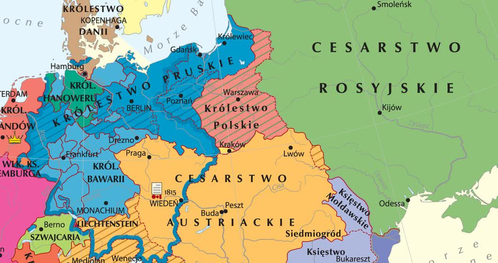

# Sprawdzian — Europa w pierwszej połowie XIX wieku

**Klasa VII · 40 minut · 30 pkt**

Imię i nazwisko: ........................................................................ Klasa: ........ Data: ...............

## 1. Prawda czy fałsz? Wpisz P albo F. (4 pkt)
A. Rewolucja przemysłowa rozpoczęła się w Wielkiej Brytanii. ........

B. Rozwój fabryk przyczynił się do rozrostu miast. ........

C. Kongres wiedeński dążył do zniesienia monarchii w Europie. ........

D. Wiosna Ludów objęła wyłącznie Francję. ........

## 2. Wyjaśnij pojęcia. Nie podawaj tylko przykładu. (4 pkt)
**Rewolucja przemysłowa:** ........................................................................................................

...................................................................................................................................................

**Legitymizm:** ...........................................................................................................................

...................................................................................................................................................

## 3. Uporządkuj chronologicznie. Zapisz litery. (2 pkt)
A. Wiosna Ludów.

B. Obrady kongresu wiedeńskiego.

C. Początki rewolucji przemysłowej w Wielkiej Brytanii.

D. Utworzenie Świętego Przymierza.

Kolejność: ........ → ........ → ........ → ........

## 4. Połącz urządzenie z zastosowaniem. Każdej litery użyj raz. (3 pkt)
1. Maszyna parowa. 2. Mechaniczne krosno. 3. Telegraf.

A. Przekazywanie wiadomości na odległość.

B. Napęd maszyn lub pojazdów.

C. Wytwarzanie tkanin.

1 — ........     2 — ........     3 — ........

## 5. Odczytaj mapę Europy po kongresie wiedeńskim. (3 pkt)

*Mapa: Krystian Chariza i zespół / ZPE, CC BY-SA 3.0; fragment, wydruk w skali szarości.*

a) Jakie państwo leżało na wschód od Królestwa Polskiego? ........................................................

b) Jakie państwo leżało na południe od Królestwa Polskiego? .....................................................

c) Czy Królestwo Polskie było niepodległe? Uzasadnij na podstawie wiedzy z lekcji.

...................................................................................................................................................

<!-- page-break -->

## 6. Rozpoznaj idee polityczne po założeniach. (4 pkt)
**Wybierz: liberalizm · konserwatyzm · socjalizm · komunizm. Każdej nazwy użyj raz.**

A. Ochrona wolności jednostki i własności prywatnej; ograniczenie władzy monarchy przez konstytucję. — ..........................................................................................................................

B. Obrona tradycji i monarchii; niechęć do gwałtownych przemian rewolucyjnych.
— ..............................................................................................................................................

C. Dążenie do ograniczenia nierówności społecznych i poprawy warunków życia robotników; krytyka niesprawiedliwości kapitalizmu. — .................................................................................

D. W ujęciu Marksa i Engelsa: walka klas, rewolucja proletariacka i likwidacja prywatnej własności środków produkcji; cel — społeczeństwo bezklasowe. — ...........................................................

*Opisy są szkolnymi charakterystykami idei, nie cytatami z programów konkretnych partii.*

## 7. Przeczytaj tekst źródłowy i odpowiedz. (3 pkt)
**Deklaracja praw człowieka i obywatela, Francja, 1789 r., fragmenty art. 1–2:**

„Ludzie rodzą się i pozostają wolni i równi w prawach. […] Celem wszelkiego zrzeszenia politycznego jest zachowanie naturalnych i niezbywalnych praw człowieka. Prawami tymi są wolność, własność, bezpieczeństwo i opór przeciw uciskowi”.

*Przekład własny z tekstu angielskiego: The Avalon Project, Yale Law School, Declaration of the Rights of Man — 1789. Fragment powstał przed XIX w.; zadanie dotyczy idei wyrażonych w nim, nie daty powstania partii.*

a) Wypisz **dwa prawa** wymienione w tekście. (1 pkt)

...................................................................................................................................................

b) Z którą ideą z zadania 6 najlepiej łączy się ochrona wolności jednostki i własności? (1 pkt)

...................................................................................................................................................

c) Wyjaśnij, dlaczego ograniczenie samowoli władzy pomaga chronić jedno z praw wymienionych w tekście. (1 pkt)

...................................................................................................................................................

...................................................................................................................................................

## 8. Wiosna Ludów — czas, przyczyny, przebieg i skutki. (7 pkt)
a) Wpisz rok rozpoczęcia: .................. i rok zakończenia głównej fali wystąpień: .................. (1 pkt)

b) Podaj **dwie różne przyczyny** Wiosny Ludów. (2 pkt)

1. ...............................................................................................................................................

2. ...............................................................................................................................................

c) Wskaż jedno państwo lub obszar Europy i opisz wydarzenie, które zaszło tam podczas Wiosny Ludów. (2 pkt)

Miejsce: .....................................................................................................................................

Wydarzenie: ..............................................................................................................................

...................................................................................................................................................

d) Podaj **dwa różne skutki** Wiosny Ludów. (2 pkt)

1. ...............................................................................................................................................

2. ...............................................................................................................................................

<!-- teacher-key -->

## Klucz odpowiedzi — wyłącznie dla nauczyciela

Zakres: klasa VII, podstawa stara-przejściowa 2026/2027, Dz.U. 2024 poz. 996: XIX.1–2, idee jako kontekst XIX-wiecznych przemian. Wiosna Ludów wyłącznie czas, przyczyny, ogólny przebieg i skutki. Nie wymagamy biografii przywódców, szczegółowych bitew ani innych powstań. Nazwy doktryn nie są nazwami jednolitych partii europejskich. Socjalizm jest szerokim nurtem, a komunizm w zadaniu opisano w węższym ujęciu marksistowskim, by dopasowanie było jednoznaczne.

1. P, P, F, F — po 1 pkt.
2. Rewolucja przemysłowa: przejście od produkcji ręcznej do mechanicznej (1 pkt) i rozwój systemu fabrycznego / przemiana organizacji produkcji (1 pkt). Legitymizm: uznawanie praw legalnych dynastii do tronu (1 pkt), również mimo ich wcześniejszego obalenia / odróżnienie tego prawa od woli poddanych (1 pkt). Przyjmij inne poprawne, pełne wyjaśnienia; sama „władza króla” nie wystarcza.
3. C → B → D → A. 2 pkt za pełną poprawną kolejność; 1 pkt, gdy jedynie dwa sąsiednie wydarzenia zamieniono miejscami; w pozostałych przypadkach 0. Daty: II połowa XVIII w.; 1814–1815; wrzesień 1815; 1848–1849.
4. 1–B, 2–C, 3–A; po 1 pkt.
5. a) Cesarstwo Rosyjskie / Rosja, b) Cesarstwo Austriackie / Austria — po 1 pkt. c) 1 pkt za „nie” wraz z uzasadnieniem: car Rosji był królem Polski / unia personalna i zależność od Rosji. Mapa pozwala odczytać położenie, nie stanowi dowodu ustroju. Sprawdzono czytelność nazw w wersji czarno-białej.
6. A liberalizm, B konserwatyzm, C socjalizm, D komunizm — po 1 pkt. Komunizm marksistowski dotyczy zniesienia prywatnej własności środków produkcji, nie wszystkich osobistych przedmiotów.
7. a) 1 pkt łącznie za dwa różne prawa z tekstu: wolność, własność, bezpieczeństwo, opór przeciw uciskowi (przyjmij równość w prawach z art. 1); b) liberalizm — 1 pkt; c) 1 pkt za powiązanie ograniczenia samowoli z konkretnym prawem, np. władza nie może dowolnie uwięzić człowieka, zabrać własności lub ograniczyć wolności bez prawnej podstawy. Samo przepisanie nazwy prawa = 0 pkt.
8. a) 1848 i 1849 — 1 pkt łącznie; b) po 1 pkt za dwie odrębne przyczyny, np. brak konstytucji i praw politycznych; kryzys, głód, bezrobocie; dążenia narodowe do niepodległości lub zjednoczenia. Nie punktuj dwóch parafraz jednej przyczyny. c) 1 pkt za miejsce i 1 pkt za zgodne z nim konkretne wydarzenie: Francja — obalenie monarchii i ogłoszenie II Republiki; monarchia Habsburgów / Wiedeń — wystąpienia i ustąpienie Metternicha; Węgry — wystąpienie przeciw Habsburgom; państwa włoskie — walki przeciw obcemu panowaniu; państwa niemieckie — wystąpienia o konstytucję i zjednoczenie / parlament frankfurcki. d) po 1 pkt: np. stłumienie większości wystąpień, zniesienie pańszczyzny w monarchii Habsburgów, przetrwanie i umocnienie dążeń narodowych lub konstytucyjnych. Nie przyjmuj zjednoczenia Niemiec lub Włoch jako dokonanego w latach 1848–1849.

Razem: 4 + 4 + 2 + 3 + 3 + 4 + 3 + 7 = 30 pkt. Progi ocen zgodnie z zasadami szkoły; uznawaj równoważne poprawne odpowiedzi.

Źródło cytatu odczytane: https://avalon.law.yale.edu/18th_century/rightsof.asp — art. 1–2; przekład własny, skrót oznaczono […]. Mapa lokalna: `tests/7/assets/mapa-europy-1815-fragment.jpg`, istniejąca kopia z lekcji `classes/7/01-kongres-wiedenski`, Krystian Chariza i zespół / ZPE, CC BY-SA 3.0. Mapa w podglądzie jest wyświetlana w skali szarości. Źródło i licencja oryginału w `classes/7/01-kongres-wiedenski/sources.md`.
